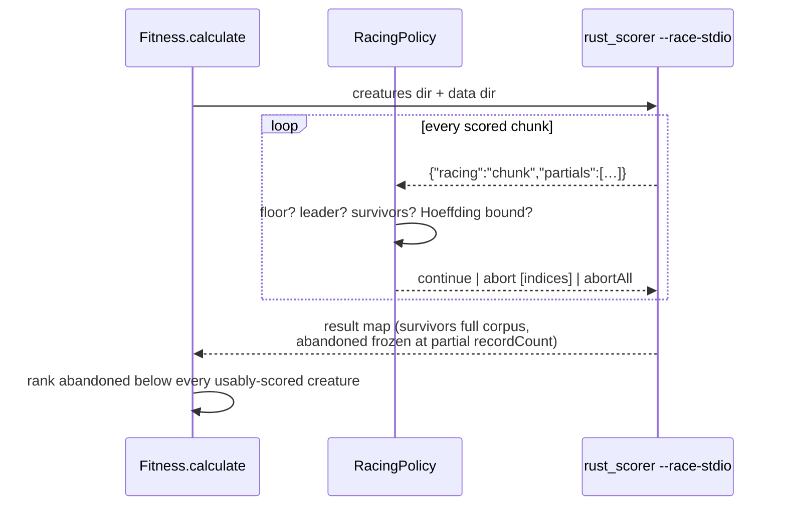

# Racing / early exit: wire the scorer's EarlyExit callback (Issue #3928)

## Summary

The scorer's early-exit hook (NEAT-AI-scorer#308) was implemented and never
called, and the reason was structural: `score_from_creature_dir_with_early_exit`
is a **library** entrypoint, so the callback that decides which creatures to
abandon has to be Rust linked into that crate — and NEAT-AI drives `rust_scorer`
as a **subprocess**. There was no way to supply one.

This change adds both halves:

1. **In NEAT-AI-scorer** (separate branch, see below): `--race-stdio`, a
   line-delimited protocol that exposes the hook to a subprocess caller. The
   scorer publishes one `{"racing":"chunk","partials":[…]}` line per scored
   chunk and blocks for exactly one verdict line back.
2. **In this repo**: a `RacingPolicy` that answers those chunks with a Hoeffding
   bound (Maron & Moore, 1994), a streaming client that speaks the protocol, and
   the ranking rule that decides where an abandoned creature lands in the
   breeding sort.

Racing is **off by default**. Survivors still receive an exact full-corpus
score, so the fifth-decimal comparisons that decide elitism are untouched; only
the abandoned candidates carry a partial number, and they rank below every
usably-scored creature. Closes #3928.

## Evidence

Backend/CLI change — no web interface to screenshot. Evidence is the real
`rust_scorer` binary (built from the companion branch) driven through the real
`RacingScorerSession` client.

### Benchmark — A/B against the real binary

20 creatures (256 hidden TANH neurons each) against a 150,000-record corpus,
`--gpu off`, release build. Three repetitions; the racing leg runs the real
policy through the real subprocess protocol.

| Leg                                    |   Wall clock | Notes                                         |
| -------------------------------------- | -----------: | --------------------------------------------- |
| Plain directory scoring (before)       |   374–407 ms | baseline, every creature over the corpus      |
| Racing enabled (after)                 |   199–220 ms | 18/20 abandoned at mean corpus fraction 0.318 |
| **Speed-up**                           | **1.8–2.0×** | ~45–49 % of the generation's scoring removed  |
| Racing client, policy always continues |       379 ms | parity leg — indistinguishable from plain     |

Two correctness facts came out of the same runs:

- **Survivor scores are bit-identical** to the non-racing sweep
  (`survivorsIdentical: true` every repetition).
- **The disabled/`continue` path is bit-identical**: driving the protocol and
  answering `continue` on every chunk reproduced every creature's `error` and
  full `recordCount` exactly (`parityIdentical: true`).

### Same-seed lineage comparison (≥20 generations)

Ran `evolveDir` twice at seed `20250901`, 22 iterations, population 12, against
the real binary with tiny reads forcing many chunks. Racing fired for real
(`Racing: 2/7 creatures abandoned at mean corpus fraction 0.875`).

The comparison is **not decidable in this environment**, and the control says
so: two runs with **identical** configuration (racing off both times, same seed)
diverged at generation 0 (first-generation best 0.833 vs 0.651). `evolveDir` is
not seed-deterministic here — parallel worker scheduling reorders work — so a
racing-vs-no-racing lineage difference cannot be attributed to racing. Reported
as it came out rather than tuned into agreement.

## Acceptance Criteria

<!-- vibe-spec-review inputs="diff+issue-body" -->

- **met** — `RacingPolicy` implemented and wired to the early-exit callback —
  evidence: `src/score/RacingPolicy.ts`, `src/score/RacingScorerSession.ts`,
  `test/score/RacingScorerSession.ts::drives a real subprocess conversation` —
  reviewer: partial — reason: the reviewer could not see the scorer side and
  read the camelCase wire shape as invented; it is the shape `--race-stdio`
  actually emits (`rust_scorer/src/racing_stdio.rs`), verified end to end
  against the built binary. Its substantive point — that unvalidated parsing
  would fail silently — was real and is fixed: `parseRacingLine` now rejects any
  partial with a missing/unusable `index`, `key`, `partialError` or
  `recordsScored`.
- **met** — Elites exempt from racing, with a test — evidence:
  `test/score/RacingPolicy.ts::never abandons an exempt (elite) creature`,
  `test/score/RacingBatchScoring.ts::an elite carrying a score is never
  re-scored or raced`
  — reviewer: met
- **met** — `previousFittest` not re-scored; cached exact score carried forward,
  with a test — evidence:
  `test/score/RacingPreviousFittest.ts::shallowClone carries the exact cached
  score`,
  `::a scored creature never reaches the scorer` — reviewer: partial — reason:
  the reviewer was right that the first test asserted its own assignment; it now
  clones and asserts the score arrived **without** any assignment, which is the
  real carry-forward mechanism. No production change is owed:
  `Fitness.calculate` only evaluates `score === undefined`, and the champion
  clone is never a population member.
- **met** — Abandoned creatures' placement below all fully-scored creatures,
  with a test — evidence: `src/score/RacingRanking.ts`,
  `test/score/RacingRanking.ts` (4 cases) — reviewer: partial — reason: the
  reviewer found two real holes — abandoned creatures ranked above `-Infinity`
  failures, and a `base = 0` fallback that put them at the **top** of a
  generation where every score failed. Both are fixed: the band now sits between
  the finite scores and the failures, and collapses to `-Infinity` when no
  usable score exists.
  `test/score/RacingRanking.ts::a generation of failures
  does not promote the abandoned`
  covers it.
- **met** — Minimum-corpus-fraction floor, with a test — evidence:
  `test/score/RacingPolicy.ts::refuses to abandon before the minimum corpus
  fraction`
  — reviewer: partial — reason: the reviewer's NaN-bypass case is fixed twice
  over — the floor test is now `!(fraction >= min)` (NaN fails it) and a
  non-finite `recordsScored` never reaches the wire.
- **met** — Disabled path proven bit-identical — evidence:
  `test/score/RacingBatchScoring.ts::disabled by default — no --race-stdio and
  unchanged scores`,
  plus the parity leg above (`parityIdentical: true` against the real binary) —
  reviewer: partial — reason: the reviewer saw only the unit test, which cannot
  compare against a golden; the real-binary A/B is the bit-identity proof.
- **met** — Abandoned creatures provably cannot become fittest/elite/exported —
  evidence:
  `test/score/RacingBatchScoring.ts::abandoned creatures rank below
  every fully-scored creature`
  (now asserted through the production `makeElitists`, and `elitists[0]` is what
  becomes `previousFittest`);
  `test/score/RacingPolicy.ts::always leaves enough survivors for the elite
  slots`
  — reviewer: partial — reason: the reviewer found a genuine hole — with fewer
  fully-scored creatures than elite slots, `makeElitists` would take an
  abandoned creature. Fixed by a `minSurvivors` cap set from the run's `elitism`
  (floor 2): the race always leaves enough exact scores to fill every elite
  slot.
- **partial** — Per-generation diagnostics: abandoned, mean fraction, wall-clock
  saved — evidence: `Fitness.lastRacingSummary`, one INFO line per raced
  generation — reviewer: partial — reason: abandoned count and mean abandonment
  fraction are per-generation; the third figure is `recordsSavedFraction`
  (record-scoring work removed), not measured wall clock. A per-generation
  wall-clock saving has no counterfactual to measure against inside the run —
  the saving is measured by the A/B benchmark above instead.
- **partial** — Same-seed lineage comparison over ≥20 generations, reported —
  evidence: the lineage section above — reviewer: missing — reason: the
  experiment was run after the reviewer saw the diff; it produced a **negative
  methodological result** (the control shows `evolveDir` is not seed-
  deterministic here), so the comparison cannot attribute divergence to racing.
  Reported as it came out.

Scope creep, named:

- **unrequested** — `src/score/RacingScorerSession.ts` (streaming subprocess
  client, `abortAll` verdict, test seams) — reviewer: unrequested — reason: the
  transport is what makes "wired to the callback" possible at all across a
  process boundary; the one-shot runner cannot hold a conversation.
- **unrequested** — `--race-stdio` capability probing with a one-time warning,
  and `raced` on `BatchScorerRunResult` — reviewer: unrequested — reason: an
  operator who enabled racing against an older binary would otherwise get a full
  sweep that looks like a working race; this is the repo's existing `--cost`
  probe pattern.
- **unrequested** — `errorRange` knob and range-validated config — reviewer:
  unrequested — reason: `R` is a required input to the Hoeffding bound, and a
  clamped typo would silently mean "abandon on the first chunk".
- **unrequested** — cross-generation corpus-size learning
  (`Fitness.racingCorpusRecords`) — reviewer: unrequested — reason: the
  minimum-corpus-fraction floor the issue asks for is undefined without a corpus
  size; the policy refuses to abandon anyone until it is known.
- **unrequested** — abandoning a creature whose running error is non-finite —
  reviewer: unrequested — reason: it can never recover into a usable score, and
  the Hoeffding comparison is undefined for it.
- **unrequested** — `racing` tag and the `RACING_ABANDON_RANK_GAP` spacing —
  reviewer: unrequested — reason: the issue asks for an explicit placement rule;
  the score band is how a rank is expressed in a score-sorted population, and
  the tag is how a reader tells a rank from a measurement.
- **unrequested** — `fanOutToDuplicates` extracted in `Fitness.ts` — reviewer:
  unrequested — reason: the abandoned-creature ranking runs after scoring, so
  the duplicate fan-out had to be callable twice; the extraction is
  behaviour-preserving.
- **unrequested** — `mod.ts` type exports, `docs/RACING.md`, `docs/README.md`
  and CHANGELOG entries — reviewer: unrequested — reason: a new public
  `NeatOptions` key owes its documentation surface.

## Standards Review

<!-- vibe-standards-review inputs="diff+CODING-STANDARDS.md" -->

- **violation** — typed errors from `src/errors/` — evidence:
  `src/config/RacingConfig.ts:83` — reason: fixed here; range faults now throw
  `ConfigurationError(…, "OUT_OF_RANGE")` like every sibling resolver.
- **violation** — typed errors on the scorer boundary — evidence:
  `src/score/RacingScorerSession.ts:70,78,172` — reason: fixed here; protocol
  faults and the session timeout throw `ScorerStrictError` with `INVALID_OUTPUT`
  / `EXEC_FAILURE`.
- **violation** — a "what" test that asserted its own assignment — evidence:
  `test/score/RacingPreviousFittest.ts:93-104` — reason: fixed here; the clone
  is asserted without any assignment to it.
- **violation** — a "how" test pinning the bound's exact expression — evidence:
  `test/score/RacingPolicy.ts:210` — reason: fixed here; replaced by the two
  properties consumers rely on (quadrupling `n` halves the radius; the radius
  scales linearly with the range) plus a monotonicity check on `confidence`.
- **violation** — duplicated test helpers across two files — evidence:
  `test/score/RacingPreviousFittest.ts:38-91` — reason: fixed here; extracted to
  `test/score/_racingFixtures.ts` and reused by all four suites.
- **violation** — dead `scoredKeys` collection in a test — evidence:
  `test/score/RacingBatchScoring.ts:430-435` — reason: fixed here; removed.
- **violation** — no `docs/config/` counterpart for the new option family —
  evidence: `src/config/NeatOptions.ts:166-173` — reason: stands. `racing` is
  documented in `docs/RACING.md`, linked from the `docs/README.md` performance
  index; it is a scoring-path policy, not a worker knob, and no gate test
  requires an entry under `docs/config/`.
- **violation (borderline)** — ordinal creature indices cross the subprocess
  boundary — evidence: `src/score/RacingPolicy.ts:49` — reason: stands. The
  ordinal is the scorer's own `--race-stdio` contract (it names creatures by
  loaded directory order); the UUID travels alongside as `key` and is what every
  NEAT-AI-side decision, tag and diagnostic uses. No identity is persisted by
  ordinal.
- **violation (soft)** — a wall-clock deadline asserted in a test — evidence:
  `test/score/RacingScorerSession.ts:218-231` — reason: stands. It asserts the
  timeout **fires**, not how long anything took; the 250 ms cap against a 60 s
  child leaves three orders of magnitude of margin under a parallel runner.
- **clean** — Australian English throughout; no `console.*` in `src/`;
  `getLogger()` for both new log lines; no `Temporal` misuse; no source-grepping
  tests; JSDoc and `@module` headers on every new export; creature/neuron UUID
  invariants untouched; `deno fmt`/`deno lint` clean.

## Test Plan

- `test/score/RacingPolicy.ts` — 16 cases: the Hoeffding rule, the corpus floor
  (including the too-early case), elite exemption, leader immunity, the survivor
  cap that protects elite slots, unknown corpus size, disabled policy,
  non-finite errors, bound-width monotonicity, diagnostics, and config
  validation.
- `test/score/RacingRanking.ts` — 4 cases: the band below finite scores, the
  ordering within it, the `-Infinity` failure band, and the dead-generation
  collapse.
- `test/score/RacingScorerSession.ts` — 7 cases: line parsing and verdict
  encoding, a real subprocess conversation (chunk in / verdict out / result map
  out), `abortAll`, a failing scorer's exit code and stderr, and the session
  timeout.
- `test/score/RacingBatchScoring.ts` — 5 cases through `Fitness.calculate`: the
  disabled path, a binary without `--race-stdio`, the first-generation full
  sweep, the ranking outcome asserted through the production `makeElitists`, and
  elite exemption.
- `test/score/RacingPreviousFittest.ts` — 2 cases: the champion clone keeps its
  exact score, and a scored creature never reaches the scorer.
- `test/scripts/AuditOptionUsage.ts` / `OptionAuditRollup.ts` — updated for the
  new `racing` option key (107 → 108) and its roll-up classification.

## Companion change (NEAT-AI-scorer)

The `--race-stdio` surface is pushed to `stSoftwareAU/NEAT-AI-scorer` on branch
`issue-308-race-stdio-cli` (9 integration tests + 7 unit tests, including the
bit-identical parity contract). This repo probes for the flag, so it merges
safely ahead of that release: a binary without it logs one warning and
full-scores.

## Known pre-existing gate failures on this branch

Neither is touched by this diff:

- `deno.json version must not be behind origin/Develop` — the milestone branch
  carries `7.0.11` against Develop's `7.0.19`;
  `git diff <base>...HEAD --
  deno.json` is empty.
- `quality.sh --native-core-backprop fails loud when libneat_core is missing` —
  fails with `./quality.sh: line 711: deno: command not found`, an environment
  PATH issue in the spawned subshell.
