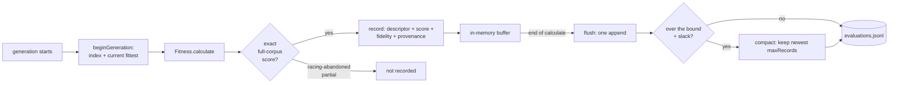

# Evaluation archive: keeping the exact scores (Issue #3929)

## Summary

NEAT-AI computed tens of thousands of exact fitness evaluations per lineage and
discarded every one of them — `Fitness.calculate` attached a score to a creature
and the pair evaporated when the creature was culled. Every surrogate in Jin
(2011) needs exactly that pair to exist first, so nothing model-based in the
#3919 sweep was possible without it.

This adds an **append-only evaluation archive**: on the exact-evaluation path
only, each true evaluation is kept as a versioned `(descriptor, score)` pair
with its fidelity and provenance, in a size-bounded JSONL (JSON Lines) file. It
is **off by default**, it is run infrastructure, and nothing it records reaches
the creature export.

Closes #3929.

## Evidence

Backend/CLI change — no web interface to screenshot. Evidence is the test suite,
the benchmark, and two real evolution runs.

**Overhead, measured at production scale**
(`bench/EvaluationArchiveOverhead.ts`, 5,300 neurons / 87,096 synapses,
generation of 20):

| Operation                                         | Cost    |
| ------------------------------------------------- | ------- |
| Descriptor, one creature (no reference)           | 1.4 ms  |
| Descriptor, 20 distinct creatures, cold distances | 40.6 ms |
| `record()` — one exact evaluation                 | 1.4 ms  |
| A whole generation: 20 records + one flush        | 41.7 ms |

Against a ~7.8-minute (468,000 ms) generation that is **~0.017%**. The benchmark
now **asserts** that budget — it throws if one archived generation exceeds 1% of
a generation — rather than only reporting it. It lives in `bench/` because
`AGENTS.md` forbids timing APIs in `test/`, where parallel execution makes
wall-clock readings unreliable.

**Identical-descriptor / different-score incidence**, from two real runs, posted
to #3919 (comment `5615657684`, superseding an earlier comment measured against
a pre-review cut of the descriptor):

| Run                     | Exact records | Colliding records | Incidence  | Widest spread |
| ----------------------- | ------------- | ----------------- | ---------- | ------------- |
| pop 24, 40 generations  | 533           | 4                 | **0.750%** | 0.0573        |
| pop 32, 120 generations | 2,114         | 7                 | **0.331%** | 0.1172        |

**Quality gate.** `./quality.sh` cannot run in this container: it requires the
native `rust_scorer` binary and `libneat_ai_backpropagation`, and neither the
binaries nor their sibling repositories are present. I ran every check it
performs that does not need them — `deno fmt --check` (2,715 files), `deno lint`
(2,178 files), `deno check mod.ts src test bench`, and the affected suites — all
clean. Nineteen `trainDir` tests fail for want of the native backprop library; I
confirmed on a worktree of the base branch that the same nineteen fail there
identically, so they are pre-existing and environmental. CI runs the full gate
on the PR.

<!-- vibe-quality-gate-skipped reason="./quality.sh requires the native rust_scorer and libneat_ai_backpropagation binaries, absent from this container; fmt, lint, check and the affected test suites were run instead and pass" -->

## Acceptance Criteria

<!-- vibe-spec-review inputs="diff+issue-body" -->

- **met** — Append-only archive written on the exact-evaluation path, off by
  default — evidence: `src/architecture/Fitness.ts::archiveExactEvaluation` at
  the two exact-score sites;
  `test/archive/EvaluationArchiveFitness.ts::the
  per-creature path archives every exact score`
  — reviewer: met
- **met** — Versioned descriptor with a documented, stable definition —
  evidence: `src/archive/EvaluationDescriptor.ts::EVALUATION_DESCRIPTOR_VERSION`
  and the frozen `DESCRIPTOR_V1_SQUASH_NAMES`; `docs/EVALUATION_ARCHIVE.md` —
  reviewer: met
- **met** — Fidelity and provenance recorded per entry — evidence:
  `test/archive/EvaluationArchive.ts::records an exact evaluation with its
  provenance`
  — reviewer: partial — reason: the reviewer found the de-duplicator's breeding
  path (`Breed.breed`) never recorded lineage, so every duplicate-replacement
  offspring was archived with no parents. Fixed: `src/breed/Breed.ts` now calls
  `recordLineage`, and a 120-generation run shows 709 of 2,114 records carrying
  parents. The reviewer's second point — that an empty `operators` array cannot
  be told from "none applied" — stands as designed; an empty array _is_ "none
  known", and the archive does not invent provenance it does not have.
- **met** — Descriptor reproducibility test against a committed creature fixture
  — evidence:
  `test/archive/EvaluationDescriptor.ts::committed fixture
  re-derives to the committed vector`,
  against `test/fixtures/archive/descriptor-v1-*.json` — reviewer: met
- **met** — Version-mismatch reads fail loudly, with a test — evidence:
  `src/archive/EvaluationArchiveFormat.ts::assertRecordVersion`;
  `test/archive/EvaluationArchive.ts::reading a foreign descriptor version fails
  loudly`
  — reviewer: met
- **met** — Retention/size bound implemented and documented — evidence:
  `src/archive/EvaluationArchive.ts::compactArchive`;
  `test/archive/EvaluationArchive.ts::retention keeps the newest records and
  bounds the file`
  — reviewer: met
- **met** — Excluded from creature export, with a test — evidence:
  `src/archive/CreatureLineage.ts` (module-level `WeakMap`);
  `test/archive/EvaluationArchiveFitness.ts::nothing it records reaches the
  creature export`
  — reviewer: met
- **met** — Overhead measured against a production-scale generation and reported
  — evidence: `bench/EvaluationArchiveOverhead.ts`, table above — reviewer: met
  — reason: the reviewer independently reproduced the benchmark and found the
  single-pair rows understated the cost, because the genetic-distance cache
  serves every iteration after the first. Fixed: a cold 20-distinct-creature row
  was added and the documented table re-measured.
- **met** — Identical-descriptor/different-score incidence reported on #3919 —
  evidence: #3919 comment `5615657684`, and the table in
  `docs/EVALUATION_ARCHIVE.md` — reviewer: partial — reason: the reviewer could
  see only the diff, in which the incidence was an instrument with no measured
  number. Two runs were measured and posted to #3919, and the numbers are now
  committed in the doc as well.
- **met** — Constraint: descriptor stability; version it and refuse to mix
  versions on read — evidence:
  `test/archive/EvaluationArchive.ts::a foreign version appended later is still
  caught`
  — reviewer: met — reason: the reviewer separately found that slot 16
  (`geneticDistanceToReference`) is measured against a reference that moves as
  the fittest changes, making the vector non-stationary in a way the version
  gate cannot see. That is real, and the issue itself asked for the slot. Fixed
  by making the drift visible rather than silent: every record now carries
  `referenceUuid`, and the doc tells a consumer to group by it or drop the slot.
- **met** — Constraint: write only exact scores; a partial or sampled score is
  tagged, never ground truth — evidence:
  `test/archive/EvaluationArchiveFitness.ts::a racing-abandoned partial score is
  never archived`
  — reviewer: met
- **met** — Constraint: bounded on disk, cheap enough not to register against a
  7.8-minute generation — evidence: benchmark table above — reviewer: met
- **met** — Constraint: do not put it on the creature export — evidence:
  `test/archive/CreatureLineage.ts::never reaches the creature export` —
  reviewer: met
- **met** — Failure detection: archive writes must not measurably move
  time-per-generation; assert against a budget — evidence:
  `bench/EvaluationArchiveOverhead.ts::assertGenerationWithinBudget` — reviewer:
  partial — reason: the reviewer correctly found no assertion existed, only a
  transcribed table. Fixed by making the benchmark throw when one archived
  generation exceeds 1% of a generation. It is asserted in `bench/` rather than
  `test/` because `AGENTS.md` forbids timing APIs in unit tests.
- **met** — Failure detection: a descriptor-version mismatch on read must fail
  loudly, not coerce — evidence:
  `test/archive/EvaluationArchive.ts::a wrong-length descriptor is refused, not
  coerced`
  — reviewer: met
- **met** — Failure detection: re-deriving a descriptor from an archived
  creature reproduces the archived vector exactly — evidence:
  `test/archive/EvaluationDescriptor.ts::committed fixture re-derives to the
  committed vector`
  — reviewer: partial — reason: the reviewer found slot 16 was not re-derivable
  from a record at all, because nothing said which creature the distance was
  measured against. Fixed by `referenceUuid`; all 57 slots are now re-derivable
  given the archive.
- **met** — Failure detection: report the identical-descriptor incidence rate —
  evidence: #3919 comment `5615657684` — reviewer: partial — reason: same as the
  acceptance item above; the number was measured and posted after the review.
- **unrequested** — `error`, `approach` and `recordedAt` fields on each record —
  reviewer: unrequested — reason: three cheap columns that make a record
  self-describing (the raw error the score came from, the pipeline stage that
  produced the creature, and when it was archived). Kept.
- **unrequested** — descriptor slots the issue did not enumerate: `inputs`,
  `outputs`, `hiddenNeurons`, `constantNeurons`, `biasMeanAbs`, `biasMaxAbs` —
  reviewer: unrequested — reason: the issue says "neuron and synapse counts" and
  "weight-magnitude summary statistics"; these split the neuron count by role
  and add the bias magnitudes, which the magnitude penalty already scores as
  part of the same family. Kept.
- **unrequested** — a public package API for the archive in `mod.ts` — reviewer:
  unrequested — reason: the reviewer flagged 14 exported symbols as semver
  commitments on something the issue calls run infrastructure. Trimmed to the
  eight a consumer genuinely needs to read an archive and score a candidate; the
  config resolver, its default constant, `EvaluationArchive` itself,
  `EXACT_FIDELITY` and two derivable name lists were removed, following the
  precedent that `RacingConfig` exports types only.
- **unrequested** — moving `stubRunner` / `racingSession` from
  `test/score/RacingBatchScoring.ts` into `test/score/_racingFixtures.ts` —
  reviewer: unrequested — reason: the new racing-exclusion test needs the same
  fake `--race-stdio` session; the fixtures file exists for exactly that, and
  its own header says so. The alternative was duplicating 90 lines.

## Standards Review

<!-- vibe-standards-review inputs="diff+CODING-STANDARDS.md" -->

- **violation** — the genetic-distance sentinel also fired when the creature
  _was_ the reference, conflating "no reference" with a genuine zero — evidence:
  `src/archive/EvaluationDescriptor.ts:272` — reason: fixed; the identity check
  is gone, and
  `test/archive/EvaluationDescriptor.ts::the genetic-distance sentinel means only
  'no reference'`
  covers the self-reference case.
- **violation** — bare swallowing `catch` on an unresolvable activation name —
  evidence: `src/archive/EvaluationDescriptor.ts:157` — reason: fixed; it now
  warns through `getLogger()`, once per unknown name so a 5,300-neuron creature
  cannot flood the log, before counting it under `squash:other`.
- **violation** — `record()` dropped evaluations with no signal at all —
  evidence: `src/archive/EvaluationArchive.ts:187` — reason: fixed; non-finite
  scores and creatures without a UUID are tallied and reported in a warning at
  the next flush.
- **violation** — buffered records were destroyed before the write that could
  fail, so a loud error was also silently destructive — evidence:
  `src/archive/EvaluationArchive.ts:227` — reason: fixed; the buffer is restored
  on failure, covered by
  `test/archive/EvaluationArchive.ts::a failed flush keeps the records it could
  not write`.
- **violation** — module docstring cited a test file that does not exist —
  evidence: `src/archive/EvaluationDescriptor.ts:26` — reason: fixed to point at
  `test/archive/EvaluationDescriptor.ts`.
- **violation** — four assertions on `archive.bufferedCount` tested the
  buffering strategy, not behaviour — evidence:
  `test/archive/EvaluationArchive.ts:78` — reason: fixed; the accessor is gone
  and the tests now assert observable file state, which also verifies the
  documented one-append-per-generation contract.
- **violation** — the retention test imported the slack formula it was meant to
  bound — evidence: `test/archive/EvaluationArchive.ts:174` — reason: fixed;
  `compactionSlack` is no longer exported and the test asserts the documented
  contract (dropped some, kept at least `maxRecords`, kept the newest contiguous
  run).
- **violation** — `CORPUS_RECORDS` / `CHUNK_RECORDS` exported with no cross-file
  consumer — evidence: `test/score/_racingFixtures.ts:101` — reason: fixed; the
  `export` keyword was dropped from both.
- **violation** — `EvaluationArchive.close()` had no production caller —
  evidence: `src/archive/EvaluationArchive.ts:252` — reason: fixed; removed.
  `flush()` already does everything it did.
- **violation** — the new call sat under comments describing different code —
  evidence: `src/NEAT/NeatEvolution.ts:204` — reason: fixed; the archive call
  was moved above the `#2239` / `#4141` comment block.
- **violation** — acronyms not expanded on first use — evidence:
  `docs/EVALUATION_ARCHIVE.md:5` — reason: fixed; UUID, JSON, JSONL, WASM and
  IEEE 754 are expanded, and RBF and SVM now carry links.
- **violation** — 439 lines and five responsibilities in one file — evidence:
  `src/archive/EvaluationArchive.ts` — reason: fixed; the on-disk format, its
  parser, the version gate and the reader moved to
  `src/archive/EvaluationArchiveFormat.ts`, leaving the writer.
- **violation** — JSDoc drift within the change: constructor, `parseRecordLine`,
  `assertRecordVersion` and `canonicalSquashName` lacked the tag set every
  sibling carries — evidence: `src/archive/EvaluationArchive.ts:141` — reason:
  fixed; all four now carry `@param` / `@returns` / `@throws`.
- **violation** — raw `Deno.errors` escaped instead of the typed error the
  module promises — evidence: `src/archive/EvaluationArchive.ts:275` — reason:
  fixed; a new `IO_FAILURE` reason wraps every non-`NotFound` filesystem
  failure.
- **clean** — Australian English throughout; `Temporal` for the wall-clock
  `recordedAt` and no `Date.now()` added for a calendar timestamp; no
  `console.*` under `src/` and no `@std/log`; no timing API in any `test/` file;
  the creature-UUID and neuron-UUID invariants (lineage is a `WeakMap`, nothing
  hashable is mutated, no integer neuron id is persisted); typed errors from
  `src/errors/`; config rejected rather than clamped; every `deno.json` lint
  rule including `no-await-in-loop` and `no-import-prefix`; `mod.ts` banner
  style; test placement and naming.

## Test Plan

Added, 46 tests across six files:

- `test/archive/EvaluationDescriptor.ts` — 8 tests: committed-fixture
  reproducibility, export/import round trip, fixed length, unique slot names,
  squash-alias canonicalisation, the sentinel meaning only "no reference",
  participating-population means, and structure moving the vector.
- `test/archive/EvaluationArchive.ts` — 12 tests: provenance including
  `referenceUuid`, cross-run append, fidelity refusal, non-finite and
  unidentified skips, retention bound, foreign version on read, on append, and
  appended later, a failed flush preserving its records, wrong-length
  descriptor, torn line, and an absent archive reading empty.
- `test/archive/EvaluationArchiveFitness.ts` — 5 tests through the real
  `Fitness.calculate`: off by default, every exact score archived, a
  de-duplicated creature archived once, a racing-abandoned partial score never
  archived, and nothing reaching the creature export.
- `test/archive/EvaluationArchiveNeatWiring.ts` — 2 tests on the `NeatOptions` →
  `Neat` → `Fitness` seam, both directions of the opt-in.
- `test/archive/CreatureLineage.ts` — 5 tests: absent lineage, both parents, a
  parent without identity read as a gap, no identifiable parent, and never
  reaching the export.
- `test/archive/DescriptorCollisions.ts` — 7 tests: empty archive, distinct
  descriptors, agreement within tolerance, a real disagreement measured, float
  noise, exact-records-only, and the rendered report.
- `test/config/EvaluationArchiveConfig.ts` — 5 tests: defaults, per-run ids,
  overrides, retention bound rejected not clamped, empty directory or run id.

Also `bench/EvaluationArchiveOverhead.ts`, which asserts the per-generation
overhead budget on start-up and benchmarks five operations.

No existing test was removed or disabled. `test/score/RacingBatchScoring.ts`
keeps every one of its five tests; two helper functions moved into the sibling
fixtures file it already imports from.
