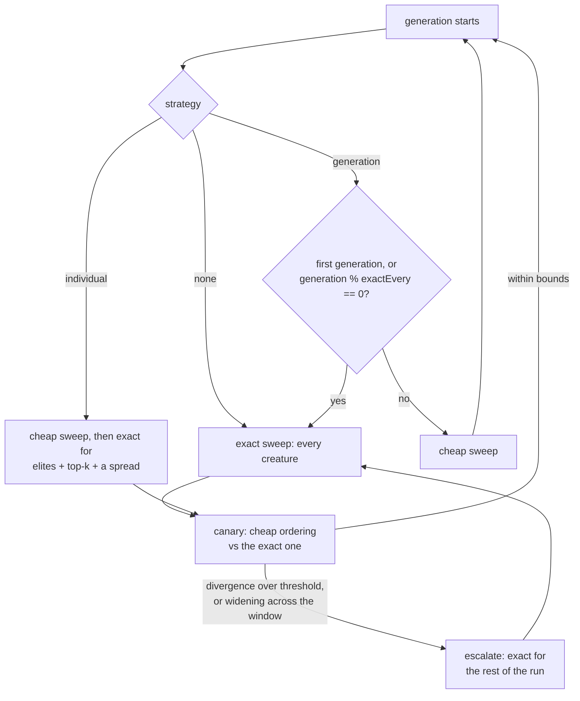

## Summary

Nothing in NEAT-AI decided when a creature earned an exact evaluation. There was
one fitness policy and it was implicit — `src/architecture/Fitness.ts` evaluates
every creature exactly, every generation — so even once a cheap evaluation
became _available_, no object owned the question Jin (2011) §4 says decides
whether surrogate-assisted evolution works at all. This adds that decision
layer. Closes #3931.

- **`src/NEAT/EvolutionControl.ts`** — the policy object, beside
  `AdaptivePopulationSizer` / `PlateauDetector` rather than inside `Fitness`,
  which stays a mechanism. Strategies `"none"` (the default and the previous
  behaviour), `"generation"` (an exact sweep every λth generation) and
  `"individual"` (a cheap sweep with the top _k_ plus a deterministic spread
  re-evaluated exactly). Jin's third family, population-based control, is not
  offered: it needs an island model the loop does not have.
- **`src/architecture/ScoreFidelity.ts`** — per-creature fidelity as a
  `scoreFidelity` tag, with the guards that refuse an approximate score wherever
  ground truth is required. An untagged creature reads as `null` — "never
  approximated" — not a fabricated `1`, and a corrupt tag throws rather than
  being read as exact.
- **`src/config/EvolutionControlConfig.ts`** — resolution that rejects, never
  clamps.
- **Wiring** — `NeatEvolution` plans each generation, logs its fidelity and
  exact-evaluation count, and enforces the elite / `previousFittest` / export
  guards when the policy is active. `RacingRanking` tags an abandoned creature
  with the corpus fraction it managed (the only approximate score the build
  produces today); both `Fitness` scoring paths clear that tag once a
  full-corpus score replaces it.
- **`scripts/evolution_control_ab.ts`** + evidence — the same-seed A/B.

### What this deliberately does not do

**No cheap evaluator is wired into the evolution loop**, because none has passed
its gate: [#3927](../../evidence/rank-fidelity-3927.md) found no sampling rate
safe on the real lineage, and
[#3930](../../evidence/surrogate-feasibility-3930.md) could not decide its
surrogate kill gate. Setting `"generation"` or `"individual"` therefore changes
which fidelity each generation _asks_ for while every creature is still
evaluated exactly.

That is not left silent. The first generation whose plan is not honoured logs a
warning naming the strategy and stating that it costs what `"none"` costs, so a
run can never read as cheap when it was not
(`EvolutionControl.unhonouredPlanWarning`, `NeatEvolution.ts`), and
`docs/EVOLUTION_CONTROL.md` says so in its opening note.

## Evidence

Backend/library change with no web interface, so no screenshot applies. The
evidence is a measurement plus the tests below.

Ten seeds, 60 generations each, judged on the **exact score of the final
creature** — full table, method and caveats in
[`docs/evidence/evolution-control-3931.md`](../../evidence/evolution-control-3931.md):

| Arm          | Equal generations |    vs control | Equal record budget | vs control |
| ------------ | ----------------: | ------------: | ------------------: | ---------: |
| `none`       |         -4.449561 |             — |           -5.561302 |          — |
| `generation` |         -4.444883 |     +4.68e-03 |           -4.575336 |  +9.86e-01 |
| `individual` |         -4.530791 | **-8.12e-02** |           -4.530791 |  +1.03e+00 |

`"individual"` is **worse at equal generations on 8 of 10 seeds** — the exact
regression the issue warned about, reported rather than buried. At equal record
budget both cheap arms beat exact-everything on all 10 seeds. The canary
escalated on 7 of 10 `"generation"` seeds, every one of them on the
widening-trend rule rather than the threshold.

The A/B runs against a synthetic objective whose cheap fitness is a strided
sub-sample of its own corpus. That is a limitation and the evidence file states
it: it measures the **policy**, not a 5,317-neuron GRQ creature, because there
is no cheap evaluator the real lineage may use.

## Acceptance Criteria

<!-- vibe-spec-review inputs="diff+issue-body" -->

- **met** — `EvolutionControl` in `src/NEAT/`, default `"none"`, behaviour
  unchanged when off — evidence:
  `test/NEAT/EvolutionControlWiring.ts::a default evolve tags nothing and plans every generation exact`
  — reviewer: met — reason: the reviewer's caveat, that the new guards could
  hard-throw in a racing run that previously completed, was real; the guards are
  now gated on an active policy (`NeatEvolution.ts`), so an off run is
  identical.
- **partial** — `"generation"` and `"individual"` implemented per Jin §4 —
  evidence: `src/NEAT/EvolutionControl.ts`,
  `test/NEAT/EvolutionControl.ts::generation-based control anchors every λth generation`
  — reviewer: partial — reason: the decision is implemented and measured, but no
  production evaluator consumes the plan, because none has passed its gate
  (#3927, #3930); the mismatch is now logged loudly instead of being silent.
- **met** — elites and `previousFittest` always exactly evaluated, with a test —
  evidence:
  `test/NEAT/EvolutionControl.ts::an approximate score cannot reach an elite slot`
  and `::an approximate score cannot become previousFittest`, enforced at
  `src/NEAT/NeatEvolution.ts` — reviewer: met.
- **partial** — fidelity tracked per creature; cross-fidelity comparison
  rejected, with a test — evidence: `src/architecture/ScoreFidelity.ts`,
  `test/NEAT/EvolutionControl.ts::comparing a cheap score against an exact one is refused`
  — reviewer: partial — reason: tracking is enforced in production, but
  `compareScores` is available to callers rather than replacing the loop's own
  sort; racing's rank band remains the mechanism that keeps an approximate score
  out of the elite band today.
- **met** — exported creatures always carry an exact score, with a test —
  evidence:
  `test/NEAT/EvolutionControl.ts::an approximate score cannot be exported`
  (which asserts through the clone the export is built from), enforced at
  `src/NEAT/NeatEvolution.ts` — reviewer: met.
- **partial** — false-optimum canary implemented, logged per exact sweep, with
  an escalation threshold — evidence: `src/NEAT/EvolutionControl.ts`,
  `test/NEAT/EvolutionControl.ts::a widening trend escalates below the threshold`
  — reviewer: partial — reason: the canary is implemented, tested and exercised
  by the A/B, but with no cheap sweep in production there is no ordering to
  compare, so a real run reports `canary divergence n/a` until an evaluator
  lands.
- **met** — same-seed A/B over ≥50 generations judged on final exact score,
  reported whichever way it goes — evidence:
  `docs/evidence/evolution-control-3931.md`, harness
  `scripts/evolution_control_ab.ts` (which refuses `--generations < 50`) —
  reviewer: met — reason: the reviewer noted it measures "the policy object
  rather than the shipped evolution path"; that limitation is stated in the
  evidence file and is forced by #3927/#3930.
- **unrequested** — `src/score/RacingRanking.ts` tags every racing-abandoned
  creature with its partial fidelity — reviewer: unrequested — reason: without
  it "fidelity tracked per creature" would be vacuous — racing is the only
  source of an approximate score in the build today.
- **unrequested** — `refreshExactScoreFidelity` in both `Fitness` scoring paths
  — reviewer: unrequested — reason: a tag that outlived the approximation it
  described would mark an exact score as cheap next generation.
- **unrequested** — the equal-record-budget comparison and `scoreAtBudget()` in
  the A/B harness — reviewer: unrequested — reason: the issue's own regime is
  wall-clock-bounded, so both framings are reported; the equal-generation one
  the issue named carries the negative result.
- **unrequested** — `mod.ts` exports, `docs/EVOLUTION_CONTROL.md`, the
  `docs/README.md` index entry and the `deno task evolution-control-ab` entry —
  reviewer: unrequested — reason: repo convention, mirroring the #3929 and
  #3927/#3930 precedents; a code change owes a docs change.
- **unrequested** — registering `evolutionControl` in
  `scripts/lib/optionAuditRollup.ts` and bumping the pinned top-level key count
  — reviewer: unrequested — reason: the audit fails loud on an unclassified
  option key, so a new config surface cannot land without it.

## Standards Review

<!-- vibe-standards-review inputs="diff+CODING-STANDARDS.md" -->

- **violation** — the creature tag was named `fidelity`, the exact name Issue
  #3929 asserts never appears on a creature or in its export — evidence:
  `src/architecture/ScoreFidelity.ts:34` — reason: fixed here; the tag is
  `scoreFidelity` and `test/architecture/ScoreFidelity.ts` pins the name.
- **violation** — an active strategy was a silently inert option, and its trace
  line contradicted itself (`approximate … 24 exact / 0 approximate`) —
  evidence: `src/NEAT/NeatEvolution.ts:244` — reason: fixed here;
  `unhonouredPlanWarning` states the mismatch loudly, once per run, and the docs
  say the strategies are advisory until an evaluator lands.
- **violation** — `partialCorpusFidelity` floored invalid input (`NaN`, a
  non-positive corpus) into a plausible-looking fidelity instead of throwing —
  evidence: `src/architecture/ScoreFidelity.ts:153` — reason: fixed here; it
  throws `INVALID_FIDELITY`, with a test per invalid shape.
- **violation** — `EXACT_SCORE_FIDELITY = 1` duplicated the existing
  `EXACT_FIDELITY` — evidence: `src/architecture/ScoreFidelity.ts:37` — reason:
  fixed here; it aliases the archive's constant, asserted equal in
  `test/architecture/ScoreFidelity.ts`.
- **violation** — no `test/config/EvolutionControlConfig.ts` and no
  `test/architecture/ScoreFidelity.ts`, contrary to CONTRIBUTING's "Adding
  Configuration" step and the `test/` mirrors `src/` rule — evidence:
  `test/NEAT/EvolutionControl.ts` — reason: fixed here; both files now exist and
  the folded-in tests moved to them.
- **violation** — `MIXED_FIDELITY_COMPARISON`'s JSDoc described only the
  cheap-vs-exact case, though it is also thrown for misaligned arrays and an
  unscored creature — evidence: `src/errors/EvolutionControlError.ts:17` —
  reason: fixed here.
- **violation** — `docs/EVOLUTION_CONTROL.md` used `Creature.evolveDataSet(...)`
  (it is an instance method), gave a reproduction command that does not
  reproduce the ten-seed evidence, restated citations instead of linking
  `docs/comparison/REFERENCES.md`, and described cheap-sweep behaviour the
  library does not perform — evidence: `docs/EVOLUTION_CONTROL.md:120` — reason:
  all four fixed here; Jin, Olhofer & Sendhoff (2002) added to REFERENCES.md
  with its DOI.
- **clean** — Australian English throughout the diff (the only American spelling
  is inside a verbatim paper title); no hidden paths staged; every new `src/`
  module carries a `@module` block and every export its `@param`/`@returns`/
  `@throws`; `getLogger()` only, no `console.*` under `src/`; typed errors match
  the `ConfigurationError` shape; config rejects rather than clamps; tests call
  real exported functions and a real `evolveDataSet` rather than grepping
  source; no wall-clock assertions in unit tests; neuron-UUID and
  semantic-version stability untouched; no new dependencies.

## Test Plan

- `test/NEAT/EvolutionControl.ts` — the policy: strategy scheduling, the exact
  subset and its determinism, the elite / `previousFittest` / export refusals,
  cross-fidelity comparison, ordering divergence (including one-sided vs mutual
  ties and the undecidable case), threshold and widening-trend escalation, the
  per-generation summary, and the unhonoured-plan warning firing exactly once.
- `test/architecture/ScoreFidelity.ts` — the tag: absent reads as `null`, a
  corrupt tag throws, out-of-range is rejected, a stale tag is refreshed by an
  exact score, an untouched creature stays untagged, the tag survives the export
  clone, invalid partial-corpus counts throw, and the tag name does not collide
  with #3929's.
- `test/config/EvolutionControlConfig.ts` — defaults, per-field overrides, every
  named strategy, and ten invalid values each rejected rather than clamped.
- `test/NEAT/EvolutionControlWiring.ts` — config → `Neat` → the loop: an invalid
  option fails the run, a racing-abandoned creature carries its partial fidelity
  and is refused every exact-only slot, a full-corpus rescore clears it, and a
  default `evolveDataSet` run completes with no fidelity tag anywhere.
- `test/scripts/EvolutionControlAB.ts` — the harness arithmetic the committed
  evidence rests on: corpus reproducibility from the seed, strided scoring and
  its phases, the cost accounting, the arm's reproducibility, and the budget
  read never reporting a score the arm had not reached.
- `test/scripts/OptionAuditRollup.ts` / `test/scripts/AuditOptionUsage.ts` —
  updated for the new option key.
- `./quality.sh` — run to completion after the final edit.
