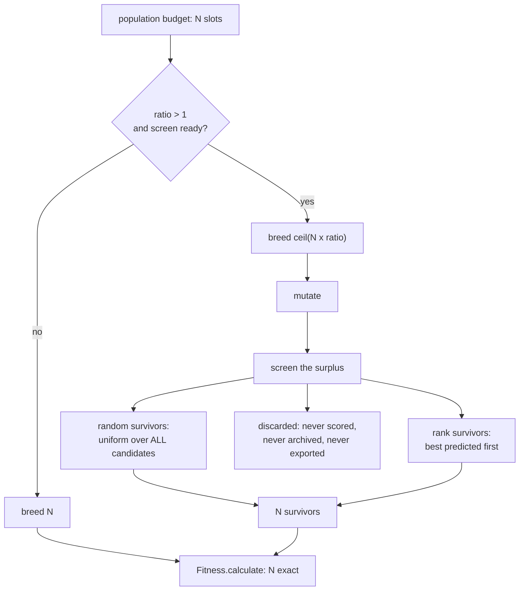

## Summary

Offspring pre-selection — breed a surplus, screen it, evaluate only the
survivors (Issue #3932).

NEAT-AI bred exactly the offspring the population budget called for and every
one of them went into `Fitness.calculate()` at full corpus cost — on the GRQ
lineage, 7.8 minutes each. There was no point in the pipeline where a candidate
could be created and then rejected before it was expensive; the only pre-fitness
filter, `DeDuplicator`, declines to score the same creature twice and is happy
to spend a full evaluation on twenty distinct bad ones.

This adds the missing stage — Jin (2011) §4's **pre-selection**, the lever
distinct from the evolution control that landed in #3931. Breed a surplus, rank
it with a cheap screen, keep the population-sized survivor set, discard the rest
before anyone pays for them. Closes #3932.

- **`src/NEAT/PreSelection.ts`** — the policy: how large a surplus to ask the
  breeder for, which candidates survive, and the per-generation diagnostics.
- **`src/NEAT/OffspringScreen.ts`** — one interface, two screens.
  `SampledCorpusScreen` wraps a caller-supplied cheap evaluator;
  `SurrogateScreen` is distance-weighted k-NN over the Issue #3929 structural
  descriptor, fitted to the exact scores the run has already paid for.
- **`src/config/PreSelectionConfig.ts`** — `ratio` (the issue's
  `preSelectionRatio`), `screen` (`preSelectionScreen`),
  `randomSurvivorFraction`, and the two surrogate knobs. Nested under one
  `preSelection` key so the surface matches the `evolutionControl` policy it
  composes with. **Off by default (`ratio: 1`, `screen: "none"`).**
- **Wiring** — `NeatEvolution` asks the breeder for `offspringTarget(slots)` and
  screens the bred slice back to the budget **after mutation**, so the screen
  judges the creature fitness will actually evaluate.
- **Docs** — [`docs/PRE_SELECTION.md`](../../PRE_SELECTION.md), the option
  tables, and the measured result.



### Two refusals worth reading before the code

- **`screen: "sampled"` throws inside the evolution loop.** Issue #3926 put the
  cheap fidelity in the **data pipeline** — a run is pointed at a sampled corpus
  — so the loop has no second, cheaper evaluator to call. Constructing a `Neat`
  with that screen raises `PreSelectionError` `NO_SCREEN_EVALUATOR` rather than
  discarding offspring on a fabricated number. The class itself takes a
  caller-supplied evaluator and is exercised end to end by the A/B harness.
- **`ratio > 1` with `screen: "none"` is a configuration error**, and so is a
  screen at `ratio: 1`. Over-generating and then discarding unscreened is a
  random cull, not pre-selection; a screen with no surplus screens nothing.
  Every other invalid value is rejected, never clamped.

## Evidence

Backend/library change with no web interface, so there is no screenshot to
capture. Evidence is the measurement and the test suite.

### The measurement, and it is not flattering

`deno task pre-selection-ab --generations=30 --replicates=10` — ten seeds, 30
generations, population 24, ratio 3, against a synthetic in-process objective.
Real in the harness: the creatures, `Offspring.breed`, the `Mutator` operators,
`Genus`, `geneticCompatibility`, and the `PreSelection` stage itself. Full
numbers, and what they do not say, in
[`docs/evidence/pre-selection-3932.md`](../../evidence/pre-selection-3932.md);
the artefact carries a `summary` block so every number below is re-derivable.

| Arm           | Equal generations | Equal record budget | Mean genetic distance |
| ------------- | ----------------- | ------------------- | --------------------- |
| `control`     | −0.040396         | −0.040396           | 0.1501                |
| `sampled`     | −0.012406 (7/10)  | −0.055391 (3/10)    | 0.1028 (**−0.0474**)  |
| `surrogate`   | −0.032478 (6/10)  | −0.057664 (1/10)    | 0.0915 (**−0.0586**)  |
| `random-only` | −0.015769 (7/10)  | −0.058123 (3/10)    | 0.1550 (+0.0048)      |

Three findings, stated plainly:

1. **No arm improved at equal record budget — every one was a regression
   there.** At equal _generations_ the over-generated arms beat control, but so
   does `random-only`, which never consults its screen: the gain is the surplus
   filling a population when crossover fails, not the screen. Repeated
   invocations moved the equal-budget deltas by ±2e-2 (the size of the deltas
   themselves), because `Offspring.breed` mints neuron identities with
   `crypto.randomUUID()` and the harness is therefore same-seed within an
   invocation but not bit-reproducible across them.
2. **Both screens cost genetic diversity** — a third to 40 % of mean genetic
   distance — while `random-only` holds it. That is the diversity sink the issue
   predicted, and `randomSurvivorFraction: 0.25` does not prevent it.
3. **The elite-rank diagnostic works.** The `"sampled"` screen's eventual elites
   come from the top 3 % of its ordering; the `"surrogate"` screen's from 0.289
   against a 0.382 no-information baseline — weakly informative, not
   anti-correlated. Screening cost 0.65 ms (surrogate) and 3.34 ms (sampled) a
   generation.

**This is why the stage ships off**, and the issue asked for exactly this
reporting rather than retuning until the number improved. What the issue asked
for is the mechanism plus the diagnostics that would catch it going wrong; the
measurement is the honest answer to "does it help", and today it is "not
demonstrated on this objective".

### Quality gate

`./quality.sh` cannot run to completion in this container: the gate requires a
native `rust_scorer` binary (Issue #3871, no WASM fallback) and it is not
installed here —
`❌ Native rust_scorer is required (quality.sh default) but was not found.` What
did run:

- `./quality.sh --lint-only` — `deno fmt`, `deno lint`, bash checks: **clean**.
- `./quality.sh --check-only` — `deno check` over the tree: **clean**.
- `deno test` over `test/NEAT/`, `test/config/`, `test/architecture/`,
  `test/breed/`, `test/scripts/`, `test/archive/`, `test/score/`, `test/docs/`,
  `test/creature/`, `test/validate/`, `test/mutate/`, `test/utils/` — every
  failure is one of two missing native binaries (`rust_scorer`,
  `neat_ai_backpropagation`) and reproduces on files this PR does not touch.
  Every test in the changed areas passes.
- `cspell` and `markdownlint-cli2` over the new and changed markdown: clean.

CI runs the full gate on the PR.

## Test Plan

55 new tests across five files, all calling real code:

- `test/config/PreSelectionConfig.ts` (12) — defaults are the stage off, every
  refusal, the two cross-field contradictions.
- `test/NEAT/OffspringScreen.ts` (15) — the sampled screen's refusal to exist
  without an evaluator, misaligned and non-finite screen values, the surrogate's
  readiness, its predictions, its bounded window and its eviction behaviour.
- `test/NEAT/PreSelection.ts` (15) — `ratio: 1` identical to the current build;
  the surplus cut to budget; **the random survivor fraction proven not
  rank-ordered** over 40 seeded draws; a discarded creature carrying no score
  and no rank; a screen that writes a score refused; elite ranks recorded and
  forgotten on schedule.
- `test/NEAT/PreSelectionWiring.ts` (8) — config reaching `Neat`, the sampled
  screen's refusal, a default evolve run screening nothing, a real multi-
  generation evolve screening offspring, and **the evaluation archive holding no
  more than the evaluated populations** while the stage discards.
- `test/scripts/PreSelectionAB.ts` (5) — the harness's corpus, scoring, genetic
  distance and both arms.

Commands:

```bash
deno test --allow-all test/NEAT/PreSelection.ts test/NEAT/OffspringScreen.ts \
  test/NEAT/PreSelectionWiring.ts test/config/PreSelectionConfig.ts \
  test/scripts/PreSelectionAB.ts
deno task pre-selection-ab --generations=30 --replicates=10
```
