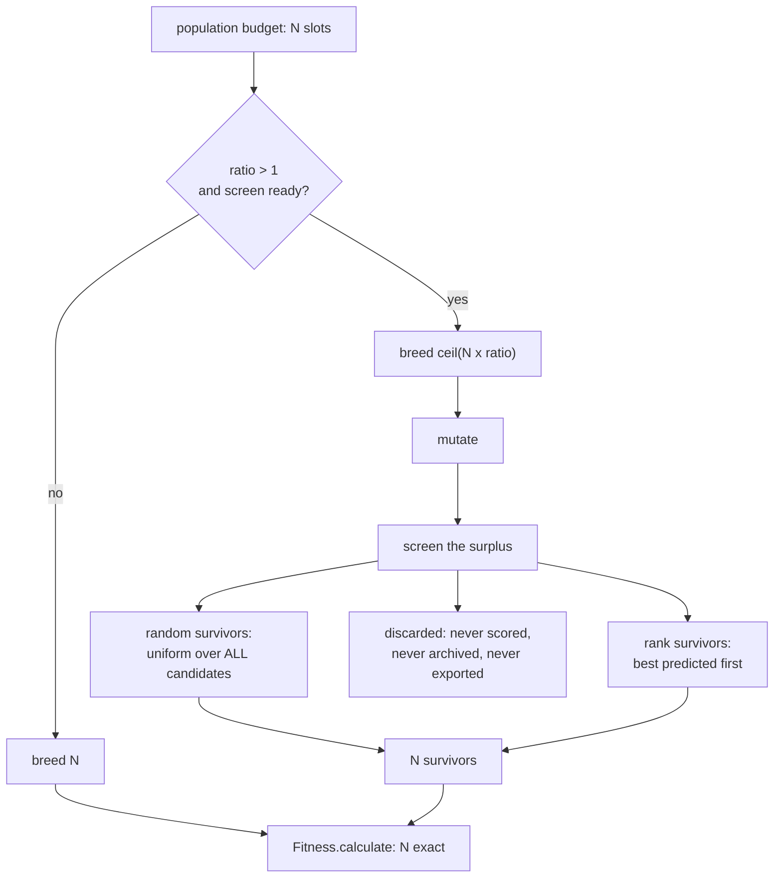

## Summary

Offspring pre-selection — breed a surplus, screen it, evaluate only the
survivors (Issue #3932).

NEAT-AI bred exactly the offspring the population budget called for and every
one of them went into `Fitness.calculate()` at full corpus cost — on the GRQ
lineage, 7.8 minutes each. There was no point in the pipeline where a candidate
could be created and then rejected before it was expensive; the only pre-fitness
filter, `DeDuplicator`, declines to score the same creature twice and is happy
to spend a full evaluation on twenty distinct bad ones.

This adds the missing stage — Jin (2011) §4's **pre-selection**, the lever
distinct from the evolution control that landed in #3931. Breed a surplus, rank
it with a cheap screen, keep the population-sized survivor set, discard the rest
before anyone pays for them. Closes #3932.

- **`src/NEAT/PreSelection.ts`** — the policy: how large a surplus to ask the
  breeder for, which candidates survive, and the per-generation diagnostics.
- **`src/NEAT/OffspringScreen.ts`** — one interface, two screens.
  `SampledCorpusScreen` wraps a caller-supplied cheap evaluator;
  `SurrogateScreen` is distance-weighted k-NN over the Issue #3929 structural
  descriptor, fitted to the exact scores the run has already paid for.
- **`src/config/PreSelectionConfig.ts`** — `ratio` (the issue's
  `preSelectionRatio`), `screen` (`preSelectionScreen`),
  `randomSurvivorFraction`, and the two surrogate knobs. Nested under one
  `preSelection` key so the surface matches the `evolutionControl` policy it
  composes with. **Off by default (`ratio: 1`, `screen: "none"`).**
- **Wiring** — `NeatEvolution` asks the breeder for `offspringTarget(slots)` and
  screens the bred slice back to the budget **after mutation**, so the screen
  judges the creature fitness will actually evaluate.
- **Docs** — [`docs/PRE_SELECTION.md`](../../PRE_SELECTION.md), the option
  tables, and the measured result.



### Two refusals worth reading before the code

- **`screen: "sampled"` throws inside the evolution loop.** Issue #3926 put the
  cheap fidelity in the **data pipeline** — a run is pointed at a sampled corpus
  — so the loop has no second, cheaper evaluator to call. Constructing a `Neat`
  with that screen raises `PreSelectionError` `NO_SCREEN_EVALUATOR` rather than
  discarding offspring on a fabricated number. The class itself takes a
  caller-supplied evaluator and is exercised end to end by the A/B harness.
- **`ratio > 1` with `screen: "none"` is a configuration error**, and so is a
  screen at `ratio: 1`. Over-generating and then discarding unscreened is a
  random cull, not pre-selection; a screen with no surplus screens nothing.
  Every other invalid value is rejected, never clamped.

## Evidence

Backend/library change with no web interface, so there is no screenshot to
capture. Evidence is the measurement and the test suite.

### The measurement, and it is not flattering

`deno task pre-selection-ab --generations=30 --replicates=10` — ten seeds, 30
generations, population 24, ratio 3, against a synthetic in-process objective.
Real in the harness: the creatures, `Offspring.breed`, the `Mutator` operators,
`Genus`, `geneticCompatibility`, and the `PreSelection` stage itself. Full
numbers, and what they do not say, in
[`docs/evidence/pre-selection-3932.md`](../../evidence/pre-selection-3932.md);
the artefact carries a `summary` block so every number below is re-derivable.

| Arm           | Equal generations | Equal record budget | Mean genetic distance |
| ------------- | ----------------- | ------------------- | --------------------- |
| `control`     | −0.047237         | −0.047237           | 0.1308                |
| `sampled`     | −0.017237 (9/10)  | −0.047247 (4/10)    | 0.1147 (**−0.0161**)  |
| `surrogate`   | −0.033025 (7/10)  | −0.069645 (5/10)    | 0.1120 (**−0.0188**)  |
| `random-only` | −0.016846 (9/10)  | −0.049942 (5/10)    | 0.1541 (+0.0233)      |

Three findings, stated plainly:

1. **No arm improved at equal record budget.** At equal _generations_ the
   over-generated arms beat control, but `random-only` — which never consults
   its screen — is the best of them: the gain is the surplus filling a
   population when crossover fails, not the screen. Repeated invocations moved
   the equal-budget deltas by ±2e-2 and flipped their sign, because
   `Offspring.breed` mints neuron identities with `crypto.randomUUID()` and no
   seed reaches it; the harness is same-seed within an invocation and not
   bit-reproducible across them.
2. **Both screens cost genetic diversity while keeping the same surplus at
   random does not** (−0.016 and −0.019 against +0.023). Every over-generated
   arm sees more offspring, so a diversity-neutral screen would look like
   `random-only`; neither does. The direction held across every repeat while the
   magnitude did not. That is the diversity sink the issue predicted, and
   `randomSurvivorFraction: 0.25` does not prevent it.
3. **The elite-rank diagnostic works.** One observation per creature: the
   `"sampled"` screen's eventual elites come from the top 5 % of its ordering;
   the `"surrogate"` screen's from 0.298 against a 0.411 no-information baseline
   — weakly informative, not anti-correlated. The screen itself cost 0.66 ms
   (surrogate) and 4.95 ms (sampled) a generation.

**This is why the stage ships off**, and the issue asked for exactly this
reporting rather than retuning until the number improved. What the issue asked
for is the mechanism plus the diagnostics that would catch it going wrong; the
measurement is the honest answer to "does it help", and today it is "not
demonstrated on this objective".

### Quality gate

`./quality.sh` cannot run to completion in this container: the gate requires a
native `rust_scorer` binary (Issue #3871, no WASM fallback) and it is not
installed here —
`❌ Native rust_scorer is required (quality.sh default) but was not found.` What
did run:

- `./quality.sh --lint-only` — `deno fmt`, `deno lint`, bash checks: **clean**.
- `./quality.sh --check-only` — `deno check` over the tree: **clean**.
- `deno test` over `test/NEAT/`, `test/config/`, `test/architecture/`,
  `test/breed/`, `test/scripts/`, `test/archive/`, `test/score/`, `test/docs/`,
  `test/creature/`, `test/validate/`, `test/mutate/`, `test/utils/` — every
  failure is one of two missing native binaries (`rust_scorer`,
  `neat_ai_backpropagation`) and reproduces on files this PR does not touch.
  Every test in the changed areas passes.
- `cspell` and `markdownlint-cli2` over the new and changed markdown: clean.

CI runs the full gate on the PR.

## Acceptance Criteria

<!-- vibe-spec-review inputs="diff+issue-body" -->

- **met** — Pre-selection stage between breeding and fitness, disabled by
  default — evidence: `src/NEAT/NeatEvolution.ts:744` (breeding target) and
  `:900-916` (screening the bred slice);
  `test/NEAT/PreSelectionWiring.ts::pre-selection wiring — a default Neat runs
  the stage off`
  — reviewer: met
- **partial** — `"sampled"` and `"surrogate"` screens implemented behind one
  interface — evidence: `src/NEAT/OffspringScreen.ts:47` (the interface), `:88`
  and `:140` (the two implementations); `test/NEAT/OffspringScreen.ts` —
  reviewer: partial — reason: both are implemented against one interface, but
  `"sampled"` is unreachable through `Neat` by design — the loop has no cheap
  corpus evaluator (#3926 publishes the sampled corpus through the data
  pipeline), so it refuses loudly rather than fabricating screen values; the A/B
  harness supplies its own evaluator and exercises it end to end.
- **met** — Random-survivor fraction implemented, with a test proving it is not
  rank-ordered — evidence: `src/NEAT/PreSelection.ts:258-275` (the draw runs
  over every candidate before any rank fill);
  `test/NEAT/PreSelection.ts::pre-selection — the random survivor fraction is
  not rank-ordered`
  (40 seeded draws) — reviewer: met
- **met** — Elites exempt from screening, with a test — evidence:
  `src/NEAT/NeatEvolution.ts:873` (the stage only ever sees the bred slice);
  `test/NEAT/PreSelectionWiring.ts::pre-selection wiring — an active stage
  never costs the run its elites`
  — reviewer: partial — reason: the reviewer saw only the by-construction
  argument and no test of that seam; a test was added after the review that runs
  four real generations and asserts the incumbent never regresses, which is the
  observable consequence of the exemption.
- **met** — Screened-out creatures provably absent from archive, species stats
  and export — evidence:
  `test/NEAT/PreSelection.ts::pre-selection — a discarded creature is never
  scored or ranked`,
  `test/NEAT/PreSelectionWiring.ts::pre-selection wiring — a
  screened-out creature never reaches the archive`
  (the archive holds no more than the evaluated populations), and the incumbent
  test above for the export path — reviewer: partial — reason: the reviewer's
  copy predated the archive test; species statistics and the export are both
  built from `neat.population`, which a discarded creature never enters, and the
  archive test is the direct check on the one surface that writes to disk.
- **met** — Per-generation diagnostics including screen-rank of eventual elites
  — evidence: `src/NEAT/PreSelection.ts:105-125` (`offspringGenerated`,
  `screenedOut`, `screenMs`, `randomSurvivors`) and `:344` (`recordElites`),
  logged at `src/NEAT/NeatEvolution.ts:396` and `:915`;
  `test/NEAT/PreSelection.ts::pre-selection — an elite is counted once, however
  long it survives`
  — reviewer: met — reason: the reviewer also found the double-counting defect
  in the elite-rank aggregate; fixed in this diff and the evidence re-run.
- **met** — Same-seed diversity comparison (species count, mean genetic
  distance) reported — evidence: `scripts/lib/preSelectionAB.ts` (production
  `Genus`, `computeSpeciesDiversity` and `geneticCompatibility`) and
  `docs/evidence/pre-selection-3932.md` — reviewer: met — reason: the reviewer
  noted the harness drives a simplified loop rather than `Neat.evolve`, which
  the evidence file states, along with the fact that `crypto.randomUUID()` in
  crossover makes a run same-seed within an invocation but not reproducible
  across them.
- **partial** — `preSelectionRatio: 1` proven identical to current behaviour —
  evidence:
  `test/NEAT/PreSelection.ts::pre-selection — ratio 1 is identical to
  the current build even with a screen present`,
  `test/NEAT/PreSelectionWiring.ts::pre-selection wiring — a default evolve run
  screens nothing`
  — reviewer: partial — reason: the off path is proven inert (the breeder is
  asked for exactly the budget, `select` is never called, no creature is tagged
  or dropped), but a bit-identical same-seed run against the pre-change build is
  impossible: `Offspring.breed` mints neuron identities from
  `crypto.randomUUID()`, so two runs of the _unchanged_ build already differ.
- **unrequested** — a ratio cap of `MAX_PRE_SELECTION_RATIO = 10` — reviewer:
  unrequested — reason: the issue sets no bound and an unbounded ratio would let
  one option allocate unbounded creatures; refused loudly rather than OOM.
- **unrequested** — `ratio > 1` with `screen: "none"`, and a screen at
  `ratio: 1`, are configuration errors rather than inert — reviewer: unrequested
  — reason: honouring half of that request silently is how a run ends up culling
  offspring at random; the issue's own text says an unscreened cull is not
  pre-selection.
- **unrequested** — `surrogateWindow` and `surrogateNeighbours` as public
  options — reviewer: unrequested — reason: the surrogate the issue asks for has
  to be fitted to something, and both knobs are validated and documented rather
  than hidden constants.
- **unrequested** — the endpoint half of the A/B (equal generations, equal
  record budget) and the fourth `random-only` arm — reviewer: unrequested —
  reason: criterion 7 asks only for diversity, but the issue's failure-detection
  section warns that a screen can improve mean fitness while collapsing
  diversity; without the endpoint read and a keep-at-random control that warning
  cannot be checked, and the control is what showed the gain is the surplus
  rather than the screen.
- **unrequested** — `PreSelection.reset()` / `SurrogateScreen.reset()` —
  reviewer: unrequested — reason: matches `EvolutionControl.reset()` from the
  sibling policy object so a re-used instance cannot carry a previous run's
  history; exercised by tests.
- **unrequested** — the `mod.ts` export block (20 symbols) — reviewer:
  unrequested — reason: the public surface a consumer needs to configure and
  observe the stage, mirroring what #3931 exported for `EvolutionControl`.

## Standards Review

<!-- vibe-standards-review inputs="diff+CODING-STANDARDS.md" -->

- **violation** — `deno lint` failed repo-wide with three errors the quality
  gate could not see (it lints only `src test bench mod.ts`) — evidence:
  `scripts/lib/preSelectionAB.ts:226` (`require-await`), `:312` and
  `scripts/pre_selection_ab.ts:150` (`no-await-in-loop`) — reason: fixed here;
  `deno lint` over all 2,216 files is clean, and the two remaining sequential
  awaits carry `deno-lint-ignore` with the reason they are sequential.
- **violation** — the A/B harness broke the same-seed guarantee it documents:
  `return runSeededArm(...)` inside `try/finally` left the block at the first
  inner await, restoring the caller's generator part-way through generation 1 —
  evidence: `scripts/lib/preSelectionAB.ts:237-241` — reason: fixed here with
  `return await`; the evidence was re-run and re-quoted afterwards. This is the
  finding of the review — a silent failure that made a published claim false.
- **violation** — doc example called `Creature.evolveDir` as a static returning
  a `Creature`; it is an instance method returning `EvolveResult` — evidence:
  `docs/PRE_SELECTION.md:78` — reason: fixed here to `creature.evolveDataSet`,
  matching `docs/EVOLUTION_CONTROL.md`.
- **violation** — a test monkey-patched the screen collaborator and asserted it
  had been called, which AGENTS.md's testing policy rules out — evidence:
  `test/NEAT/PreSelectionWiring.ts:231-247` — reason: replaced here with an
  observable assertion — four real generations in which the incumbent never
  regresses, which is what elite exemption actually buys.
- **violation** — `preSelection` skipped the `parseNumber` coercion CONTRIBUTING
  mandates for a `CoerceNumeric` option, so a CLI-supplied `ratio="3"` was
  rejected as out of range — evidence: `src/config/NeatConfig.ts:781` — reason:
  fixed here inside `resolvePreSelectionConfig`, with a test for the string form
  and for `"three"` failing loud. (The sibling `evolutionControl`, `racing` and
  `evaluationArchive` take the same shortcut; only this PR's option is changed.)
- **violation** — `docs/OPTION_AUDIT_CONSOLIDATED.md` declares itself generated,
  but its row note differs from the generator's and its verdict totals were not
  incremented — evidence: `docs/OPTION_AUDIT_CONSOLIDATED.md:156` — reason:
  **stands**. The committed file has been stale against its own generator since
  before this change (the generator emits 27/162/80 over 126 rows against the
  file's 86/121/68 over 131), and #3929 and #3931 appended rows the same way.
  Regenerating it would be a large unrelated diff; this PR appends its row and
  leaves the drift to whoever owns that audit.
- **violation** — bare "NEAT" used for this implementation's behaviour —
  evidence: `docs/PRE_SELECTION.md:94`, `src/config/PreSelectionConfig.ts:88` —
  reason: **stands**. Both sentences are about the 2002 algorithm's reliance on
  novel topology, which is what AGENTS.md reserves bare "NEAT" for.
- **violation** — "GRQ" used unexpanded and not in the glossary — evidence:
  `docs/PRE_SELECTION.md:32` — reason: **stands**, pre-existing across `docs/`;
  adding the term to `docs/GLOSSARY.md` is a separate change from this issue.
- **clean** — Australian English throughout; no `console.*` under `src/`;
  `Date.now()` only for elapsed-time deltas, never a persisted timestamp; no
  timing APIs in any test and every test drives real code; typed errors that
  reject rather than clamp; `PreSelectionError` mirroring
  `EvolutionControlError`; the neuron-UUID and semantic-version invariants
  untouched; module sizes and the `test/` mirror in line with the tree; the
  `NeatOptions` / `NeatOptionsInput` / `Omit` config wiring complete; the A/B
  harness driving the production `PreSelection` rather than a shadow copy;
  `deno check` and `deno fmt --check` clean repo-wide.

## Test Plan

61 new tests across five files, all calling real code:

- `test/config/PreSelectionConfig.ts` (14) — defaults are the stage off, every
  refusal, the two cross-field contradictions.
- `test/NEAT/OffspringScreen.ts` (16) — the sampled screen's refusal to exist
  without an evaluator, misaligned and non-finite screen values, the surrogate's
  readiness, its predictions, its bounded window and its eviction behaviour.
- `test/NEAT/PreSelection.ts` (17) — `ratio: 1` identical to the current build;
  the surplus cut to budget; **the random survivor fraction proven not
  rank-ordered** over 40 seeded draws; a discarded creature carrying no score
  and no rank; a screen that writes a score refused; elite ranks recorded and
  forgotten on schedule.
- `test/NEAT/PreSelectionWiring.ts` (9) — config reaching `Neat`, the sampled
  screen's refusal, a default evolve run screening nothing, a real multi-
  generation evolve screening offspring, **the evaluation archive holding no
  more than the evaluated populations** while the stage discards, and four real
  generations in which **the incumbent never regresses** — the observable
  consequence of elites being exempt from the screen.
- `test/scripts/PreSelectionAB.ts` (5) — the harness's corpus, scoring, genetic
  distance and both arms.

Commands:

```bash
deno test --allow-all test/NEAT/PreSelection.ts test/NEAT/OffspringScreen.ts \
  test/NEAT/PreSelectionWiring.ts test/config/PreSelectionConfig.ts \
  test/scripts/PreSelectionAB.ts
deno task pre-selection-ab --generations=30 --replicates=10
```
