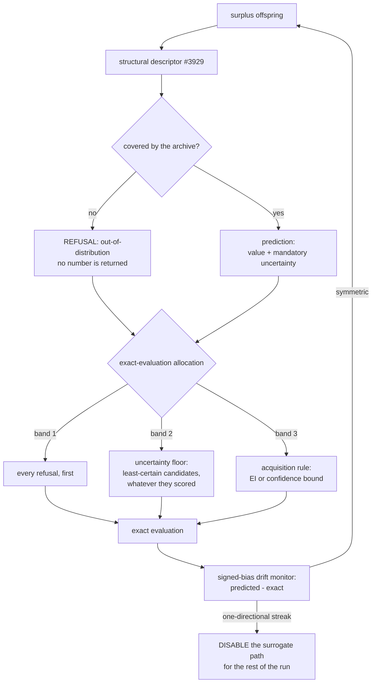

## Summary

The surrogate uncertainty guard — mandatory uncertainty, an acquisition rule
instead of an argmax, a refusal to extrapolate, and the signed-bias drift
monitor (Issue #3933). Closes #3933.

Jin (2011) §4–§5 returns repeatedly to one failure mode: a surrogate does not
merely make mistakes, it makes **consistent** mistakes, and an evolutionary
algorithm finds and exploits them. The search converges on an optimum of the
_model_ that is not an optimum of the _objective_, and the fitness trace looks
excellent throughout because the trace is drawn from the model. Before this
change the surrogate screen that landed with #3932 produced a bare number, every
exact evaluation went to the top of its own ranking, and nothing in the run
would have noticed.

- **`src/surrogate/UncertainSurrogate.ts`** — a verdict is a value with a
  **mandatory** uncertainty, or a refusal. No third shape, no nullable field, no
  optional property: it is impossible to consume a prediction without
  confronting its confidence. `assertVerdict` refuses a non-finite value or a
  negative uncertainty at the boundary.
- **`src/surrogate/Acquisition.ts`** — expected improvement (Jones, Schonlau &
  Welch 1998) and the confidence bound, both computed on the maximisation mirror
  of their literature form because NEAT-AI scores are higher-is-better. EI
  against a non-finite incumbent throws rather than ordering on an accident of
  candidate order.
- **`src/surrogate/ExactEvaluationAllocator.ts`** — three bands: every refusal
  first, then the **uncertainty floor** (a stated minimum fraction of the slots
  to the least-certain candidates, whatever they scored), then the acquisition
  rule. The floor is enforced and then asserted; `assertUncertaintyFloor` is
  exported so a consumer that builds its own allocation is held to the same
  rule.
- **`src/surrogate/CoverageRegion.ts`** — the region the archive (#3929) covers,
  as a box test on every descriptor slot plus a radius taken from the archive's
  own nearest-neighbour distances. Outside it, the model reports a refusal and
  the candidate is routed to an exact evaluation.
- **`src/surrogate/DriftMonitor.ts`** — signed bias, not absolute error. The
  reading is `mean(predicted − exact) / mean(|predicted − exact|)`: `±1` when
  every residual points the same way, near `0` for symmetric noise of any
  magnitude. Scale-free by construction, which is what lets it see a `1e-04`
  bias on a lineage whose improvements are `1e-05`.
- **`src/surrogate/SurrogateGuard.ts`** — composes them and accumulates the
  three per-run diagnostics the issue asks for.
- **`src/config/SurrogateUncertaintyConfig.ts`** — nested under
  `preSelection.uncertainty`, **on by default**, every value rejected rather
  than clamped.
- **Wiring** — `SurrogateScreen.verdicts()` produces uncertainty-bearing
  verdicts, `PreSelection.select` allocates the exact-evaluation slots through
  the guard, `PreSelection.observe` differences each prediction against the
  exact score that arrives for it, and `NeatEvolution` logs the acquisition and
  drift lines. When the monitor escalates, `PreSelection.active` goes false for
  the rest of the run: the stage stops over-generating and every creature takes
  a true evaluation.

## Evidence

Backend/CLI change: there is no web interface to screenshot. What was tested
instead:

**The long-horizon A/B, judged on final exact score.**
`scripts/surrogate_uncertainty_ab.ts` (`deno task surrogate-uncertainty-ab`)
runs the same seed, the same starting population and the same surrogate screen
with the guard on and off, and refuses a horizon shorter than 100 generations.
Measured at **120 generations over 3 seeds**, population 24
(`docs/evidence/surrogate-uncertainty-3933.md`, machine-readable in the matching
`.json`):

| Arm                                 | Mean final exact score | Mean exact evaluations | vs unguarded |
| ----------------------------------- | ---------------------- | ---------------------- | ------------ |
| `unguarded` (predicted-rank argmax) | `-0.012964`            | 1,718                  | —            |
| `guarded`                           | `-0.005990`            | 2,158                  | `+6.974e-3`  |

The guarded arm finished ahead on two seeds and **behind on the third**
(`-0.012019` against `-0.002488`), spent **25.6 %** of the allocated slots on
uncertainty (**18.6 %** of every exact evaluation the stage spent), refused
**3.9 %** of candidates, and **the drift monitor disabled the surrogate path on
one of the three runs** — the detector firing on a real search rather than on a
fixture.

**Reported whichever way it goes, and read cautiously.** The arms did not spend
the same budget: the guarded one paid for about 26 % more exact evaluations, so
this is not an efficiency result. Three seeds on a synthetic regression is not
evidence that the guard buys score, and it was never argued for on those grounds
— what the A/B establishes is that reserving a quarter of the allocation for
exploration did not collapse the endpoint.

**Quality gate.** `./quality.sh` refuses to run its test stage in this
container: the native `rust_scorer` binary is not present and the gate will not
let tests fall back to the WASM scorer
(`❌ Native rust_scorer is required (quality.sh default) but was not found.`).
The stages that do not need it were run and pass — `deno fmt --check` over all
2,788 files, `deno lint`, `deno check` over every source and test module, and
the shell checks. The test suites below were run directly with `deno test`. CI
runs the full gate on this PR.

<!-- vibe-quality-gate-skipped reason="native rust_scorer binary absent in this container; fmt, lint, check and shell stages run and passing; test suites run directly with deno test" -->

Two pre-existing failures in this container are unrelated to this change and
fail identically on the base branch: `test/NEAT/Train.ts` and
`test/NEAT/TrainingLoopAllocations.ts` (and
`test/config/RetiredExperimentalOptions.ts`) all die with _"trainDir must use
neat_ai_backpropagation when Rust trainDir is enabled"_ — the same missing
native library.

**Test output.** The new suites pass — 47 in `test/surrogate/`, 12 in
`test/NEAT/SurrogateUncertaintyScreen.ts`, 8 in
`test/config/SurrogateUncertaintyConfig.ts`, 3 in
`test/scripts/SurrogateUncertaintyAB.ts` — as do the #3932 suites they extend
(`test/NEAT/PreSelection.ts`, `OffspringScreen.ts`, `PreSelectionWiring.ts`,
`test/config/PreSelectionConfig.ts`), the docs suite (316) and the option-audit
roll-up. The affected batch was run twice end to end for stability: 131 passed,
0 failed.

## Acceptance Criteria

<!-- vibe-spec-review inputs="diff+issue-body" -->

- **met** — `predict()` returns a mandatory uncertainty; no nullable path exists
  — evidence: `src/surrogate/UncertainSurrogate.ts:41-66` (discriminated union,
  no optional field), `assertVerdict` at `:110-134`, tests
  `test/surrogate/UncertainSurrogate.ts` — reviewer: met — reason: the reviewer
  flagged that nothing _enforced_ eligibility — a screen omitting `verdicts()`
  silently ran unguarded. Fixed here: a `"surrogate"` screen that cannot report
  an uncertainty is now refused with `PreSelectionError`
  `SURROGATE_WITHOUT_UNCERTAINTY` (`src/NEAT/PreSelection.ts`).
- **met** — Acquisition function (EI or LCB) implemented and configurable —
  evidence: `src/surrogate/Acquisition.ts` (`expectedImprovement`,
  `confidenceBound`, `acquisitionValue`), `preSelection.uncertainty.acquisition`
  in `src/config/SurrogateUncertaintyConfig.ts`, tests
  `test/surrogate/Acquisition.ts` — reviewer: met
- **met** — Minimum fraction of exact evaluations reserved for high-uncertainty
  candidates, enforced and asserted — evidence: band 2 of
  `allocateExactEvaluations` plus `assertUncertaintyFloor`
  (`src/surrogate/ExactEvaluationAllocator.ts`), tests
  `test/surrogate/ExactEvaluationAllocator.ts::allocation — the floor spends on uncertainty the model calls mediocre`
  and `::uncertainty floor — an argmax-shaped allocation is refused` — reviewer:
  partial — reason: the reviewer's three caveats, each addressed or accepted
  deliberately. (a) The reported fraction excluded the exact evaluations the
  uniform survivor draw had already spent: the run now reports
  `explorationShare` over **every** exact evaluation (18.6 % against the 25.6 %
  of allocated slots) as well. (b) The per-allocation assertion is unreachable
  while the bands are correct — it is a tripwire for a future change, and
  `assertUncertaintyFloor` is exported and tested directly against an
  argmax-shaped allocation. (c) OOD slots count towards the floor by design, and
  the docs say so: a refusal is the maximum-uncertainty case, not a separate
  budget.
- **met** — Out-of-distribution detection against archive coverage; OOD refuses
  to predict, with a test — evidence: `src/surrogate/CoverageRegion.ts`, wired
  in `SurrogateScreen.verdicts`; tests
  `test/surrogate/CoverageRegion.ts::coverage region — a novel topology is refused, not predicted`
  and
  `test/NEAT/SurrogateUncertaintyScreen.ts::pre-selection — an out-of-distribution candidate earns an exact evaluation`
  — reviewer: partial — reason: the reviewer was right that the region is fitted
  to the screen's window of exact `(descriptor, score)` pairs rather than read
  from the #3929 archive file. That is deliberate — the refusal must hold
  whether or not archiving is switched on, and the records are the same ones —
  and the docs no longer claim otherwise.
- **met** — Signed-bias drift monitor with automatic disable-and-log escalation
  — evidence: `src/surrogate/DriftMonitor.ts`, disable through
  `PreSelection.active`, warn line in `src/NEAT/NeatEvolution.ts`; tests
  `test/surrogate/DriftMonitor.ts::a 1e-04 one-directional bias disables the surrogate`
  and
  `test/NEAT/SurrogateUncertaintyScreen.ts::a one-directional bias disables the surrogate path`;
  fired on a real A/B run (seed 3934) — reviewer: met — reason: the reviewer
  also found that a generation the model got exactly right was treated as
  silence and left the streak standing; it now reads as zero bias and resets it.
- **met** — Per-run diagnostics: signed bias, uncertainty-allocation fraction,
  OOD rate — evidence: `SurrogateGuard.runDiagnostics` / `describeRun()`, logged
  every generation from `src/NEAT/NeatEvolution.ts`, carried into the A/B JSON —
  reviewer: partial — reason: the reviewer found the per-run line was computed
  but never logged in the production evolve path. It is now emitted each
  generation (cumulative), so a deadline-killed run still leaves it in the
  trace. The reviewer also found the run-level bias ratio was outlier-dominated;
  the run now reports the mean of the per-generation ratios beside the pooled
  one, with the pooled one documented as not robust.
- **met** — ≥100-generation A/B judged on final exact score, reported whichever
  way it goes — evidence: `scripts/surrogate_uncertainty_ab.ts` (refuses
  `--generations < 100`), `docs/evidence/surrogate-uncertainty-3933.md` and
  `.json`, which report the seed that went the other way and the unequal budget
  — reviewer: met
- **met** — Documented: the surrogate path must not run in production without
  this issue landed — evidence: `docs/SURROGATE_UNCERTAINTY.md` (IMPORTANT
  block), echoed in `docs/PRE_SELECTION.md`, `docs/config/TRAINING.md`,
  `docs/README.md`, `mod.ts` — reviewer: met
- **unrequested** — `src/surrogate/FeatureScaler.ts`: the standardisation and
  distance helpers were lifted out of `OffspringScreen.ts` into a shared module
  — reviewer: unrequested — reason: the coverage region and the k-NN predictor
  must standardise identically or a candidate could be judged _covered_ under
  one scaling and predicted under another; duplicating the code was the
  alternative.
- **unrequested** — `ScreenRank.value` widened from `number` to `number | null`
  — reviewer: unrequested — reason: a refusal has no number behind it, and
  substituting one (a window mean, a zero) is exactly the fabricated prediction
  the refusal exists to prevent.
- **unrequested** — `OffspringScreen.bestObservedScore?()` — reviewer:
  unrequested — reason: expected improvement needs a **ground-truth** incumbent;
  taking it from the model's own window is what stops EI being measured against
  the model's optimism.
- **unrequested** — `deno.json` gains the `@surrogate/` alias and a
  `surrogate-uncertainty-ab` task; `mod.ts` exports the new surface; the
  option-audit roll-up classifies `preSelection.uncertainty` — reviewer:
  unrequested — reason: repo conventions, each enforced by a test that fails
  without it (`test/scripts/OptionAuditRollup.ts` fails loud on an unclassified
  option key).
- **unrequested** — `SurrogateGuard.assertUncertaintyAllocationFor()` —
  reviewer: unrequested — reason: it is how the run-level floor rule is
  reachable and testable by a consumer that allocates some of its own exact
  evaluations; `assertUncertaintyAllocation()` is the same rule over the run's
  own totals.

## Standards Review

<!-- vibe-standards-review inputs="diff+CODING-STANDARDS.md" -->

- **violation** — `PreSelection.observe()` gained a `generation` parameter that
  the JSDoc did not document, on a publicly exported surface — evidence:
  `src/NEAT/PreSelection.ts:284` — reason: fixed here; the `@param generation`
  tag is now present.
- **violation** — An untyped `Error` for the empty training set, against the
  "typed errors from `src/errors/`" rule every other refusal in the diff follows
  — evidence: `src/surrogate/FeatureScaler.ts:313` — reason: fixed here; it
  throws `SurrogateUncertaintyError` `EMPTY_TRAINING_SET`, a new reason on the
  typed union.
- **violation** — A non-finite descriptor failed loud on the ranking path but
  was silently converted into an ordinary out-of-distribution refusal on the new
  verdict path, so a descriptor bug bought an exact evaluation and inflated the
  OOD rate — evidence: `src/NEAT/OffspringScreen.ts:344`,
  `src/surrogate/CoverageRegion.ts:207` — reason: fixed here; `verdicts()` makes
  the same `INVALID_SCREEN_VALUE` refusal the ranking path makes.
- **violation** — `--replicates` was read but never validated, so
  `--replicates=0` printed `NaN` means as if they were results; both sibling
  harnesses validate the same flag — evidence:
  `scripts/surrogate_uncertainty_ab.ts:101` — reason: fixed here; a non-integer
  or non-positive value fails loud.
- **violation** — `describeDrift` / `describeAllocation` / `describeRun` carried
  no `@returns` while every neighbouring method documents one — evidence:
  `src/surrogate/SurrogateGuard.ts:192`, `:200`, `src/NEAT/PreSelection.ts:594`
  — reason: fixed here.
- **clean** — Australian English throughout (cspell en-GB over all 31 changed
  files, zero issues); tests call real functions and assert on returned values,
  errors and diagnostics, with no source-text greps, no sleeps and no absolute
  wall-clock assertions; fail-loud everywhere else in the diff (typed errors
  with actionable messages, config rejected rather than clamped, no empty
  catches); file sizes and module layout inside repo norms; `@surrogate/` alias
  and `src/surrogate/` ↔ `test/surrogate/` mirroring follow convention; no
  hidden paths staged; docs updated alongside the surface (new guide indexed and
  cross-linked, option audit, evidence `.json` + `.md` pair, `mod.ts` banner);
  `deno fmt --check`, `deno lint` and `deno check` clean.

## Test Plan

- **`test/surrogate/UncertainSurrogate.ts`** (5) — a verdict cannot carry a
  value without an uncertainty; a non-finite value or a negative uncertainty is
  refused; zero uncertainty is a real answer, not a missing one.
- **`test/surrogate/Acquisition.ts`** (7) — EI prefers an uncertain candidate
  predicted _below_ the incumbent over a confident one; certainty collapses EI
  to the improvement; EI refuses a run with no incumbent; `kappa: 0` reduces the
  confidence bound to the argmax.
- **`test/surrogate/CoverageRegion.ts`** (9) — a novel topology is refused; a
  hole inside the box is still an extrapolation; wrong width, empty archive and
  non-finite descriptors fail loud.
- **`test/surrogate/ExactEvaluationAllocator.ts`** (11) — refusals are allocated
  first; the floor spends on candidates the model calls mediocre; a zero floor
  degenerates to the argmax the issue warns about; an argmax-shaped allocation
  is refused by `assertUncertaintyFloor`.
- **`test/surrogate/DriftMonitor.ts`** (8) — symmetric noise never disables; a
  1e-04 one-directional bias on scores around 0.36 does, at the expected
  generation; a bias that changes direction is not a trend; too few residuals is
  undecidable, never a pass.
- **`test/surrogate/SurrogateGuard.ts`** (7) — the three run diagnostics; the
  floor honoured with and without refusals; disable-and-log.
- **`test/config/SurrogateUncertaintyConfig.ts`** (8) — the guard is on by
  default; CLI strings parse; every out-of-range knob is rejected, never
  clamped.
- **`test/NEAT/SurrogateUncertaintyScreen.ts`** (12) — end to end through
  `PreSelection`: an OOD candidate earns an exact evaluation and records `null`
  for its screen value; the floor keeps spending on doubt; **a bred offspring
  with no UUID still feeds the drift monitor** (the regression for the defect
  the review found); a one-directional bias disables the stage and it falls
  through to full evaluation; symmetric error leaves it alone.
- **`test/NEAT/PreSelectionWiring.ts`** — extended: a real evolve loop must
  reach the drift monitor with residuals and allocate its exact evaluations
  through the acquisition rule.
- **`test/scripts/SurrogateUncertaintyAB.ts`** (3) — the guarded arm reports its
  diagnostics and honours its floor; the unguarded arm runs without a guard; the
  reported fraction is the one the slots add up to.
