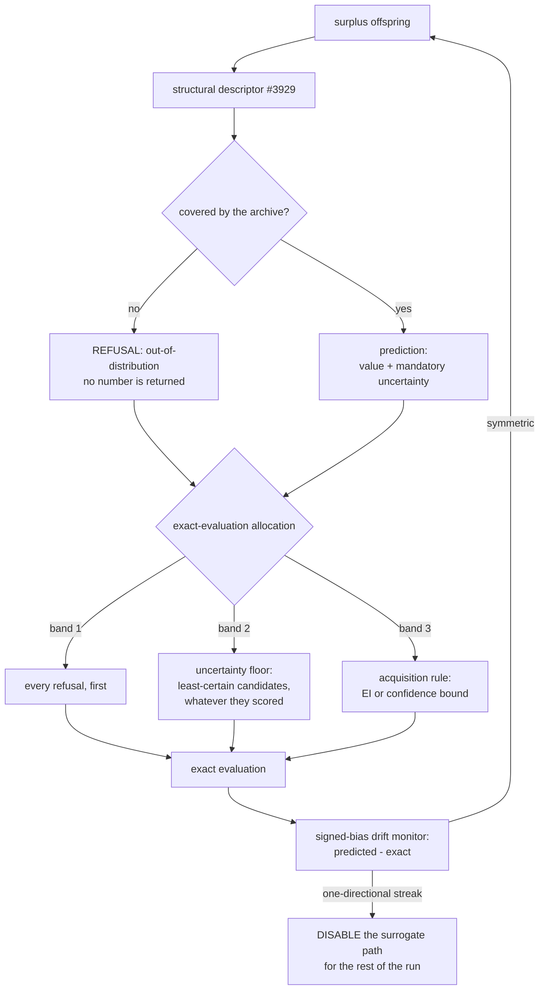

## Summary

The surrogate uncertainty guard — mandatory uncertainty, an acquisition rule
instead of an argmax, a refusal to extrapolate, and the signed-bias drift
monitor (Issue #3933). Closes #3933.

Jin (2011) §4–§5 returns repeatedly to one failure mode: a surrogate does not
merely make mistakes, it makes **consistent** mistakes, and an evolutionary
algorithm finds and exploits them. The search converges on an optimum of the
_model_ that is not an optimum of the _objective_, and the fitness trace looks
excellent throughout because the trace is drawn from the model. Before this
change the surrogate screen that landed with #3932 produced a bare number, every
exact evaluation went to the top of its own ranking, and nothing in the run
would have noticed.

- **`src/surrogate/UncertainSurrogate.ts`** — a verdict is a value with a
  **mandatory** uncertainty, or a refusal. No third shape, no nullable field, no
  optional property: it is impossible to consume a prediction without
  confronting its confidence. `assertVerdict` refuses a non-finite value or a
  negative uncertainty at the boundary.
- **`src/surrogate/Acquisition.ts`** — expected improvement (Jones, Schonlau &
  Welch 1998) and the confidence bound, both computed on the maximisation mirror
  of their literature form because NEAT-AI scores are higher-is-better. EI
  against a non-finite incumbent throws rather than ordering on an accident of
  candidate order.
- **`src/surrogate/ExactEvaluationAllocator.ts`** — three bands: every refusal
  first, then the **uncertainty floor** (a stated minimum fraction of the slots
  to the least-certain candidates, whatever they scored), then the acquisition
  rule. The floor is enforced and then asserted; `assertUncertaintyFloor` is
  exported so a consumer that builds its own allocation is held to the same
  rule.
- **`src/surrogate/CoverageRegion.ts`** — the region the archive (#3929) covers,
  as a box test on every descriptor slot plus a radius taken from the archive's
  own nearest-neighbour distances. Outside it, the model reports a refusal and
  the candidate is routed to an exact evaluation.
- **`src/surrogate/DriftMonitor.ts`** — signed bias, not absolute error. The
  reading is `mean(predicted − exact) / mean(|predicted − exact|)`: `±1` when
  every residual points the same way, near `0` for symmetric noise of any
  magnitude. Scale-free by construction, which is what lets it see a `1e-04`
  bias on a lineage whose improvements are `1e-05`.
- **`src/surrogate/SurrogateGuard.ts`** — composes them and accumulates the
  three per-run diagnostics the issue asks for.
- **`src/config/SurrogateUncertaintyConfig.ts`** — nested under
  `preSelection.uncertainty`, **on by default**, every value rejected rather
  than clamped.
- **Wiring** — `SurrogateScreen.verdicts()` produces uncertainty-bearing
  verdicts, `PreSelection.select` allocates the exact-evaluation slots through
  the guard, `PreSelection.observe` differences each prediction against the
  exact score that arrives for it, and `NeatEvolution` logs the acquisition and
  drift lines. When the monitor escalates, `PreSelection.active` goes false for
  the rest of the run: the stage stops over-generating and every creature takes
  a true evaluation.

## Evidence

Backend/CLI change: there is no web interface to screenshot. What was tested
instead:

**The long-horizon A/B, judged on final exact score.**
`scripts/surrogate_uncertainty_ab.ts` (`deno task surrogate-uncertainty-ab`)
runs the same seed, the same starting population and the same surrogate screen
with the guard on and off, and refuses a horizon shorter than 100 generations.
Measured at **120 generations over 3 seeds**, population 24
(`docs/evidence/surrogate-uncertainty-3933.md`, machine-readable in the matching
`.json`):

| Arm                                 | Mean final exact score | Mean exact evaluations | vs unguarded |
| ----------------------------------- | ---------------------- | ---------------------- | ------------ |
| `unguarded` (predicted-rank argmax) | `-0.012964`            | 1,718                  | —            |
| `guarded`                           | `-0.005990`            | 2,158                  | `+6.974e-3`  |

The guarded arm finished ahead on two seeds and **behind on the third**
(`-0.012019` against `-0.002488`), spent **25.6 %** of the allocated slots on
uncertainty (**18.6 %** of every exact evaluation the stage spent), refused
**3.9 %** of candidates, and **the drift monitor disabled the surrogate path on
one of the three runs** — the detector firing on a real search rather than on a
fixture.

**Reported whichever way it goes, and read cautiously.** The arms did not spend
the same budget: the guarded one paid for about 26 % more exact evaluations, so
this is not an efficiency result. Three seeds on a synthetic regression is not
evidence that the guard buys score, and it was never argued for on those grounds
— what the A/B establishes is that reserving a quarter of the allocation for
exploration did not collapse the endpoint.

**Quality gate.** `./quality.sh` refuses to run its test stage in this
container: the native `rust_scorer` binary is not present and the gate will not
let tests fall back to the WASM scorer
(`❌ Native rust_scorer is required (quality.sh default) but was not found.`).
The stages that do not need it were run and pass — `deno fmt --check` over all
2,788 files, `deno lint`, `deno check` over every source and test module, and
the shell checks. The test suites below were run directly with `deno test`. CI
runs the full gate on this PR.

<!-- vibe-quality-gate-skipped reason="native rust_scorer binary absent in this container; fmt, lint, check and shell stages run and passing; test suites run directly with deno test" -->

Two pre-existing failures in this container are unrelated to this change and
fail identically on the base branch: `test/NEAT/Train.ts` and
`test/NEAT/TrainingLoopAllocations.ts` (and
`test/config/RetiredExperimentalOptions.ts`) all die with _"trainDir must use
neat_ai_backpropagation when Rust trainDir is enabled"_ — the same missing
native library.

**Test output.** The new suites pass (47 in `test/surrogate/`, 10 in
`test/NEAT/SurrogateUncertaintyScreen.ts`, 8 in
`test/config/SurrogateUncertaintyConfig.ts`, 3 in
`test/scripts/SurrogateUncertaintyAB.ts`), as do the #3932 suites they extend
(56 across `test/NEAT/PreSelection.ts`, `OffspringScreen.ts`,
`PreSelectionWiring.ts` and `test/config/PreSelectionConfig.ts`) and the docs
(316) and option-audit suites.
