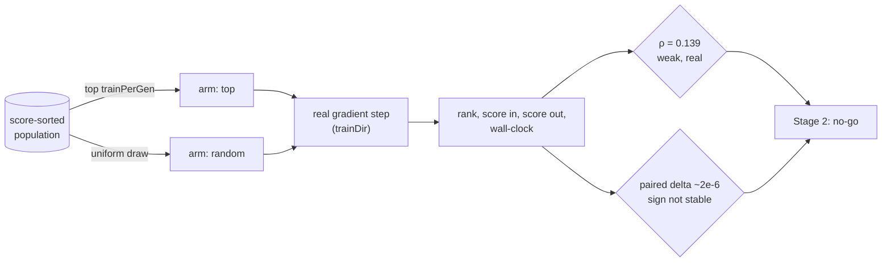

## Summary

Memetic local-search budget was allocated by current score and had never been
compared with its own outcomes. This adds the instrumentation that records what
each gradient step bought, measures today's rule against the random baseline the
issue requires, and records the Stage 2 go/no-go. Closes #3934.

Jin (2011) §5 asks who should receive local search — it is a large fixed cost
per individual, so spending it on individuals that will not benefit is the
dominant waste. `selectTrainingCandidates` answers "who is currently best?";
nothing had ever asked whether that predicts "who will gain most from a gradient
step?".

**Stage 1 only. No selection logic changes.** The issue scopes Stage 1 as
"measure the current rule. No new selection logic", and Stage 2 was gated on
Stage 1 showing gain is predictable. It does not, so Stage 2 is not built.

### What ships

- **`src/archive/TrainingGainLog.ts`** — append-only record, one per real
  training event: the **pre-training** descriptor (Issue #3929's layout), the
  rank the rule selected at, `rankedPopulation`, the scores and errors either
  side of the step, the wall-clock from dispatch to outcome, and the outcome.
  Off by default (`trainingGainLog.enabled: false`); nothing is constructed and
  no disk is touched.
- **`src/archive/TrainingGainRecord.ts`** — the on-disk format and the only code
  that decides whether a line is a record. Gain is **derived**
  (`trainingGain()`), never stored; a `failed` step has `undefined` gain, never
  `0`.
- **Wiring** — `scheduleTraining` opens an event only after every existing guard
  has passed and a heavy worker slot is committed; the completion path closes it
  with the trained score, the failure path closes it as `failed` (it consumed
  the slot), and a hard-deadline abandon drops it (the cost belongs to the
  abandon). `NeatEvolution` flushes once per generation and supplies the rank
  via `selectRankedTrainingCandidates`, which is the same rule reporting what it
  did — `selectTrainingCandidates` now delegates to it so the two cannot drift.
- **The Stage 1 study** — `scripts/memetic_gain_study.ts` with
  `scripts/lib/memeticGainStudy.ts` (a real memetic loop: real crossover, real
  mutation operators, **real backpropagation** through `trainDir`) and
  `scripts/lib/memeticGainAnalysis.ts` (Spearman ρ, Kendall τ-b, a seeded
  permutation test, robust centre statistics, and the pre-registered Stage 2
  gate).

### What it found

Over **15,000 real gradient steps** — 75 seeds across 3 independent repeats, two
arms at the same seed:

| policy             | events | median gain | trimmed mean |  max gain |   improved |    gain/s |
| ------------------ | -----: | ----------: | -----------: | --------: | ---------: | --------: |
| top (today's rule) |  7,500 |  -2.801e-02 |   -4.234e-02 | 1.923e-01 |  **4.8 %** | -4.085e+0 |
| random (baseline)  |  7,500 |  -1.385e-02 |   -2.287e-02 | 5.479e-01 | **21.3 %** | -2.380e+0 |

- **Rank does order gain, in the predicted direction, and too weakly to act
  on.** ρ = 0.139, τ-b = 0.096, p = 0.0005 over the 7,500 unbiased
  (randomly-selected) events — below the 0.2 materiality floor the harness
  pre-registers. The shape is monotone over comparable quartiles of that same
  arm: 11.4 % of steps improve a creature in the fittest quartile against 35.1 %
  in the worst, confirming the issue's reasoning that the incumbent is nearest
  its local optimum.
- **No endpoint gap for a predictor to close.** Judged on final exact score at
  the same seed — the criterion the issue insists on — the two means agree to
  four significant figures (-1.3259e-2 against -1.3256e-2) and the paired mean
  delta is -2.5e-06. The **sign of that delta flipped between two runs of the
  same configuration** (44/75 paired wins this run, 34/75 before), so the
  comparison has no direction to report.
- **Stage 2: no-go**, with all three repeats agreeing independently (ρ = 0.171 /
  0.125 / 0.123). Recorded on #3919
  ([verdict](https://github.com/stSoftwareAU/NEAT-AI/issues/3919#issuecomment-5628076100),
  [correction](https://github.com/stSoftwareAU/NEAT-AI/issues/3919#issuecomment-5628256837)).
  A selector fitted to this signal would move the budget towards creatures with
  more headroom and arrive at the same place — the failure mode the issue names.
- **The number worth keeping: 95.2 % of the gradient steps today's rule
  dispatches produce a creature worse than the one they trained.** That is about
  how much local search this lineage can absorb, not about who receives it — and
  the shipped log can now ask it on a real GRQ run.

## Evidence

Backend/CLI only — no web interface, so no screenshot applies. What was run:

- **The study, 15,000 real gradient steps:**
  `NEAT_AI_BACKPROP_ENABLED=0 deno task memetic-gain-study --seeds=25 --repeats=3 --generations=25 --json=docs/evidence/memetic-gain-3934.json`.
  Report:
  [`docs/evidence/memetic-gain-3934.md`](../../evidence/memetic-gain-3934.md);
  artefact: [`memetic-gain-3934.json`](../../evidence/memetic-gain-3934.json),
  which carries every table the report quotes.
- **Instrumentation overhead, asserted not reported:**
  `deno bench bench/TrainingGainLogOverhead.ts` →
  `One training event logged: 20.2 ms (0.0336% of a 60000 ms step; budget 60 ms)`
  on a production-scale creature (5,300 neurons, 87,096 synapses); steady-state
  **1.8 ms per event**. The bench throws if the 0.1 %-of-a-step budget is
  breached, which is the issue's "assert against a budget" requirement.
- **Caveats are in the evidence document, not buried:** small creatures and a
  600-record corpus (the ordering transfers, the magnitudes do not), the
  TypeScript/WASM trainer rather than the Rust one on a plain checkout, and
  reproducible in distribution rather than bit for bit — the mutation operators
  mint unseeded neuron UUIDs and crossover aligns genes by them, which is why
  the evidence is 75 seeds across 3 repeats.

## Acceptance Criteria

<!-- vibe-spec-review inputs="diff+issue-body" -->

- **met** — "Per-training-event record: descriptor, pre/post score, population
  rank, wall-clock" — evidence: `src/archive/TrainingGainRecord.ts:35` (record
  shape), `src/NEAT/NeatScheduling.ts:650` (dispatch half) and `:698` (outcome
  half),
  `test/NEAT/TrainingGainLogWiring.ts::a dispatched step is recorded with
  its rank and gain`
  — reviewer: partial — reason: the reviewer found the records were not durable
  — the only flush ran at the _top_ of `evolve()`, so the final generation's
  events were never appended. Fixed in this diff: an awaited flush now runs in
  the bounded teardown of all three evolve paths
  (`src/creature/CreatureTraining.ts:781`, `:1077`, `:1634`) and is covered by
  `test/NEAT/TrainingGainLogWiring.ts::the run-end flush appends what is
  buffered`.
- **met** — "Rank-vs-gain correlation reported over ≥200 real training events" —
  evidence: `docs/evidence/memetic-gain-3934.md` (ρ = 0.139, n = 7,500 unbiased;
  15,000 events in total), floor enforced at
  `scripts/lib/memeticGainAnalysis.ts:48` and tested by
  `test/scripts/MemeticGainAnalysis.ts::too few events is undecidable, not a
  negative`
  — reviewer: met — reason: the reviewer noted the events come from the study
  harness rather than the shipped log, which is correct and is stated in the
  evidence document; the shipped log is covered by its own tests and the
  overhead bench.
- **met** — "Random-selection baseline reported alongside the current rule" —
  evidence: `docs/evidence/memetic-gain-3934.md` per-policy table (gain/s: top
  -4.085, random -2.380), arms at `scripts/lib/memeticGainStudy.ts:207` —
  reviewer: met.
- **met** — "Explicit go/no-go for Stage 2 recorded on #3919" — evidence:
  [#3919 verdict](https://github.com/stSoftwareAU/NEAT-AI/issues/3919#issuecomment-5628076100)
  and its
  [correction](https://github.com/stSoftwareAU/NEAT-AI/issues/3919#issuecomment-5628256837);
  decision produced by `stage2Verdict` rather than written by hand — reviewer:
  met.
- **met** — "If Stage 2 proceeds: current fittest always trained; a random slot
  fraction retained; both tested" — evidence: vacuous — no selector exists, and
  `test/NEAT/TrainingCandidates.ts::selects exactly what the unranked rule
  selects`
  pins that selection is unchanged — reviewer: met — reason: the reviewer
  recorded this as "met (vacuous — Stage 2 not entered)"; the precondition is
  false because Stage 1 returned no-go.
- **met** — "Stage 2 A/B at the same seed judged on final exact score" —
  evidence: `docs/evidence/memetic-gain-3934.md` paired-endpoint table (75
  paired seeds) and `finalScorePaired` in the artefact — reviewer: met — reason:
  the reviewer recorded it as vacuous-but-done; the endpoint A/B was run anyway
  because it is what makes the no-go decisive rather than merely unsupported.
- **met** — "No overlap with #3915 / #3918 scope" — evidence: nothing under
  `src/architecture/training/` changes; boundary stated at
  `docs/TRAINING_GAIN_LOG.md:140` — reviewer: met.
- **met** — "Instrumentation must not measurably lengthen a training step;
  assert against a budget" (Failure detection) — evidence:
  `bench/TrainingGainLogOverhead.ts:88` throws above 0.1 % of a 60,000 ms step;
  measured 1.8 ms per event — reviewer: met.
- **met** — "A negative Stage 1 result closes the issue as a documented finding"
  (Failure detection) — evidence: `docs/evidence/memetic-gain-3934.md` plus the
  two #3919 comments — reviewer: met.
- **unrequested** — the on-disk format's version/length gate and validating
  reader (`src/archive/TrainingGainRecord.ts`) — reviewer: unrequested — reason:
  the record carries #3929's descriptor, and a log appended to across runs
  silently mixes two feature spaces without this gate; kept, and the reviewer's
  related finding (a record with no `outcome` read back as valid) is fixed here.
- **unrequested** — the per-run `maxRecords` write bound and its refusal tallies
  (`src/config/TrainingGainLogConfig.ts:60`,
  `src/archive/TrainingGainLog.ts:330`) — reviewer: unrequested — reason: an
  opt-in log that writes to disk unboundedly is not shippable; the bound is
  per-run and announces itself rather than truncating silently.
- **unrequested** — record columns beyond the four asked for (`errorBefore`,
  `errorAfter`, `runId`, `dispatchedAt`, `referenceUuid`, `outcome`) — reviewer:
  unrequested — reason: `errorBefore`/`errorAfter` are the pair the run's own
  regression guard compares and are the only like-for-like reading available;
  the rest is provenance the study's own joins needed.
- **unrequested** — `mod.ts` exports for the log, its record helpers and
  `selectRankedTrainingCandidates` — reviewer: unrequested — reason: repo
  convention for a new option surface (#3929/#3931/#3932 each did the same), and
  `test/docs/ApiReferenceExports` gates it.
- **unrequested** — `bench/_productionScaleCreature.ts` extracted from
  `bench/EvaluationArchiveOverhead.ts` — reviewer: unrequested — reason: the
  overhead budget must be asserted at GRQ scale, and a second private copy of
  the same 90-line builder would let the two benches measure different creatures
  and call their overheads comparable.
- **unrequested** — the `trainPerGen` note in `docs/config/TRAINING.md` —
  reviewer: unrequested — reason: a code change owes a docs change, and the
  measured result belongs beside the knob it is about; the reviewer's objection
  that it over-generalised was correct and the wording is now qualified to the
  harness's scale with the caveats linked.
- **unrequested** — τ-b, the permutation test, the trimmed mean, the quartile
  table, the 3-repeat meta-run and the `undecidable` verdict state
  (`scripts/lib/memeticGainAnalysis.ts`) — reviewer: unrequested — reason: the
  issue requires the comparison to be falsifiable; ρ alone with no significance
  test, no robust centre and no repeat would not have been.

## Standards Review

<!-- vibe-standards-review inputs="diff+CODING-STANDARDS.md" -->

Inputs were this repo's documented standards — `AGENTS.md`,
`docs/ENGINEERING_PRINCIPLES.md` and `CONTRIBUTING.md` (there is no
`CODING-STANDARDS.md` in this repository).

- **violation** — a non-finite pre-training score was coerced to `NaN`, which
  `JSON.stringify` writes as `null` and the module's own reader then refuses,
  making every earlier record in the file unreadable — evidence:
  `src/NEAT/NeatScheduling.ts:657` — reason: fixed here. `recordDispatch` now
  declines the event (`src/archive/TrainingGainLog.ts:197`), counts it and warns
  at the next flush, exactly as the no-UUID case does; covered by
  `test/archive/TrainingGainLog.ts::a dispatch with no measurable score is
  declined`.
- **violation** — the final generation's records were dropped with no failure
  reported (absence of failure read as success) — evidence:
  `src/NEAT/NeatEvolution.ts:224` was the only flush site — reason: fixed here,
  see the first acceptance entry.
- **violation** — the documented `UNKNOWN_EVENT` refusal was unreachable from
  production, so a lost dispatch or a double outcome was dropped silently —
  evidence: the old `isPending` guard in `src/NEAT/NeatScheduling.ts` — reason:
  fixed here. `closeIfOpen` (`src/archive/TrainingGainLog.ts:288`) keeps the
  one-outcome-per-event invariant but **counts** every miss and warns at the
  next flush; `recordOutcome` still throws for direct callers.
- **violation** — `Date.now()` in a test file, which `AGENTS.md` bans outright —
  evidence: `test/NEAT/TrainingGainLogWiring.ts:237` — reason: fixed here,
  replaced with a literal.
- **violation** — the study entry point ran at module top level with no
  `import.meta.main` guard, unlike every sibling harness — evidence:
  `scripts/memetic_gain_study.ts` — reason: fixed here; the whole run is behind
  `main()` and the guard.
- **violation** — `console.error` in a `scripts/lib` module, where the logging
  policy routes through `getLogger()` — evidence:
  `scripts/lib/memeticGainStudy.ts:422` — reason: fixed here.
- **violation** — DRY: the random arm re-derived the finite-score ranking inline
  while the same file made a point of the top arm calling the production
  selector — evidence: `scripts/lib/memeticGainStudy.ts:217` — reason: fixed
  here; both arms now draw their ranks from `selectRankedTrainingCandidates`.
- **violation** — the shared bench header misstated the fixture's synapse count
  as ~39,000 when the builder emits ~87,096 — evidence:
  `bench/_productionScaleCreature.ts:7` — reason: fixed here, and the docstring
  now says why the denser fixture makes the budget conservative.
- **violation** — the PR summary was untracked and was the tree's only
  `deno fmt --check` failure — evidence:
  `docs/archive/pr-summaries/pr-summary-3934.md` — reason: fixed here; formatted
  and committed.
- **violation** — duplicate import from one module — evidence:
  `test/archive/TrainingGainLog.ts:20` and `:22` — reason: fixed here, merged.
- **clean** — Australian English throughout (the only American spellings are
  verbatim citation titles, matching existing practice in `REFERENCES.md`);
  every new test calls real functions and asserts on returned values, files on
  disk or thrown typed errors, with no source-text grepping, no sleeps and no
  absolute timing thresholds; the config matches the `EvaluationArchiveConfig` /
  `PreSelectionConfig` shape with all six wiring steps present and invalid
  values rejected rather than clamped; `Temporal` for instants and the injected
  clock for elapsed time; `getLogger()` only in `src/`; Deno-native tooling with
  no Node files; no hidden paths or credentials staged; the off-by-default
  invariant proven by test; `deno lint`, `deno check` and the `test/docs/*`
  gates clean.

## Test Plan

New:

- `test/archive/TrainingGainLog.ts` — one dispatch + outcome becomes one record
  with the rank, scores and wall-clock; the design point is the creature
  **before** the step (asserted against a post-step weight change); a failed
  step is recorded with no gain; an outcome with no dispatch behind it throws
  `UNKNOWN_EVENT`; an abandoned dispatch records nothing; a creature with no
  UUID is skipped; the per-run write bound stops the log; appending beneath a
  foreign descriptor version is refused **and** the buffer survives the refusal;
  concurrent flushes append whole lines.
- `test/archive/TrainingGainRecord.ts` — round-trip, torn line, each missing
  required column, version and length gates, `trainingGain()` including the
  no-score cases, absent log reads as empty, reading validates every record.
- `test/config/TrainingGainLogConfig.ts` — defaults resolve to off, per-run
  `runId`, CLI string coercion, and every invalid field rejected rather than
  clamped.
- `test/NEAT/TrainingGainLogWiring.ts` — the config → `Neat` seam both ways, and
  `scheduleTraining` → log end to end against a stub worker: a dispatched step
  is recorded with its rank and a higher score for a lower error, a worker
  failure is recorded as `failed`, a skipped dispatch logs nothing, an abandoned
  run drops the open event, the run-end flush appends what the last generation
  buffered, and an append that cannot succeed is reported loudly without
  destroying the records.
- `test/scripts/MemeticGainAnalysis.ts` — every statistic against a sample whose
  answer is known by construction (tie-averaged ranks, τ-b's tie correction, the
  permutation test on an ordered and an unordered sample, the trimmed mean
  surviving a 1e6 outlier, empty input reading as zero not `NaN`), and all five
  branches of the Stage 2 gate.
- `test/scripts/MemeticGainStudy.ts` — the corpus is deterministic, the `top`
  arm **is** the production selector (asserted equal to
  `selectTrainingCandidates`), the `random` arm draws without replacement and
  reaches ranks the production rule never observes, a non-finite score is never
  a training target, and a real arm produces one event per scheduled step with
  ranks in range and gains that agree with the two scores it derives from.

Modified:

- `test/NEAT/TrainingCandidates.ts` — ranked selection added alongside the
  existing tests (none removed or changed): ranks count candidates rather than
  array positions, and the ranked selector picks exactly what the unranked one
  picks at every limit.
- `test/scripts/AuditOptionUsage.ts` — the pinned `NeatArguments` top-level
  count moves 118 → 119 for the new `trainingGainLog` key, with the reason
  recorded in the existing comment chain.

Gates run: `deno fmt`, `deno lint`, `deno check`, the suites above, the overhead
bench, `cspell`, `markdownlint-cli2`, and `./quality.sh` — the last re-run after
the review fixes. The first full-gate run was green on 9,617 tests with a single
failure: this summary file itself was unformatted, which is fixed.
