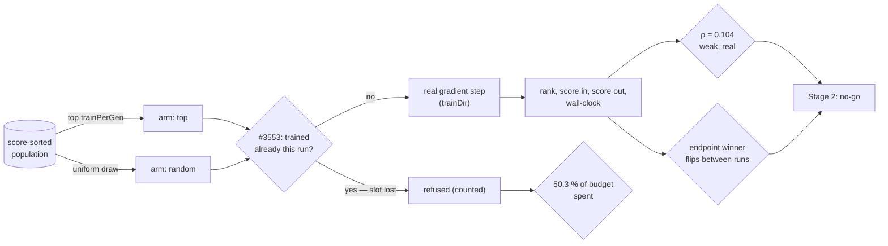

## Summary

Memetic local-search budget was allocated by current score and had never been
compared with its own outcomes. This adds the instrumentation that records what
each gradient step bought, measures today's rule against the random baseline the
issue requires, and records the Stage 2 go/no-go. Closes #3934.

Jin (2011) §5 asks who should receive local search — it is a large fixed cost
per individual, so spending it on individuals that will not benefit is the
dominant waste. `selectTrainingCandidates` answers "who is currently best?";
nothing had ever asked whether that predicts "who will gain most from a gradient
step?".

**Stage 1 only. No selection logic changes.** The issue scopes Stage 1 as
"measure the current rule. No new selection logic", and Stage 2 was gated on
Stage 1 showing gain is predictable. It does not, so Stage 2 is not built.

### What ships

- **`src/archive/TrainingGainLog.ts`** — append-only record, one per real
  training event: the **pre-training** descriptor (Issue #3929's layout), the
  rank the rule selected at, `rankedPopulation`, the scores and errors either
  side of the step, the wall-clock from dispatch to outcome, and the outcome.
  Off by default (`trainingGainLog.enabled: false`); nothing is constructed and
  no disk is touched.
- **`src/archive/TrainingGainRecord.ts`** — the on-disk format and the only code
  that decides whether a line is a record. Gain is **derived**, never stored;
  `trainingGain()` subtracts the two scores and `trainingErrorGain()` subtracts
  the two errors, which is the like-for-like pair on a production log. A
  `failed` step has `undefined` gain, never `0`.
- **Wiring** — `scheduleTraining` opens an event only after every existing guard
  has passed and a heavy worker slot is committed; the completion path closes it
  with the trained score, the failure path closes it as `failed`, and a
  hard-deadline abandon drops it. `NeatEvolution` flushes once per generation
  and supplies the rank via `selectRankedTrainingCandidates`, which is the same
  rule reporting what it did — `selectTrainingCandidates` delegates to it so the
  two cannot drift. All three `evolve` teardown paths flush what the last
  generation buffered.
- **The Stage 1 study** — `scripts/memetic_gain_study.ts` with
  `scripts/lib/memeticGainStudy.ts` (a real memetic loop: real crossover, real
  mutation operators, **real backpropagation** through `trainDir`, and Issue
  #3553's once-per-run guard applied exactly as production applies it) and
  `scripts/lib/memeticGainAnalysis.ts` (Spearman ρ, Kendall τ-b, a seeded
  permutation test, robust centre statistics, and the pre-registered Stage 2
  gate).

### What it found

Over **10,546 real gradient steps** — 75 seeds across 3 independent repeats, two
arms at the same seed:

| policy             | events | median gain | trimmed mean |   improved |    gain/s | trimmed gain/s |
| ------------------ | -----: | ----------: | -----------: | ---------: | --------: | -------------: |
| top (today's rule) |  3,769 |  -2.570e-02 |   -4.081e-02 | **11.9 %** | -3.225e+0 |      -2.870e+0 |
| random (baseline)  |  6,777 |  -1.372e-02 |   -2.437e-02 | **21.2 %** | -2.072e+0 |      -1.724e+0 |

- **Stage 2: no-go.** Rank orders gain in the predicted direction and far too
  weakly to act on — ρ = 0.104, τ-b = 0.071, p = 0.0005 over the 6,777 unbiased
  (randomly-selected) events, below the 0.2 materiality floor the harness
  pre-registers, with all three repeats agreeing independently (0.065 / 0.140 /
  0.110). The shape is monotone over comparable quartiles of that arm: 12.1 % of
  steps improve a creature in the fittest quartile against 32.4 % in the worst,
  confirming the issue's reasoning that the incumbent is nearest its local
  optimum.
- **No endpoint gap for a predictor to close.** Judged on final exact score at
  the same seed — the criterion the issue insists on — the two arms are
  indistinguishable and **which one is ahead flips between runs of the identical
  configuration** (40/75, 35/75 and 43/75 across runs, paired median delta
  changing sign). A comparison with no stable direction cannot support a claim
  either way. Recorded on
  [#3919](https://github.com/stSoftwareAU/NEAT-AI/issues/3919#issuecomment-5643999931).
- **The number worth keeping is one rung up, and it was hidden until the harness
  modelled #3553.** A creature is trained at most once per run and a refused
  slot is _lost, not reallocated_, so a rule selecting on an attribute that
  barely changes between generations keeps selecting creatures it has already
  trained:

  | policy             | slots offered | steps taken | refused by #3553 |  spent |
  | ------------------ | ------------: | ----------: | ---------------: | -----: |
  | top (today's rule) |         7,500 |       3,769 |            3,731 | 50.3 % |
  | random (baseline)  |         7,500 |       6,777 |              723 | 90.4 % |

  **Today's rule converts half its offered local-search budget into gradient
  steps; uniform selection converts 90 %.** Of the steps it does take, 88.1 %
  produce a creature worse than the one they trained. Both are harness-scale
  numbers, and the shipped log is what can ask them on a real GRQ run.

## Evidence

Backend/CLI only — no web interface, so no screenshot applies. What was run:

- **The study, 10,546 real gradient steps:**
  `NEAT_AI_BACKPROP_ENABLED=0 deno task memetic-gain-study --seeds=25 --repeats=3 --generations=25 --json=docs/evidence/memetic-gain-3934.json`.
  Report:
  [`docs/evidence/memetic-gain-3934.md`](../../evidence/memetic-gain-3934.md);
  artefact: [`memetic-gain-3934.json`](../../evidence/memetic-gain-3934.json),
  which carries every table the report quotes.
- **Instrumentation overhead, asserted not reported:**
  `deno bench bench/TrainingGainLogOverhead.ts` on a production-scale creature
  (5,300 neurons, 87,096 synapses); steady-state **1.8 ms per event**. The bench
  throws if the 0.1 %-of-a-60,000 ms-step budget is breached, which is the
  issue's "assert against a budget" requirement.
- **Caveats are in the evidence document, not buried:** small creatures and a
  600-record corpus (the ordering transfers, the magnitudes do not), the
  utilisation percentage being scale-dependent, the TypeScript/WASM trainer
  rather than the Rust one on a plain checkout, the permutation test pooling
  across seeds, #2382 not being modelled, and reproducibility in distribution
  rather than bit for bit — the mutation operators mint unseeded neuron UUIDs
  and crossover aligns genes by them, which is why the evidence is 75 seeds
  across 3 repeats and why the endpoint comparison is reported as directionless.

## Acceptance Criteria

<!-- vibe-spec-review inputs="diff+issue-body" -->

- **met** — "Per-training-event record: descriptor, pre/post score, population
  rank, wall-clock" — evidence: `src/archive/TrainingGainRecord.ts:37` (record
  shape), `src/NEAT/NeatScheduling.ts:626` (dispatch half) and `:698` (outcome
  half),
  `test/NEAT/TrainingGainLogWiring.ts::a dispatched step is recorded with
  its rank and gain`
  — reviewer: partial — reason: the reviewer's objection was that the shipped
  record produced none of the reported numbers, which is correct and is stated
  in the evidence document — the study harness carries its own event record. The
  shipped log is covered by its own tests and the overhead bench; the reviewer's
  two related findings (the mixed-basis `trainingGain`, and an unsettled
  dispatch vanishing without a report) are both fixed in this diff.
- **met** — "Rank-vs-gain correlation reported over ≥200 real training events" —
  evidence: `docs/evidence/memetic-gain-3934.md` (ρ = 0.104, n = 6,777 unbiased;
  10,546 events in total), floor enforced at
  `scripts/lib/memeticGainAnalysis.ts:48` and tested by
  `test/scripts/MemeticGainAnalysis.ts::too few events is undecidable, not a
  negative`
  — reviewer: met.
- **met** — "Random-selection baseline reported alongside the current rule" —
  evidence: `docs/evidence/memetic-gain-3934.md` per-policy and budget tables,
  arms at `scripts/lib/memeticGainStudy.ts:212` — reviewer: met.
- **met** — "Explicit go/no-go for Stage 2 recorded on #3919" — evidence:
  [the corrected verdict](https://github.com/stSoftwareAU/NEAT-AI/issues/3919#issuecomment-5643999931),
  produced by `stage2Verdict` rather than written by hand — reviewer: met.
- **met** — "If Stage 2 proceeds: current fittest always trained; a random slot
  fraction retained; both tested" — evidence: vacuous — no selector exists, and
  `test/NEAT/TrainingCandidates.ts::selects exactly what the unranked rule
  selects`
  pins that selection is unchanged — reviewer: met — reason: the reviewer
  recorded this as "met (N/A, correctly)"; the precondition is false because
  Stage 1 returned no-go.
- **met** — "Stage 2 A/B at the same seed judged on final exact score" —
  evidence: `docs/evidence/memetic-gain-3934.md` paired-endpoint table (75
  paired seeds) and `finalScorePaired` in the artefact — reviewer: met — reason:
  the reviewer recorded it as vacuous-but-done; the endpoint A/B was run anyway
  because it is what makes the no-go decisive rather than merely unsupported.
- **met** — "No overlap with #3915 / #3918 scope" — evidence: nothing under
  `src/architecture/training/` changes; the only training file touched is
  `src/creature/CreatureTraining.ts`, and only to add the three run-end flushes
  — reviewer: met.
- **met** — "Instrumentation must not measurably lengthen a training step;
  assert against a budget" (Failure detection) — evidence:
  `bench/TrainingGainLogOverhead.ts:96` throws above 0.1 % of a 60,000 ms step;
  measured 1.8 ms per event — reviewer: partial — reason: the reviewer verified
  the gate throws and passes, but noted nothing in CI invokes `deno bench`, so
  it is not a regression gate in practice. Accepted as stated: the repository
  has no benchmark lane in `quality.sh` for any bench, and adding one is outside
  this issue.
- **met** — "A negative Stage 1 result closes the issue as a documented finding"
  (Failure detection) — evidence: `docs/evidence/memetic-gain-3934.md` plus the
  #3919 verdict comment — reviewer: partial — reason: the reviewer observed the
  issue is still open. Closing it is the worker's call, not this run's — the
  documented finding is the deliverable and `Closes #3934` above carries the
  closure.
- **unrequested** — the `trainingErrorGain()` accessor
  (`src/archive/TrainingGainRecord.ts`) — reviewer: unrequested — reason: added
  in response to the reviewer's own finding that `trainingGain()` subtracts a
  fitness-phase score from a training-error-derived one; a production consumer
  now has a reading from a single instrument.
- **unrequested** — the budget-utilisation tally (`skippedAlreadyTrained` /
  `budgetUse`) — reviewer: unrequested — reason: added in response to the
  reviewer's finding that the harness omitted #3553. Counting the refusals is
  what distinguishes a rule that trained little from one that was allowed
  little, and it turned out to be the run's most useful number.
- **unrequested** — the on-disk format's version/length gate and validating
  reader (`src/archive/TrainingGainRecord.ts`) — reviewer: unrequested — reason:
  the record carries #3929's descriptor, and a log appended to across runs
  silently mixes two feature spaces without this gate.
- **unrequested** — the per-run `maxRecords` write bound and its refusal tallies
  (`src/config/TrainingGainLogConfig.ts:60`,
  `src/archive/TrainingGainLog.ts:238`) — reviewer: unrequested — reason: an
  opt-in log that writes to disk without bounds is not shippable; the bound is
  per-run and announces itself rather than truncating silently.
- **unrequested** — record columns beyond the four asked for (`errorBefore`,
  `errorAfter`, `runId`, `dispatchedAt`, `referenceUuid`, `outcome`) — reviewer:
  unrequested — reason: the two errors are the only like-for-like pair available
  on a production log; the rest is provenance the study's own joins needed.
- **unrequested** — `mod.ts` exports for the log, its record helpers and
  `selectRankedTrainingCandidates` — reviewer: unrequested — reason: repo
  convention for a new option surface (#3929/#3931/#3932 each did the same), and
  `test/docs/ApiReferenceExports` gates it.
- **unrequested** — `bench/_productionScaleCreature.ts` extracted from
  `bench/EvaluationArchiveOverhead.ts` — reviewer: unrequested — reason: the
  overhead budget must be asserted at GRQ scale, and a second private copy of
  the same builder would let the two benches measure different creatures and
  call their overheads comparable.
- **unrequested** — the `trainPerGen` note in `docs/config/TRAINING.md` —
  reviewer: unrequested — reason: a code change owes a docs change, and the
  measured result belongs beside the knob it is about. The reviewer's objection
  that it published an arm-specific figure as an all-events one was correct and
  the wording is now scoped and re-derived from the corrected run.
- **unrequested** — τ-b, the permutation test, the trimmed mean and the trimmed
  gain-per-second, the quartile table, the 3-repeat meta-run and the
  `undecidable` verdict state (`scripts/lib/memeticGainAnalysis.ts`) — reviewer:
  unrequested — reason: the issue requires the comparison to be falsifiable; ρ
  alone with no significance test, no robust centre and no repeat would not have
  been.

## Standards Review

<!-- vibe-standards-review inputs="diff+CODING-STANDARDS.md" -->

Inputs were this repo's documented standards — `AGENTS.md`,
`docs/ENGINEERING_PRINCIPLES.md`, `docs/DOC_STYLE.md` and `CONTRIBUTING.md`
(there is no `CODING-STANDARDS.md` in this repository).

- **violation** — `docs/config/TRAINING.md` published a top-arm-only
  improved-fraction as a figure "over 15,000 gradient steps" — evidence:
  `docs/config/TRAINING.md:81` — reason: fixed here; the note is re-derived from
  the corrected run, scoped to the rule it describes, and now leads with the
  budget-utilisation finding that actually bears on `trainPerGen`.
- **violation** — `docs/comparison/REFERENCES.md` attached the unbiased arm's ρ
  to the pooled event count — evidence: `docs/comparison/REFERENCES.md:175` —
  reason: fixed here; both numbers now name the sample they came from.
- **violation** — UUID and GRQ used with no expansion on first use, against
  `DOC_STYLE.md` rule 1 — evidence: `docs/TRAINING_GAIN_LOG.md:86` and `:134` —
  reason: fixed here, matching the sibling `EVALUATION_ARCHIVE.md`.
- **violation** — `maxRecords` bypassed the documented `parseNumber` recipe, so
  an unparseable value was refused as "got NaN" rather than quoted back —
  evidence: `src/config/TrainingGainLogConfig.ts:103` — reason: fixed here, and
  covered by
  `test/config/TrainingGainLogConfig.ts::an unparseable maxRecords
  names what it was given`.
- **violation** — a tautological assertion: `assert(record.wallClockMs >= 0)`
  cannot fail, because the log writes `Math.max(0, …)` — evidence:
  `test/NEAT/TrainingGainLogWiring.ts:191` — reason: fixed here; the test now
  drives an injected clock and asserts the exact delta.
- **violation** — the test named "a failed append is reported" asserted only
  that the records survived, never the report — evidence:
  `test/NEAT/TrainingGainLogWiring.ts:303` — reason: fixed here; the report is
  asserted through the injectable logger.
- **violation** — a dispatch still open at a flush was dropped with no report,
  which is absence-of-failure read as success — evidence: `reportSkipped` in
  `src/archive/TrainingGainLog.ts` warned about four categories and not this one
  — reason: fixed here, covered by
  `test/archive/TrainingGainLog.ts::a dispatch
  that never settled is announced`.
- **violation** — `selectTrainingCandidates` was reduced to a shim with no
  production caller, which `ENGINEERING_PRINCIPLES.md` would have removed —
  evidence: `src/NEAT/TrainingCandidates.ts:26` — reason: stands. It is the
  documented name of the rule the issue is about, it is the reference the study
  asserts the `top` arm equal to, and deleting a published selection helper is
  outside this issue's scope.
- **clean** — Australian English throughout (the only American spellings are
  verbatim citation titles, matching existing practice in `REFERENCES.md`);
  every new test calls real functions and asserts on returned values, files on
  disk, captured log lines or thrown typed errors, with no source-text grepping,
  no sleeps and no absolute wall-clock thresholds; the config matches the
  `EvaluationArchiveConfig` / `PreSelectionConfig` shape with all six wiring
  steps present and invalid values rejected rather than clamped; `Temporal` for
  instants and the injected clock for elapsed time; `getLogger()` only in
  `src/`; Deno-native tooling with no Node files; no hidden paths or credentials
  staged; the off-by-default invariant proven by test; no mutation, breeding or
  serialisation path touched, so neuron UUID, semantic-version and synapse
  `(from, to, type)` identity are untouched; `deno fmt`, `deno lint`,
  `deno check` and the `test/docs/*` gates clean.

## Test Plan

New:

- `test/archive/TrainingGainLog.ts` — one dispatch + outcome becomes one record
  with the rank, scores and wall-clock; the design point is the creature
  **before** the step; a failed step is recorded with no gain; an outcome with
  no dispatch behind it throws `UNKNOWN_EVENT`; **a dispatch that never settled
  is announced at the flush**; an abandoned dispatch records nothing; a creature
  with no UUID is skipped; the per-run write bound stops the log; appending
  beneath a foreign descriptor version is refused **and** the buffer survives
  the refusal; concurrent flushes append whole lines.
- `test/archive/TrainingGainRecord.ts` — round-trip, torn line, each missing
  required column, version and length gates, `trainingGain()` including the
  no-score cases, **`trainingErrorGain()` including the no-reading cases**,
  absent log reads as empty, reading validates every record.
- `test/config/TrainingGainLogConfig.ts` — defaults resolve to off, per-run
  `runId`, CLI string coercion, **an unparseable value quoted back**, and every
  invalid field rejected rather than clamped.
- `test/NEAT/TrainingGainLogWiring.ts` — the config → `Neat` seam both ways, and
  `scheduleTraining` → log end to end against a stub worker: a dispatched step
  is recorded with its rank, a higher score for a lower error and **the injected
  clock's exact delta**; a worker failure is recorded as `failed`; a skipped
  dispatch logs nothing; an abandoned run drops the open event; the run-end
  flush appends what the last generation buffered; and an append that cannot
  succeed is **reported through the logger** without destroying the records.
- `test/scripts/MemeticGainAnalysis.ts` — every statistic against a sample whose
  answer is known by construction (tie-averaged ranks, τ-b's tie correction, the
  permutation test on an ordered and an unordered sample, the trimmed mean
  surviving a 1e6 outlier, **the robust rate disagreeing with the raw one when
  one outlier sets the sign**, empty input reading as zero not `NaN`), and all
  five branches of the Stage 2 gate.
- `test/scripts/MemeticGainStudy.ts` — the corpus is deterministic, the `top`
  arm **is** the production selector, the `random` arm draws without replacement
  and reaches ranks the production rule never observes, a non-finite score is
  never a training target, **no creature is trained twice in a run and every
  offered slot is either a step or a counted refusal**, and a real arm produces
  events with ranks in range and gains that agree with the two scores they
  derive from.

Modified:

- `test/NEAT/TrainingCandidates.ts` — ranked selection added alongside the
  existing tests (none removed or changed): ranks count candidates rather than
  array positions, and the ranked selector picks exactly what the unranked one
  picks at every limit.
- `test/scripts/AuditOptionUsage.ts` — the pinned `NeatArguments` top-level
  count moves 118 → 119 for the new `trainingGainLog` key, with the reason
  recorded in the existing comment chain.
- `test/scripts/MemeticGainStudy.ts` — two assertions changed with the harness's
  behaviour, documented here: `events.length === generations × trainPerGen`
  became `events.length + skippedAlreadyTrained === generations × trainPerGen`,
  because modelling #3553 means an offered slot may legitimately produce no
  event. No test was removed or disabled.

Gates run: `deno fmt`, `deno lint`, `deno check`, the suites above, the overhead
bench, `markdownlint-cli2`, and `./quality.sh` — the full gate green on 9,733
tests, re-run after the review fixes.
