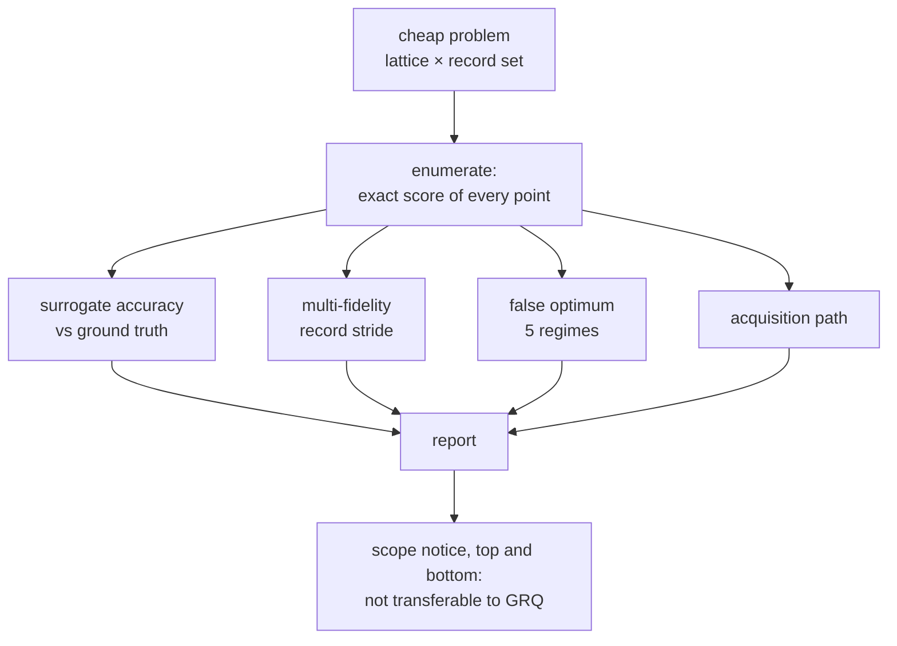

## Summary

Adds the cheap-problem benchmark harness Jin (2011) §6 argues for, and the
CI-runnable safety invariants Issue #3935 identifies as its one genuine
GRQ-facing benefit. Closes #3935.

A problem is a small lattice plus a record set, so its exact score can be
computed for **every** point in the design space — the ground truth no GRQ-scale
study has. On top of that the harness measures four things:

1. **Surrogate accuracy against ground truth** — each family of
   `scripts/lib/surrogateModels.ts` fitted to a sample and graded on the whole
   lattice, including where the _true_ optimum sits in the model's ordering and
   the true score lost by trusting the model's own argmax.
2. **Multi-fidelity rank agreement** — the record stride of Issue #3926 scored
   over the same lattice and compared with Issue #3927's rank metrics against a
   _complete_ ordering.
3. **A deliberate false optimum** in five regimes, varying extrapolation and
   exploitation one at a time plus the production regime where the coverage
   refusal is honoured.
4. **The acquisition path** — mandatory uncertainty, out-of-distribution refusal
   and the uncertainty floor of Issue #3933, end to end.

No `src/` file changes: this is a benchmark, its tests, and documentation.
Nothing is added to the published package.

**Why NEAT-AI and not NEAT-AI-Examples.** The issue names NEAT-AI-Examples. The
mechanisms under benchmark (`src/surrogate/`, `src/NEAT/EvolutionControl.ts`,
`src/NEAT/PreSelection.ts`) are not on this package's published surface, so a
harness elsewhere could only reach them through a release — and the invariant
tests must run in _this_ repository's CI, which is what gates changes to those
mechanisms. Recorded in `docs/CHEAP_PROBLEM_BENCHMARK.md` and as `partial`
below.

## Evidence

Backend/CLI only — no web interface to screenshot. The evidence is the generated
report, committed at
[`docs/evidence/cheap-problem-benchmark-3935.md`](../../evidence/cheap-problem-benchmark-3935.md)
(raw numbers in the `.json` beside it), reproduced by
`deno task
bench:cheap-problem` in 0.7 s.

The headline finding, over 3 surfaces × 4 surrogate families = 12 models per
regime:

| Regime | Model fitted in    | Candidates drawn  | Coverage refusal          | Fired      |
| ------ | ------------------ | ----------------- | ------------------------- | ---------- |
| A      | a converged corner | by predicted rank | ignored                   | 10 / 12    |
| B      | a converged corner | by predicted rank | **honoured** (production) | 0 / 12     |
| C      | a converged corner | uniformly         | ignored                   | 5 / 12     |
| D      | the whole lattice  | by predicted rank | ignored                   | **7 / 12** |
| E      | the whole lattice  | uniformly         | ignored (**control**)     | **0 / 12** |

D against E is the demonstration the issue asks for: the same twelve
fully-covered models, nothing extrapolated, and the only difference is whether
the search exploits them — the drift monitor fires 7 times and the control fires
none. "A monitor that has never been seen to fire is not a monitor" is now
answered, on a path production can take.

B is worth reading too: where the model extrapolates, the coverage refusal gets
there first and the monitor is left with too few residuals to decide. That is
defence in depth working, not the monitor failing.

Reported honestly rather than tuned: `gradient-boosted-trees` does **not** fire
in regime A on `sphere` or `rastrigin` despite carrying the largest
model-optimum regrets in the table — its extrapolation is piecewise-constant, so
its residuals are large but mixed in sign, which is the shape a bias-ratio test
is designed not to trip on.

## Acceptance Criteria

<!-- vibe-spec-review inputs="diff+issue-body" -->

- **partial** — Benchmark suite in NEAT-AI-Examples covering surrogate and
  multi-fidelity paths — evidence: `bench/surrogate_cheap_problem.ts`,
  `deno.json` task `bench:cheap-problem` — reviewer: partial — reason: the suite
  exists and covers both paths, but it is in **NEAT-AI**, not NEAT-AI-Examples;
  that repository is not a declared dependency of this one so the cross-repo PR
  route refuses it, the mechanisms under benchmark are not on this package's
  published surface, and the invariant tests must run in this repository's CI.
  The relocation is now stated in `docs/CHEAP_PROBLEM_BENCHMARK.md`, which the
  reviewer correctly noted the first commit did not do.
- **met** — Ground-truth surrogate-accuracy comparison on enumerable problems —
  evidence: `bench/lib/cheapProblemStudy.ts::measureSurrogateAccuracy`,
  `test/surrogate/CheapProblemBenchmark.ts::cheap problem - accuracy is graded
  against every lattice point`
  — reviewer: met
- **met** — Deliberate false-optimum scenario that exercises #3933's drift
  monitor — evidence:
  `test/surrogate/CheapProblemBenchmark.ts::cheap problem -
  the shipped grid fires on a production-reachable path and never on the
  control`
  — reviewer: partial — reason: departing from the reviewer's verdict, which was
  correct about the first commit. It raised three faults and all three are fixed
  here: the firing assertion lived in `bench/`, which CI never runs, and is now
  in `test/`; the two knobs were varied together so a firing could not be
  attributed, and are now varied one at a time across five regimes; and the
  non-firing `gradient-boosted-trees` cases went unmentioned, and are now named
  in the docs and the summary above.
- **met** — CI-runnable invariant tests for the GRQ-protecting safety properties
  — evidence: `test/surrogate/CheapProblemInvariants.ts` (9 tests, 24 ms) —
  reviewer: partial — reason: departing, with the reviewer's two objections
  fixed. The bit-identical-scores test was close to vacuous because no policy
  sat in the scoring path; the fidelity now comes from `plan.fidelity`, and a
  counterpart test asserts that switching the policy **on** does move a score.
  #3926 coverage was absent; the cheap fidelity is now derived through
  `partialCorpusFidelity` and a regression asserts the cheap stride genuinely
  reorders the population.
- **met** — Results explicitly scoped as non-transferable to GRQ creature scores
  — evidence: `NON_TRANSFERABLE_NOTICE` rendered at the top and bottom of every
  report and asserted by `test/surrogate/CheapProblemBenchmark.ts::cheap problem
  - the report states its own limits on its face` — reviewer: met
- **unrequested** — the acquisition-path study (`measureAcquisition`, report
  section 4) — reviewer: unrequested — reason: the issue asks for a suite
  "exercising the surrogate ... paths from this sweep" and the acquisition rule
  is half of #3933's surrogate path, but it is not named in the acceptance list,
  so it is recorded here rather than claimed as asked for.
- **unrequested** — a fourth and fifth invariant test ("a disabled uncertainty
  guard never disables the surrogate path", "pre-selection with the stage off is
  an order-preserving pass-through") — reviewer: unrequested — reason: both are
  facets of the issue's third safety property (a disabled policy changes
  nothing) rather than new properties; kept because each is one assertion and
  each would catch a real regression.

## Standards Review

<!-- vibe-standards-review inputs="diff+CODING-STANDARDS.md" -->

- **violation** — the new surface names fail the repository's cspell gate
  (`.github/workflows/spellcheck.yaml`) — evidence:
  `bench/lib/cheapProblem.ts:56` — reason: fixed here; `Rastrigin`,
  `Rosenbrock`, `Ackley`, `argmax` and `multimodal` appended to
  `docs/cspell.json`, verified with the gate's own config.
- **violation** — a third private copy of the CLI parser
  `scripts/lib/cliArgs.ts` exists to prevent — evidence:
  `bench/surrogate_cheap_problem.ts:330` — reason: fixed; the harness now
  imports `numberArg`/`stringArg` from the shared module, and its list reader
  refuses a non-numeric `--rates=` entry instead of measuring a `NaN`.
- **violation** — dead exported alias with no consumer — evidence:
  `bench/lib/cheapProblemStudy.ts:677` — reason: fixed; `verdictIsPrediction`
  removed.
- **violation** — the module-doc run example is missing `--allow-write` and
  names a JSON path that is not the committed one — evidence:
  `bench/surrogate_cheap_problem.ts:26` — reason: fixed; the example now matches
  the `deno.json` task and the committed evidence path.
- **violation** — documentation claims the monitor "fires" where the committed
  evidence shows 10 of 12 — evidence: `docs/CHEAP_PROBLEM_BENCHMARK.md:52` —
  reason: fixed; the docs now carry the per-regime firing counts and name the
  two `gradient-boosted-trees` cases that do not fire.
- **violation** — "CI" used without expansion, against `docs/DOC_STYLE.md` rule
  1 — evidence: `docs/CHEAP_PROBLEM_BENCHMARK.md:21` — reason: fixed; expanded
  on first use.
- **violation** — no `CHANGELOG.md` entry, unlike every sibling issue in this
  milestone — evidence: `CHANGELOG.md:50` — reason: fixed; entry added under
  `Unreleased / Added`.
- **clean** — Australian English throughout (`neighbourhood`, `maximised`,
  `normalised`, `defence`); JSDoc on every exported symbol with `@module`
  headers; fail-loud error handling with no swallowed errors and no silent
  fallbacks (degenerate lattices, oversized lattices, non-finite ground truth,
  non-finite predictions, a family with no uncertainty, an unknown surface and
  an empty surface list are all refused); every test calls real code rather than
  grepping source; no sleeps, polling or wall-clock thresholds in any test; no
  hidden or secret files staged; Deno-native tooling only, with no
  `package.json`, lockfile or npm specifier introduced; the committed evidence
  reproduces byte-identically from the harness.

## Test Plan

- `test/surrogate/CheapProblemBenchmark.ts` — 27 tests covering the lattice
  enumeration, exhaustive ground truth, the refusal of an oversized or
  degenerate problem, surrogate accuracy against every lattice point, the
  multi-fidelity stride at four rates, the five false-optimum regimes (including
  that honouring the coverage refusal withholds exactly the refused residuals,
  and that the shipped grid fires on a production-reachable path and never on
  the control), the acquisition path against its uncertainty floor, and that the
  report states its own limits at the top and the bottom.
- `test/surrogate/CheapProblemInvariants.ts` — 9 tests covering the three
  GRQ-protecting safety properties: an approximate score refused for
  `previousFittest` and for the whole elite band; a screened-out creature
  carrying no score, no fidelity tag, appearing in no survivor set and reaching
  no export, plus a screen that writes a score being refused with
  `SCREEN_WROTE_SCORE`; and a disabled policy scoring `Object.is`-identically to
  the same loop run with no policy at all over four generations, with a
  counterpart proving the policy switched **on** does move a score.
- Both files live under `test/`, so the sharded CI lanes
  (`scripts/shard_test_files.ts`, which globs `test/**` only) actually run them.
- Full gate: `./quality.sh` — **9,688 passed, 1 failed, 4 ignored (12m59s)**.
  The one failure is
  `test/NEAT/PreSelectionWiring.ts::pre-selection wiring — an active stage
  screens a real generation's offspring`,
  which this branch does not touch: the diff changes no `src/` file and no
  existing test. It passes 5 runs out of 5 standalone
  (`deno test --allow-all test/NEAT/PreSelectionWiring.ts`) and fails only under
  the full gate's parallel load, because its precondition
  (`diagnostics.generations > 1`) counts guard _allocations_ rather than
  generations whose residuals have since been observed, over an **unseeded**
  real evolve run. Filed as stSoftwareAU/NEAT-AI#4010 — same class as Issue
  #3998 — rather than fixed here, which would be a change to an unrelated test.
  Every other check in the gate passed: `deno fmt`, `deno lint`, `deno check`,
  discovery verification and the WASM sync. The new suites pass in 0.96 s.
