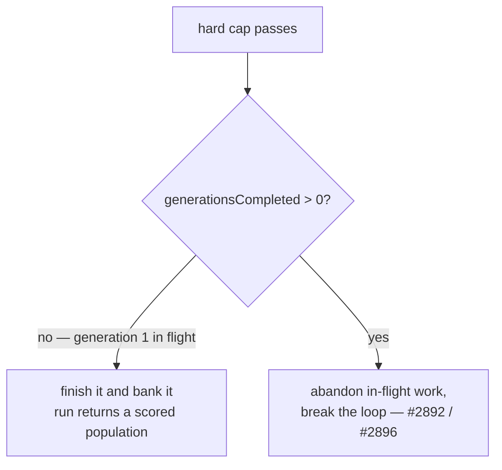

# Never abandon the first generation at the hard deadline

## Summary

`evolveDir` could return `generation === 0`: the T+grace hard cap abandoned the
in-flight **first** generation, so the population was never scored and there was
no winner to publish. On GRQ-26 that burnt a whole team slot per run, for days.

The two guards disagreed. `shouldStopStartingGenerations` has always refused to
stop a run that has not completed a generation;
`abandonInFlightPastHardDeadline` gated on time alone and overrode it. The floor
now lives in the one chokepoint every enforcement path goes through, so no
caller can abandon generation 1. Once one generation is banked, the #2892 /
#2896 cap behaves exactly as before. Closes #3940.

What changed:

- **`src/NEAT/HardDeadline.ts`** — new pure predicate `shouldAbandonInFlight`
  (generations completed + cap + now → boolean), carrying the same
  one-generation floor `shouldStopStartingGenerations` applies.
- **`src/NEAT/Neat.ts`** — new per-run counter `generationsCompleted` (distinct
  from the lineage-accumulated `currentGeneration`), and
  `abandonInFlightPastHardDeadline` now defers to `shouldAbandonInFlight`. That
  covers the evolve loops, the `completed`-branch check, and the in-fitness
  watchdog (`pollHardDeadlineWatchdog`), which is what emitted
  `stalled in fitness; interrupting` during generation 1.
- **`src/NEAT/NeatEvolution.ts`** — increments `generationsCompleted` once a
  generation has been evaluated end to end.
- **`src/creature/CreatureTraining.ts`** — `evolveDir` awaits generation 1
  uncapped (`generationCap = generation === 0 ? 0 : hardDeadlineMS`). This
  generalises the existing "a run that began already past its cap keeps the
  unbounded await" exemption to the case that actually bit: the cap passing
  _while_ generation 1 is in flight.
- **`docs/TIMEOUTS.md`** — the guarantee, the deadline table, the per-phase
  rules and the sequence diagram now state the one-generation floor.

An unbounded first generation is deliberate and bounded in practice: every
discovery / training child inside it still carries the absolute `hardDeadlineTS`
and is clamped to it (Issues #2898 / #2899), and the per-task stuck-task
watchdog (#3053) still fires, so the generation ends without the loop-level cap.



## Evidence

Backend/library change — no web interface to screenshot. The evidence is the
end-to-end regression test, which reproduces the GRQ-26 log lines exactly
against the unfixed code:

```text
[Neat] Hard deadline (timeoutMinutes + grace) exceeded during generation 1 — abandoning the in-flight generation and keeping the 0 generation(s) already evolved
[Neat] Hard deadline (timeoutMinutes + grace) exceeded — abandoning 0 in-flight task(s)
error: AssertionError: evolveDir must never return zero generations, got 0
```

After the fix, the same test returns a scored generation with the champion
written to `creatureStore`:

```text
evolveDir: a first generation that outlasts the hard deadline is completed, not abandoned ... ok (1s)
ok | 5 passed | 0 failed
```

The existing hard-deadline suites still pass unchanged in behaviour
(`test/NEAT/NeatHardDeadlineEnforcement.ts`,
`test/NEAT/NeatAbandonLateCompletion.ts`,
`test/NEAT/FitnessStallWatchdog.test.ts`,
`test/creature/EvolveDirHardDeadline.ts`,
`test/creature/EvolveDirStuckChildDeadline.ts`,
`test/creature/EvolveDirBoundedTeardown.ts`,
`test/NEAT/OverrunEnforcement.test.ts` — 57 + 14 cases green).

## Reproduction

- **symptom** — `evolveDir` returned `Evolution of 0 generation`: the hard cap
  abandoned the in-flight first generation, leaving an unscored population with
  no winner to publish
- **status** — `verified` — the regression test was observed failing against the
  unfixed code
  (`AssertionError: evolveDir must never return zero generations,
  got 0`, with
  the two GRQ-26 log lines) and passing after the fix
- **regression test** —
  `test/creature/EvolveDirFirstGenerationHardDeadline.ts::evolveDir: a first generation that outlasts the hard deadline is completed, not abandoned`

## Acceptance Criteria

- **met** — `evolveDir` never returns `generation === 0` because of the hard
  deadline — evidence: `src/creature/CreatureTraining.ts` (generation-1 await is
  uncapped) plus `src/NEAT/Neat.ts::abandonInFlightPastHardDeadline` (floored on
  `generationsCompleted`); covered by
  `test/creature/EvolveDirFirstGenerationHardDeadline.ts` and
  `test/NEAT/HardDeadlineFirstGeneration.ts::abandonInFlightPastHardDeadline: refuses while no generation has completed`
- **met** — a run whose first generation outlasts `timeoutMinutes + grace`
  completes that generation and returns it — evidence:
  `test/creature/EvolveDirFirstGenerationHardDeadline.ts` (injected clock steps
  past T+grace at the start of generation 1; the run returns `generation >= 1`
  with a champion in `creatureStore`)
- **met** — the existing #2892 / #2896 behaviour is unchanged once at least one
  generation has completed — evidence:
  `test/NEAT/HardDeadlineFirstGeneration.ts::shouldAbandonInFlight: unchanged once a generation is in hand`,
  the unchanged assertions in `test/NEAT/NeatHardDeadlineEnforcement.ts` /
  `test/NEAT/NeatAbandonLateCompletion.ts` /
  `test/NEAT/FitnessStallWatchdog.test.ts`, and
  `test/creature/EvolveDirHardDeadline.ts` still returning at generation 1
- **unrequested** — moved the orphaned `abandonInFlightPastHardDeadline` doc
  comment (it had drifted onto `abandonStuckTrainingTasks`) back onto its method
  — reason: it is the comment this change had to amend, so it is fixed in place
  rather than amended where it does not belong

The issue also flags `NeatOptions.iterations` and the never-produced
`"iterations"` `EvolveTerminationReason` as traps; it states neither is what it
asks for, so both are left untouched.

## Test Plan

Added:

- `test/NEAT/HardDeadlineFirstGeneration.ts` — `shouldAbandonInFlight` boundary
  cases (0 generations never abandons; unchanged once one is banked; on-cap is
  not past-cap; no cap configured), `abandonInFlightPastHardDeadline` refusing
  while nothing is banked (bookkeeping, `terminationReason`, `doNotStartMore`
  and the abandon token all untouched) then firing once one is, and the
  in-fitness watchdog not interrupting generation 1.
- `test/creature/EvolveDirFirstGenerationHardDeadline.ts` — end-to-end: the cap
  passes _during_ generation 1 on an injected clock; the run must still return a
  scored generation, a champion that activates, a written `creatureStore`, and
  `terminationReason: "hard-deadline"` once the generation is banked.

Modified (behaviour change documented, no test removed or weakened): the six
existing cases that exercise the abandon mechanism on a fresh `Neat` now set
`neat.generationsCompleted = 1` first, because the mechanism has a new
precondition — one banked generation. Their assertions are unchanged.

- `test/NEAT/NeatHardDeadlineEnforcement.ts`
- `test/NEAT/NeatAbandonLateCompletion.ts`
- `test/NEAT/FitnessStallWatchdog.test.ts`
