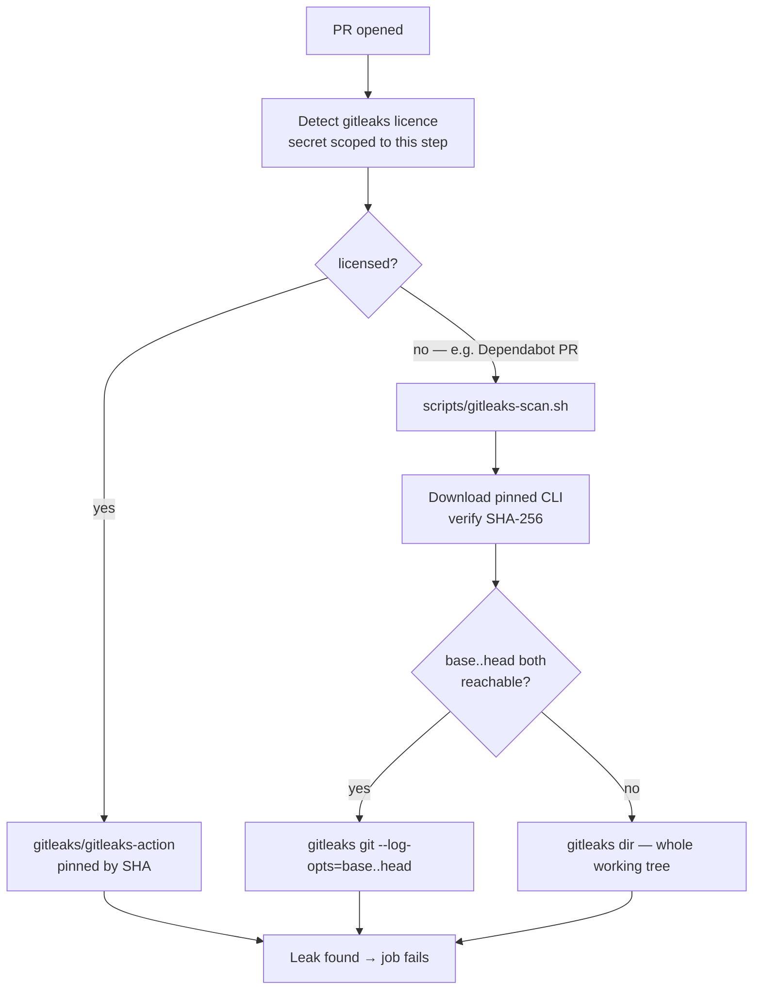

# Gitleaks: licence-less fallback so no PR merges unscanned

## Summary

`.github/workflows/quality.yml` scanned for secrets only via
`gitleaks/gitleaks-action`, which needs an organisation licence on org-owned
repositories. Dependabot-authored PRs receive no Actions secrets, so the licence
arrives empty and the action exits with `ErrLicense` before scanning anything —
the job goes green over an unscanned diff, which is worse than no gate because
it reads as covered.

Secret scanning now runs down one of two paths, and exactly one of them always
runs:

- **licensed** — the pinned `gitleaks/gitleaks-action`, unchanged;
- **licence-less** — `scripts/gitleaks-scan.sh`, which fetches the free,
  open-source CLI at a pinned version, verifies it against its published SHA-256
  checksum, and scans.

Two further faults were found while making the fallback actually scan, and are
fixed here because without them the fallback is a no-op:

1. **`.gitleaks.toml` disabled every rule.** A config file at the scan target's
   root _replaces_ gitleaks' built-in ruleset rather than adding to it, so the
   repository was being scanned with zero rules — by either scanner.
   `[extend] useDefault = true` restores the built-in rules; the existing commit
   allowlist still subtracts from them.
2. **An unresolvable commit range scans nothing and still exits 0.** The issue's
   suggested `gitleaks git --log-opts="$BASE..$HEAD"` reports "no leaks found"
   with exit 0 when git cannot resolve the range. The script verifies both
   endpoints with `git cat-file -e` first and widens to a whole-tree
   `gitleaks dir` scan when it cannot — never nothing.

`GITLEAKS_LICENSE` is resolved into a step output rather than exposed at job
level. The `secrets` context is unavailable in a step-level `if:`, but job-level
`env:` would put the secret in scope for every step of a job that executes
PR-controlled code, breaking the boundary Issue #3607 established.

Closes #3950.

### Human action required — this scan blocks merges only once it is required

Adding the fallback makes the scan _advisory_: a red run reports the problem and
the PR still merges. It blocks a merge only once `Quality reviews / quality` and
`Quality reviews / push-fixes` are **required status checks** on the rulesets
targeting both the default branch **and** `milestone/**` (most PRs land on
milestone branches — Issue #1300). Editing a ruleset needs repository-settings
permissions the worker is deliberately denied, so a human administrator must do
this under **Settings → Rules → Rulesets**.

## Evidence

Backend/CI change — no web interface to screenshot. The behaviour was verified
by running the real script and the real `gitleaks` CLI against throwaway git
repositories, plus the automated tests below.



**Manual verification — the fallback catches a real planted secret.** A scratch
repository with a synthetic GitHub PAT (a `ghp_` prefix followed by 36
placeholder characters — not reproduced here, so this file is not itself a
finding) committed on top of a clean base, scanned by the script's own download
path (real network fetch, real checksum verification, real gitleaks 8.30.1):

```text
$ BASE_SHA=$BASE HEAD_SHA=$HEAD bash scripts/gitleaks-scan.sh .
🔍 gitleaks: scanning ae2a52c1..c2fc9c5c
INF 1 commits scanned.
WRN leaks found: 1
EXIT=1
```

**Manual verification — the unguarded form is the silent green this fixes.** The
same repository, same secret, with the range endpoint unreachable:

```text
$ gitleaks git --exit-code 1 --log-opts="0000…0000..c2fc9c5c" .     # suggested form
ERR [git] fatal: Invalid revision range 0000…0000..c2fc9c5c
INF 0 commits scanned.
INF no leaks found
EXIT=0                                    # ← green over an unscanned diff

$ BASE_SHA=0000…0000 HEAD_SHA=c2fc9c5c bash scripts/gitleaks-scan.sh .
🔍 gitleaks: no reachable commit range — scanning the whole working tree
WRN leaks found: 1
EXIT=1                                    # ← the guard turns it into a real scan
```

**Manual verification — `.gitleaks.toml` was disabling every rule.** The same
planted `ghp_` token in a directory alongside the committed config, before and
after adding `[extend] useDefault = true`:

```text
$ gitleaks dir .        # with the previous .gitleaks.toml
INF no leaks found — EXIT=0
$ gitleaks dir .        # with useDefault = true
WRN leaks found: 1 — EXIT=1
```

Scanning the whole repository with the restored ruleset reports no leaks, so the
change does not turn CI red on existing content:

```text
$ gitleaks dir --redact --no-banner --exit-code 1 .
INF scanned ~26.81 MB in 820ms
INF no leaks found
```

`actionlint .github/workflows/quality.yml` passes, as do
`shellcheck --severity=warning scripts/gitleaks-scan.sh`, `bash -n`, cspell and
markdownlint on the changed files.

## Test Plan

New — `test/scripts/GitleaksScanScript.ts` (7 tests). These run the real script
and assert on what it did: the scanner argv it produced and its exit code. The
scanner is a stub and the release is served over `file://`, so the tests are
hermetic and finish in ~80 ms.

- scans the pull-request commit range when it is reachable
- scans the whole tree when the base commit is unreachable (the silent-green
  fix)
- scans the whole tree when no commit range is supplied (`workflow_dispatch`)
- fails loud when the scanner reports a leak
- refuses an installed binary that is not executable
- downloads and runs a release whose checksum matches
- refuses to run a release whose checksum does not match, and never executes it

New — `test/ci/QualityGitleaksFallback.ts` (4 tests). These execute the
workflow's own licence-detection bash for both licence states, then evaluate the
two scanner steps' `if:` conditions against the result.

- `evaluateCondition` handles equality, inequality and absence
- exactly one gitleaks scanner runs whether or not a licence is present
- the open-source CLI runs when no licence is present, and its script exists
- no job exposes a secret at job-level `env:` (guards the Issue #3607 boundary)

Verified red before the fix: with `.github/workflows/quality.yml` reverted, the
two workflow-wiring tests fail with "has no step with id `gitleaks_licence`".

Full `test/ci/*.ts` + `test/scripts/*.ts` suite: 543 passed, 0 failed.
