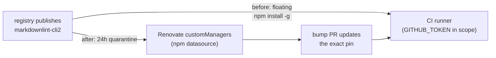

# Pin the CI install of `markdownlint-cli2` to an exact version

## Summary

`.github/workflows/markdown-lint.yml` installed `markdownlint-cli2` from a bare
`run:` step with no version, so the job executed whatever the npm registry
served at that moment. A `run:` block is not a manifest, so neither Renovate's
`minimumReleaseAge` nor Deno's `minimumDependencyAge` embargoed it, and the
`uses:` SHA-pinning gate never inspects `run:` — a hijacked release would have
run on the runner, with the workflow `GITHUB_TOKEN` in scope, the instant it was
published.

This change:

- pins the install to `markdownlint-cli2@0.23.2` (current latest, published
  2026-07-27, well outside the 24 h quarantine);
- adds a Renovate `customManagers` regex entry covering
  `.github/workflows/*.y(a)ml` with the `npm` datasource, so the pin is bumped
  inside the existing 24 h `minimumReleaseAge` window rather than going stale;
- documents the rule beside the other quarantine paths in
  `docs/CORE_DEPENDENCY_POLICY.md`.

`--ignore-scripts` was deliberately **not** added — per the issue, that is a
separate per-package judgement, and pinning is the fix here.

Closes #3951.



## Evidence

Backend/CI change with no web interface, so no screenshot applies. Evidence is
command output:

- The pinned version lints the whole repository corpus cleanly:

  ```text
  markdownlint-cli2 v0.23.2 (markdownlint v0.41.1)
  Finding: **/*.md !node_modules !.git
  Linting: 429 files
  Summary: 0 issues in 0 files
  ```

- New gate test red against the unfixed workflow, green after:

  ```text
  markdown-lint.yml pins every global npm install ... FAILED
    AssertionError: .github/workflows/markdown-lint.yml:49 installs
    'markdownlint-cli2' at '<floating>' — ... Pin an exact version.
  renovate.json keeps the workflow's npm install pin current ... FAILED
  → after the fix: ok | 9 passed | 0 failed
  ```

- `deno test -A test/ci/*.ts` — `282 passed | 0 failed`.
- `deno test -A test/scripts/*.ts` — `277 passed | 0 failed`.
- `./quality.sh --lint-only` and `./quality.sh --check-only` — clean.
- `actionlint .github/workflows/markdown-lint.yml` — no findings.

<!-- vibe-quality-gate-skipped reason="full ./quality.sh aborts in this container: '❌ Native rust_scorer is required (quality.sh default) but was not found.' — the sibling NEAT-AI-scorer binary is not present. The lint, format, bash-syntax and type-check lanes were run individually and pass; CI runs the full gate on the PR." -->

## Test Plan

Added `test/ci/MarkdownLintInstallPin.ts` (9 tests), following the existing
`test/ci/` "what" pattern — it parses the committed workflow and `renovate.json`
and asserts on the resulting configuration:

- `findGlobalNpmInstalls` unit tests: pinned spec, floating spec, scoped
  package, flag skipping and multiple packages, and non-matching lines (local
  install, `npm ci`, commented-out line).
- `isExactVersion` unit tests: exact release and pre-release accepted; range,
  partial version, dist-tag and `null` rejected.
- `matchesManagerFilePattern` unit tests: Renovate's `/regex/` and glob forms.
- Gate test: every global npm install in `markdown-lint.yml` carries an exact
  version.
- Gate test: `renovate.json` has a `customManagers` regex entry whose file
  pattern selects the workflow and whose `matchStrings` regex, run against the
  committed workflow text, actually extracts `depName` and `currentValue`
  matching the installed package and pin — so a regex that silently stops
  matching fails the build.
