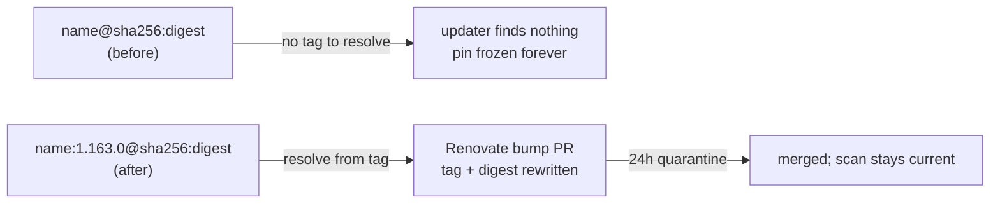

# Pin the semgrep container to a trackable tag + digest (Issue #3960)

## Summary

`.github/workflows/semgrep.yml` pinned the SAST job's container to a bare
`semgrep/semgrep@sha256:7cad2bc…` — immutable, but untrackable. Renovate's
`github-actions` manager and Dependabot's `docker` ecosystem both resolve a
version bump from the **tag** and then rewrite the digest beside it, so with no
tag the image was frozen at whatever `:latest` resolved to on 2026-05-22 and no
updater could ever move it: new Semgrep rule packs and CVE fixes silently
stopped reaching the scan.

The pin now carries the release tag alongside the same digest:

```yaml
image: semgrep/semgrep:1.163.0@sha256:7cad2bc2d1e44f87f0bf4be6d1fa23aa90fb72015bebc89fb91385d813987a03
```

`1.163.0` is the tag that resolves to that exact multi-arch index digest
(confirmed against the Docker Hub registry API), so the image pulled by CI is
byte-for-byte the one that ran before this change — the supply-chain intent of
Issue #2743 is untouched — while Renovate can now raise bump PRs against it
under the existing 24 h `minimumReleaseAge` quarantine in `renovate.json`.

Closes #3960.



## Evidence

Backend/CI-only change — no web interface to screenshot. Evidence is the test
run and the committed workflow.

Red before the fix (the gate written first, run against the unfixed workflow):

```text
every digest-pinned workflow container image also carries a release tag (Issue #3960) ... FAILED
  AssertionError: semgrep.yml: container image
  'semgrep/semgrep@sha256:7cad2bc…' on line 32 pins a digest with no release
  tag, so Renovate and Dependabot cannot resolve a bump from it
semgrep.yml container image is pinned and trackable (Issues #2743, #3960) ... FAILED
FAILED | 10 passed | 2 failed
```

Green after the fix:

```text
deno test --allow-read test/ci/WorkflowContainerImagePinning.ts
ok | 12 passed | 0 failed (27ms)
```

The committed workflow parses and yields the intended reference:

```text
$ deno eval "…parse('.github/workflows/semgrep.yml')…jobs.semgrep.container.image"
semgrep/semgrep:1.163.0@sha256:7cad2bc2d1e44f87f0bf4be6d1fa23aa90fb72015bebc89fb91385d813987a03
```

Quality gate: `./quality.sh --lint-only` (fmt, lint, bash) and
`./quality.sh --check-only` (type check) both pass. The **full** `./quality.sh`
cannot run in this container — it fails loud at the native-scorer gate
(`❌ Native rust_scorer is required (quality.sh default) but was not found`),
which is environmental, not caused by this change. The 22 unrelated `test/ci/`
failures (`WorkflowVersionOutputInjection.ts`, `QualityGitleaksFallback.ts`,
`CoverageMergeGate.ts`, `CoverageMergeStepLeastPrivilege.ts`) were confirmed
pre-existing by stashing this diff and re-running them on a clean tree — they
are the failures tracked by Issue #3961. CI runs the same checks on this PR.

## Test Plan

All in `test/ci/WorkflowContainerImagePinning.ts`:

- **Added** `parseImageRef()` + `isTrackableTag()` helpers and their unit tests:
  name/tag/digest split, missing tag, missing digest, and the registry-port edge
  case (`registry.local:5000/app` must not be read as a tag); trackable release
  tags (`1.163.0`, `v2`, `3.1.0-rc1`) versus moving ones (`latest`, `stable`,
  `edge`, empty, null).
- **Added**
  `every digest-pinned workflow container image also carries a release
  tag (Issue #3960)`
  — repo-wide gate over `.github/workflows/*.y*ml`, so a future untrackable pin
  in any workflow fails the build, not just semgrep's.
- **Modified** (documented, not removed)
  `semgrep.yml container image is
  pinned…` →
  `…is pinned and trackable (Issues #2743, #3960)`: the assertion tightens from
  `^semgrep/semgrep@sha256:<64-hex>$` to
  `^semgrep/semgrep:\d+\.\d+\.\d+@sha256:<64-hex>$`. The Issue #2743 digest
  requirement is unchanged — the tag requirement is added on top, so the older
  guarantee cannot regress.
