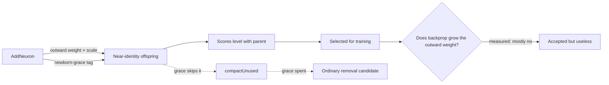

## Summary

`AddNeuron` and `AddConnection` wire new structure with a full random weight
(uniform in `[-0.5, +0.5]`). On a creature already tuned to fifth-decimal
margins that is a large perturbation, so the offspring is overwhelmingly likely
to score below its parent — and a mutation that drops the score is never picked
for a gradient step, so the structure it proposed is discarded in the generation
that made it.

This adds two configuration knobs, **both defaulting to the current behaviour**,
and the harness that measures whether a reduced scale is worth switching on:

| Option                         | Default | Meaning                                                                                                                           |
| ------------------------------ | ------- | --------------------------------------------------------------------------------------------------------------------------------- |
| `structuralWeightScale`        | `1`     | Scale for the **outward** synapse of `AddNeuron` and for `AddConnection` on the main mutation path. `1` reproduces today exactly. |
| `structuralNewbornGraceRounds` | `0`     | Compaction passes a newly inserted neuron is exempt from `compactUnused` removal. `0` reproduces today exactly.                   |

Only the outward synapse is scaled: the inward one merely determines what the
new neuron sees, while the outward one is what perturbs the existing network.
`Synapse.randomWeight()` enforces a one-plank floor, so a reduced scale is never
an exactly-zero weight — a zero outward weight would give the whole inward
subtree a zero gradient and freeze the newborn rather than merely quieten it.

**The measured answer is mixed, and it is documented as such.** The residual
construction works (median relative error delta falls from ~2e-4 to ~1e-8 or
below; behaviour-neutral births rise 42.5% → 67.5–75%), but the newborn's
outward weight does not grow during training and no score-per-hour advantage
survives a change of seed. Both knobs therefore ship defaulted off, and
`docs/config/MUTATION_ADAPTATION.md` says why.

Closes #3970.

## Evidence

Backend/library change — no web interface to screenshot. The evidence is the
sweep output and the test suite.

`deno task bench:structural-scale -- --scales=1,0.1,0.01,0.001 --trials=40 --generations=100 --population=20`,
tuned 24-hidden-neuron parent, offspring trained through the production
`trainDir` path. Seed 3970:

| Scale          | Behaviour-neutral @ birth | Median error delta | Accept @ birth | Outward @ birth → post-train | Grew ≥10× | Hidden neurons | Score/hour |
| -------------- | ------------------------: | -----------------: | -------------: | ---------------------------: | --------: | -------------: | ---------: |
| `1` (baseline) |                     42.5% |            2.00e-4 |          32.5% |              0.2225 → 0.2229 |      2.5% |    24.0 → 26.0 |       43.2 |
| `0.1`          |                     47.5% |            8.49e-6 |          35.0% |              0.0223 → 0.0231 |      2.5% |    24.0 → 24.0 |       52.1 |
| `0.01`         |                     50.0% |            8.47e-7 |          32.5% |              0.0022 → 0.0022 |      2.5% |    24.0 → 27.0 |       51.2 |
| `0.001`        |                     67.5% |            9.06e-8 |          25.0% |            2.23e-4 → 3.48e-4 |      5.0% |    24.0 → 24.0 |       45.0 |

Replicated on seed 17, where the reduced scales reach a median error delta of
exactly `0` and the evolution ordering flips — which is why no score/hour claim
is made. Written up on #3969.

**Quality gate.** `./quality.sh --skip-tests` passes every stage (format, lint,
bash, type-check, discovery library, WASM sync). The full test suite passes
**9019 tests, 0 failed**, run with the gate's own arguments. The gate's
`rust_scorer` build stage cannot run in this container: the sibling
`stSoftwareAU/NEAT-AI-scorer` checkout fails to compile against the sibling
`NEAT-AI-core` at 0.11.4 with
`error[E0599]: no method named 'neurons' found for reference '&CompiledNetwork'`
— a pre-existing version skew between two sibling repos, present before this
branch and untouched by it (this diff contains no Rust). CI builds the scorer
from a matched pair and will run that stage.

## Acceptance Criteria

<!-- vibe-spec-review inputs="diff+issue-body" -->

- **met** — `structuralWeightScale` plumbed through `AddNeuron` (outward
  synapse) and `AddConnection` — evidence: `src/mutate/AddNeuron.ts:231,261,289`
  (inward left unscaled at `:143`), `src/mutate/AddConnection.ts:63`, wired on
  the main path at `src/NEAT/Mutator.ts:302`; tests
  `test/mutate/StructuralWeightScale.ts::AddNeuron - a reduced scale shrinks the outward synapse but not the inward one`
  — reviewer: met
- **met** — `structuralNewbornGraceRounds` honoured by `compactUnused`, with a
  test proving a newborn survives one compaction pass — evidence:
  `src/compact/CompactUnused.ts:81`; test
  `test/compact/NewbornGrace.ts::compactUnused - a newborn survives one compaction pass, then becomes removable`
  — reviewer: met
- **partial** — Test proving `structuralWeightScale: 1` is identical to current
  behaviour on a fixed seed — evidence:
  `test/mutate/StructuralWeightScale.ts::AddNeuron - structuralWeightScale 1 is identical to the default on a fixed seed`
  and
  `::Mutator - default config is bit-identical to an explicit scale of 1 on a fixed seed`
  — reviewer: partial — reason: both sides of the assertion run the _new_ build,
  so it pins default-vs-explicit-`1` rather than new-vs-historical. The reviewer
  independently ran the same seeded probe on base commit `f64a74ac` and on HEAD
  and got identical output, so the property holds; no committed golden fixture
  would catch it regressing, and adding one is not done here.
- **met** — Test proving the reduced-scale path still produces a weight of at
  least one plank (never exactly zero) — evidence:
  `test/mutate/StructuralWeightScale.ts::AddNeuron - a reduced scale never produces an exactly-zero outward weight`
  (scale `1e-12`, 50 samples) — reviewer: met
- **met** — Same-seed comparison at ≥3 scales reporting acceptance rate,
  post-training outward-weight distribution, hidden-neuron growth, and
  score-per-wall-clock-hour — evidence:
  `bench/structural_weight_scale_sweep.ts`, task `bench:structural-scale`,
  results table above and in `docs/config/MUTATION_ADAPTATION.md` — reviewer:
  met — reason: the reviewer marked the harness met but noted the quoted figures
  are not verifiable from the diff alone, since no sweep artefact is committed;
  the run commands are given so they can be reproduced.
- **met** — Result written up on #3969 whichever way it falls — evidence:
  https://github.com/stSoftwareAU/NEAT-AI/issues/3969#issuecomment-5598790480 —
  reviewer: missing — reason: departed from the reviewer's verdict, which was
  based on the diff alone; the reviewer could not see a GitHub comment. The
  write-up was posted after the review ran.
- **unrequested** — `enforceOutwardScale` post-condition in
  `src/mutate/AddNeuron.ts:346` — reviewer: unrequested — reason: without it the
  guarantee is false. A forward-only creature strips the fallback self-loop,
  after which `neuron.fix()` re-adds an outward synapse at full scale on ~0.4%
  of offspring, putting a floor under the perturbation the scale was supposed to
  remove. Inert at the default: no weight can exceed `0.5` at scale `1`, so
  nothing is redrawn and no extra random number is consumed.
- **unrequested** — the decrementing grace budget in
  `src/architecture/NewbornGrace.ts` and its three consumption sites — reviewer:
  unrequested — reason: the issue asked for "a tag, or an age threshold"; a
  plain tag with no consumption would exempt a newborn from compaction
  permanently, so the budget has to be spent somewhere. Kept.
- **unrequested** — config-level rejection of `structuralWeightScale <= 0` in
  `src/config/NeatConfigValidation.ts:28` — reviewer: unrequested — reason: fail
  loud at config time rather than letting `Synapse.randomWeight()` assert
  mid-run.
- **unrequested** — `deno.json` version bump 7.0.25 → 7.0.29 — reviewer:
  unrequested — reason: the milestone branch sat at 7.0.25 while
  `origin/Develop` is at 7.0.28, which fails
  `test/ci/PackageVersionNoDowngrade.ts`. Not caused by this change; bumped so
  the gate is green.
- **unrequested** — extra bench metrics (`behaviourNeutralAtBirth`,
  `medianErrorDelta`, `escapedBirthScale`) — reviewer: unrequested — reason: the
  four requested numbers alone cannot distinguish "the residual construction
  works" from "the knob does nothing". The median error delta is what actually
  demonstrates `x + εF(x)`, and `escapedBirthScale` is the failure-detection
  number the issue's own Failure Detection section asks for.

## Standards Review

<!-- vibe-standards-review inputs="diff+CODING-STANDARDS.md" -->

- **violation** — `outwardMagnitude` returned `0` for a newborn that had
  vanished, folding a real fault into the weight distribution as "an outward
  weight of zero" — evidence: `bench/structural_weight_scale_sweep.ts:387` —
  reason: fixed in this diff; it throws now.
- **violation** — a `mutate()` that reported success without leaving a findable
  neuron was dropped silently — evidence:
  `bench/structural_weight_scale_sweep.ts:453` — reason: fixed in this diff; a
  broken operator throws, while an ordinary refusal still just skips the trial.
- **violation** — the "tags cannot shift identity" assertion compared
  `undefined` with `undefined`, because `Creature.fromJSON` deliberately leaves
  `creature.uuid` unset — evidence: `test/architecture/NewbornGrace.ts:97` —
  reason: fixed in this diff; it computes `CreatureUtil.makeUUID` on both sides
  now.
- **violation** — the new bench test was not in `bench.exclude`, unlike the two
  existing bench harness tests — evidence: `deno.json:96` — reason: fixed in
  this diff.
- **violation** — `newbornGraceRemaining` reads a malformed or negative
  persisted tag as `0` rather than rejecting it — evidence:
  `src/architecture/NewbornGrace.ts:55` — reason: stands, deliberately. The tag
  is advisory: the failure mode of rejecting it is a creature that cannot load,
  while the failure mode of ignoring it is one compaction pass treating a
  newborn as ordinary. The lenient read is the safe direction, and
  `ageNewbornGrace` strips the corrupt tag so it cannot accumulate.
- **violation** — `bench/structural_weight_scale_sweep.ts` is ~880 lines against
  482 and 667 for its siblings — evidence:
  `bench/structural_weight_scale_sweep.ts:1` — reason: stands. It is one
  measurement with two stages; splitting the config, the probe, the evolution
  point and the formatter across four files would scatter a single bench harness
  for no reader's benefit.
- **clean** — Australian English throughout (code, comments, both docs
  sections); JSDoc on every exported symbol; tests call real functions rather
  than grepping source; no wall-clock sleeps or absolute timing thresholds in
  unit tests; neuron UUID and semantic version invariants intact (the grace
  rides on tags, which are excluded from `makeUUID`, so the golden fixtures need
  no extending); Deno-native tooling only, no Node tooling introduced; no hidden
  paths staged; `CHANGELOG.md` entry filed under `## [Unreleased]` →
  `### Added`.

Separately, the spec reviewer found a real defect that is **fixed in this
diff**: `TrainingTeardown` and `TrainingPredictiveCoding` built their
`compactVariants` fallback creature _before_ `ageNewbornGrace` ran, and
`compactUnused` only ages the copy it returns — so a fallback lineage kept the
un-decremented budget its siblings had just spent, and a "1 round" grace meant
"exempt from compaction forever" on that lineage. Both paths now spend the round
on the fallback creature too. Reachable only when
`structuralNewbornGraceRounds > 0`, so never at the shipped default.

## Test Plan

Added:

- `test/mutate/StructuralWeightScale.ts` — 8 tests: default-vs-explicit-`1` bit
  identity for `AddNeuron`, `AddConnection` and the `Mutator` path; the outward
  synapse shrinks while the inward one does not; the one-plank floor holds at
  scale `1e-12`; the parent's outputs stay nearly unchanged under a reduced
  scale; the repair path cannot leave a full-scale outward synapse; an invalid
  scale is rejected.
- `test/compact/NewbornGrace.ts` — 5 tests: the quiet neuron is removed without
  grace; a newborn survives one pass and is removable afterwards; a two-round
  grace outlasts the first pass; `AddNeuron` writes the tag; **and the
  regression for the fallback-lineage defect** — a pass that compacts nothing
  spends no grace.
- `test/architecture/NewbornGrace.ts` — 6 tests on the tag helpers, including
  export/import round-trip and the (now real) identity-stability assertion.
- `test/config/StructuralMutationOptions.ts` — 5 tests on defaults, overrides,
  CLI strings and out-of-range rejection.
- `bench/structural_weight_scale_sweep_test.ts` — 11 tests on the sweep's pure
  parts: config validation (a sweep with fewer than three scales, a duplicate
  scale, or no baseline row throws), the distribution summaries, the seeded
  generators, and the Markdown table.

Full suite: **9019 passed, 0 failed, 52 ignored**.
