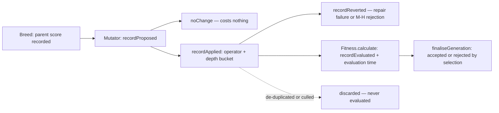

# Per-operator mutation outcome telemetry (Issue #3971)

## Summary

`MCMCDiagnostics` counts mutation acceptance in aggregate, so nothing in the
repository could say whether `AddNeuron` is rejected more often than
`ModWeight`, at what depth a rejected change landed, how large the score delta
of an accepted structural mutation was, or how much evaluation time went into
offspring that were then discarded. Without those numbers #3970 and #3973 are
arguments rather than fixes.

This adds always-on per-operator mutation outcome telemetry
(`MutationOperatorTelemetry`). Every operator in `src/mutate/` now reports, per
generation: `proposed`, `noChange`, `applied`, `reverted`, `evaluated`,
`accepted`, `rejected`, `evaluationMs`, the score-delta distribution
(min/median/max — never a mean), and the depth bucket of each structural site,
both as applied and joined with the selection outcome. It rides the existing
`generation_complete` event as `mutationOperators`, `EvolveResult`, and a
verbose `[MutationOps]` log line — no new output channel. Closes #3971.

Design notes:

- **Attribution survives breeding.** An offspring accumulates every operator
  applied to it and each is credited with the whole outcome;
  `soleAttributed`/`coAttributed` and `attribution.note` state the ambiguity
  rather than guessing at one operator.
- **`noChange` ≠ `rejected`.** An operator that returns `false`, or leaves the
  UUID unrotated, costs nothing and is booked separately.
- **Score delta is measured against the parent.** `ParallelBreeding` records the
  ranked parent's score per offspring (`lastParentBaselines`); the offspring's
  own score is captured at evaluation time, because a rejected offspring is
  disposed — which clears its score — before the generation ends.
- **Cost is per mutation, never per synapse.** The only non-constant call is the
  depth bucket, computed for structural mutations only; weight/bias mutations
  report `unknown` and never walk the topology.

## Evidence

Backend/CLI change with no web interface, so there is no screenshot to capture.
The evidence is the test suite plus a real measured run.

**Measured run** — `evolveDataSet`, 62 generations, population 50, 3→1
regression target, reading `generation_complete.mutationOperators`. This is the
shape of the number #3970 will be judged against (it is a local harness, **not**
a production GRQ run — see the acceptance block):

| operator   | proposed | noChange | applied | reverted | evaluated | accepted | rejected | accept% | evalMs | depth in/mid/out/? |
| ---------- | -------: | -------: | ------: | -------: | --------: | -------: | -------: | ------: | -----: | ------------------ |
| MOD_BIAS   |       49 |        0 |      49 |        0 |        37 |        4 |       33 |    10.8 |     10 | 0/0/0/49           |
| MOD_WEIGHT |       39 |        0 |      39 |        0 |        27 |        1 |       26 |     3.7 |      7 | 0/0/0/39           |
| MOD_SQUASH |        6 |        0 |       6 |        0 |         4 |        1 |        3 |    25.0 |      1 | 0/0/6/0            |
| ADD_NODE   |        3 |        0 |       3 |        0 |         1 |        0 |        1 |     0.0 |      5 | 3/0/0/0            |

`attribution: resolved=69 multiOperator=0 discarded=27 evalMs=23`;
`delta MOD_WEIGHT: min=-0.0670 med=-0.00947 max=0.00573` (7 samples);
`delta MOD_BIAS: min=-0.0785 med=-0.0161 max=-0.00183` (13 samples).

On this toy problem `ADD_NODE` is proposed 3 times in 62 generations, so it
cannot answer the GRQ question — which is exactly the point of shipping the
counters before the conclusion.

## Acceptance Criteria

<!-- vibe-spec-review inputs="diff+issue-body" -->

- **met** — Per-operator counters for every operator in `src/mutate/` —
  evidence: `src/NEAT/Mutator.ts` records through the single `mutateCreature`
  entry point;
  `test/NEAT/MutationOperatorTelemetryIntegration.ts::the Mutator records a proposal and a depth bucket for ADD_NODE`
  — reviewer: met
- **met** — Score-delta distribution and depth bucket recorded per
  accepted/rejected structural mutation — evidence:
  `test/NEAT/MutationOperatorTelemetry.ts::the depth bucket travels with the outcome across the generation lag`
  and `::an accepted structural mutation records its depth` — reviewer: partial
  — reason: the reviewer found the applied-depth histogram reset each generation
  while an offspring is evaluated the generation _after_ it is mutated, so the
  depth of an accepted/rejected change was unrecoverable; fixed in commit
  `35d0770` by carrying the bucket on the pending offspring and reporting
  `acceptedDepthBuckets` / `rejectedDepthBuckets`, with the lag documented.
- **met** — Multi-mutation offspring attributed to all applied operators, with
  the ambiguity stated — evidence:
  `test/NEAT/MutationOperatorTelemetry.ts::an offspring is attributed to every operator applied`;
  `MULTI_OPERATOR_ATTRIBUTION_NOTE` in `src/NEAT/MutationOperatorReport.ts` —
  reviewer: met
- **met** — `noChange` counted separately from `rejected`, with a test —
  evidence:
  `test/NEAT/MutationOperatorTelemetry.ts::noChange is counted separately from rejected`
  and
  `test/NEAT/MutationOperatorTelemetryIntegration.ts::an operator that cannot change anything counts as noChange`
  — reviewer: met
- **met** — Reconciliation test against `MCMCDiagnostics` aggregate totals —
  evidence:
  `test/NEAT/MutationOperatorTelemetryIntegration.ts::per-generation M-H totals reconcile with MCMCDiagnostics`
  — reviewer: met
- **met** — De-duplicated offspring excluded from `evaluated`/`wallClock`, with
  a test — evidence:
  `test/NEAT/MutationOperatorTelemetryIntegration.ts::de-duplicated offspring are excluded from evaluated and wallClock`
  — reviewer: met
- **missing** — A baseline measurement from a real GRQ run posted to #3969 —
  reviewer: missing — reason: a production GRQ run is not reachable from this
  container; the measured local run above is posted to #3969 as the interim
  baseline and the harness it came from is the telemetry itself, so the GRQ
  number is now one run away.
- **unrequested** — Per-operator `mcmcAccepted` / `mcmcRejected` and the
  `reverted` counter — reviewer: unrequested — reason: the issue's own failure
  detection requires reconciling against the aggregate M-H totals and separating
  a rolled-back mutation from a rejected one; both counters are what make that
  check possible.
- **unrequested** — `deltaUnavailable`, `discardedOffspring` and the
  two-generation pending write-off — reviewer: unrequested — reason: the issue
  demands that a never-evaluated offspring not appear in
  `evaluated`/`wallClock`; these are how that exclusion is reported instead of
  silently dropped.
- **unrequested** — `computeLayerBucket` extracted to `src/NEAT/LayerBucket.ts`
  and `SquashEffectivenessTracker` rewired to it — reviewer: unrequested —
  reason: the issue names that tracker as the bucketing model to reuse; a
  verbatim extraction reuses it rather than copying it (DRY), and its tests pass
  unchanged.
- **unrequested** — `ParallelBreeding.lastParentBaselines` — reviewer:
  unrequested — reason: `scoreDelta` is defined as "offspring score minus parent
  score", and a bred offspring has no score of its own; this is the only place
  the parent is known.
- **unrequested** — `deno.json` version bump, `CHANGELOG.md` entry,
  `docs/MUTATION_OPERATOR_TELEMETRY.md`, `mod.ts` type exports — reviewer:
  unrequested — reason: required by `AGENTS.md` (deployment checklist, root
  barrel) and the fleet "a code change owes a docs change" rule.

## Standards Review

<!-- vibe-standards-review inputs="diff+CODING-STANDARDS.md" -->

- **violation** — `setMutationTelemetry` was inserted between `calculate()`'s
  JSDoc and `calculate()`, orphaning the docs of a public method — evidence:
  `src/architecture/Fitness.ts:227` — reason: fixed in `35d0770`; the new method
  now sits above `calculate()`'s doc block.
- **violation** — same orphaning of `breedSingle`'s JSDoc — evidence:
  `src/breed/ParallelBreeding.ts:473` — reason: fixed in `35d0770`.
- **violation** — `deno.json` version not incremented and no `CHANGELOG.md`
  entry, against the AGENTS.md deployment checklist — evidence: `deno.json:4` —
  reason: fixed in `35d0770` (7.0.29 → 7.0.30, `Unreleased → Added` entry).
- **violation** — `MCMC` and `UUID` used unexpanded, and no glossary link, in
  the new doc (DOC_STYLE rules 1 and 2) — evidence:
  `docs/MUTATION_OPERATOR_TELEMETRY.md:3` — reason: fixed in `35d0770`; both
  expanded and linked, with a house-vocabulary paragraph linking
  `docs/GLOSSARY.md`.
- **violation** — the report types were not re-exported from the root barrel, so
  a consumer could not name the type of a public event field — evidence:
  `src/config/TrainingEvent.ts:374` — reason: fixed in `35d0770`; exported from
  `mod.ts`.
- **clean** — Australian English throughout src, tests and docs; no hidden paths
  staged; tests call the real `MutationOperatorTelemetry`, `Mutator`,
  `DeDuplicator`, `MCMCDiagnostics` and `evolveDataSet` rather than grepping
  source; no sleeps or absolute timing thresholds in tests; the single new
  `catch` logs the operator and error before degrading to the `unknown` bucket
  rather than swallowing it; the layer-bucket logic is extracted, not copied; no
  dead code (every operator that notes a site is covered by
  `isTopologyMutation`); `deno fmt`, `deno lint` and `deno check` clean; neuron
  UUID and semantic-version invariants untouched.

## Test Plan

Added:

- `test/NEAT/MutationOperatorTelemetry.ts` — 20 unit tests: `noChange` vs
  `rejected`, selection outcome, multi-operator attribution and the ambiguity
  note, the min/median/max distribution (and its even-sample median), the
  parent-baseline and `score`-tag fallbacks, the delta surviving a disposed
  offspring, depth buckets travelling across the generation lag, reverted
  mutations, never-evaluated offspring, and the `MCMCDiagnostics`
  reconciliation.
- `test/NEAT/MutationOperatorLog.ts` — 3 tests for the `[MutationOps]` verbose
  line: a quiet generation produces no line, an active operator renders its
  counters, delta, applied and outcome-joined depth buckets and attribution
  split, and the outcome buckets are omitted before there is an outcome.
- `test/NEAT/MutationOperatorTelemetryIntegration.ts` — 6 integration tests
  driving the real `Mutator`, `DeDuplicator` and `evolveDataSet`: proposal +
  depth bucket for `ADD_NODE`, weight mutations bucketed `unknown` (proving the
  hot path is not layer-walked), `SUB_NODE` on a hidden-less creature counted as
  `noChange`, the per-generation M-H reconciliation, de-duplicated offspring
  excluded from `evaluated`/`evaluationMs`, and the report arriving on
  `generation_complete` with internally consistent counters.

Modified:

- `test/creature/EvolveGenerationTail.ts` — the `EvolveResult` fixture carries
  the new `mutationOperators` field.

`./quality.sh` passed in full: **9094 passed, 0 failed, 4 ignored (11m7s)**,
exit 0. It ran at commit `9c60023`; the two files added after it started —
`test/NEAT/MutationOperatorLog.ts` (3 tests, run separately, green) and this
summary — were checked individually with `deno fmt`, `deno lint`, `deno test`
and `markdownlint-cli2`.

Existing suites re-run green: `test/mutate/` (199), `test/NEAT/` (942; the 9
`Train.ts` / `TrainingLoopAllocations.ts` failures are the pre-existing
environmental `neat_ai_backpropagation` library requirement and pass with the
`NEAT_AI_BACKPROP_ENABLED=0` the gate sets), `test/breed/` (330),
`test/score/` + `test/config/` (603), `test/docs/` (304).
