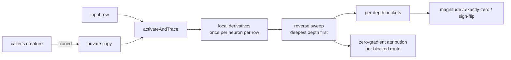

## Summary

Gradient reliability at depth in GRQ-lineage creatures was unmeasured. This adds
the measurement, runs it, and publishes the answer. Closes #3972.

- `src/propagate/GradientDepthProbe.ts` — a read-only reverse-mode sweep that
  measures the gradient reaching every hidden neuron, bucketed by depth
  (`computeLayerAssignments`): magnitude distribution, **exactly-zero
  fraction**, sign-flip rate, and attribution of each zero to the construct that
  blocked it, counted per blocked route.
- `src/propagate/GradientDepthBuckets.ts` — the cause taxonomy and per-depth
  statistics, split out so the measurement and the bookkeeping stay separately
  readable.
- `src/propagate/SerialChains.ts` — finds the single-file runs of depth levels
  that make a zero derivative unrecoverable. Confirms the issue's claim: the GRQ
  creature has a 28-neuron chain from depth 34 to 61.
- `test/fixtures/depth/` — the language-neutral corpus freezing NEAT-AI's depth
  bucketing, so NEAT-AI-Backpropagation can verify agreement before its numbers
  are compared against these.
- `scripts/gradientDepthReport.ts` — renders a profile as Markdown.
- `RunnerUpProximity.ts` now exports `RUNNER_UP_LEAK_FRACTION`, used by
  `MINIMUM`, `MAXIMUM` **and** the probe, so the three cannot drift.

**Finding: zero gradient (topology), not badly-scaled gradient (#3916).** The
3-deep control never measures an exactly-zero gradient and flips sign on 18–28%
of consecutive pairs; the GRQ creature is exactly zero on 99.6% of measurements
at depth 1 and at least 95.1% at every depth from 4 to 44. An adaptive
per-parameter step size multiplies zero and gets zero, so #3973 and #3974 are
worth building.

## Evidence

Backend/CLI change with no web interface, so no screenshot applies. The
deliverable _is_ the measurement:
[`docs/evidence/gradient-depth-3972.md`](../../evidence/gradient-depth-3972.md)
— the full per-depth profile of the GRQ creature, an input-scale sensitivity
re-run, two shallow controls, and a reproduction command per section. Posted to
#3969
([profile](https://github.com/stSoftwareAU/NEAT-AI/issues/3969#issuecomment-5600406711),
[corrections](https://github.com/stSoftwareAU/NEAT-AI/issues/3969#issuecomment-5600575338)).

Static gates are green: `./quality.sh --lint-only` (fmt, lint, bash) and
`./quality.sh --check-only` (type check, 2,644 files) both pass.

<!-- vibe-quality-gate-skipped reason="full ./quality.sh test lane needs the native rust_scorer and libneat_ai_backpropagation, neither of which is present in this container; the gate fails loud by design before running any test" -->

The full `./quality.sh` refuses to start here: it requires a native
`rust_scorer` binary (and, for the `trainDir` lane,
`libneat_ai_backpropagation`), neither of which exists in this container, and it
fails loud rather than falling back. Tests were run directly instead — **1,296
passed, 0 failed** across `test/propagate/`, `test/scripts/` and `test/docs/`,
plus 406 + 140 in `test/architecture/` and `test/methods/` and 433 in
`test/mutate/`, `test/neuron/`, `test/utils/`. The 9 failures in
`test/creature/CreatureTrainEvolve.ts` are the missing native backprop library
and are unrelated to this diff, which adds only new files and touches no
`trainDir` path. CI runs the full gate on the PR.

## Acceptance Criteria

<!-- vibe-spec-review inputs="diff+issue-body" -->

- **partial** — Per-depth gradient magnitude, exactly-zero fraction, and
  sign-flip rate collected over the existing epoch loop — evidence:
  `src/propagate/GradientDepthProbe.ts::probeGradientDepth`,
  `test/propagate/GradientDepthProbe.ts::measures the hand-computable chain gradient`
  — reviewer: partial — reason: the metrics are collected, but by a read-only
  sweep at fixed weights rather than over an epoch loop, so sign flips are
  measured between consecutive observations, not consecutive training steps;
  recorded as a stated limit in `docs/evidence/gradient-depth-3972.md` rather
  than papered over.
- **partial** — Zero-gradient attribution to saturating `HARD_TANH` vs
  unselected `MIN`/`MAX`/`IF` branch — evidence:
  `test/propagate/GradientDepthProbe.ts::attribution counts every blocked route, not one winner`,
  `docs/evidence/gradient-depth-3972.md` squash column — reviewer: partial —
  reason: the reviewer found the per-squash breakdown collected but never
  rendered, so ~25% of the mass (`STEP`, `BIPOLAR` — no slope anywhere, not
  saturation) was invisible; the column is now published and the distinction
  named, but the taxonomy carries five causes beyond the three the issue listed.
- **missing** — Depth bucketing verified to agree with NEAT-AI
  `computeLayerAssignments` on a shared fixture — evidence:
  `test/fixtures/depth/`, `test/propagate/DepthBucketConformance.ts` — reviewer:
  missing — reason: the corpus and the TypeScript runner exist, but the runner
  compares the TypeScript implementation against a snapshot of itself; no Rust
  runner has replayed it, so cross-engine agreement is unverified. Stated as
  such in the evidence.
- **met** — Probe proven inert: identical trained weights with it on and off,
  same seed — evidence:
  `test/propagate/GradientDepthProbeInert.ts::same seed trains identically with the probe on or off`
  — reviewer: met — reason: the reviewer notes the guarantee is close to
  tautological for an unintegrated probe; the test also guards against vacuity
  by asserting training moved the weights at all.
- **partial** — Measured profile from the production GRQ creature and corpus
  posted to #3969 — evidence: `docs/evidence/gradient-depth-3972.md`, issue
  comments 5600406711 and 5600575338 — reviewer: missing — reason: the reviewer
  checked #3969 before the comment was posted and correctly found nothing; it is
  posted now. It stays `partial` on the reviewer's second ground, which stands:
  the creature is production-derived but the corpus is seeded synthetic, because
  the production corpus is not in this repository.
- **met** — An explicit statement of which of the two failure modes was found —
  evidence: `docs/evidence/gradient-depth-3972.md` "Finding" section, and the
  #3969 comment — reviewer: partial — reason: the reviewer's ground was that the
  statement ignored a contradicting control; that control is now explained (its
  zeros trace to `BIPOLAR`/`STEP`, a distinct squash-choice fault) and the
  finding says plainly that GRQ carries two independent mechanisms.
- **partial** — Failure detection: sign-flip rate reported against a shallow
  control — evidence: `docs/evidence/gradient-depth-3972.md` Controls section —
  reviewer: partial — reason: two controls are profiled but neither is trained,
  and each is profiled on rows of its own input width, so it is not a matched
  corpus; both limits are stated in the document.
- **met** — Failure detection: the expected outcome is a negative result and the
  probe must not be tuned until it alarms — evidence: the probe was corrected
  _against_ its own conclusion (the runner-up leak fix reduced the zero
  fractions and the correction was published) — reviewer: met.
- **unrequested** — Five zero-gradient causes beyond the three the issue named
  (`if-condition`, `zero-weight`, `downstream-zero`, `cancellation`,
  `unreached`) — reviewer: unrequested — reason: without `downstream-zero` every
  inherited zero would be misattributed to a local construct; the categories are
  what let the second control be diagnosed rather than dismissed.
- **unrequested** — `src/propagate/SerialChains.ts` as a general exported
  topology API — reviewer: unrequested — reason: the issue's chain restriction
  needs the chain found, and #3974 (depth-blind `ModSquash`) needs the same
  detector; kept exported rather than duplicated later.
- **unrequested** — `test/fixtures/depth/` corpus, `--scale`/`--output`/strict
  flag parsing, the second control, `mod.ts` exports, and
  `docs/GRADIENT_DEPTH_PROBE.md` — reviewer: unrequested — reason: the corpus is
  the acceptance criterion above in executable form; `--scale` makes the
  sensitivity check reproducible (the reviewer flagged it citing a `/tmp` path);
  the rest follow this repo's conventions for a new public capability.

## Standards Review

<!-- vibe-standards-review inputs="diff+CODING-STANDARDS.md" -->

- **violation** — Shadow implementation of engine-owned `MIN`/`MAX` semantics
  that had already drifted: the probe starved every losing branch while the
  engine leaks to runners-up inside a proximity window — evidence:
  `src/propagate/GradientDepthProbe.ts:482-510` (pre-fix) — reason: fixed here.
  `RUNNER_UP_LEAK_FRACTION` is now exported from `RunnerUpProximity.ts` and read
  by `MINIMUM`, `MAXIMUM` and the probe; covered by
  `test/propagate/GradientDepthProbe.ts::a MINIMUM runner-up inside the window still carries gradient`.
  Every published figure was regenerated and the corrections posted to #3969.
- **violation** — Silent fallback: a squash with no `derivative()` was recorded
  as slope 0 and then blamed by name for a saturation never measured — evidence:
  `src/propagate/GradientDepthProbe.ts:518-523` (pre-fix) — reason: fixed here;
  it now raises an `ActivationError` naming the squash and the neuron.
- **violation** — Documented equivalence claim false for recurrent creatures
  (pre-activation summed only forward edges while the engine sums all inward) —
  evidence: `src/propagate/GradientDepthProbe.ts:341-342` (pre-fix) — reason:
  fixed in commit 61a78f4e, before the review landed; forward quantities now
  scan every inward synapse and the forward-only gradient routing is documented
  as a deliberate choice.
- **violation** — Module docstring duplicated the reader-facing doc verbatim,
  including the claim that had drifted — evidence:
  `src/propagate/GradientDepthProbe.ts:1-40` — reason: fixed here; the docstring
  now links `docs/GRADIENT_DEPTH_PROBE.md` and states only the two invariants a
  reader of the file needs.
- **violation** — Numeric CLI flags accepted `NaN`; `--seed abc` seeded the RNG
  with `NaN` and `--samples abc` surfaced as a misleading "needs at least one
  sample" — evidence: `scripts/gradientDepthReport.ts:177,189` — reason: fixed
  here via `numericFlag`, and `--samples`/`--seed`/`--scale` now refuse to be
  silently ignored alongside `--observations`; covered by
  `test/scripts/GradientDepthReport.ts::numeric flags refuse anything that is not a number`.
- **violation** — Undisposed clone on the error path, the one resource the
  inertness guarantee rests on — evidence:
  `src/propagate/GradientDepthProbe.ts:435` — reason: fixed here with
  `try`/`finally`.
- **violation** — Evidence cited a `/tmp` path no one else can reproduce, and
  the reproduction block did not produce three of the document's four sections —
  evidence: `docs/evidence/gradient-depth-3972.md:119` — reason: fixed here;
  `--scale` was added and every section now carries the command that produced
  it.
- **violation** — Uncited literature claim repeated three times, and `Balduzzi`
  / `argmin` absent from `docs/cspell.json`, which the spellcheck workflow would
  have failed on — evidence: `docs/GRADIENT_DEPTH_PROBE.md:9` — reason: fixed
  here; Balduzzi and He are linked to arXiv and both words added to the
  dictionary.
- **violation** — Two H1 headings in one document and no Mermaid diagram across
  254 lines — evidence: `docs/evidence/gradient-depth-3972.md:1,194` — reason:
  fixed here; the document was rewritten with one H1, emoji headings and a
  flowchart.
- **violation** — File size / single responsibility: 612 lines, the largest in
  `src/propagate/` — evidence: `src/propagate/GradientDepthProbe.ts` — reason:
  fixed here; the statistics moved to `GradientDepthBuckets.ts` (171 lines),
  leaving the probe at 510.
- **violation** — Acronyms unexpanded on first use (ResNet, RNG) — evidence:
  `docs/GRADIENT_DEPTH_PROBE.md:8,89` — reason: fixed here.
- **clean** — Australian English across every added line; no hidden files
  staged; no Node tooling introduced (no `package.json`, `npm:`, `npx`, `yarn`);
  tests call real functions and assert on results with no source-text grepping
  and no timing assertions; `Deno.test` + `@std/assert` with `test/` mirroring
  `src/`; private-repo GRQ reference guards pass (all `test/docs/` gate tests
  green); no `console.*` under `src/`; neuron UUID and semantic-version
  invariants untouched; `deno fmt --check` and `deno lint` clean; Mermaid blocks
  valid; `docs/README.md` index updated and every relative link resolves; the
  fixture corpus follows the `test/fixtures/validate/` convention.

## Test Plan

- `test/propagate/GradientDepthProbe.ts` — 11 tests. Hand-computable chain
  gradients (4 and 12 for a ×2/×3/×4 chain); saturated `HARD_TANH` zeroing and
  being blamed; `MINIMUM` winner-only routing **and** the runner-up leak inside
  the proximity window; `IF` gating both branches and the condition; sign-flip
  counting on an alternating condition; per-route attribution; the serial-chain
  cut's range and measured-member count; nearest-rank percentiles; and
  `RangeError` on empty, mis-shaped and bad-limit inputs.
- `test/propagate/GradientDepthProbeInert.ts` — 2 tests. The profiled creature
  is byte-identical afterwards, and a seeded training run yields identical
  weights with the probe on or off, with a guard against a vacuous comparison.
- `test/propagate/SerialChains.ts` — 4 tests. Chain detected end to end; a
  shared depth level breaks it; a wide network has none; and the GRQ fixture's
  depth 34–61, 28-neuron tail.
- `test/propagate/DepthBucketConformance.ts` — 2 tests. Replays
  `test/fixtures/depth/` against `computeLayerAssignments`.
- `test/scripts/GradientDepthReport.ts` — 6 tests. Seeded reproducibility, the
  scale factor, corpus parsing and its four refusals, unknown/valueless flag
  refusal, numeric-flag refusal, and the rendered Markdown.
