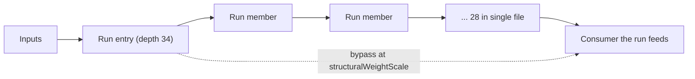

## Summary

Any forward synapse from a low-index neuron to a high-index one already **is** a
skip connection, so the topology has always permitted the residual construction
`x + F(x)`. What was missing is an operator that proposes one _deliberately_ —
`AddConnection` draws its endpoints uniformly, so the output neuron (a target
many draws hit) collects short-circuits while a deep interior run collects none.
#3972 measured exactly that on `test/data/grq-23-forests-constants.json`: fan-in
325 and a one-hop input→output path, against a 28-neuron single-file tail from
depth 34 to 61 with no bypass anywhere along it.

This adds `AddSkipConnection` (`ADD_SKIP_CONN`), which finds the deep serial runs
with #3972's `findSerialChains`, prefers the longest, and connects the run's
entry neuron directly to a neuron the run feeds — at #3970's
`structuralWeightScale`, because a ±0.5 bypass around a tuned run is the same
mistake that issue describes.

| Option               | Default | Meaning                                                                        |
| -------------------- | ------- | ------------------------------------------------------------------------------ |
| `skipConnectionRate` | `0`     | Selection rate for `ADD_SKIP_CONN` in the operator mix; `0` disables it        |
| `skipMinRunLength`   | `4`     | Shortest serial run considered worth bypassing, counted in hidden neurons (≥2) |

**The operator ships off by default and the measurement says why.** Where it is
aimed it works: on the GRQ creature the run's entry neuron had an exactly-zero
gradient on **100% of 64 samples**, and one targeted bypass brings that to
**40.6%**, where a uniformly drawn `AddConnection` at the same weight scale
leaves it at 100%. But the pooled zero-gradient fraction over depths 1–34 does
not move at all, the chain's own aggregate improves only 2.2 points, and on the
trained synthetic parent the score ordering flips between seeds. Both figures are
in `docs/config/MUTATION_ADAPTATION.md` rather than smoothed away.

Closes #3973.

## Evidence

Backend/library change — no web interface to screenshot. The evidence is the
committed harness output and the test suite.



### The depth profile, re-run with skips in place

`deno task bench:skip-null --creature test/data/grq-23-forests-constants.json --profile-only true --samples 64 --skips 4`
— committed verbatim as
[`docs/evidence/skip-connection-null-grq.md`](../../evidence/skip-connection-null-grq.md).
The operator found the 28-member run at depth 34 unaided and bypassed it with one
synapse, `4395 -> 5048`:

| Arm      | Added | Entry neuron zero-gradient | Chain aggregate | Pooled depths 1–34 |
| -------- | ----: | -------------------------: | --------------: | -----------------: |
| baseline |     0 |                     100.0% |           85.0% |              89.4% |
| skip     |     1 |                  **40.6%** |           82.8% |              89.4% |
| random   |     1 |                     100.0% |           85.0% |              89.4% |

The null arm is matched to what the skip arm actually added, so this is one
targeted synapse against one random one at the same weight scale — not three
against one.

**Read the last column honestly.** The pooled figure covers thousands of neurons
at depths 1–34 that already have many depth-parallel routes, so a 28-neuron tail
cannot move it. The chain aggregate moves only slightly because the bypass
restores the route _into_ the chain rather than repairing the zero derivatives
inside it — that is #3974's `ModSquash` work.

### Post-training weight of the added skip synapses

`deno task bench:skip-null --skips 3 --iterations 300 --obs-scale 3 --samples 64`
on a tuned parent with breadth plus a 12-neuron single-file tail — committed as
[`docs/evidence/skip-connection-null-synthetic-seed3973.md`](../../evidence/skip-connection-null-synthetic-seed3973.md)
and
[`...-seed17.md`](../../evidence/skip-connection-null-synthetic-seed17.md):

| Seed | Skip synapse \|w\| birth → trained | Random synapse \|w\| birth → trained | Error after (baseline / skip / random) |
| ---- | ---------------------------------- | ------------------------------------ | -------------------------------------- |
| 3973 | 0.00204 → 0.01505 (7.4×)           | 0.00447 → 0.00383 (0.9×)             | 0.00574 / 0.01645 / 0.01858            |
| 17   | 0.00356 → 0.05927 (16.6×)          | 0.00102 → 0.00323 (3.2×)             | 0.03902 / 0.00751 / 0.03679            |

The bypass is **not** the "accepted but useless" structure #3970 warned about:
backprop grows it by 7× and 17× its birth scale on the two seeds, while the null
arm's synapse stays at or near its own. The dataset error ordering flips between
seeds, which is why no score claim is made and the operator ships disabled.

### Quality gate

`./quality.sh --skip-tests` passes every stage (exit 0: format, lint, bash,
type-check, discovery library build and load, WASM sync). The gate's test lane
cannot run in this container: it requires the native `rust_scorer` binary
(Issue #3871), and there is no `NEAT-AI-scorer` checkout beside this worktree —

```
❌ Native rust_scorer is required (quality.sh default) but was not found.
```

The full suite was therefore run with the gate's own test-lane arguments
(`--parallel --preload test/_preload.ts --v8-flags=--max-old-space-size=8192`,
`NEAT_AI_DISCOVERY_DETERMINISTIC=1`, `NEAT_SCORER_GPU=off`, backprop flags off)
minus the scorer environment. CI builds the scorer from a matched pair and runs
that lane.

## Test Plan

- `test/mutate/AddSkipConnection.ts` (13 tests) — the bypass lands from the run's
  entry to the neuron the run feeds; `skipMinRunLength` is honoured in both
  directions; the longest run wins; the run is found among 40 depth-1 neurons a
  uniform draw would have hit instead; a forward-only creature stays
  forward-only and the guard refuses a backward bypass; the weight honours
  `structuralWeightScale` and is never exactly zero; one bypass per call and
  never a duplicate; a creature with no serial run is left alone; focus lists are
  preferred then relaxed; out-of-range options are refused; and the bypass costs
  the run nothing under `compact()`.
- `test/NEAT/SkipConnectionRate.ts` (8 tests) — the default and an explicit `0`
  reproduce a **golden mutation-selection sequence and the following three RNG
  draws captured from base commit `e02d33af`**, so the zero case is pinned
  against the historical build rather than against itself; rate `1` always
  selects the operator; a fractional rate mixes it in; the operator stays out of
  `Mutation.ALL` and `Mutation.FFW`; a full `Mutator.mutate()` batch adds the
  bypass and leaves the creature valid; `skipMinRunLength` reaches the operator
  through the config; out-of-range config values are refused.
- `bench/skip_connection_null_comparison_test.ts` (11 tests) — the harness's own
  readings: pooled and single-bucket zero-gradient over real profiles, the chain
  aggregate mirroring the probe's, the magnitude summary including the empty
  case, config validation, the three-arm run with the null matched to the skip
  arm, the loud refusal on a creature with no serial run, and the Markdown
  rendering.
