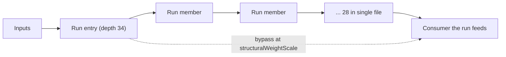

## Summary

Any forward synapse from a low-index neuron to a high-index one already **is** a
skip connection, so the topology has always permitted the residual construction
`x + F(x)`. What was missing is an operator that proposes one _deliberately_ —
`AddConnection` draws its endpoints uniformly, so the output neuron (a target
many draws hit) collects short-circuits while a deep interior run collects none.
#3972 measured exactly that on `test/data/grq-23-forests-constants.json`: fan-in
325 and a one-hop input→output path, against a 28-neuron single-file tail from
depth 34 to 61 with no bypass anywhere along it.

This adds `AddSkipConnection` (`ADD_SKIP_CONN`), which finds the deep serial
runs with #3972's `findSerialChains`, prefers the longest, and connects the
run's entry neuron directly to a neuron the run feeds — at #3970's
`structuralWeightScale`, because a ±0.5 bypass around a tuned run is the same
mistake that issue describes.

| Option               | Default | Meaning                                                                        |
| -------------------- | ------- | ------------------------------------------------------------------------------ |
| `skipConnectionRate` | `0`     | Selection rate for `ADD_SKIP_CONN` in the operator mix; `0` disables it        |
| `skipMinRunLength`   | `4`     | Shortest serial run considered worth bypassing, counted in hidden neurons (≥2) |

**The operator ships off by default and the measurement says why.** Where it is
aimed it works: on the GRQ creature the run's entry neuron had an exactly-zero
gradient on **100% of 64 samples**, and one targeted bypass brings that to
**40.6%**, where a uniformly drawn `AddConnection` at the same weight scale
leaves it at 100%. But the pooled zero-gradient fraction over depths 1–34 does
not move at all, the chain's own aggregate improves only 2.2 points, and on the
trained synthetic parent the score ordering flips between seeds. Both figures
are in `docs/config/MUTATION_ADAPTATION.md` rather than smoothed away.

Closes #3973.

## Evidence

Backend/library change — no web interface to screenshot. The evidence is the
committed harness output and the test suite.



### The depth profile, re-run with skips in place

`deno task bench:skip-null --creature test/data/grq-23-forests-constants.json --profile-only true --samples 64 --skips 4`
— committed as
[`docs/evidence/skip-connection-null-grq.md`](../../evidence/skip-connection-null-grq.md)
(the harness's own output, with `deno fmt` run over the table alignment, which
the repo's format gate requires of every committed Markdown file). The operator
found the 28-member run at depth 34 unaided and bypassed it with one synapse,
`4395 -> 5048`:

| Arm      | Added | Entry neuron zero-gradient | Chain aggregate | Pooled depths 1–34 |
| -------- | ----: | -------------------------: | --------------: | -----------------: |
| baseline |     0 |                     100.0% |           85.0% |              89.4% |
| skip     |     1 |                  **40.6%** |           82.8% |              89.4% |
| random   |     1 |                     100.0% |           85.0% |              89.4% |

The null arm is matched to what the skip arm actually added, so this is one
targeted synapse against one random one at the same weight scale — not three
against one.

**Read the last column honestly.** The pooled figure covers thousands of neurons
at depths 1–34 that already have many depth-parallel routes, so a 28-neuron tail
cannot move it. The chain aggregate moves only slightly because the bypass
restores the route _into_ the chain rather than repairing the zero derivatives
inside it — that is #3974's `ModSquash` work.

### Post-training weight of the added skip synapses

```bash
deno task bench:skip-null --skips 3 --seed 3973 --iterations 300 --obs-scale 3 --samples 64
deno task bench:skip-null --skips 3 --seed 17   --iterations 300 --obs-scale 3 --samples 64
```

on a tuned parent with breadth plus a 12-neuron single-file tail — committed as
[`docs/evidence/skip-connection-null-synthetic-seed3973.md`](../../evidence/skip-connection-null-synthetic-seed3973.md)
and
[`docs/evidence/skip-connection-null-synthetic-seed17.md`](../../evidence/skip-connection-null-synthetic-seed17.md):

| Seed | Skip \|w\| birth → trained | Random \|w\| birth → trained | Error after: baseline / skip / random |
| ---- | -------------------------- | ---------------------------- | ------------------------------------- |
| 3973 | 0.002037 → 0.007213 (3.5×) | 0.004465 → 0.004147 (0.9×)   | 0.004741 / **0.003478** / 0.004780    |
| 17   | 0.003564 → 0.020314 (5.7×) | 0.001024 → 0.004858 (4.7×)   | 0.021469 / 0.019734 / **0.018296**    |

The skip synapse grows during training on both seeds, so the bypass is **not**
the "accepted but useless" structure #3970 warned about — backprop finds a job
for it. The rest is reported as measured, not as hoped: the null arm's synapse
also grows on seed 17 (4.7×), so growth alone does not separate the arms, and
the error ordering **flips between seeds**. No score claim is made, and the
operator ships disabled.

These figures are reproducible: the harness re-seeds before the parent tuning
and before each arm's training, because `trainDir` draws from the global RNG.
Without that, two runs of the same command disagreed — which is how the first
version of this summary came to quote figures its own evidence file did not
carry.

### Quality gate

`./quality.sh --skip-tests` passes every stage (exit 0: format, lint, bash,
type-check, discovery library build and load, WASM sync). The gate's test lane
cannot run in this container: it requires the native `rust_scorer` binary (Issue
#3871), and there is no `NEAT-AI-scorer` checkout beside this worktree —

```
❌ Native rust_scorer is required (quality.sh default) but was not found.
```

The full suite was therefore run with the gate's own test-lane arguments
(`--parallel --preload test/_preload.ts --v8-flags=--max-old-space-size=8192`,
`NEAT_AI_DISCOVERY_DETERMINISTIC=1`, `NEAT_SCORER_GPU=off`, backprop flags off)
minus the scorer environment. CI builds the scorer from a matched pair and runs
that lane.

## Acceptance Criteria

<!-- vibe-spec-review inputs="diff+issue-body" -->

- **met** — `AddSkipConnection` operator with serial-run detection, disabled by
  default — evidence: `src/mutate/AddSkipConnection.ts:84`, default
  `skipConnectionRate: 0` at `src/config/NeatConfig.ts:463`; tests
  `test/mutate/AddSkipConnection.ts::AddSkipConnection - bypasses the run from its entry to the neuron it feeds`
  and
  `test/NEAT/SkipConnectionRate.ts::skipConnectionRate - the operator stays out of Mutation.ALL and FFW`
  — reviewer: met
- **met** — Uses `structuralWeightScale` (#3970) for the new synapse — evidence:
  `src/mutate/AddSkipConnection.ts:174`, wired from config at
  `src/NEAT/Mutator.ts:79`; test
  `test/mutate/AddSkipConnection.ts::AddSkipConnection - the bypass weight honours structuralWeightScale`
  — reviewer: met — reason: the reviewer noted the test only asserted the
  **range**, which a clamped-but-ignored option would also satisfy; it now pins
  the draw against `Synapse.randomWeight(scale)` on the same seed.
- **met** — Forward-only guard exercised by a test on a forward-only creature —
  evidence:
  `test/mutate/AddSkipConnection.ts::AddSkipConnection - a forward-only creature stays forward-only`
  and `::the forward-only guard refuses a backward bypass` — reviewer: met —
  reason: the reviewer added that the operator's own guard call is unreachable
  because candidate selection already rejects `target <= entry`. Kept as defence
  in depth and the guard is exercised directly; the unreachability is now the
  point, not an oversight.
- **met** — Test proving `skipConnectionRate: 0` is identical to current
  behaviour — evidence:
  `test/NEAT/SkipConnectionRate.ts::skipConnectionRate - the default is identical to commit e02d33af`
  and `::an explicit 0 is identical to commit e02d33af`, pinned against a golden
  captured from base commit `e02d33af` — reviewer: met — reason: the reviewer
  independently re-derived the golden on a worktree at `e02d33af` and it matched
  byte for byte.
- **partial** — Null comparison against random `AddConnection` at matched
  **rate** and weight scale — evidence:
  `bench/skip_connection_null_comparison.ts:518` and the two committed evidence
  files — reviewer: partial — reason: the harness matches synapse **count**, not
  a selection **rate** over an evolution run, and every arm adds exactly one
  synapse because the GRQ run's exit has a single consumer. A rate-matched
  population comparison is not built here.
- **met** — Post-skip re-run of #3972's depth profile showing whether the
  upstream zero-gradient fraction fell — evidence:
  `docs/evidence/skip-connection-null-grq.md`; entry neuron 100.0% → 40.6%,
  pooled depths 1–34 unchanged at 89.4% — reviewer: met (weak metric) — reason:
  the reviewer reproduced it independently and flagged that the pooled
  "upstream" figure cannot resolve a 28-neuron effect. Recorded as met because
  the criterion asks for the re-run and the result **whichever way it falls**;
  both the null result and the reason the pooled metric cannot see it are stated
  in `docs/config/MUTATION_ADAPTATION.md`.
- **partial** — Post-training weight distribution of added skip synapses
  reported — evidence:
  `docs/evidence/skip-connection-null-synthetic-seed{3973,17}.md` — reviewer:
  partial — reason: it is a distribution of n=1 per arm on the synthetic parent;
  the GRQ creature is profiled but never trained, so no post-training weight
  exists for it. The seed-17 inconsistency the reviewer found was real and is
  fixed: the harness now re-seeds before training and both files were
  regenerated.
- **partial** — Proposed step 2: serial runs as consecutive-depth hidden neurons
  **with fan-out 1** — evidence: `src/propagate/SerialChains.ts:71` via
  `src/mutate/AddSkipConnection.ts:110` — reviewer: partial — reason: detection
  reuses #3972's landed **depth-occupancy** definition, which that module
  documents as deliberately not fan-out. Reusing it keeps one owner for "what a
  serial run is"; the difference is now stated in the docs.
- **partial** — Proposed step 3: prefer runs whose zero-gradient fraction is
  high, once #3972 lands — evidence: `src/mutate/AddSkipConnection.ts:144` sorts
  by length then depth — reviewer: partial — reason: reading that fraction needs
  input samples a mutation operator is never given and a forward plus reverse
  sweep per sample, which cannot ride on every mutation. Declined deliberately,
  documented in the module header and a docs `[!NOTE]`, and measured in the
  bench harness instead.
- **met** — Forward-only lineages stay forward-only, exercised rather than
  relied upon — evidence: as above, plus
  `test/mutate/AddSkipConnection.ts::a back-edge off the run is never mistaken for a consumer`
  — reviewer: met
- **met** — Check the added fan-out does not change a fan-out-1 neuron's
  eligibility in `compact/` paths — evidence:
  `test/mutate/AddSkipConnection.ts::the bypass does not make the run compactable`
  — reviewer: partial — reason: departed from the reviewer's verdict after
  fixing what it found. The test used `LOGISTIC`, for which `compact()` returns
  `undefined` in both arms, so it could not fail; it now uses `IDENTITY`,
  asserts compaction actually fired, and compares the bypassed arm against the
  control.
- **met** — One skip per run per mutation — evidence:
  `src/mutate/AddSkipConnection.ts:162` takes `candidates()[0]` only; test
  `::adds one bypass per call and never a duplicate` — reviewer: met
- **partial** — Failure detection: watch for the operator becoming a growth pump
  — evidence: #3971's telemetry keys on the operator name, so `ADD_SKIP_CONN`
  counters come for free; the exposure is documented in a `[!NOTE]` in
  `docs/config/MUTATION_ADAPTATION.md` — reviewer: partial — reason: the rate is
  applied before the large-creature topology-expansion suppression and MCMC
  accepts structural mutations unconditionally, so a high rate on a large
  creature is undamped growth. No cap is added — the issue does not ask for one
  and the operator is off by default — but the hazard is now written down rather
  than left implicit.
- **met** — `skipConnectionRate: 0` bit-identical on a fixed seed — evidence: as
  above — reviewer: met
- **unrequested** — Focus-list preference-then-relaxation
  (`src/mutate/AddSkipConnection.ts:151`) — reviewer: unrequested — reason:
  every other operator in `src/mutate/` honours `focusList`; an operator that
  ignored it would behave differently from its siblings under the same config.
- **unrequested** — Public `candidates()` and exported `SkipCandidate`
  (`src/mutate/AddSkipConnection.ts:105`) — reviewer: unrequested — reason: the
  targeting _is_ the issue, so it has to be assertable without mutating a
  creature; the bench harness and eight of the tests read it.
- **unrequested** — `constant`-target and self-loop exclusions
  (`src/mutate/AddSkipConnection.ts:128`) — reviewer: unrequested — reason:
  `AddConnection` excludes the same endpoints; without them the operator can
  propose a synapse `connect()` refuses.
- **unrequested** — `src/mutate/SkipConnectionOptions.ts` validation layer —
  reviewer: unrequested — reason: the operator is constructible directly, so its
  own options need their own range check; the duplicated `structuralWeightScale`
  check the standards reviewer found is now delegated to #3970's resolver.
- **unrequested** — `ADD_SKIP_CONN` added to
  `MetropolisHastings.isTopologyMutation` — reviewer: unrequested — reason:
  without it a structural mutation would be treated as a weight/bias one and M-H
  would compare weight penalties across a topology change. Its consequence
  (unconditional acceptance) is the documented hazard above.
- **unrequested** — Bench harness beyond the bare comparison (synthetic parent
  generator, CLI flags, `bench/skip_connection_null_comparison_test.ts`) —
  reviewer: unrequested — reason: the null comparison needs a creature with both
  breadth and a deep run to be fair, and evidence-producing code is tested like
  any other code in this repo.
- **unrequested** — Documentation volume (`MUTATION_ADAPTATION.md`,
  `CONFIGURATION.md`, `EVOLUTION.md`, `CHANGELOG.md`, evidence files) and
  plumbing (`deno task bench:skip-null`, `optionAuditRollup` entries, the
  `AuditOptionUsage` 109 → 111 pin) — reviewer: unrequested — reason: required
  by this repo's own gates and the "a code change owes a docs change" rule; the
  option-count pin fails the build otherwise.

## Standards Review

<!-- vibe-standards-review inputs="diff+CODING-STANDARDS.md" -->

Standards for this repo live in `AGENTS.md` and
`docs/ENGINEERING_PRINCIPLES.md`; the reviewer was given the diff and both.

- **violation** — the harness replaced the global RNG and never restored it —
  evidence: `bench/skip_connection_null_comparison.ts:461` — reason: fixed.
  `runSkipNullComparison` now captures and restores the caller's RNG in a
  `finally`, and
  `bench/skip_connection_null_comparison_test.ts::runSkipNullComparison - leaves the caller's RNG in place`
  pins it.
- **violation** — harness tests mutated global RNG state without
  `withRngTestLock` — evidence:
  `bench/skip_connection_null_comparison_test.ts:174` — reason: fixed; every
  test that reaches the RNG now holds the lock.
- **violation** — the vacuous-result guard was incomplete: a run shorter than
  `skipMinRunLength` produced three identical arms and exit 0 — evidence:
  `bench/skip_connection_null_comparison.ts:526` — reason: fixed; an empty skip
  arm now throws, covered by
  `::runSkipNullComparison - refuses a run it cannot bypass`.
- **violation** — `structuralWeightScale` validation was copied from #3970 —
  evidence: `src/mutate/SkipConnectionOptions.ts:69` — reason: fixed; it
  delegates to `resolveStructuralMutationOptions`, which owns that field.
- **violation** — five helpers duplicated the sibling sweep harness
  (`trainCreature`, `datasetError`, `pct`, `summariseMagnitudes` + inline
  median, `buildTask`) — evidence:
  `bench/skip_connection_null_comparison.ts:271,365,403` — reason: fixed; all
  five now come from `bench/structural_weight_scale_sweep.ts` (three gained an
  `export`, which is the only change to that file). `fmt` stays local, with the
  reason stated in place: the sweep's four-decimal formatter renders a `1e-3`
  weight as `2.04e-3`.
- **violation** — the docs quoted seed-17 figures its own evidence file did not
  carry — evidence: `docs/config/MUTATION_ADAPTATION.md:400` — reason: fixed,
  and the root cause with it. `trainDir` draws from the global RNG, so the
  trained arm was not reproducible; the harness now re-seeds before the parent
  tuning and before each arm's training, both evidence files were regenerated,
  and every quoted figure was re-read from them.
- **violation** — the report header omitted `iterations`, so the trained
  evidence was not reproducible from its own provenance line — evidence:
  `bench/skip_connection_null_comparison.ts:589` — reason: fixed; the header
  names the epoch count, or says `profile only (no training arm)`, and the docs
  give the exact command for each committed evidence file.
- **violation** — `test/NEAT/SkipConnectionRate.ts` pins the raw RNG draw stream
  rather than behaviour — evidence: `test/NEAT/SkipConnectionRate.ts:91` —
  reason: stands, deliberately. The issue asks for bit-identity on a fixed seed,
  and only the draw stream demonstrates "consumes no randomness". The cost — a
  legitimate change to the mutation mix breaks these two tests — is now stated
  in the file header along with how to regenerate the golden.
- **violation** — duplicate `chainCreature` fixture across two test files —
  evidence: `test/NEAT/SkipConnectionRate.ts:110` — reason: fixed; both import
  `test/mutate/_chainCreature.ts`.
- **violation** — the `docs/api/EVOLUTION.md` operator table was not updated —
  evidence: `docs/api/EVOLUTION.md:365` — reason: no change needed; the reviewer
  diffed before commit `f4b01832`, which adds that row and the preset note. It
  is in the branch.
- **clean** — Australian English throughout code, comments and docs; import-map
  aliases (`@mutate/`, `@propagate/`, `@config/`, `@errors/`, `@utils/`) with
  relative imports only where no alias exists; no timing APIs or wall-clock
  assertions in the new tests (32 tests in ~330 ms); tests exercise real
  topologies, real `compact()`, real `Mutator.mutate()` and real gradient
  profiles rather than source text; no hidden files or credentials staged;
  neuron UUID and semantic-version invariants untouched; fail-loud typed
  `ConfigurationError`s in `src/`; no new `console.*` under `src/`; run
  detection genuinely reuses `findSerialChains`/`probeGradientDepth` rather than
  reimplementing them; `CHANGELOG.md`, `docs/api/CONFIGURATION.md` and the
  option audit roll-up all updated alongside the code.

## Test Plan

- `test/mutate/AddSkipConnection.ts` (14 tests) — the bypass lands from the
  run's entry to the neuron the run feeds; `skipMinRunLength` is honoured in
  both directions; the longest run wins; the run is found among 40 depth-1
  neurons a uniform draw would have hit instead; a forward-only creature stays
  forward-only and the guard refuses a backward bypass; the weight honours
  `structuralWeightScale` and is never exactly zero; one bypass per call and
  never a duplicate; a creature with no serial run is left alone; focus lists
  are preferred then relaxed; out-of-range options are refused; the bypass costs
  the run nothing under `compact()` (on an `IDENTITY` fixture, where compaction
  genuinely fires); and — the regression test for the bug the spec review found
  — a **back-edge** off the run's exit is never mistaken for a neuron the run
  feeds, which used to put the "bypass" inside the chain on a recurrent lineage.
- `test/NEAT/SkipConnectionRate.ts` (8 tests) — the default and an explicit `0`
  reproduce a **golden mutation-selection sequence and the following three RNG
  draws captured from base commit `e02d33af`**, so the zero case is pinned
  against the historical build rather than against itself; rate `1` always
  selects the operator; a fractional rate mixes it in; the operator stays out of
  `Mutation.ALL` and `Mutation.FFW`; a full `Mutator.mutate()` batch adds the
  bypass and leaves the creature valid; `skipMinRunLength` reaches the operator
  through the config; out-of-range config values are refused.
- `bench/skip_connection_null_comparison_test.ts` (14 tests) — the harness's own
  readings: pooled and single-bucket zero-gradient over real profiles, the chain
  aggregate mirroring the probe's, the magnitude summary including the empty
  case, config validation, the three-arm run with the null matched to the skip
  arm, the loud refusals on a creature with no serial run and on a run it cannot
  bypass, the caller's RNG being restored, and the Markdown rendering including
  the epoch count a trained report depends on.
- `test/mutate/_chainCreature.ts` — the single-file-run fixture both suites
  share, extracted after the standards review found it duplicated.
