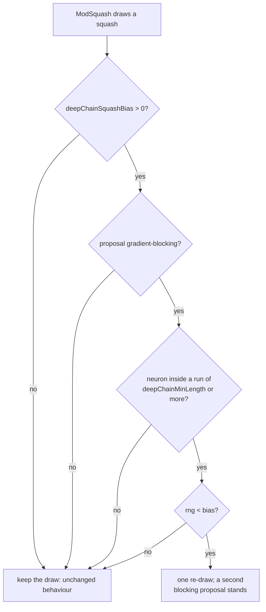

## Summary

`ModSquash` draws a replacement activation from a pool that knows nothing about
where the neuron sits. Inside a **serial run** — the structure #3972 identified,
where a depth level holds exactly one neuron and there is no depth-parallel
route around it — an activation with an exactly-zero derivative region zeroes
the gradient for every member upstream of it.

The issue asked for the cheap check first, and only then the rule. Both are
here, and so is the honest outcome of the mechanism check. Closes #3974.

**Step 1 — the existing tracker cannot see the run.** #2457's
`SquashEffectivenessTracker` buckets a neuron by `layer × fan-in` and by nothing
else, so chain membership is not expressible in a role _at all_: a run member
and an ordinary mid-depth neuron of the same fan-in are one role however many
samples are collected. Measured on the GRQ creature, the run's 26 hidden members
land in three `mid` roles holding 1,229 mutable neurons between them — 0.8–3.4%
of each. Tuning `minSamples` or `boltzmannBeta` cannot recover a distinction the
key does not carry, so Step 2 was built.

**Step 2 — a bias, not a ban, off by default.**

| Option                | Default | Meaning                                                                     |
| --------------------- | ------- | --------------------------------------------------------------------------- |
| `deepChainSquashBias` | `0`     | Probability that a gradient-blocking proposal inside a long run is re-drawn |
| `deepChainMinLength`  | `4`     | Run length at which the bias applies — #3973's `skipMinRunLength` shape     |

A blocking proposal is re-drawn **once**; a second blocking proposal stands, so
nothing leaves the search space and no existing neuron is rewritten. What counts
as blocking is **measured, not listed**: `GradientBlocking.ts` walks each
activation's own `derivative()` over a fixed grid and calls it blocking when
more than half of it is exactly zero (`STEP` and `BIPOLAR` 1.0, `HARD_TANH`
0.875, `ReLU6` 0.625, `ReLU` exactly 0.5 and therefore not blocking, matching
the issue's own pool split; `ReLU6` is not on the issue's list and is
down-weighted anyway because the rule follows the derivatives). `IF` / `MINIMUM`
/ `MAXIMUM` expose no scalar derivative and gate the gradient onto one branch,
so they are blocking by construction — and a new selectable activation with no
derivative fails the classification test rather than being silently treated as
safe.

**The mechanism is refuted on the GRQ creature, and that is reported rather than
smoothed away.** The bias changes what is proposed — 5.8% blocking → 0.8% where
it is aimed — but the run's zero-gradient fraction does not fall: 64.4%
baseline, 66.0% biased, and **88.9% with every run member set to `TANH`**. The
probe blames `downstream-zero` for the bulk of it: the gradient arriving at a
run member is already zero when it gets there, so no squash chosen inside the
run can restore it. Per the issue's own failure rule, the option therefore ships
disabled and any score change under it would be coincidence.

## Evidence

Backend/library change — no web interface to screenshot. The evidence is the
committed harness output and the test suite.



Reproduce every figure below with:

```bash
deno task bench:squash-bias --step1 true \
  --output docs/evidence/deep-chain-squash-bias-3974-step1.md
deno task bench:squash-bias --focus chain --mutations 100 --population 4 \
  --samples 16 --output docs/evidence/deep-chain-squash-bias-3974-chain.md
deno task bench:squash-bias --focus any --mutations 2000 --population 4 \
  --samples 16 --seed 17 \
  --output docs/evidence/deep-chain-squash-bias-3974-uniform.md
```

### Step 1 — what the tracker's roles can see

[`docs/evidence/deep-chain-squash-bias-3974-step1.md`](../../evidence/deep-chain-squash-bias-3974-step1.md)

| Role                    | Mutable neurons | In the run | Run share |
| ----------------------- | --------------: | ---------: | --------: |
| `mid｜medium`           |             599 |          5 |      0.8% |
| `mid｜low`              |             368 |         12 |      3.3% |
| `mid｜high`             |             262 |          9 |      3.4% |
| `output-adjacent｜low`  |               1 |          1 |    100.0% |
| `output-adjacent｜high` |               1 |          1 |    100.0% |

The percentages are the statistical half; the structural half is decisive and is
pinned by `test/NEAT/DeepChainBucketVisibility.ts` — the role key carries no
chain term, so the tracker cannot express the distinction at any sample count.

### The mechanism, aimed at the run

[`docs/evidence/deep-chain-squash-bias-3974-chain.md`](../../evidence/deep-chain-squash-bias-3974-chain.md)
— 400 draws that landed on run members, per arm:

| Arm      | Blocking proposals | Blocking members left | Run zero-gradient |
| -------- | -----------------: | --------------------: | ----------------: |
| baseline |    23 / 400 (5.8%) |                     2 |             64.4% |
| biased   |     3 / 400 (0.8%) |                     1 |             66.0% |
| ceiling  |                  0 |                     0 |         **88.9%** |

The `ceiling` arm takes no draws at all — every run member is set to `TANH` —
and bounds what _any_ squash-level intervention could achieve on this creature.
It is worse than both, which is the refutation: the run's zeros do not come from
its members' activations.

| Cause (run aggregate) | baseline | biased | ceiling |
| --------------------- | -------: | -----: | ------: |
| `downstream-zero`     |      299 |    297 |     391 |
| `zero-derivative`     |       64 |     73 |     153 |
| `untaken-if-branch`   |       14 |     13 |       0 |

### Diversity, at production odds

[`docs/evidence/deep-chain-squash-bias-3974-uniform.md`](../../evidence/deep-chain-squash-bias-3974-uniform.md)
— 8,000 uniformly drawn squash mutations per arm, matched seed:

| Arm      | Blocking proposals | Squash histogram entropy | Distinct squashes | Species diversity |
| -------- | -----------------: | -----------------------: | ----------------: | ----------------: |
| baseline |                503 |               4.701 bits |                36 |             1.000 |
| biased   |                499 |               4.703 bits |                36 |             1.000 |

At GRQ scale a blocking proposal landing on a run member is ~0.05% of draws, so
the bias changed 4 of 8,000 mutations. The diversity risk the issue named is
therefore not realised — for the same reason the effect is not either.

### Quality gate

`./quality.sh --skip-tests` passes every stage (exit 0: dependencies, format,
lint, bash, type-check, discovery library build and load, WASM sync). The gate's
test lane cannot run in this container: it requires the native `rust_scorer`
binary (Issue #3871) and there is no `NEAT-AI-scorer` checkout beside this
worktree —

```
❌ Native rust_scorer is required (quality.sh default) but was not found.
```

The full suite was therefore run with the gate's own test-lane arguments
(`--parallel --preload test/_preload.ts --v8-flags=--max-old-space-size=8192`,
`NEAT_AI_DISCOVERY_DETERMINISTIC=1`, `NEAT_SCORER_GPU=off`, backprop flags off)
minus the scorer environment: **9,177 passed, 0 failed, 52 ignored**. CI builds
the scorer from a matched pair and runs that lane.

## Test Plan

- `test/mutate/DeepChainSquashBias.ts` — the operator's behaviour: a golden
  squash sequence captured from the **previous** `ModSquash` (`HEAD~`) that
  `deepChainSquashBias: 0` must reproduce exactly, including the next RNG draw;
  the bias cutting blocking proposals inside a long run; a blocking squash still
  reaching the pool (bias, not ban); a run below `deepChainMinLength` untouched;
  `deepChainMinLength` lowering the bar; a neuron outside any run untouched; and
  option validation.
- `test/methods/activations/GradientBlocking.ts` — the measured classification
  (`HARD_TANH` 0.875, `STEP` 1.0, `ReLU` exactly 0.5 and not blocking), the
  gating aggregates, alias resolution, a loud failure on an unknown name, and a
  drift guard that fails when a new selectable activation has neither a scalar
  derivative nor a recorded gating entry, plus a robustness case proving no
  registered activation throws while being classified — `ModSquash` calls the
  classifier on every proposal under a live bias.
- `test/NEAT/DeepChainBucketVisibility.ts` — Step 1: on the GRQ creature a run
  member and an ordinary mid-depth neuron of the same fan-in resolve to the same
  tracker role.
- `test/NEAT/DeepChainSquashBiasConfig.ts` — the config defaults, out-of-range
  values failing loud, and the knob reaching `ModSquash` through the `Mutator`.
- `test/propagate/SerialChains.ts` — `serialChainLengthAt` reports the run a
  neuron sits in, and `0` for a neuron with a depth-parallel sibling.
- `bench/deep_chain_squash_bias_test.ts` — the harness's own summarising:
  entropy, depth pooling, config refusal, and the Step 1 role-visibility
  measurement.
