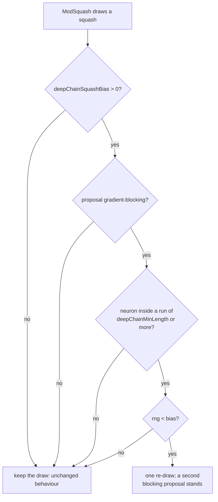

## Summary

`ModSquash` draws a replacement activation from a pool that knows nothing about
where the neuron sits. Inside a **serial run** — the structure #3972 identified,
where a depth level holds exactly one neuron and there is no depth-parallel
route around it — an activation with an exactly-zero derivative region zeroes
the gradient for every member upstream of it.

The issue asked for the cheap check first, and only then the rule. Both are
here, and so is the honest outcome of the mechanism check. Closes #3974.

**Step 1 — the existing tracker cannot see the run.** #2457's
`SquashEffectivenessTracker` buckets a neuron by `layer × fan-in` and by nothing
else, so chain membership is not expressible in a role _at all_: a run member
and an ordinary mid-depth neuron of the same fan-in are one role however many
samples are collected. Measured on the GRQ creature, the run's 26 hidden members
land in three `mid` roles holding 1,229 mutable neurons between them — 0.8–3.4%
of each. Tuning `minSamples` or `boltzmannBeta` cannot recover a distinction the
key does not carry, so Step 2 was built.

**Step 2 — a bias, not a ban, off by default.**

| Option                | Default | Meaning                                                                     |
| --------------------- | ------- | --------------------------------------------------------------------------- |
| `deepChainSquashBias` | `0`     | Probability that a gradient-blocking proposal inside a long run is re-drawn |
| `deepChainMinLength`  | `4`     | Run length at which the bias applies — #3973's `skipMinRunLength` shape     |

A blocking proposal is re-drawn **once**; a second blocking proposal stands, so
nothing leaves the search space and no existing neuron is rewritten. What counts
as blocking is **measured, not listed**: `GradientBlocking.ts` walks each
activation's own `derivative()` over a fixed grid and calls it blocking when
more than half of it is exactly zero (`STEP` and `BIPOLAR` 1.0, `HARD_TANH`
0.875, `ReLU6` 0.625, `ReLU` exactly 0.5 and therefore not blocking, matching
the issue's own pool split; `ReLU6` is not on the issue's list and is
down-weighted anyway because the rule follows the derivatives). `IF` / `MINIMUM`
/ `MAXIMUM` expose no scalar derivative and gate the gradient onto one branch,
so they are blocking by construction — and a new selectable activation with no
derivative fails the classification test rather than being silently treated as
safe.

**The mechanism is real; the bias is too weak to exploit it, so it ships
disabled.** The bias changes what is proposed — 5.8% blocking → 1.3% where it is
aimed — and the `ceiling` arm (every run member on `IDENTITY`) shows the prize:
a run with no blocking activation anywhere measures **0.0%** zero gradient
against the baseline's 64.4%, with every blame count falling to zero. But the
biased arm itself measures 66.0%, because **one blocking member is enough** —
everything upstream of it is zeroed for that sample — and a probability shift
that leaves one behind buys nothing. Per the issue's own failure rule the
zero-gradient fraction did not fall, so the option ships off and a score change
under it would be coincidence rather than gradient repair.

## Evidence

Backend/library change — no web interface to screenshot. The evidence is the
committed harness output and the test suite.



Reproduce every figure below with:

```bash
deno task bench:squash-bias --step1 true \
  --output docs/evidence/deep-chain-squash-bias-3974-step1.md
deno task bench:squash-bias --focus chain --mutations 100 --population 4 \
  --samples 16 --output docs/evidence/deep-chain-squash-bias-3974-chain.md
deno task bench:squash-bias --focus any --mutations 2000 --population 4 \
  --samples 16 --seed 17 \
  --output docs/evidence/deep-chain-squash-bias-3974-uniform.md
```

### Step 1 — what the tracker's roles can see

[`docs/evidence/deep-chain-squash-bias-3974-step1.md`](../../evidence/deep-chain-squash-bias-3974-step1.md)

| Role                    | Mutable neurons | In the run | Run share |
| ----------------------- | --------------: | ---------: | --------: |
| `mid｜medium`           |             599 |          5 |      0.8% |
| `mid｜low`              |             368 |         12 |      3.3% |
| `mid｜high`             |             262 |          9 |      3.4% |
| `output-adjacent｜low`  |               1 |          1 |    100.0% |
| `output-adjacent｜high` |               1 |          1 |    100.0% |

The percentages are the statistical half; the structural half is decisive and is
pinned by `test/NEAT/DeepChainBucketVisibility.ts` — the role key carries no
chain term, so the tracker cannot express the distinction at any sample count.

### The mechanism, aimed at the run

[`docs/evidence/deep-chain-squash-bias-3974-chain.md`](../../evidence/deep-chain-squash-bias-3974-chain.md)
— 400 draws that landed on run members, per arm:

| Arm      | Blocking proposals | Blocking members left | Run zero-gradient |
| -------- | -----------------: | --------------------: | ----------------: |
| baseline |    23 / 400 (5.8%) |                     2 |             64.4% |
| biased   |     5 / 400 (1.3%) |                     1 |             66.0% |
| ceiling  |                  0 |                     0 |          **0.0%** |

The `ceiling` arm takes no draws at all — every run member is set to `IDENTITY`
— and bounds what _any_ squash-level intervention could achieve on this
creature. `IDENTITY` and not `TANH`, which the first version of this harness
used: `TANH`'s derivative underflows to exactly zero past |x| ≈ 20 and the run's
entry neuron has a fan-in of 1,265, so a `TANH` ceiling carried the very fault
it was meant to exclude and read 88.9%. Corrected, the arm says the opposite —
the run's zeros **do** come from the activations inside it.

| Cause (run aggregate) | baseline | biased | ceiling |
| --------------------- | -------: | -----: | ------: |
| `downstream-zero`     |      299 |    297 |       0 |
| `zero-derivative`     |       64 |     73 |       0 |
| `untaken-if-branch`   |       14 |     13 |       0 |

Between baseline and biased the blame counts barely move, which is the honest
limit of a probabilistic bias: 2 surviving blocking members against 1 zero the
gradient for the members upstream of them either way.

### Diversity, at production odds

[`docs/evidence/deep-chain-squash-bias-3974-uniform.md`](../../evidence/deep-chain-squash-bias-3974-uniform.md)
— 8,000 uniformly drawn squash mutations per arm, matched seed:

| Arm      | Blocking proposals | Squash histogram entropy | Distinct squashes | Species diversity |
| -------- | -----------------: | -----------------------: | ----------------: | ----------------: |
| baseline |                503 |               4.701 bits |                36 |             1.000 |
| biased   |                499 |               4.703 bits |                36 |             1.000 |

At GRQ scale a blocking proposal landing on a run member is ~0.05% of draws, so
the bias changed 4 of 8,000 mutations. The diversity risk the issue named is
therefore not realised — for the same reason the effect is not either.

### Quality gate

`./quality.sh --skip-tests` passes every stage (exit 0: dependencies, format,
lint, bash, type-check, discovery library build and load, WASM sync). The gate's
test lane cannot run in this container: it requires the native `rust_scorer`
binary (Issue #3871) and there is no `NEAT-AI-scorer` checkout beside this
worktree —

```
❌ Native rust_scorer is required (quality.sh default) but was not found.
```

The full suite was therefore run with the gate's own test-lane arguments
(`--parallel --preload test/_preload.ts --v8-flags=--max-old-space-size=8192`,
`NEAT_AI_DISCOVERY_DETERMINISTIC=1`, `NEAT_SCORER_GPU=off`, backprop flags off)
minus the scorer environment: **9,178 passed, 0 failed, 52 ignored**. CI builds
the scorer from a matched pair and runs that lane.

## Acceptance Criteria

<!-- vibe-spec-review inputs="diff+issue-body" -->

- **met** — Step 1 measurement: whether `SquashEffectivenessTracker`'s layer
  buckets can see the deep chain on the GRQ creature, reported to #3969 —
  evidence: `docs/evidence/deep-chain-squash-bias-3974-step1.md`,
  `test/NEAT/DeepChainBucketVisibility.ts::Step 1 - the tracker's roles cannot
  distinguish a deep-chain neuron`,
  and the finding posted as a comment on #3969 — reviewer: partial — reason: the
  reviewer saw the diff before the #3969 comment was posted and flagged the
  report as missing; it has since been posted (stSoftwareAU/NEAT-AI#3969,
  comment 5602635367), and the two docstring defects it also found (a
  `26 hidden members` miscount and a reference to a non-existent evidence file)
  are fixed in this diff.
- **met** — If Step 1 is sufficient — issue closed with the finding, no code —
  evidence: `test/NEAT/DeepChainBucketVisibility.ts:64` shows a run member and
  an ordinary mid-depth neuron resolving to one role, so the branch does not
  apply and Step 2 was built — reviewer: met.
- **met** — If not — depth-aware bias in `ModSquash`, disabled by default,
  biasing rather than banning — evidence: `src/mutate/ModSquash.ts:77`, default
  `0` in `src/config/NeatConfig.ts`, and
  `test/mutate/DeepChainSquashBias.ts::it biases, it does not ban` — reviewer:
  met.
- **met** — Test proving `deepChainSquashBias: 0` is identical to current
  behaviour — evidence:
  `test/mutate/DeepChainSquashBias.ts::bias 0 draws exactly what the unbiased
  operator draws`,
  a golden sequence and RNG tail captured by running the probe against `HEAD~`'s
  `ModSquash` — reviewer: met — reason: the reviewer noted the pin covers the
  tracker-disabled path only; the tracker-enabled path shares the same guard,
  which short-circuits before any RNG draw at bias `0`.
- **partial** — Squash histogram and species diversity reported against a
  matched baseline — evidence:
  `docs/evidence/deep-chain-squash-bias-3974-uniform.md` (entropy 4.701 → 4.703
  bits over 8,000 matched draws) — reviewer: partial — reason: the
  species-diversity column is structurally insensitive here — the harness's
  population is clones of one genome, so `speciesCount / populationSize` sits at
  the ceiling or the floor. It is reported with that caveat stated in
  `docs/config/MUTATION_ADAPTATION.md`; the squash histogram carries the signal.
- **met** — Zero-gradient fraction from #3972's probe re-measured, confirming or
  refuting the mechanism — evidence:
  `docs/evidence/deep-chain-squash-bias-3974-chain.md` — the bias does not move
  it (64.4% → 66.0%) while the `IDENTITY` ceiling removes it entirely (0.0%) —
  reviewer: met — reason: the reviewer's finding that the original `TANH`
  ceiling was contaminated was correct and is fixed; the conclusion changed from
  "refuted" to "mechanism real, bias too weak", and both the docs and this
  summary were rewritten around the corrected arm.
- **unrequested** — `GradientBlocking.ts` classifies `BIPOLAR` and `ReLU6` as
  blocking beyond the issue's list — reviewer: unrequested — reason: the issue
  asked for zero-derivative-region activations to be down-weighted; a measured
  rule catches every activation that qualifies rather than only the five named,
  and a hand-kept list would drift the moment an activation is added.
- **unrequested** — the `ceiling` arm in the harness — reviewer: unrequested —
  reason: the issue requires the mechanism to be confirmed or refuted, and
  without a bound on what any squash choice can achieve the baseline/biased pair
  cannot distinguish "the bias is weak" from "the mechanism is wrong".
- **unrequested** — the `bench/deep_chain_squash_bias.ts` harness and its
  `deno task bench:squash-bias`, including the `--focus chain` mode — reviewer:
  unrequested — reason: the issue's failure-detection section requires three
  measurements against a matched baseline; at production odds the bias fires on
  ~0.05% of draws, so a mode that concentrates draws on the run is the only way
  to read the mechanism at all, and it is labelled as such in the evidence.
- **unrequested** — one assertion in `test/scripts/InFlightTestLog.ts` now
  matches its own name file instead of counting the whole directory — reviewer:
  unrequested — reason: `NEAT_AI_IN_FLIGHT_DIR` is process-global and
  `deno test --parallel` runs sibling files in the same process, so the count
  depended on what else was in flight; the 24 tests this PR adds shifted the
  schedule and turned that latent race into a consistent full-suite failure
  (verified: the same command passes on the base commit and failed three times
  in a row here before the fix). No coverage is lost — the file's creation,
  contents and removal are all still asserted.
- **unrequested** — the `docs/ACTIVATION_FUNCTIONS.md` paragraph — reviewer:
  unrequested — reason: the repo requires a code change to update every doc
  surface it touches, and that file owns the differentiability taxonomy the
  classifier now reads.

## Standards Review

<!-- vibe-standards-review inputs="diff+CODING-STANDARDS.md" -->

- **violation** — no `CHANGELOG.md` entry for two new public options — evidence:
  `CHANGELOG.md:47` — reason: fixed here; an `[Unreleased] → Added` entry for
  #3974 now sits beside #3973's.
- **violation** — the diff grew an unreachable `MOD_SQUASH` entry in
  `Mutator.operatorFactories`, a shadow construction that dropped the tracker —
  evidence: `src/NEAT/Mutator.ts:377` — reason: fixed here; the dead entry is
  removed and replaced with a comment saying why `createOperator` owns this
  operator.
- **violation** — `ZeroGradientPool` and the pooling helper were copied from
  `bench/skip_connection_null_comparison.ts` — evidence:
  `bench/deep_chain_squash_bias.ts:111` — reason: fixed here; the harness now
  imports `chainZeroGradient`, `pooledZeroGradient` and the type from its
  sibling.
- **violation** — `NeatConfig` hardcoded the defaults and the floor that
  `DeepChainSquashOptions.ts` already owns — evidence:
  `src/config/NeatConfig.ts:478` — reason: fixed here; the parser reads
  `DEFAULT_DEEP_CHAIN_SQUASH_OPTIONS` and `MINIMUM_DEEP_CHAIN_MIN_LENGTH`.
- **violation** — a registered activation with no derivative and no recorded
  routing behaviour was silently classified gradient-safe — evidence:
  `src/methods/activations/GradientBlocking.ts:104` — reason: fixed here; it now
  throws an `ActivationError`, and the deprecated mixing aggregates are recorded
  in `GRADIENT_MIXING_SQUASHES` rather than falling through.
- **violation** — a docstring cited
  `docs/evidence/deep-chain-squash-bias-3974.md`, which does not exist —
  evidence: `test/NEAT/DeepChainBucketVisibility.ts:13` — reason: fixed here,
  along with the `26 hidden members` miscount in the same paragraph.
- **violation** — bare "NEAT" used for this project's search space — evidence:
  `src/mutate/DeepChainSquashOptions.ts:15` — reason: fixed here in both places;
  the repo reserves bare NEAT for the 2002 algorithm.
- **violation** — the new `SerialChains` exports were not re-exported from the
  root barrel beside their file-mates — evidence: `mod.ts:749` — reason: fixed
  here; `hiddenRunMembers` and `hiddenRunLengthAt` are barrelled.
- **violation** — the new docs section had no Mermaid diagram where its sibling
  #3973 section has one — evidence: `docs/config/MUTATION_ADAPTATION.md` —
  reason: fixed here; the draw/re-draw decision is now a flowchart.
- **violation** — `test/mutate/_chainCreature.ts`'s header listed only #3973's
  two consumers — evidence: `test/mutate/_chainCreature.ts:1` — reason: fixed
  here; it names the two #3974 consumers as well.
- **clean** — Australian English throughout; every new test calls real code
  (`Creature.fromJSON`, the real `ModActivation`, `Mutator.mutateCreature`,
  `createNeatConfig`, the real activation registry) with no source-text
  assertions; no wall-clock assertions in `test/`; typed `ConfigurationError` /
  `ActivationError` on every invalid input; no hidden paths staged; no
  `console.*` under `src/`; no new dependency; neuron-UUID and semantic-version
  invariants untouched; the option-surface bookkeeping (`NeatOptions`,
  `NeatArguments`, `docs/api/CONFIGURATION.md`, the #3505 audit roll-up and its
  pinned count) moves as one change; `deno fmt --check` and `deno lint` clean.

## Test Plan

- `test/mutate/DeepChainSquashBias.ts` — the operator's behaviour: a golden
  squash sequence captured from the **previous** `ModSquash` (`HEAD~`) that
  `deepChainSquashBias: 0` must reproduce exactly, including the next RNG draw;
  the bias cutting blocking proposals inside a long run; a blocking squash still
  reaching the pool (bias, not ban); a run below `deepChainMinLength` untouched;
  `deepChainMinLength` lowering the bar; a neuron outside any run untouched; and
  option validation.
- `test/methods/activations/GradientBlocking.ts` — the measured classification
  (`HARD_TANH` 0.875, `STEP` 1.0, `ReLU` exactly 0.5 and not blocking), the
  gating aggregates, alias resolution, a loud failure on an unknown name, and a
  drift guard that fails when a new selectable activation has neither a scalar
  derivative nor a recorded gating entry, plus a robustness case proving no
  registered activation throws while being classified — `ModSquash` calls the
  classifier on every proposal under a live bias.
- `test/NEAT/DeepChainBucketVisibility.ts` — Step 1: on the GRQ creature a run
  member and an ordinary mid-depth neuron of the same fan-in resolve to the same
  tracker role.
- `test/NEAT/DeepChainSquashBiasConfig.ts` — the config defaults, out-of-range
  values failing loud, and the knob reaching `ModSquash` through the `Mutator`.
- `test/propagate/SerialChains.ts` — `serialChainLengthAt` reports the run a
  neuron sits in, and `0` for a neuron with a depth-parallel sibling.
- `bench/deep_chain_squash_bias_test.ts` — the harness's own summarising:
  entropy, depth pooling, config refusal, and the Step 1 role-visibility
  measurement.
