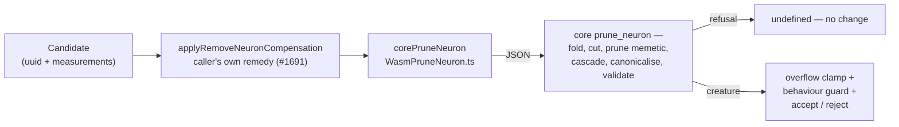

## Summary

Hidden-neuron removal moves from TypeScript to NEAT-AI-core's Rust/WASM
`prune_neuron`. Discovery's `removeHarmfulNeuron` / `removeLowImpactNeuron` now
hand the creature to core through a new thin bridge
(`src/wasm/WasmPruneNeuron.ts`), and the superseded TypeScript rewrite in those
two paths is deleted — there is no fallback behind it. Core owns the removal,
the mean bias fold, the memetic prune, the cleanup cascade, canonicalisation and
validation. Closes #3975.

Because core also **rewrites the neurons that survive** a removal (a hidden
neuron stranded without an inward edge becomes a unity `constant` with its fixed
activation folded into the outgoing weight), the replay path that stacks two
accepted removals had to learn to carry those survivor edits — a membership diff
cannot see an edit to a row present on both sides.

## Evidence

Backend/library change with no web interface, so there is no screenshot to
capture; the evidence is test output, the parity gate, and behavioural probes
against the real vendored WASM bundle.



**Test runs** (this branch, real vendored bundle):

- `test/wasm/*.ts`, `test/discovery/*.ts`,
  `test/ErrorGuidedStructuralEvolution/*.ts` → **1575 passed, 0 failed**.
- `./scripts/parity-gate.sh` → **passed (3 steps, 8/8 tests)**. Running it
  advanced the internal `stSoftwareAU/NEAT-AI-core` pin to `b7a4a3ef`; the gate
  and every affected suite pass on that revision.
- `./quality.sh --lint-only` and `--check-only` → clean (format, lint, bash,
  type-check).

**Regression reproduced and fixed.** Routing to core made the combined-candidate
replay leave a hidden neuron with no inward edge, which
`validateAndFixCreatureSync` then repaired by calling `fix()` — the path's own
"this indicates a bug in modification logic" warning. Observed on this branch in
an unmodified pre-existing test and absent on `Develop`:

```
[DiscoveryCandidates] Validation failed for remove-low-impact change: hidden neuron neuron-B-target-of-A has no inward connections
[DiscoveryCandidates] Calling fix() on remove-low-impact change - this indicates a bug in modification logic
```

`test/discovery/RemovalReplaySurvivorRewrite.ts` was written against the unfixed
code (2 of its 4 original cases failed, reproducing that exact warning) and
passes after the fix.

**Known non-blocking gap.** 26 tests in the full `deno test` run fail in this
container with `neat_ai_backpropagation library/binary was not found`. They are
all `trainDir`/backprop/predictive-coding tests, they fail identically on the
unmodified baseline, and none touches neuron removal. `./quality.sh` (full)
could not be run here for the same class of reason — it requires a native
`rust_scorer` binary that is not present and refuses to fall back silently:

```
❌ Native rust_scorer is required (quality.sh default) but was not found.
```

<!-- vibe-quality-gate-skipped reason="quality.sh requires a native rust_scorer binary absent from this container and refuses a silent WASM fallback; lint-only, check-only, the parity gate and the full deno test suite were run instead" -->

## Acceptance Criteria

<!-- vibe-spec-review inputs="diff+issue-body" -->

- **partial** — all existing relevant TypeScript tests pass after the production
  path calls Rust/WASM — evidence: `test/discovery/*.ts` +
  `test/ErrorGuidedStructuralEvolution/*.ts` + `test/wasm/*.ts`, 1575 passed —
  reviewer: partial — reason: they pass, but two pre-existing assertions in
  `test/discovery/RemovalCandidates.ts` were rewritten to the new canonical form
  (bias×weight contribution instead of an exact bias; memetic pruned
  entry-by-entry instead of dropped), so the gate was partly moved rather than
  only satisfied.
- **met** — successful Rust results validate before use — evidence:
  `src/wasm/WasmPruneNeuron.ts` `readSuccess` refuses an under-specified
  response field-by-field, plus `validateAndFixIfNeeded` on the reconstructed
  creature; `test/wasm/PruneNeuron.ts` (19 cases) — reviewer: met
- **partial** — no runtime fallback to the old TS implementation exists
  (principle 7) — evidence: `src/wasm/WasmPruneNeuron.ts` throws
  `MODULE_NOT_LOADED` rather than falling back;
  `test/wasm/PruneNeuron.ts::throws when the bundle is unavailable` — reviewer:
  partial — reason: inside the two migrated entry points there is no fallback,
  but `ApplyCoordinatedStructuralCandidate.ts` still contains a TypeScript
  hidden-neuron removal for the ordered multi-op plan, and `applyMeanBiasFold`
  still runs on the #1691 variance branch. Both are now documented as the
  boundary in `docs/DISCOVERY_ARCHITECTURE.md` and `CHANGELOG.md` rather than
  left implicit.
- **partial** — duplicate TS implementation for the migrated neuron-removal
  capability is deleted (principle 6) — evidence:
  `src/architecture/ErrorGuidedStructuralEvolution/DiscoveryNeuronRemoval.ts`
  (−181 lines: the fold loops, the neuron/synapse filters, the memetic and
  orphan cleanup calls) — reviewer: partial — reason: deleted for the
  single-neuron rewrite, but the coordinated multi-op plan keeps its own TS
  removal and `applyMeanBiasFold` survives for the caller-supplied remedy. A
  plan is only valid as a whole, so routing each op through a rewrite that
  canonicalises and validates would reject legal intermediate states.
- **partial** — the working production system changes only by this proven
  capability boundary — evidence: `CHANGELOG.md` and
  `docs/DISCOVERY_ARCHITECTURE.md` enumerate each deliberate difference —
  reviewer: partial — reason: **constant-neuron removal is now refused**
  (`PROTECTED_NEURON`), verified by probe against the real bundle. Core protects
  constants by design — its own `docs/research/pruning-parity-matrix.md` grades
  `CONSTANT_BIAS_FOLD` "on the hidden-neuron twin" precisely because
  `prune_neuron` protects constants — so this is a known upstream boundary, not
  an oversight. It is recorded in the CHANGELOG; adding a TypeScript
  constant-removal rule here would be the shadow implementation principle 7
  forbids.
- **unrequested** — survivor-rewrite replay in `applyRemoveNeuron`
  (`src/discovery/CandidateApplicationOps.ts`) — reviewer: unrequested — reason:
  not asked for, but a direct consequence of the cutover: without it the
  migration silently regressed the combined-candidate path into calling `fix()`.
  Kept, with regression tests.
- **unrequested** — `PruneProxyStats` / `PruneNeuronStats.variance` /
  `weightShares` on the bridge — evidence: `src/wasm/WasmPruneNeuron.ts` —
  reviewer: unrequested — reason: they map core's request/response ABI, which
  the bridge documents in full; no production caller populates them yet. Kept as
  contract documentation rather than deleted and re-added by #3976.
- **unrequested** — the contract-fault tests in `test/wasm/PruneNeuron.ts` —
  reviewer: unrequested — reason: beyond "parity fixtures derived from the
  existing TS tests", but they are what makes acceptance criterion 2
  ("successful Rust results validate before use") demonstrable rather than
  asserted.

## Standards Review

<!-- vibe-standards-review inputs="diff+CODING-STANDARDS.md" -->

`CODING-STANDARDS.md` does not exist in this repo; the reviewer was given
`AGENTS.md` (the repo's stated single source of truth) and
`docs/ENGINEERING_PRINCIPLES.md` in its place, plus the fleet-wide standards.

- **violation** — re-derived the canonical synapse key and claimed it matched
  `SynapseKey.ts` — evidence: `src/wasm/WasmPruneNeuron.ts:176` — reason: fixed
  here; now calls `synapseTripleKey`, and the false comment is gone.
- **violation** — `exact: fold.exact === true` coerced a missing required field
  into a confident `false` — evidence: `src/wasm/WasmPruneNeuron.ts:475` —
  reason: fixed here; `requiredBoolean` now refuses it, covered by
  `test/wasm/PruneNeuron.ts::a fold claiming exactness it did not send fails
  loud`.
  The remaining `?? []` array defaults stand: core omits an empty list rather
  than sending `[]`, so refusing them would fail on every ordinary removal.
- **violation** — the `malformed` throw, singled out in the module docstring,
  had no test — evidence: `src/wasm/WasmPruneNeuron.ts:584` — reason: fixed
  here;
  `test/wasm/PruneNeuron.ts::a malformed failure is a bridge fault, not a
  refusal`.
- **violation** — the deliberate single-fold exception (#1691) was untested, and
  it is the highest-risk new logic — evidence:
  `src/architecture/ErrorGuidedStructuralEvolution/DiscoveryNeuronRemoval.ts:196`
  — reason: fixed here;
  `NeuronRemovalCoreGuards.ts::a Discovery remedy is
  folded once, not once here and again in core`.
- **violation** — two docstrings still described a fallback path this migration
  deleted — evidence:
  `src/architecture/ErrorGuidedStructuralEvolution/DiscoveryNeuronRemoval.ts:47`
  and `:96` — reason: fixed here.
- **violation** — `docs/TS_RUST_MIGRATION.md` §"What should NOT be migrated"
  still listed pruning as TypeScript, contradicting the table edited in the same
  diff — evidence: `docs/TS_RUST_MIGRATION.md:195` — reason: fixed here; the
  bullet is narrowed and the stale "(May 2026)" heading date corrected.
- **violation** — leftover scratch probe under `test/`, which `deno.json`
  collects via `test/**/*.ts` — evidence: `test/tmpprobe/probe.ts` — reason:
  fixed here; deleted.
- **violation** — the CHANGELOG enumerated every deliberate behavioural
  consequence except the new non-finite `averageActivation` refusal — evidence:
  `src/architecture/ErrorGuidedStructuralEvolution/DiscoveryNeuronRemoval.ts:309`
  — reason: fixed here; that refusal and core's `IF`→`IDENTITY` downgrade are
  now both recorded.
- **violation** — principle 6 step 4 gates deleting a superseded implementation
  on a clean parity-gate run recorded in the PR — evidence:
  `docs/PARITY_GATE.md` — reason: fixed here; `./scripts/parity-gate.sh` passes
  (3 steps, 8/8) and the run is recorded in Evidence above. Maintainer sign-off
  remains a human step.
- **clean** — Australian English throughout the added lines; no Node tooling
  introduced in this Deno repo; all new production logging via `getLogger()`; no
  secrets or hidden paths staged; the core repin commits `deno.json`,
  `wasm_activation/pkg/**` and `WasmBundleSha256.ts` together as AGENTS.md
  requires; only the UUID-only `CreatureExport` crosses the WASM boundary;
  `cleanupOrphanedNeurons` / `cleanupMemeticForRemovedNeuron` /
  `assertValidSynapseReferences` all retain other callers, so the deletion
  orphaned no helper; every new test calls real functions against the real
  bundle and asserts on returned values — no source grepping, no sleeps, no
  absolute timing thresholds.

Two findings from the review were **not** accepted, having been checked and
found incorrect:

- "the overflow guard now covers less than it did" — probed both ways: a
  core-authored weight of 1e20 comes back clamped to `MAX_SAFE_WEIGHT_BIAS`
  under the old per-fold loop too, because creature load clamps as well. The
  guard was never narrowed. The sweep was kept anyway because it is simpler than
  the per-fold lookup, which silently skipped the clamp when a fold named a
  target the answer did not contain.
- "`replaySurvivorRewrite` overwrites instead of composing" was correct, and
  fixed — but composing _everything_ would have been wrong too: a canonical
  unity constant must be assigned, not incremented, or a second replay doubles
  it. The fix composes only when the survivor kept its role.

## Test Plan

Added:

- `test/discovery/RemovalReplaySurvivorRewrite.ts` (5 tests) — the replay
  carries the survivor's new role, its folded bias and its folded outgoing
  weight; needs no `fix()` to validate; leaves an unrelated earlier edit alone;
  and composes two stacked removals' folds instead of discarding one.
- `test/ErrorGuidedStructuralEvolution/NeuronRemovalCoreGuards.ts` (7 tests) —
  the overflow bound holds over a core-authored weight; `removeHarmfulNeuron`
  refuses a non-finite mean and still removes on a finite one;
  `removeLowImpactNeuron` proceeds without a usable mean; a Discovery remedy is
  folded exactly once; a genuinely uncompensated removal is still reported.
- `test/wasm/PruneNeuron.ts` (+10 tests) — the canned success fixture is itself
  accepted (so the negative cases prove something); a creature with no
  neurons/synapses array, a fold with no `targetUUID`, no `delta` or no `exact`,
  a rewrite naming the wrong neuron, a refusal with no reason, and a malformed
  request all fail loud; an understood refusal is not an error; an error does
  not dump the creature into the log.

Modified:

- `test/discovery/DiscoveryNeuronRemovalMemetic.ts` — module docstring only; it
  referenced line numbers in code this migration deleted. The tests themselves
  are unaltered and now exercise the Rust/WASM path through the normal public TS
  entry points, which is what the issue asked for.
