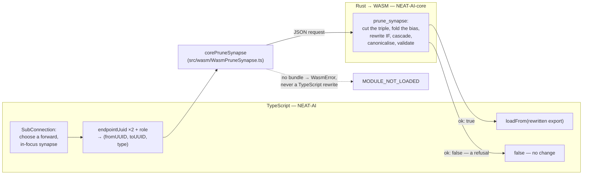

# Migration 2: replace TS synapse removal with proven WASM pruning

## Summary

`SubConnection` no longer rewrites the creature itself. It chooses a candidate
and hands the creature to NEAT-AI-core's `prune_synapse`, which cuts exactly the
named `(fromUUID, toUUID, type)` triple, folds what the creature itself fixes
into the target's bias, rewrites whatever `IF` structure the removal made
statically decidable, cascades away what is left stranded, canonicalises and
validates before answering. The superseded TypeScript rewrite in that operator —
the demote-to-constant, the orphan cascade, the wholesale
`delete
creature.memetic`, and the `#wouldBreakIfNeuron` guard — is deleted,
with no runtime fallback ([principle 7](../../ENGINEERING_PRINCIPLES.md)).
Closes #3976.

Two behaviours change deliberately, and both are improvements core proved:

- an `IF` left short a role is **rewritten** rather than the removal refused.
  `#wouldBreakIfNeuron` used to decline any removal that would empty an `IF`'s
  condition, positive or negative role, which made that whole class of typed
  structure unreachable to the mutation operators. Core instead flattens an `IF`
  whose condition has gone to the branch that condition always took (an
  `IDENTITY` sum), or restores an emptied branch with a **zero-weight** support
  edge. Both are exact — an empty branch sum is `0`, and so is `0 · 1`;
- `memetic` is pruned entry by entry rather than dropped wholesale, so a
  survivor's fine-tuning history survives a removal that did not invalidate it.

Scope is the **forward** synapse. `SubSelfCon` and `SubBackCon` remove a
self-loop or a feedback edge and keep their in-place TypeScript rewrite until
they are migrated in turn; the ledgers say so rather than claiming synapse
pruning has moved wholesale.

## Evidence

This is a library/CLI change with no web interface to screenshot. The evidence
is the test suites below and the ownership boundary this diagram records.

Full-gate note: `./quality.sh` refuses to run in this container because it
requires the native `rust_scorer` binary and a Rust toolchain for the discovery
and WASM-sync steps, neither of which is present
(`❌ Native rust_scorer is required (quality.sh default) but was not found`).
Everything the gate runs that does not need them was run and passes:
`./quality.sh --skip-tests --skip-discovery --skip-wasm` (dependency check,
`deno fmt` over 2617 files, `deno lint` over 2054 files, the bash-script gate,
and the full type check) exits 0, and the whole test suite was run separately
with the gate's own environment
(`NEAT_SCORER_GPU=off NEAT_AI_BACKPROP_ENABLED=0 NEAT_AI_BACKPROP_REQUIRE_FFI=0
NEAT_AI_NATIVE_CORE_BACKPROP=0 deno test … --parallel --preload
test/_preload.ts`):
**9016 passed, 1 failed, 89 ignored**.

The one failure is
`test/scripts/InFlightTestLog.ts::in-flight log leaves a name
file until the test finishes`,
and it is pre-existing and unrelated. It sets `NEAT_AI_IN_FLIGHT_DIR` to a temp
directory and counts the files in it, but the environment is process-global
while `--parallel` is not, so a concurrent case writes a second name file. It
was reproduced on this branch running only `test/scripts/`, `test/architecture/`
and `test/creature/` — three suites this change does not touch — and it passes
when its own file is run alone.

## Acceptance Criteria

<!-- vibe-spec-review inputs="diff+issue-body" -->

- **met** — add the TS adapter for synapse identity, including typed roles —
  evidence: `src/wasm/WasmPruneSynapse.ts` (`PruneSynapseKey`, `PruneRole`,
  `assertKnownRole`), `test/wasm/PruneSynapse.ts` (19 cases) — reviewer: met
- **met** — use the existing `SubConnection` tests as the primary acceptance
  gate — evidence: `test/mutate/SubConnection.ts` and
  `test/mutate/SubConnectionStaleFromIndex.ts` are untouched by the diff and
  pass against the WASM path — reviewer: met
- **met** — add only the extra tests needed for the Rust improvements —
  evidence: `test/mutate/SubConnectionCoreRewrite.ts` (7 cases) covers the
  outcomes the superseded TypeScript could not produce — reviewer: met
- **met** — prove parity/superiority for last-input → constant, last-output →
  dead cascade, same-pair typed roles, input/output incident edges, `IF` role
  rewrites and shared branches — evidence: one case per scenario in
  `test/wasm/PruneSynapse.ts` and `test/mutate/SubConnectionCoreRewrite.ts` —
  reviewer: met
- **partial** — preserve existing TS tests unaltered wherever practical —
  evidence: `test/propagate/IfElse.ts::if-fix` — reviewer: partial — reason:
  that case asserted the old `#wouldBreakIfNeuron` refusal directly (an `IF`
  output keeps three roles through 110 mutations), which the migration
  deliberately removes; it now asserts the invariant that survives — an `IF` is
  retired only by being flattened to `IDENTITY`, and no _surviving_ `IF` is left
  short a role — with the reason documented in place. Every other pre-existing
  case is unaltered.
- **met** — route production synapse removal to Rust/WASM and delete the
  superseded TS rewrite plus helpers used only by it — evidence:
  `src/mutate/SubConnection.ts` — reviewer: met — the helpers it dropped
  (`removeHiddenNeuron`, `moveConstantNeuronIntoPrefix`) keep other callers, so
  nothing is orphaned
- **met** — stop the cutover and improve core first if a required TS test
  exposes a missing Rust case — evidence: no core change was needed; every
  pre-existing case passes on the pinned revision — reviewer: met
- **met** — all existing relevant TypeScript tests pass after the normal TS code
  path calls Rust/WASM — evidence: 9016 passed (see Evidence for the one
  unrelated pre-existing failure) — reviewer: met
- **met** — every successful result validates before use — evidence: core
  validates the stable result before answering (`prune_synapse`: "A successful
  call never returns an invalid creature"), and every case in
  `test/mutate/SubConnectionCoreRewrite.ts` calls `creatureValidate` on the
  loaded creature — reviewer: partial — reason: the reviewer noted the operator
  loads with `loadFrom(…, false)` and this repo does not re-validate. That is
  deliberate: a second TypeScript validate-and-repair pass over a core-validated
  answer is the shadow implementation principle 7 forbids, and the guarantee is
  asserted by the tests rather than re-implemented.
- **met** — no runtime fallback to the previous TS implementation exists —
  evidence: `WasmPruneShared.bundleUnavailable` throws `MODULE_NOT_LOADED`;
  `test/wasm/PruneSynapse.ts::throws when the bundle is unavailable` — reviewer:
  met
- **met** — duplicate TS synapse-rewrite / IF-repair / orphan-cleanup code owned
  by core is deleted — evidence: `src/mutate/SubConnection.ts` lost the whole
  in-place rewrite including `#wouldBreakIfNeuron` — reviewer: met
- **met** — the migration stays small and independently reviewable — evidence:
  one operator, one bridge, one shared wire module; no second implementation
  accumulates — reviewer: met
- **unrequested** — `src/wasm/WasmPruneShared.ts` is new, and
  `src/wasm/WasmPruneNeuron.ts` was reduced onto it — reviewer: unrequested —
  reason: core answers both rewrites with one response shape, so the synapse
  bridge would otherwise have duplicated ~400 lines of response reading and
  given the two bridges two chances to disagree with core about a field. The
  public API of `WasmPruneNeuron` is unchanged and its tests pass unaltered.
- **unrequested** — `SubConnection` logs a warning and returns `false` on a
  refusal instead of re-drawing — reviewer: unrequested — reason: fail-loud
  requires a refusal be reported rather than swallowed, and `false` is the
  operator's existing "no change" contract; the same policy `prune_neuron`'s
  callers adopted in #3975.

## Standards Review

<!-- vibe-standards-review inputs="diff+CODING-STANDARDS.md" -->

Note on inputs: this repository has no `CODING-STANDARDS.md`; the reviewer was
given the documents that own the same policy here — `AGENTS.md`,
`docs/ENGINEERING_PRINCIPLES.md` and `CONTRIBUTING.md`.

- **violation** — the ledgers claimed synapse pruning was Rust-only while
  `SubSelfCon` / `SubBackCon` still carry the same TypeScript rewrite (principle
  7, and a doc claim owes the code behind it) — evidence:
  `docs/TS_RUST_MIGRATION.md:76`, `AGENTS.md:695` — reason: fixed here; the
  entries now say **forward**-synapse pruning, a "Recurrent synapse removal —
  TypeScript" row names the pair that has not moved, and the `CHANGELOG` says
  the same.
- **violation** — `SYNAPSE_ROLES` was a second hard-coded copy of the role
  vocabulary `src/architecture/SynapseKey.ts` declares itself the single home
  for (principle 5, DRY) — evidence: `src/wasm/WasmPruneSynapse.ts:95` — reason:
  fixed here; `PruneRole` is derived from `SynapseRole`, `PRUNE_ROLES` is
  annotated with it so a spelling that drifts fails to compile, and
  `PruneSynapseKey.type` is now typed rather than `string`.
- **violation** — the `if-fix` `else` arm looped over surviving `IF` neurons and
  so asserted nothing when none survived (a test must assert on outcomes) —
  evidence: `test/propagate/IfElse.ts:176` — reason: fixed here; the arm now
  names the squash a flattened `IF` must land on, which is a real assertion in
  both arms.
- **violation** — near-identical `IF` and hidden-chain fixtures were defined
  twice in one change (principle 5 names fixtures explicitly) — evidence:
  `test/wasm/PruneSynapse.ts:57` and
  `test/mutate/SubConnectionCoreRewrite.ts:93` — reason: fixed here;
  `test/_pruneFixtures.ts` is the single home and both suites consume it.
- **clean** — Australian English throughout the added lines; no TS fallback or
  `*TS` shim for the migrated path; fail-loud on an unavailable bundle, a
  non-JSON answer, a non-response, a `malformed` failure and every unreadable
  report field; `getLogger()` rather than `console.*`; synapse identity carried
  as the full `(from, to, type)` triple with `synapseTripleKey` for metadata
  restore; neuron UUIDs and `semanticVersion` survive the export → core →
  `loadFrom` round trip; no superseded helper left without a caller; tests call
  real functions and assert on results, with no source grepping or wall-clock
  thresholds; `default-param-last` respected.

One further finding from the spec reviewer was correctness rather than standards
and is also fixed here: extracting the shared envelope had moved
`assertFiniteStats` ahead of the bundle-availability check on the **neuron**
path, so a caller with no bundle _and_ a bad statistic was told about the
statistic. The request is now built inside `callPrune`, after the bundle check,
and both bridges carry a regression test for the ordering.

## Test Plan

Added:

- `test/wasm/PruneSynapse.ts` — 19 cases over the real vendored WASM bundle: the
  exact fold of a fixed source, the caller's mean fold, the orphan cascade, the
  stranded-hidden fold to constant support, both `IF` rewrites, typed-role
  identity on a shared pair, a role at a target that cannot tell roles apart,
  observation/output-incident edges, `tags` / `frozen` preservation, an unknown
  triple, an unknown role spelling, a non-finite statistic, an unavailable
  bundle (including that it is reported ahead of a bad request shape), and four
  contract-breaking answers that must fail loud.
- `test/mutate/SubConnectionCoreRewrite.ts` — 7 cases driving the operator
  itself, with the candidate draw pinned so each assertion is about the edge
  named: target left with no inward edge, source left with no outward edge, the
  last `IF` condition, an emptied `IF` branch, a shared branch pair, an
  observation-incident edge, and memetic pruned entry by entry.
- `test/_pruneFixtures.ts` — the fixtures both suites share.

Modified:

- `test/wasm/PruneNeuron.ts` — one added case pinning the guard ordering on the
  neuron bridge. The other 19 are unaltered and pass over the extracted
  envelope.
- `test/propagate/IfElse.ts::if-fix` — see the `partial` entry above.

Unaltered and used as the acceptance gate: `test/mutate/SubConnection.ts`,
`test/mutate/SubConnectionStaleFromIndex.ts`, `test/mutate/TransitiveFocus.ts`,
`test/creature/NeuronUuidStability.ts`,
`test/creature/SemanticVersionStability.ts`,
`test/NEAT/MutatorOperatorFactory.ts`.
