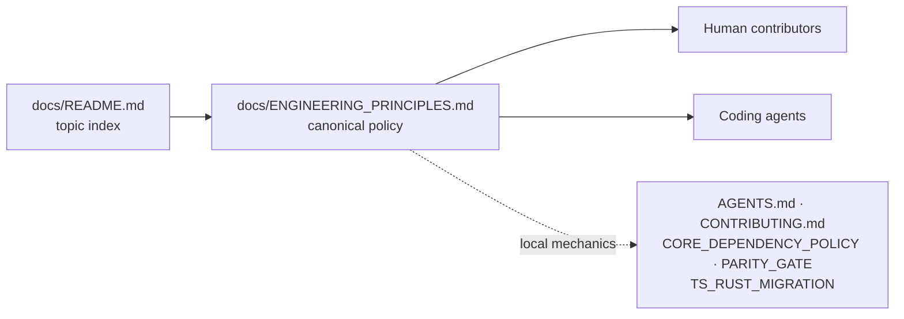

# Canonical family-wide ENGINEERING_PRINCIPLES.md (Issue #3978)

## Summary

The NEAT-AI family's shared engineering rules were scattered across `AGENTS.md`,
`CONTRIBUTING.md`, `docs/CORE_DEPENDENCY_POLICY.md`, `docs/PARITY_GATE.md`,
`docs/TS_RUST_MIGRATION.md` and issue history, with no single place a human or
an agent could read them. This adds `docs/ENGINEERING_PRINCIPLES.md` — eleven
numbered, normative principles covering test-driven development,
regression-first defect handling, behaviour tests, one implementation owner per
capability, DRY across the family, the incremental TypeScript → Rust migration
rule (prove, cut over, delete in the same migration), no fallback or shadow
path, rollback by repinning, small revertible migrations, shared logic in the
lowest reusable component, and application-agnostic public libraries — and links
it from the documentation index. Wording is drawn from the existing project
rules and the migration rule agreed in #3975/#3976; nothing contradicts the docs
it consolidates.

`AGENTS.md` and `CONTRIBUTING.md` are deliberately untouched: rewiring them to
link here instead of restating shared policy is the next step of the parent
project (#3977), and doing it now would exceed this issue's scope.

Closes #3978.



## Evidence

Documentation-only change with no web interface to screenshot. Evidence is the
test run.

Red first — the three guards written before the document existed:

```
FAILED | 0 passed | 3 failed (5ms)
docs/ENGINEERING_PRINCIPLES.md exists and is non-empty
docs/ENGINEERING_PRINCIPLES.md internal links resolve
docs index links to the canonical engineering principles
```

Green after the document and the index entry landed, and the whole `test/docs/`
suite with it:

```
deno test --no-check --allow-all --config ./deno.json test/docs/*.ts
ok | 307 passed | 0 failed (6s)
```

`markdownlint-cli2` reports 0 issues on both changed Markdown files;
`./quality.sh --lint-only` and `./quality.sh --check-only` both pass.

<!-- vibe-quality-gate-skipped reason="./quality.sh refuses to run in this container: the default test lane requires the native rust_scorer binary, which is not installed and has no sibling NEAT-AI-scorer checkout — '❌ Native rust_scorer is required (quality.sh default) but was not found.' The runnable stages (--lint-only, --check-only, markdownlint, the full test/docs suite) were run instead and all pass. CI runs the same checks on this PR." -->

## Acceptance Criteria

<!-- vibe-spec-review inputs="diff+issue-body" -->

- **met** — one canonical document exists — evidence:
  `docs/ENGINEERING_PRINCIPLES.md`, guarded by
  `test/docs/EngineeringPrinciples.ts::docs/ENGINEERING_PRINCIPLES.md exists and is non-empty`
  — reviewer: met
- **met** — it is written for humans and agents equally — evidence:
  `docs/ENGINEERING_PRINCIPLES.md:3-9` ("one contract, one wording, no
  agent-only dialect") — reviewer: met
- **met** — no agent-only terminology is required to understand the rules —
  evidence: principles 3 and 7 now state the rule in full and cite `AGENTS.md`
  only as this repository's local expression
  (`docs/ENGINEERING_PRINCIPLES.md:50-61`, `:90-99`) — reviewer: partial —
  reason: the reviewer saw the pre-fix diff, where those two principles sent the
  reader to `AGENTS.md` for "the full rule"; that deference was removed in
  commit `1a6125bb`
- **met** — no contradictory migration/fallback guidance remains in the
  canonical document — evidence: reviewer confirmed internal consistency and
  agreement with `docs/TS_RUST_MIGRATION.md` and `AGENTS.md` §WASM-only
  operations — reviewer: met
- **met** — docs index links to it — evidence: `docs/README.md:209`, guarded by
  `test/docs/EngineeringPrinciples.ts::docs index links to the canonical engineering principles`
  — reviewer: met
- **met** — TDD first for new behaviour and bug fixes — evidence: principle 1 —
  reviewer: met
- **met** — smallest reproducing regression test before fixing a post-release
  defect — evidence: principle 2 — reviewer: met
- **met** — tests describe behaviour/contract rather than implementation detail
  — evidence: principle 3 — reviewer: partial — reason: the reviewer marked it
  partial only because the pre-fix wording deferred the full rule to
  `AGENTS.md`; principle 3 is now self-contained
- **met** — one implementation owner per capability — evidence: principle 4 —
  reviewer: met
- **met** — DRY across the NEAT-AI family — evidence: principle 5 — reviewer:
  met
- **met** — incremental TS → Rust migration: prove parity/superiority using
  existing tests, switch to Rust/core, remove the superseded TS in the same
  migration — evidence: principle 6, steps 1–4 — reviewer: met
- **met** — no runtime fallback, shadow implementation, or long-lived dual path
  — evidence: principle 7 — reviewer: met
- **met** — versioning/pinning is the operational rollback mechanism — evidence:
  principle 8 — reviewer: partial — reason: the reviewer showed the mechanism
  was described inaccurately ("a one-line change"); principle 8 now states the
  real repin — `neatCore.rev` plus `assetSha256`, `./build.sh`, regenerated
  bundle committed together
- **met** — migrations small, independently reviewable and revertible —
  evidence: principle 9 — reviewer: met
- **met** — shared core logic in the lowest sensible reusable component;
  orchestration/policy stays with the owning product — evidence: principle 10 —
  reviewer: met
- **met** — public libraries stay application-agnostic; private stock-market
  usage must not leak into or be promoted as the public contract — evidence:
  principle 11 — reviewer: met
- **unrequested** — `test/docs/EngineeringPrinciples.ts` and
  `test/docs/_markdownLinks.ts` — reviewer: unrequested — reason: the issue
  asked for a document, not tests; TDD is mandatory for this repository, and
  these are the behavioural guards (existence, link resolution, index entry)
  that made the acceptance criteria verifiable
- **unrequested** — the "Who this applies to" role taxonomy, the migration
  Mermaid diagram and the pre-PR recap checklist — reviewer: unrequested —
  reason: `docs/DOC_STYLE.md` rules 5–6 ask for diagrams and reader orientation;
  the three roles are what principles 10–11 turn on, and the checklist restates
  the principles rather than adding a new gate

## Standards Review

<!-- vibe-standards-review inputs="diff+CODING-STANDARDS.md" -->

This repository has no `CODING-STANDARDS.md`; the reviewer was given the diff
and the repository's documented standards (`AGENTS.md`, `CONTRIBUTING.md`,
`docs/DOC_STYLE.md`).

- **violation** — the summary claimed `AGENTS.md`/`CONTRIBUTING.md` already
  defer to this document, which nothing in the repository does — evidence:
  `docs/ENGINEERING_PRINCIPLES.md:6-9` — reason: fixed here; the summary now
  says the rewiring is the next step of #3977
- **violation** — the index entry asserted "Other documents link to it rather
  than restating it" — evidence: `docs/README.md:214` — reason: fixed here; the
  entry now says it carries the canonical wording while the repository-specific
  files hold the local mechanics
- **violation** — `API` used without expansion or a deeper-reading link
  (DOC_STYLE rule 1) — evidence: `docs/ENGINEERING_PRINCIPLES.md:135` (post-fix
  line) — reason: fixed here; expanded to "Application Programming Interface
  (API)" and linked to `API_REFERENCE.md`
- **violation** — `TypeScript (TS)`, `TDD` and `DRY` expanded but not linked
  (DOC_STYLE rule 1) — evidence: `docs/ENGINEERING_PRINCIPLES.md:25`, `:33`,
  `:63` — reason: fixed here; each expansion now carries a link
- **violation** — `relativeLinkTargets` duplicated a helper that already exists
  in three other `test/docs/` guards (DRY) — evidence:
  `test/docs/EngineeringPrinciples.ts:23-36` — reason: fixed here by extracting
  `test/docs/_markdownLinks.ts`; the three pre-existing copies are left alone as
  out of scope for this issue
- **violation** — claimed the README publishes "every sibling repository" while
  the private consumers named below it are absent from that table — evidence:
  `docs/ENGINEERING_PRINCIPLES.md:14-16` — reason: fixed here; the claim is now
  scoped to the public repositories
- **violation** — principles 1, 3 and 7 restate rules that also live in
  `AGENTS.md`/`CONTRIBUTING.md` (one source of truth) — evidence:
  `docs/ENGINEERING_PRINCIPLES.md:39-44`, `:54-61`, `:88-97` — reason: stands,
  by design. The issue asks this document to _consolidate_ rules currently
  scattered across those files; #3977 step 3 removes the duplicate wording from
  them. The duplication is transient and deliberate, not drift left unmanaged
- **clean** — Australian English throughout; `Deno.test` + `@std/assert` under
  `test/`, picked up by the `test/**/*.ts` include; no timing APIs and no
  source-grepping in the tests; `deno fmt`, `deno lint` and `markdownlint-cli2`
  clean; every relative link and heading anchor in the new doc resolves; no
  hidden files staged; no private-repo references introduced; commit messages
  follow the repository shape

## Test Plan

- Added `test/docs/EngineeringPrinciples.ts` — three behavioural guards: the
  canonical document exists and is non-empty, every relative link in it resolves
  on disk, and `docs/README.md` links to it.
- Added `test/docs/_markdownLinks.ts` — the shared link-target extractor the new
  guard uses, rather than a fourth private copy.
- `test/docs/DocsIndex.ts::docs/README.md indexes every top-level guide`
  (pre-existing) now also covers the new document.
- Full `test/docs/` suite: `ok | 307 passed | 0 failed`.
