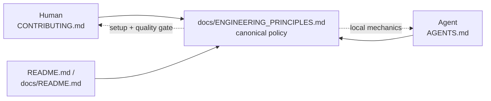

# Docs 2: AGENTS.md and CONTRIBUTING.md defer to ENGINEERING_PRINCIPLES.md (Issue #3979)

## Summary

`docs/ENGINEERING_PRINCIPLES.md` landed in #3978 as the canonical, family-wide
engineering policy, but the two entry points still carried their own parallel
copies of it. This change rewires both to consume that document instead:
`AGENTS.md` and `CONTRIBUTING.md` now link prominently to it, the normative
wording the canonical document owns (test-driven development, behaviour-not-
implementation testing, the no-TypeScript-fallback rule) is shortened to a link,
and the repository-specific mechanics — the WASM-only operation list, the
`deno.json` core pin, the invariants — stay where they are best documented.

Humans discover the policy without needing to know `AGENTS.md` exists: it is now
step 2 of the `docs/README.md` reading path and a top entry point in
`README.md`. A drift guard in `test/docs/EngineeringPrinciples.ts` proves both
entry points reference the canonical document. Closes #3979.

## Evidence

Documentation-only change with one test file; there is no web interface to
screenshot. What was run:

- `deno test -A "test/docs/*.ts"` — **309 passed, 0 failed**, including the two
  new guards.
- `deno check test/docs/EngineeringPrinciples.ts` — clean.
- `./quality.sh --lint-only` — dependency check, `deno fmt`, `deno lint --fix`
  and the bash syntax checks all clean.
- `markdownlint-cli2` over all 434 Markdown files — 0 issues (an MD028
  `no-blanks-blockquote` regression from the first commit was found and fixed).
- Red-then-green check on the new guard: with the
  `docs/ENGINEERING_PRINCIPLES.md` link removed from `CONTRIBUTING.md`, the
  guard fails; restored, it passes.

<!-- vibe-quality-gate-skipped reason="rust_scorer binary unavailable in this container; the full ./quality.sh test lane cannot start here" -->

The full `./quality.sh` could not run in this container: it fails at the scorer
pre-flight with "Native rust_scorer is required (quality.sh default) but was not
found" — a pre-existing environment limitation unrelated to this change, which
touches only Markdown and one docs test. CI runs the same gate on the PR.

## Acceptance Criteria

<!-- vibe-spec-review inputs="diff+issue-body" -->

- **met** — `AGENTS.md` links prominently to `docs/ENGINEERING_PRINCIPLES.md` —
  evidence: `AGENTS.md:6-8` (intro), `:10-19` (`[!IMPORTANT]` callout), `:32-34`
  (first bullet of "where to go next"), `:833` (sibling docs) — reviewer: met
- **met** — `CONTRIBUTING.md` links to the same canonical document — evidence:
  `CONTRIBUTING.md:8-13` (lead paragraph), `:27-29`, `:615-616`, `:621-622` —
  reviewer: met
- **partial** — keep only genuinely agent-operational instructions in
  `AGENTS.md` — evidence: `AGENTS.md:3-8`, `:10-19` — reviewer: missing —
  reason: the reviewer is right that no content moved along a human/agent axis,
  and it was deliberately not moved: `docs/ENGINEERING_PRINCIPLES.md:3-5` states
  the policy is written "for human contributors and coding agents equally: one
  contract, one wording, no agent-only dialect", so carving `AGENTS.md` into an
  agent-only dialect would contradict the document this issue makes canonical.
  The split actually performed is family-wide vs repository-local, which is the
  axis the goal and acceptance criterion describe.
- **met** — keep only contributor workflow/onboarding detail in
  `CONTRIBUTING.md` — evidence: `CONTRIBUTING.md:251-261` (TDD trimmed to a link
  plus the local steps), `:350-351` ("how" test list replaced by a pointer to
  `AGENTS.md` §Testing) — reviewer: partial — reason: departed; the reviewer saw
  the third copy of the prohibition list, which was removed after the review.
- **met** — remove or shorten duplicated normative wording — evidence:
  `AGENTS.md:580-590`, `:667-672`, `:745-752`; `CONTRIBUTING.md:251-261`,
  `:337-338`, `:350-351` — reviewer: partial — reason: departed; the reviewer's
  counter- example was the five-principle enumeration copied into three places.
  Both copies this change introduced (`AGENTS.md`, `CONTRIBUTING.md`) were
  removed after review, leaving the enumeration only where the canonical
  document and the pre-existing `docs/README.md:213` governance entry state it.
- **met** — update the documentation index so humans can discover the policy
  without knowing `AGENTS.md` exists — evidence: `docs/README.md:22-25` (step 2
  of the reading path, explicitly "you do not need `AGENTS.md` to find it"),
  `README.md:45-47` — reviewer: met
- **met** — preserve repository-specific technical invariants locally, link
  family-wide policy — evidence: `AGENTS.md:664-692` (WASM-only operation list
  and `requireWasm` guidance kept, rule attributed to principle 7), `:738-752`
  (core pin mechanics kept) — reviewer: met
- **met** — lightweight guard proving both entry points reference the canonical
  policy — evidence:
  `test/docs/EngineeringPrinciples.ts::AGENTS.md links to the canonical engineering principles`
  and `::CONTRIBUTING.md links to the canonical engineering principles` —
  reviewer: met
- **met** — acceptance: human and agent are directed to the same document, with
  no contradictory duplicated migration/fallback rules — evidence: the two
  guards above; the remaining `fallback` mentions (`AGENTS.md:242`, `:344`,
  `:375`) are repository-specific neuron-UUID and wire-format behaviours, not
  implementation-fallback policy — reviewer: met
- **unrequested** — `README.md:45-47` adds the policy to the root README's top
  entry points — reviewer: unrequested — reason: the issue named "docs/README.md
  / relevant documentation index"; the root README is the first index a human
  meets, and the criterion is discovery without `AGENTS.md`.
- **unrequested** — `docs/ENGINEERING_PRINCIPLES.md:6-8` and `:53-54` reword the
  now-stale forward reference ("Rewiring them to link here … is the next step of
  the project") and principle 3's pointer — reviewer: unrequested — reason: this
  change _is_ that rewiring, so leaving the sentence would contradict the tree
  it describes.

## Standards Review

<!-- vibe-standards-review inputs="diff+CODING-STANDARDS.md" -->

- **violation** — the prominence assertion added to the drift guard was a
  line-count assertion on document layout, which `AGENTS.md` §Testing and
  `docs/ENGINEERING_PRINCIPLES.md:53-54` both ban — evidence:
  `test/docs/EngineeringPrinciples.ts:33,85-94` (as reviewed) — reason: fixed
  here; the window check was removed and the guard now asserts only on parsed
  link targets. This is a deliberate departure from the Spec reviewer's wish for
  a stronger "prominence" guard: the repository rule against layout assertions
  is explicit, and the issue asks for a lightweight check that does not test
  prose.
- **violation** — `AGENTS.md` claimed shared policy is "linked, never restated",
  then enumerated five of the eleven principles in the callout — evidence:
  `AGENTS.md:13-16` (as reviewed) — reason: fixed here; the callout now names
  the document and its scope without restating its contents.
- **violation** — MD028 `no-blanks-blockquote` from two adjacent GitHub alerts —
  evidence: `AGENTS.md:19`, `CONTRIBUTING.md:18` (as reviewed) — reason: fixed
  before review completed; `markdownlint-cli2` is 0 issues over 434 files.
- **violation** — the callout soft-wrapped "Test-driven" across a line break, so
  it rendered as "Test- driven development" — evidence: `AGENTS.md:12-13` (as
  reviewed) — reason: fixed here by reflowing, then removed entirely with the
  enumeration.
- **clean** — Australian English throughout the added lines (no
  `behavior|organize|optimize|favor|color|center|analyze` hits); acronyms expanded
  on first use per `docs/DOC_STYLE.md` rule 1; every new anchor fragment
  resolves to a real heading, with no reference cycle between the three
  documents; `deno fmt --check` and `cspell --config docs/cspell.json` clean;
  only the six intended files staged, no hidden paths or build artefacts.

## Test Plan

- Extended `test/docs/EngineeringPrinciples.ts` with two data-driven guards —
  `AGENTS.md links to the canonical engineering principles` and
  `CONTRIBUTING.md links to the canonical engineering principles` — which parse
  each entry point's relative link targets via the shared
  `test/docs/_markdownLinks.ts` extractor and assert
  `docs/ENGINEERING_PRINCIPLES.md` is among them. They assert on link structure,
  never on prose, so an editorial reword cannot break them.
- Both guards were observed failing before the documentation edits and passing
  after; removing the link again reproduces the failure.
- The full `test/docs/` suite (309 tests) passes, so no existing documentation
  guard — `DocsIndex`, `NeatTerminologyDefersToCanonical`,
  `ContributingProjectStructure`, `AgentsDirectoryStructure` — regressed.
