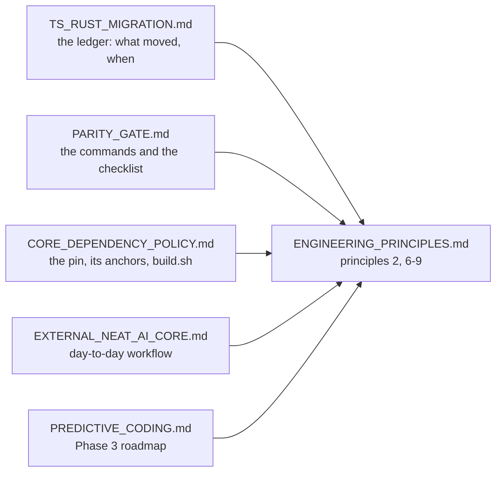

# Docs 3: point the migration and parity docs at the canonical engineering principles

## Summary

`docs/CORE_DEPENDENCY_POLICY.md`, `docs/PARITY_GATE.md` and
`docs/TS_RUST_MIGRATION.md` each carried their own wording for rules that
[`docs/ENGINEERING_PRINCIPLES.md`](../../ENGINEERING_PRINCIPLES.md) now owns.
Each document keeps its repository-specific mechanics — pinning and bundle
verification, the parity commands and release checklist, the migration ledger —
and cites the canonical policy for the family-wide rules instead of restating
them. Two closely related documents were swept in the same pass:
`docs/EXTERNAL_NEAT_AI_CORE.md` (the cluster entry point) now links the policy,
and `docs/PREDICTIVE_CODING.md`'s Phase 3 roadmap step no longer plans to "keep
TypeScript as fallback", which contradicted principle 7 outright.

Closes #3980.

## Evidence

Documentation-only change with a behavioural guard; there is no web interface to
screenshot. The guard is `test/docs/EngineeringPrinciples.ts`, extended in two
ways:

- each of the three documents must link to `ENGINEERING_PRINCIPLES.md`;
- **every** committed Markdown file that cites a principle by anchor must cite
  one that exists — the test parses the canonical document's headings into
  GitHub anchor slugs and compares them against every
  `…ENGINEERING_PRINCIPLES.md#…` link in the repository, so a renumbered or
  reworded principle fails loudly instead of leaving dead links behind.

Observed red before the change (3 failures: the three documents did not link the
policy), and observed red again by mutation after it — rewriting one citation to
`#99-not-a-principle` fails the anchor test, so the guard is not a tautology.

```text
$ deno test --no-check -A --config ./deno.json test/docs/*.ts
ok | 316 passed | 0 failed (6s)

$ ./quality.sh < /dev/null
ok | 9007 passed (5 steps) | 0 failed | 41 ignored (4m11s)
```

Where the policy now lives, and what each document kept:



## Acceptance Criteria

<!-- vibe-spec-review inputs="diff+issue-body" -->

- **met** — `docs/CORE_DEPENDENCY_POLICY.md` updated — evidence:
  `docs/CORE_DEPENDENCY_POLICY.md:8-17` (principles 7–8 cited; rollback points
  at its own §Bumping section) — reviewer: met
- **met** — `docs/PARITY_GATE.md` updated — evidence:
  `docs/PARITY_GATE.md:12-22`, `:109-111`, `:147-148` — reviewer: met
- **met** — `docs/TS_RUST_MIGRATION.md` updated — evidence:
  `docs/TS_RUST_MIGRATION.md:17-32` (labels and links, no paraphrase), `:74-80`,
  `:194-195` — reviewer: met
- **met** — closely related docs that define duplicate ownership/fallback policy
  — evidence: `docs/PREDICTIVE_CODING.md:685-687` (the roadmap step, replaced)
  (the "keep TypeScript as fallback" roadmap step, replaced) and
  `docs/EXTERNAL_NEAT_AI_CORE.md:20-23` — reviewer: partial — reason: the
  reviewer saw the first commit, which stopped at the three named documents;
  both files it named were swept in the follow-up commit
- **met** — repository-specific mechanics kept in place — evidence: pinning,
  sidecar verification, `build.sh` modes, parity steps and the release checklist
  are unchanged — reviewer: met
- **met** — the six semantics preserved by reference — evidence:
  `docs/TS_RUST_MIGRATION.md:20-32` links principles 6 (acceptance contract,
  parity before cutover, delete the superseded TS), 7 (no fallback), 8 (rollback
  by pinning), 9 and 2 (regression test before the fix) — reviewer: met
- **partial** — update project references (core#587, #3975, #3976, Ockham#182) —
  evidence: comments posted on
  [#3975](https://github.com/stSoftwareAU/NEAT-AI/issues/3975#issuecomment-5578588841)
  and
  [#3976](https://github.com/stSoftwareAU/NEAT-AI/issues/3976#issuecomment-5578589049)
  citing the canonical principles — reviewer: missing — reason: the two
  cross-repo issues (NEAT-AI-core#587, NEAT-AI-Ockham#182) cannot be commented
  on from this run — the `gh` guard allows writes to the claim repo only — and
  the reviewer judged the diff before the two in-repo comments were posted
- **met** — the family-wide rule is defined once and the consumers only link
  back — evidence: `test/docs/EngineeringPrinciples.ts` enforces both the
  deferral and the anchor validity, and no principle prose is copied into the
  three documents — reviewer: partial — reason: the reviewer's partial rested on
  the two sweep gaps above, both since closed
- **unrequested** — the anchor guard scans every committed Markdown file rather
  than the three documents alone — reviewer: unrequested — reason: a hand-kept
  file list rots exactly like the prose this issue removes; scanning is the same
  test with no list to maintain
- **unrequested** — `test/docs/_markdownLinks.ts` gained `relativeLinks()` —
  reviewer: unrequested — reason: the anchor guard needs the `#fragment` the old
  helper discarded; `relativeLinkTargets()` is now a one-line projection of it,
  so there is no second extractor
- **unrequested** — `docs/CORE_DEPENDENCY_POLICY.md:250-251` now names
  `src/wasm/WasmBundleSha256.ts` in the commit step — reviewer: unrequested —
  reason: the rollback pointer sends readers to that section, and it disagreed
  with §Decision Summary about which files `build.sh` regenerates

## Standards Review

<!-- vibe-standards-review inputs="diff+CODING-STANDARDS.md" -->

The repository has no `CODING-STANDARDS.md`; the reviewer was given `AGENTS.md`,
`docs/DOC_STYLE.md` and `CONTRIBUTING.md`, which are its documented standards.

- **violation** — a duplicated rollback recipe that disagreed with the section
  it claimed to mirror — evidence: `docs/CORE_DEPENDENCY_POLICY.md:17-21` (as
  reviewed) — reason: fixed here — the paragraph now links §Bumping instead of
  repeating it, and that section was corrected to name the third regenerated
  file
- **violation** — "this document does not restate them", immediately followed by
  a restatement of five principles — evidence: `docs/TS_RUST_MIGRATION.md:19-35`
  (as reviewed) — reason: fixed here — the bullets are now a label plus a link
  each
- **violation** — copy-pasted test bodies in the guard — evidence:
  `test/docs/EngineeringPrinciples.ts:142-161` (as reviewed) — reason: fixed
  here — link resolution is one loop over `LINK_CHECKED` sharing a
  `brokenLinks()` helper
- **violation** — an unlinked `(principle 7)` citation the guard could not
  verify — evidence: `docs/TS_RUST_MIGRATION.md:71` (as reviewed) — reason:
  fixed here — the table cell is a link, so the anchor test covers it
- **violation** — inconsistent `./` normalisation between two adjacent link
  assertions — evidence: `test/docs/EngineeringPrinciples.ts:133-135` (as
  reviewed) — reason: fixed here — both go through `linksTo()`
- **violation** — `headingSlug` stripped underscores, which GitHub preserves —
  evidence: `test/docs/EngineeringPrinciples.ts:48-60` (as reviewed) — reason:
  fixed here — underscores are kept in the slug character class
- **clean** — Australian English throughout the added prose; `deno fmt` and
  `deno lint` pass on all changed files; the new assertions test link structure
  (target present, resolves on disk, fragment resolves to a real heading) rather
  than prose, matching the house pattern in `test/docs/DocsIndex.ts`; every
  cited principle anchor matches a real heading, including the double hyphen
  left by the dropped `→`

## Test Plan

- Extended `test/docs/EngineeringPrinciples.ts`:
  - `docs/CORE_DEPENDENCY_POLICY.md|docs/PARITY_GATE.md|docs/TS_RUST_MIGRATION.md
    defers to the canonical engineering principles`
    — each document must link `ENGINEERING_PRINCIPLES.md` (red before this
    change).
  - `… internal links resolve` — extended to the three documents through the
    shared `LINK_CHECKED` list.
  - `every document that cites a principle cites one that exists` —
    repository-wide dangling-anchor guard (red under mutation).
- Extended `test/docs/_markdownLinks.ts` with `relativeLinks()`, keeping
  `relativeLinkTargets()` as its projection.
- `deno test --no-check -A --config ./deno.json test/docs/*.ts` — 316 passed.
- `./quality.sh < /dev/null` — 9007 passed, 0 failed.
