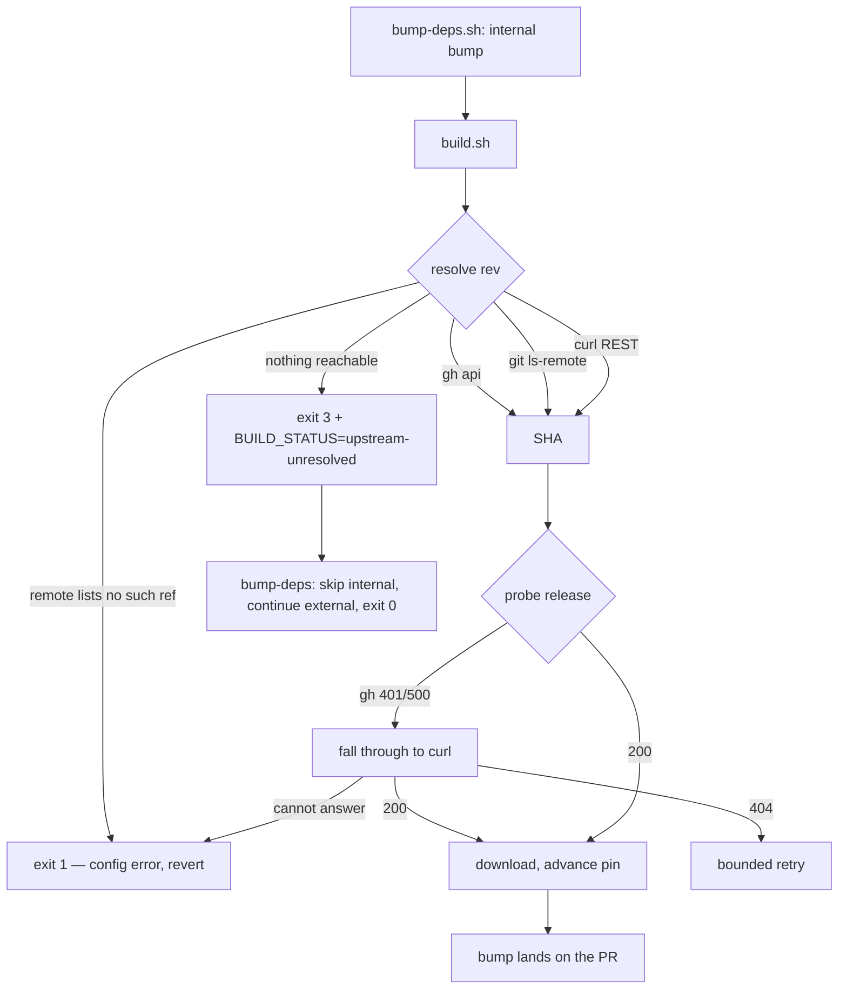

# Make the unattended dependency bump work without a `gh` session

## Summary

`build.sh` resolved NEAT-AI-core `Develop` HEAD with `gh api` alone, and `gh`
needs a token even for a public repository. Every unattended `bump-deps.sh` run
therefore died with `Could not resolve commit SHA`, the worker reverted the
bump, and no PR carried a dependency update.

Two failure points are fixed, both of which had to go for the bump to survive:

1. **Revision lookup** — `resolve_upstream_rev()` tries `gh api`, then
   `git ls-remote`, then `curl` against the REST API. Only the first needs a
   session, so an unattended runner still resolves the ref. When every strategy
   fails it reports what each one said instead of swallowing the reason.
2. **Release probe** — `probe_release()` treated any non-404 `gh` error as the
   release's verdict and exited 1. It now falls through to the credential-free
   `curl` probe and only fails fast when curl cannot answer either. Without this
   the fix stopped one step short: the revision resolved and the build still
   died.

An upstream that is genuinely unreachable is no longer a build failure:
`build.sh` prints `BUILD_STATUS=upstream-unresolved` and exits `3`, and
`bump-deps.sh` degrades to a _skipped_ internal bump — reported in the summary,
never silent — and carries on with the external bumps. Nothing was written, so
there is nothing to revert. Every other failure still exits `1`.

Closes #3990.

## Evidence

Backend/CLI change — no web interface to screenshot. Verified by test output and
by driving the real scripts:

- **Live, against the real remote, with `gh` stubbed to fail 401** —
  `resolve_upstream_rev stSoftwareAU/NEAT-AI-core Develop` printed
  `Resolved … via git ls-remote` and `86523eff033f2b947facc1f3d8d42f6f18a96e18`,
  rc 0. That is the same SHA an authenticated `gh api` returns, and it is the
  exact lookup that produced the issue's error message.
- **Real `build.sh`, offline** (gh/git/curl all stubbed to fail): exits `3` and
  prints `BUILD_STATUS=upstream-unresolved`, writing nothing —
  `test/scripts/BuildScriptRetry.ts::build.sh signals an unreachable upstream
  with exit 3 and the marker (Issue #3990)`.
- **Real `build.sh`, gh unauthenticated but curl working**: probe falls through,
  bundle downloads, pin advances —
  `test/scripts/BuildScriptRetry.ts::build.sh
  probes the release via curl when gh has no session (Issue #3990)`.
- **Full gate**: `./quality.sh` exits 0 — `9086 passed (5 steps) | 0 failed`.

One unrelated pre-existing flake surfaced during an earlier gate run:
`test/mutate/ModBiasRegularisation.ts` asserts a statistical property over 500
**unseeded** draws (`TowardsZero: 221, AwayFromZero: 279`). It passed three
isolated runs immediately afterwards and the full gate is green on this tree. It
is untouched here and filed separately as #3998.

## Reproduction

- **symptom** — `bump-deps.sh` exits 1 on every unattended run:
  `ERROR: Could not resolve commit SHA for stSoftwareAU/NEAT-AI-core@Develop`,
  then `ERROR: ./build.sh failed; internal bump aborted`, so the worker reverts
  the bump and no PR carries a dependency update.
- **status** — `verified` — the regression tests were observed failing against
  the unfixed code and passing after the fix. Against the pre-change scripts, 9
  of the new assertions failed (all 8 resolver tests, because `build.sh` defines
  no `resolve_upstream_rev`, plus the `bump-deps.sh` skip test); the probe test
  was separately re-run with the `probe_release` fall-through reverted to
  `return 2` and observed red, then green once restored.
- **regression test** —
  `test/scripts/BuildScriptRevResolution.ts::resolve_upstream_rev falls back to
  git ls-remote when gh has no session (#3990)`
  and
  `test/scripts/BuildScriptRetry.ts::build.sh probes the release via curl when
  gh has no session (Issue #3990)`.

## Acceptance Criteria

<!-- vibe-spec-review inputs="diff+issue-body" -->

- **met** — reproduce with `bash bump-deps.sh` in a clean checkout without an
  interactive `gh` login — evidence: `test/scripts/BuildScriptRevResolution.ts`
  and `test/scripts/BuildScriptRetry.ts` encode both failing paths; the reviewer
  reproduced the whole flow live — reviewer: met
- **met** — fix the SHA resolution so it works unattended (e.g. `git ls-remote`)
  — evidence: `build.sh` `resolve_upstream_rev()`;
  `test/scripts/BuildScriptRevResolution.ts::resolve_upstream_rev falls back to
  git ls-remote when gh has no session (#3990)`
  — reviewer: met
- **met** — fall back gracefully rather than aborting the whole bump when a
  lookup fails — evidence: `bump-deps.sh` skip path;
  `test/scripts/BumpDepsScript.ts::bump-deps.sh treats an unresolvable upstream
  revision as a skipped internal bump (Issue #3990)`
  — reviewer: met
- **met** — exit 0 on a no-op, non-zero only on a genuine error — evidence: the
  three exit-code tests in `test/scripts/BumpDepsScript.ts` (marked exit 3 → 0;
  bare exit 3 → non-zero; exit 1 → non-zero) — reviewer: met
- **partial** — verify that a worker PR actually carries the dependency bump
  commit — evidence:
  `test/scripts/BuildScriptRetry.ts::build.sh probes the
  release via curl when gh has no session (Issue #3990)`
  asserts the pin advances end to end in a fake repo — reviewer: partial —
  reason: this branch deliberately carries no bump commit; the worker runs
  `bump-deps.sh` before `quality.sh` when it raises the PR, and pre-empting that
  here would mix an unrelated WASM bundle change into the fix. The reviewer
  confirmed by hand that `build.sh` now advances the pin `b7a4a3e -> 86523ef`
  with an unauthenticated `gh`.
- **met** — apply `work-on` to schedule the fix — evidence: the label is already
  on the issue; the worker account cannot self-apply it — reviewer: met
- **unrequested** — the `probe_release` gh → curl fall-through — reviewer:
  unrequested — reason: not named in the issue, but without it the build still
  exits 1 at the release probe in the reported environment, so the stated goal
  is unreachable without it.
- **unrequested** — `BUMP_DEPS_BUILD_CMD` seam in `bump-deps.sh` — reviewer:
  unrequested — reason: the only way to drive the degraded-upstream branch
  without a network; mirrors the existing `BUMP_DEPS_DENO_FALLBACKS` seam and is
  now documented in `--help`.
- **unrequested** — `NEAT_CORE_REV_LOOKUP_TIMEOUT_SECONDS` and the
  transport-level caps — reviewer: unrequested — reason: an unattended lookup
  that can hang forever re-breaks the bump in a different way; the repo already
  caps its other unattended network step.
- **unrequested** — annotated-tag peeling in the `ls-remote` strategy —
  reviewer: unrequested — reason: `neatCore.ref` is configurable and a tag is a
  legal value; without peeling the resolver would return a tag object SHA, which
  no `wasm-bundle-<SHA>` release matches.
- **unrequested** — doc updates in `AGENTS.md`, `docs/CORE_DEPENDENCY_POLICY.md`
  and `docs/cspell.json` — reviewer: unrequested — reason: the exit-code
  contract changed, and a code change owes a docs change.

## Standards Review

<!-- vibe-standards-review inputs="diff+CODING-STANDARDS.md" -->

- **violation** — a 404 was read as "the ref is gone", but GitHub answers 404
  for a repository the credential cannot see — evidence: `build.sh`
  `resolve_upstream_rev()` — reason: fixed here. Only `git ls-remote` reaching
  the remote and listing no matching ref is now treated as a missing ref; the
  ambiguous 404s stay in the transient class.
- **violation** — the lookup was bounded only by an external `timeout` binary,
  which stock macOS does not ship — evidence: `build.sh`
  `resolve_upstream_rev()` — reason: fixed here. `git ls-remote` carries
  `GIT_HTTP_LOW_SPEED_*` and `curl` carries `--connect-timeout`/`--max-time`.
- **violation** — the marker/exit-code contract was duplicated across the two
  scripts with no test pinning the producing side — evidence: `build.sh` and
  `bump-deps.sh` — reason: fixed here by
  `test/scripts/BuildScriptRetry.ts::build.sh signals an unreachable upstream
  with exit 3 and the marker (Issue #3990)`,
  which drives the real `build.sh`.
- **violation** — a failed build's output was replayed on stdout, so a caller
  capturing stderr saw only the one-line abort — evidence: `bump-deps.sh`
  internal-bump branch — reason: fixed here; the log is replayed on the stream
  the exit code implies.
- **violation** — `NEAT_CORE_REV_LOOKUP_TIMEOUT_SECONDS` was interpolated
  without validation, unlike the adjacent `NEAT_CORE_BUNDLE_RETRIES` — evidence:
  `build.sh` `resolve_upstream_rev()` — reason: fixed here; a non-numeric value
  now fails loud.
- **violation** — a digit-substituted placeholder token in a test fixture
  tripped the `en-GB` cspell gate — evidence:
  `test/scripts/BuildScriptRevResolution.ts` — reason: fixed here, renamed to
  `test-token`; `cspell` reports 0 issues.
- **violation** — the bearer token is passed as a `curl` argv entry, so it is
  visible in `ps` to a local user — evidence: `build.sh`
  `resolve_upstream_rev()` — reason: **stands**. This is a fourth instance of a
  pattern the file already uses at three other call sites; changing one of the
  four would leave the file inconsistent, and moving all four to `curl -K -` is
  separate work outside this issue's scope.
- **violation** — the "red first" step is not visible as its own commit —
  evidence: commit history on this branch — reason: **stands**. Red was observed
  in-session against the pre-change scripts (recorded under Reproduction above)
  but the tests were committed alongside the fix.
- **clean** — Australian English throughout; tests drive real code (the real
  `resolve_upstream_rev` via the existing `_buildShHarness.ts`, the real
  `bump-deps.sh`, the real `build.sh`) with no source-grepping; bash 3.2-safe
  empty-array expansion `${arr[@]+"${arr[@]}"}` and `gtimeout`-before-`timeout`
  probing; no wall-clock sleeps and no timing assertions (34 script tests in
  under a second); hosts are hard-coded and `repo`/`ref` reach every tool as
  separate argv entries with no `eval`; `GIT_TERMINAL_PROMPT=0` blocks an
  interactive credential prompt; resolved SHAs are re-validated against
  `^[0-9a-f]{40}$`; docs and both `--help` texts describe the new contract with
  no stale "gh is required" text left behind.

## Test Plan

Added — `test/scripts/BuildScriptRevResolution.ts` (11 tests, new file), driving
the real `resolve_upstream_rev()` out of `build.sh` with stub `gh` / `git` /
`curl` on PATH:

- falls back to `git ls-remote` when `gh` has no session
- prefers `gh` when it is authenticated (the only strategy that reads a private
  repo)
- peels an annotated tag to its commit SHA
- falls back to the REST API over `curl`, taking the commit SHA and not the tree
  SHA
- sends the token to `curl` when one is exported
- fails loud naming every strategy it tried
- reports the tools absent from PATH
- separates a missing ref (exit 2) from an unreachable upstream (exit 1)
- fails loud on a non-numeric lookup timeout
- rejects a malformed SHA rather than passing it on

Added — `test/scripts/BuildScriptRetry.ts`:

- `build.sh probes the release via curl when gh has no session (Issue #3990)` —
  end to end: unauthenticated `gh`, bundle downloads, pin advances
- `build.sh signals an unreachable upstream with exit 3 and the marker
  (Issue #3990)`
  — the producing side of the cross-script contract

Added — `test/scripts/BumpDepsScript.ts`:

- treats an unresolvable upstream revision as a skipped internal bump (exit 0,
  `deno.json` untouched)
- does not degrade a bare exit 3 without the marker
- still fails loud when the build script fails for any other reason

Modified —
`test/scripts/BuildScriptRetry.ts::build.sh fails fast on non-404
probe error (auth) without retrying`.
**Documented behaviour change:** a `gh` error is no longer the probe's verdict
on its own, since an unauthenticated `gh` is exactly the environment this issue
is about. The test now stubs `curl` to report `000` (it could not answer either)
and still asserts the same outcome — one probe call, no retries, no download,
non-zero exit. No test was removed or weakened; the assertions are unchanged.
