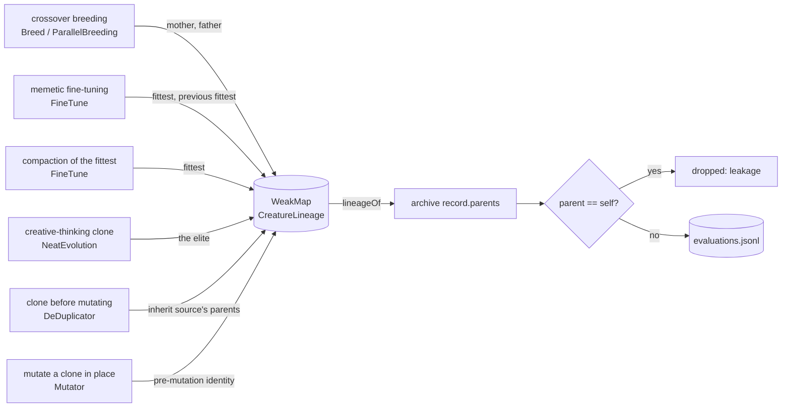

## Summary

`recordLineage` was called from three places, all crossover breeding paths, so
the evaluation archive's `parents` field was populated for under 1 % of records.
A creature produced by mutating a clone, by memetic fine-tuning, or as the
creative-thinking clone reached the archive naming nobody — indistinguishable
from a seed, an elite or a random immigrant — and every lineage-aware consumer
(the parent's-score baseline of #3930, a lineage-held-out split) was undecidable
on it.

Lineage is now recorded on **every** path that derives a creature from another,
the parent UUID is **materialised** rather than read off an optional field, and
the archive **reports its own coverage** at every flush. Closes #4004.

- `src/archive/CreatureLineage.ts` — `recordLineage` materialises each parent's
  UUID with `CreatureUtil.makeUUID`; new `recordDerivedFrom` (by UUID, for the
  mutate-in-place path) and `inheritLineage` (clone carries its source's
  parents).
- `src/NEAT/Mutator.ts` — captures the pre-mutation identity **before** anything
  mutates the creature, and names it when the archive holds it (a finite score)
  or when nothing better is on record.
- `src/blackbox/FineTune.ts` — tuned candidates name the fittest and the
  previous fittest; compaction candidates name the fittest. This is the largest
  slice of most generations.
- `src/NEAT/NeatEvolution.ts` — the creative-thinking clone names the elite.
- `src/architecture/DeDuplicator.ts` — clones inherit their source's parents, so
  a clone of an unscored bred offspring keeps links that resolve.
- `src/archive/EvaluationArchive.ts` — drops a parent equal to the creature's
  own UUID, counts coverage, and reports it per flush (`warn` under 50 %).
- `docs/EVALUATION_ARCHIVE.md` — a "Parent links: what `parents` covers"
  section.

### Where lineage is recorded

## Evidence

Backend/CLI change — there is no web interface to screenshot. The evidence is
the archive the real evaluation path writes, measured with
`scripts/surrogate_archive_capture.ts` at the exact capture shape the issue
reported (6 runs × 15 generations × population 24, synthetic corpus):

| Measure                                  | Before (issue) |          After |
| ---------------------------------------- | -------------: | -------------: |
| Records                                  |          1,143 |          1,138 |
| Records naming a parent                  |      8 (0.7 %) | 1,132 (99.5 %) |
| Parented records with no joinable parent |              — |              0 |
| Records naming themselves as parent      |              — |              0 |
| Lineage groups                           |          1,135 |            240 |

Lineage-held-out splitting no longer degenerates into leave-one-creature-out:
240 groups for 1,138 creatures, against 1,135 for 1,143.

Full quality gate (`./quality.sh`) run in the foreground after the final edit.

## Reproduction

- **symptom** — the evaluation archive's `parents` field was empty for all but
  ~0.7 % of records, so a creature bred by mutating a clone was
  indistinguishable from a seed and no parent's-score baseline could be built
- **status** — `verified` — `test/archive/EvaluationArchiveLineage.ts` was run
  against the unfixed `src/` (`git checkout HEAD~1 -- src/`) and failed with
  `only 0/44 (0.0%) of archived evaluations name a parent; the floor is 75%`; it
  passes after the fix
- **regression test** —
  `test/archive/EvaluationArchiveLineage.ts::evaluation archive lineage - archived creatures name what they came from`

## Acceptance Criteria

<!-- vibe-spec-review inputs="diff+issue-body" -->

- **met** — Archived offspring name the creature(s) they were derived from on
  the mutation path as well as the crossover path — evidence:
  `src/NEAT/Mutator.ts` (pre-mutation identity), `src/blackbox/FineTune.ts`,
  `src/NEAT/NeatEvolution.ts`;
  `test/NEAT/MutatorLineage.ts::mutator lineage - a mutated clone names the creature it came from`
  — reviewer: met
- **met** — A test that evolves a small population with the archive enabled and
  asserts a coverage floor — evidence:
  `test/archive/EvaluationArchiveLineage.ts::evaluation archive lineage - archived creatures name what they came from`
  (`MIN_PARENT_COVERAGE = 0.75`); the reviewer independently confirmed it goes
  red against the unfixed code — reviewer: met
- **met** — The named parent UUID is the one the parent was archived under, with
  a test that resolves a child's `parents` entry to a real record in the same
  archive — evidence:
  `test/archive/EvaluationArchiveLineage.ts::evaluation archive lineage - a named parent is a record in the same archive`
  — reviewer: partial — reason: the reviewer measured 13/572 (2.3 %) dangling
  links against a `MIN_RESOLVABLE = 0.9` bar and called the bar too loose. Both
  were fixed after the review: `DeDuplicator` clones now inherit their source's
  parents (the root cause of the dangling `retry` links) and the assertion now
  requires **every** parented record to join. Re-measured at the issue's capture
  shape: 0 dangling of 1,132.
- **met** — `docs/EVALUATION_ARCHIVE.md` states what coverage the field carries
  and on which paths — evidence: `docs/EVALUATION_ARCHIVE.md` §"Parent links:
  what `parents` covers" — reviewer: met
- **met** — (non-checkbox) Materialise the parent UUID rather than reading an
  optional field — evidence: `src/archive/CreatureLineage.ts` `recordLineage`
  calls `CreatureUtil.makeUUID(parent)`;
  `test/archive/CreatureLineage.ts::creature lineage - an unhashed parent is materialised, not dropped`
  — reviewer: partial — reason: the reviewer noted the `Mutator` path still
  reads the optional `creature.uuid`. Departing, with the reason now stated in a
  code comment: only an **evaluated** creature is in the archive and the
  evaluation path archives by UUID, so an identity worth naming always already
  carries one — materialising there would cost 3–18 ms per creature per
  generation at production scale and name nothing new.
- **met** — (non-checkbox) Report the coverage where the archive is written —
  evidence: `src/archive/EvaluationArchive.ts` `reportLineageCoverage`, logged
  every flush (`warn` under 50 % run-to-date) — reviewer: met
- **unrequested** — Self-parent links are dropped in `EvaluationArchive.record`
  — reviewer: unrequested — reason: the spec reviewer found a record naming its
  own UUID as a parent (a mutation that landed back on prior content re-derives
  the same hash); a baseline predicting a creature's score from itself is
  leakage, so the link is refused at the boundary. Covered by
  `test/archive/EvaluationArchive.ts::evaluation archive — a creature is never recorded as its own parent`.
- **unrequested** — Two-parent attribution for tuned candidates (`FineTune.ts`,
  `acceptCandidate(..., fittest, previousFittest)`) — reviewer: unrequested —
  reason: `tuneRandomize` genuinely interpolates both creatures, so naming one
  would be a false single-parent claim; the issue asks for the paths that derive
  a creature "from another", and this is one of them.
- **unrequested** — Parent-UUID de-duplication in `recordLineage` — reviewer:
  unrequested — reason: two content-identical parents are one ancestor, and
  recording it twice would make a one-parent derivation read as a crossover. Now
  covered by
  `test/archive/CreatureLineage.ts::creature lineage - two content-identical parents are one parent`.
- **unrequested** — Mermaid diagram in the `CreatureLineage` module header —
  reviewer: unrequested — reason: cosmetic, and the repository's documentation
  standard asks for a diagram where one aids understanding of data flow.
- **unrequested** — `EvaluationArchive.lineageCoverage` getter — reviewer:
  unrequested — reason: agreed and **removed**; it had no caller, and the flush
  report is the surface the issue asked for.

## Standards Review

<!-- vibe-standards-review inputs="diff+CODING-STANDARDS.md" -->

Reviewed against `AGENTS.md`, `docs/ENGINEERING_PRINCIPLES.md` and
`docs/DOC_STYLE.md` (this repository has no `CODING-STANDARDS.md`; those are the
documented standards it defers to).

- **violation** — `docs/EVALUATION_ARCHIVE.md` claimed compaction candidates
  record "fittest and previous fittest", but the code records only the fittest —
  evidence: `docs/EVALUATION_ARCHIVE.md:89` — reason: fixed here; the table now
  has a separate "Compaction of the fittest → the fittest" row.
- **violation** — `docs/EVALUATION_ARCHIVE.md` said "Every flush logs the
  generation's coverage" while `flush()` returns early on an empty buffer —
  evidence: `docs/EVALUATION_ARCHIVE.md:114` — reason: fixed here; it now reads
  "Every flush that writes records".
- **violation** — `EvaluationArchive.lineageCoverage` was added with no test and
  no caller — evidence: `src/archive/EvaluationArchive.ts:277` — reason: fixed
  here by removing the getter rather than testing dead API surface.
- **violation** — the same "fraction of records naming a parent" quantity now
  had two implementations, here and in `scripts/lib/surrogateStudy.ts` (DRY) —
  evidence: `src/archive/EvaluationArchive.ts:277` vs
  `scripts/lib/surrogateStudy.ts:173` — reason: resolved by removing the getter;
  what remains is a private counter feeding one log line, not a second public
  implementation of the study helper.
- **violation** — the per-flush coverage line logs at `info` unconditionally,
  where other per-generation diagnostics are gated on `config.verbose` —
  evidence: `src/archive/EvaluationArchive.ts:327` — reason: **stands, with a
  change**. The archive is opt-in run infrastructure and carries no `verbose`
  flag (plumbing one is out of scope), and its sibling `reportSkipped` logs
  ungated in the same class. The acceptance criterion is that the archive "say
  so where it is written", so silencing it by default would defeat the issue.
  The line now escalates to `warn` when run-to-date coverage falls under 50 %,
  which is the case that must never be missed.
- **violation** — a tautological assertion in the new test
  (`assertEquals(record.parents.length > 0, true)` on a record already selected
  by that predicate) — evidence: `test/archive/EvaluationArchiveLineage.ts:124`
  — reason: fixed here; replaced with the self-parent assertion over every
  record.
- **clean** — Australian English throughout prose, comments and docs
  (`materialised`, `normalise`, `behaviour`); `deno fmt`, `deno lint`,
  `deno check` clean on all changed files; `getLogger()` used, no `console.*`;
  tests drive real code (a seeded `captureArchive` evolution and the real
  `Mutator`), none grep source; no wall-clock timing assertions; determinism via
  the seeded corpus RNG, `evolveDataSet({ seed })` and `withRngTestLock`; JSDoc
  with `@param`/`@returns` on every new or changed exported symbol; the creature
  export contract is untouched — lineage stays in the `WeakMap` and never
  reaches `exportJSON`; no Node tooling, no new dependencies, `deno.json`
  unchanged; no hidden paths staged.

## Test Plan

Added:

- `test/archive/EvaluationArchiveLineage.ts` — evolves a small archive-enabled
  population and asserts (a) a 75 % parent-coverage floor, (b) that lineage
  groups collapse well below one-per-creature, (c) that **every** parented
  record names at least one parent the archive holds, (d) that a child can be
  joined to its parent's exact score, and (e) that no record names itself.
- `test/NEAT/MutatorLineage.ts` — the mutate-a-clone policy: a mutated clone
  names its pre-mutation identity; an unevaluated bred offspring keeps its
  crossover parents; an evaluated creature displaces an older link; an unmutated
  creature records nothing.

Modified:

- `test/archive/CreatureLineage.ts` — **documented business-logic change**: the
  Issue #3929 test "a parent without identity is a gap, not a guess" asserted
  that a parent whose hash had not been computed was _dropped_. Issue #4004
  reverses that rule (materialise the hash), so the test is retargeted to assert
  the new behaviour and renamed "an unhashed parent is materialised, not
  dropped". Its original intent — that a genuinely absent parent is never
  guessed — is preserved in a new test, "a genuinely absent parent is a gap, not
  a guess". Also added: clone inheritance, nearest-ancestor replacement, and
  identical-parent de-duplication.
- `test/archive/EvaluationArchive.ts` — a creature is never recorded as its own
  parent.

Verified:

- Both regression tests observed failing against the unfixed `src/` and passing
  after the fix.
- `./quality.sh` (formatter, linter, type check, discovery, WASM sync, full
  suite) run in the foreground.
