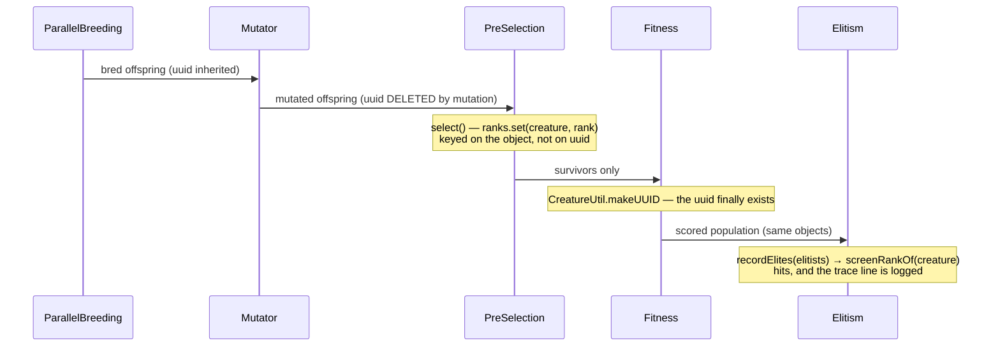

# Pre-selection elite screen rank is keyed on creature identity (Issue #4008)

## Summary

`PreSelection` recorded the screen's verdict on every survivor in a
`Map<string, ScreenRank>` keyed on `Creature.uuid`. A bred offspring reaches the
screen with **no UUID** — mutation invalidates it and `NeatEvolution` only
recomputes it during fitness, which runs _after_ pre-selection screens the bred
slice — so the `if (uuid !== undefined)` guard skipped every record, the rank
map stayed empty for the whole run, and `describeEliteRanks` returned
`undefined`, so the run logged no line and looked healthy.

The rank map, its previous-generation rotation and the once-per-creature elite
dedup are now keyed on the **creature itself** (`WeakMap` / `WeakSet`), exactly
as the Issue #3933 prediction map already is. No generational rotation is needed
for lifetime, and a missing or recomputed UUID cannot lose a record. Closes
#4008.

Where the record is made, and why the UUID is not there yet:



## Evidence

Backend library change — there is no web interface to screenshot. The evidence
is the diagnostic line the fix restores, taken from the new end-to-end test
driving the real `Neat.evolve` loop:

```text
$ deno test --allow-all test/NEAT/PreSelectionWiring.ts --filter "reports the elite screen rank"
[NEAT-AI] PreSelection: elite screen rank(s) 6/25 — a screen whose elites come
from the bottom of its own ordering is anti-correlated with what matters
ok | 1 passed | 0 failed | 9 filtered out (167ms)
```

Against the unfixed source the same command prints no such line and fails with
`no elite carried a screen rank over 15 generation(s)`.

Full gate: `./quality.sh` — **9753 passed, 0 failed, 41 ignored (11m02s)**.

An earlier gate run on the first commit of this branch reported one failure,
`pre-selection wiring — an active stage screens a real generation's offspring` —
the unseeded surrogate-residual assertion already tracked as **#4010**, which
records the same intermittent failure on a change touching no `src/` file. It is
untouched by this diff and passed in the final gate run above.

## Reproduction

- **symptom** — the elite screen rank was never recorded in a real run:
  `eliteScreenRanks` stayed empty for every generation and the trace line was
  never logged, silently
- **status** — `verified` — both regression tests were observed failing against
  the unfixed `src/NEAT/PreSelection.ts`
  (`a survivor with no UUID must still
  carry its rank`;
  `no elite carried a screen rank over 15 generation(s)`) and passing after the
  fix
- **regression test** —
  `test/NEAT/PreSelectionWiring.ts::pre-selection wiring — a real evolve run reports the elite screen rank`
  (end-to-end) and
  `test/NEAT/PreSelection.ts::pre-selection — a survivor screened without a UUID is still ranked`
  (unit)

## Acceptance Criteria

<!-- vibe-spec-review inputs="diff+issue-body" -->

- **met** — the elite screen rank is recorded for creatures that carry no UUID
  at screening time — evidence:
  `test/NEAT/PreSelection.ts:250::pre-selection — a survivor screened without a UUID is still ranked`
  over `src/NEAT/PreSelection.ts:177` — reviewer: met
- **met** — a test that drives the real evolve loop and asserts a non-empty
  `eliteScreenRanks` — evidence:
  `test/NEAT/PreSelectionWiring.ts:265::pre-selection wiring — a real evolve run reports the elite screen rank`
  — reviewer: met
- **met** — `screenRankOf` keeps working for callers that hold the creature —
  evidence: `src/NEAT/PreSelection.ts:539` keeps its signature and its ranks →
  previousRanks fallback; the pre-existing suites that call it
  (`test/NEAT/PreSelection.ts`, `test/NEAT/SurrogateUncertaintyScreen.ts`) pass
  unchanged — reviewer: met
- **unrequested** — a seven-line invariant bullet added to
  `docs/PRE_SELECTION.md` — reviewer: unrequested — reason: the guidelines
  require a docs change beside a behaviour change, and that file's invariant
  list is where this one belongs

## Standards Review

<!-- vibe-standards-review inputs="diff+CODING-STANDARDS.md" -->

The repo has no `CODING-STANDARDS.md`; the reviewer was pointed at its
documented equivalents — `AGENTS.md`, `docs/ENGINEERING_PRINCIPLES.md`,
`CONTRIBUTING.md` and `docs/DOC_STYLE.md`.

- **violation** — DRY: the new wiring test hand-rolled the generation loop that
  `evolveUntilScreened` already owns — evidence:
  `test/NEAT/PreSelectionWiring.ts:285` — reason: fixed here; the helper took an
  `until` predicate and the test now states its stop condition instead of
  repeating the loop
- **violation** — stale fixture prose claiming candidates carry a UUID "so a
  screen rank can be looked up again", the premise this change deletes —
  evidence: `test/NEAT/_preSelectionFixtures.ts:7` — reason: fixed here; the
  sentence now says what the UUIDs are actually for
- **violation** — an assertion that could pass vacuously
  (`screenRankOf(outcome.discarded[0])` with nothing pinning the discard count)
  — evidence: `test/NEAT/PreSelection.ts:273` — reason: fixed here; the count is
  asserted and every discard is checked
- **violation** — one fact written out five times (why the rank is keyed on the
  creature) — evidence: `src/NEAT/PreSelection.ts:167` — reason: partially
  fixed; the field doc is now the single canonical statement and both in-method
  comments reference it. The `predictions` JSDoc that states the same rationale
  is pre-existing Issue #3933 prose and was left alone as out of scope
- **violation** — the new UUID-less unit test is a near-clone of the elite-rank
  test above it — evidence: `test/NEAT/PreSelection.ts:250` — reason: stands.
  The two state different invariants (an elite that carries a UUID, and one that
  does not); merging them into a loop would hide which of the two regressed
- **clean** — Australian English throughout; JSDoc `@param`/`@returns` retained
  on the public `screenRankOf` / `recordElites`; `deno fmt`, `deno lint` and
  `deno check` clean; tests exercise real `Neat`, `WorkerHandler`, `evolve()`
  and the real `PreSelection` with no source-text greps; no wall-clock
  thresholds; the neuron-UUID and semantic-version invariants untouched — the
  change is compliant with the Issue #3843 creature-UUID rule, since it stops
  keying a per-creature record on a content-derived identity that mutation
  legitimately sheds

## Test Plan

- **Added**
  `test/NEAT/PreSelection.ts::pre-selection — a survivor screened
  without a UUID is still ranked`
  — deletes every fixture UUID before screening (what a bred offspring actually
  looks like), then asserts the rank, the once-per-creature elite dedup, and
  that a discard still leaves nothing behind.
- **Added**
  `test/NEAT/PreSelectionWiring.ts::pre-selection wiring — a real evolve
  run reports the elite screen rank`
  — drives the real `Neat.evolve` loop with
  `preSelection: { ratio: 3, screen: "surrogate" }` and asserts a non-empty
  `eliteScreenRanks`, every rank inside the candidate set it was taken over, and
  that `describeEliteRanks` renders the line. This is the shape of test that
  would have caught the defect; it fails loudly at the 15-generation cap.
- **Changed** `evolveUntilScreened` in the same file — an optional `until`
  predicate, so a caller waiting on a diagnostic that depends on which creatures
  became elites states its condition instead of copying the loop. The default
  stop rule is unchanged and every existing caller behaves exactly as before.
- **Re-ran** the pre-selection suites unchanged: `test/NEAT/PreSelection.ts`,
  `test/NEAT/PreSelectionWiring.ts`, `test/NEAT/SurrogateUncertaintyScreen.ts`,
  `test/scripts/PreSelectionAB.ts` — 45 passed, 0 failed.
