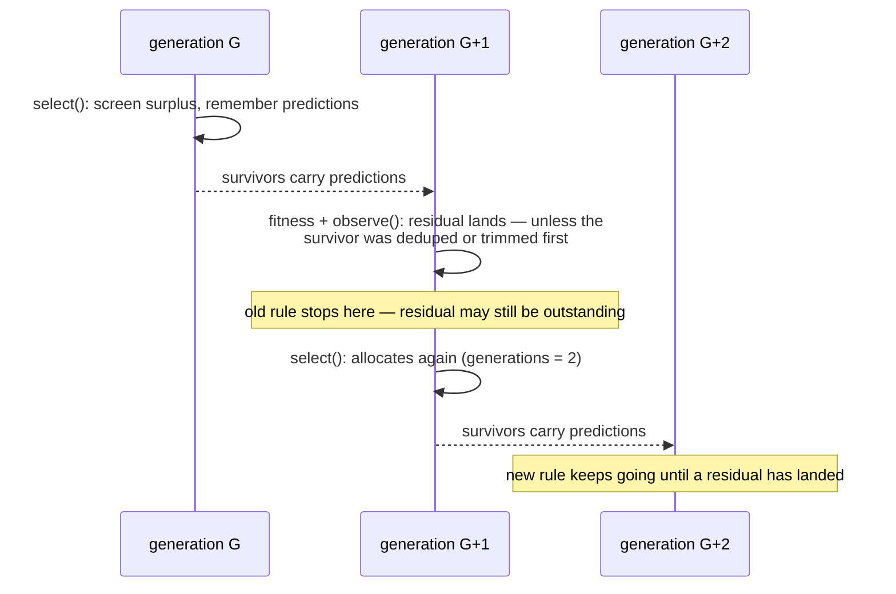

## Summary

`test/NEAT/PreSelectionWiring.ts::pre-selection wiring — an active stage screens
a real generation's offspring`
asserted `residuals > 0` **conditioned on** `guard.generations > 1` — the
guard's _allocation_ tally read as "a screened generation's residuals have
arrived". The two are not the same thing: a prediction is differenced against
the exact score that arrives for it in the _following_ generation, and a
screened survivor can lose that score on the way (de-duplication replaces it,
the population budget trims it). The condition therefore held or failed on the
luck of an unseeded evolve run — green in isolation, red under the contended
full gate.

The run is now driven until the drift monitor has **actually differenced a
prediction** (the existing `until` hook of `evolveUntilScreened`, bounded by the
same 15-generation cap), and the assertion is unconditional. A run that reaches
the cap with no residual fails loudly with the counts in the message — which is
exactly what the Issue #3933 defect this assertion guards against did, however
long the run was. The old form could also pass _vacuously_ with zero residuals,
so the new form is strictly stronger.

No `src/` change: the guard already publishes the residual count the assertion
needs, so nothing was added to it.

Closes #4010.

## Evidence

Backend/test-only change — there is no web interface to screenshot. What was
measured instead:

**The old condition sat exactly on the boundary.** A probe drove the test's own
scenario and recorded, per run, the generation the first residual landed in
versus the generation the old stopping rule stopped in — 96 runs, 24 concurrent
processes on 7 cores:

```
firstResidualGen Counter({2: 48, 3: 35, 4: 9, 5: 1, 6: 1, 8: 1, 9: 1})
oldStop          Counter({2: 48, 3: 35, 4: 9, 5: 1, 6: 1, 8: 1, 9: 1})
residualsAtOldStop==0: 0
allocGens        Counter({2: 80, 1: 16})
```

`firstResidualGen == oldRuleStoppedAt` in **96 of 96** runs: the residual landed
in the very generation the loop stopped in. Any generation that loses the
screened survivors' predictions before their exact scores arrive therefore
leaves the old assertion demanding a residual that has not arrived — which is
the reporter's failing run (`generations = 2`,
`candidates = 45 >
outOfDistribution = 6`, `residuals = 0`).



**The fixed test passes under the same contention.** 36 concurrent runs of the
fixed `test/NEAT/PreSelectionWiring.ts` and 12 serial runs: the residual
assertion never failed. Two _unrelated_ assertions in the same file did fail
under that load — `the stage discarded nothing over 15 generation(s)` (4/96 on
the **unmodified** file at `978b1585`) and
`no elite carried a screen rank over
15 generation(s)` — a separate root cause
filed as
[stSoftwareAU/NEAT-AI#4018](https://github.com/stSoftwareAU/NEAT-AI/issues/4018)
rather than folded in here.

## Reproduction

- **symptom** —
  `pre-selection wiring — an active stage screens a real
  generation's offspring`
  failed intermittently under the full `./quality.sh` run with `generations = 2`
  and `candidates (45) > outOfDistribution (6)`, so the assertion demanded
  `residuals > 0` and got `0`; it passed every time in isolation.
- **status** — `partial` — reason: the original assertion was never observed red
  on this machine (96 runs at 24-way contention plus 72 paired baseline/fixed
  runs all stayed green, the reporter saw it once under the full gate), so the
  boundary was reproduced by measurement —
  `firstResidualGen ==
  oldRuleStoppedAt` in 96/96 runs — rather than by
  catching the failure itself.
- **regression test** —
  `test/NEAT/PreSelectionWiring.ts::pre-selection wiring — an active stage
  screens a real generation's offspring`
  (now unconditional), with
  `test/surrogate/SurrogateGuard.ts::surrogate guard — the generation count is
  allocations, not differenced generations`
  pinning the guard state the old precondition misread.

## Test Plan

- **Modified**
  `test/NEAT/PreSelectionWiring.ts::pre-selection wiring — an
  active stage screens a real generation's offspring`:
  the run stops on `guard.runDiagnostics.residuals > 0` instead of one
  generation after the first discard, and the residual assertion is
  unconditional and names the counts it saw. The `after` hooks, the
  population-budget assertion and the `exactSlots` assertion are unchanged; no
  test was removed or weakened.
- **Added**
  `test/surrogate/SurrogateGuard.ts::surrogate guard — the generation
  count is allocations, not differenced generations`:
  two allocating generations, most of the population predicted, zero residuals
  and a `null` per-generation bias ratio — the legitimate state the old
  precondition ruled out.
- `deno test --allow-all test/NEAT/PreSelectionWiring.ts` — 10 passed;
  `deno test --allow-all test/surrogate/SurrogateGuard.ts` — 8 passed.
- `deno fmt`, `deno lint`, `deno check` clean on both files; full `./quality.sh`
  run in the foreground.
