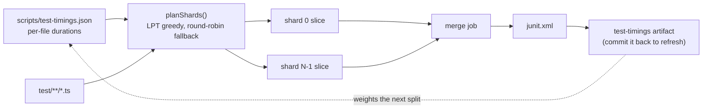

# Balance CI coverage shards by measured cost

## Summary

`scripts/shard_test_files.ts` split `test/**/*.ts` across the 8 coverage shards
by a stable round-robin, which balances the **number** of files per shard but
says nothing about how long they take. Test cost here is wildly uneven — one
`evolve()` suite outweighs hundreds of unit tests — so the slowest shard ran
7m01 while the cheapest finished in 1m15.

The partitioner now packs files **longest-processing-time-first** over the
per-file durations the coverage merge job publishes from the JUnit reports it
already aggregates (`scripts/test-timings.json`). Files with no recorded timing
keep the old round-robin placement and are charged the median recorded duration
so the packer still leaves room for them; with no timings file at all the plan
is byte-for-byte the previous round-robin. The `--verify` parity gate is
unchanged and now covers the weighted plan. Closes #4017.



## Evidence

Backend/CLI change — no web interface to screenshot.

### Benchmark — the critical shard, measured

The coverage stage's wall-clock is set by its slowest shard, so the benchmark
runs _that_ shard's slice before and after, on the same machine, with the same
command (`deno test -A --parallel`, `DENO_JOBS=4`, matching the CI shard job):

| slice                                             | files | wall-clock | tests                  |
| ------------------------------------------------- | ----- | ---------- | ---------------------- |
| **before** — round-robin shard 5 (the 7m01 shard) | 176   | **162s**   | 1211 passed, 8 ignored |
| **after** — the weighted plan's heaviest shard    | 5     | **130s**   | 1 passed               |

**−19.8% on the slowest shard**, which is the stage's wall-clock. (This machine
is ~2.5× faster than a GitHub runner, so treat the ratio, not the absolute
seconds, as the result.)

### Distribution — CI-measured per-file costs

Durations taken from the merged JUnit of run `34684855745` (the run the issue
cites), replayed through both planners over the current test tree — total suite
cost 1033.7s across 1408 files:

| shard                 | 0    | 1    | 2   | 3    | 4   | 5    | 6    | 7   | slowest  |
| --------------------- | ---- | ---- | --- | ---- | --- | ---- | ---- | --- | -------- |
| round-robin (before)  | 29s  | 105s | 67s | 217s | 35s | 373s | 150s | 56s | **373s** |
| cost-weighted (after) | 318s | 131s | 97s | 97s  | 97s | 97s  | 97s  | 97s | **318s** |

Slowest shard −15%, and the second-heaviest shard drops 217s → 131s (−40%). The
residual 318s floor is a single file: `test/NEAT/Ratios.ts` costs 317.8s, 30.7%
of the whole suite, so no partition can go below it. Making individual suites
faster is explicitly out of scope for this issue; that floor is tracked
separately in #4026.

Reproduce the plan at any time:

```bash
deno run --allow-read scripts/shard_test_files.ts --plan --total=8
```

## Test Plan

Added to `test/scripts/ShardTestFiles.ts` (13 new tests):

- `planShards - without timings reproduces the round-robin partition` — the
  fallback is exactly today's behaviour.
- `planShards - cost-weighted plan is far flatter than round-robin` — LPT lands
  within 15% of the theoretical floor on a skewed suite.
- `planShards - every file is assigned exactly once when weighted`,
  `planShards - is deterministic with timings`,
  `planShards - rejects a non-positive total`,
  `planShards - ignores timings for files that are not in the list` (a stale
  entry for a deleted file must never inject a path).
- `planShards - untimed files fall back to round-robin` — new files keep their
  index-based placement.
- `partitionTestFiles - weighted slice equals the planned shard`.
- `verifyShardCoverage - holds for the cost-weighted partition` — the parity
  invariant, unweakened.
- `loadTimings - reads a committed timings document` /
  `- fails loud on a
  malformed document` /
  `- fails loud when the file is missing`.
- `committed timings flatten the real 8-shard partition` — the real suite plus
  the committed map, asserting the weighted max shard beats round-robin and sits
  within 10% of the heaviest-file floor. Compares two plans of the same work, so
  it carries no absolute wall-clock threshold.

Added to `test/scripts/MergeJunit.ts` (8 new tests): per-file duration
extraction from Deno-shaped JUnit (`extractFileDurations`), suite-name
normalisation, accumulation across documents, the suite-level `time` fallback,
empty self-closing suites, and the `buildTimings` document shape (`generated` is
injected, never read from the clock).

Added `test/ci/CoverageTestTimings.ts` (4 tests): the merge job publishes the
timings map, scopes its `--allow-write` to that one file, opens its `run:` with
strict mode, uploads a named `test-timings` artifact (never the whole
workspace), and the committed document is readable and non-trivial.

Existing shard tests are untouched and still pass — `deno test test/ci/*.ts`
(288 passed) and `test/scripts/ShardTestFiles.ts` (23 passed).
