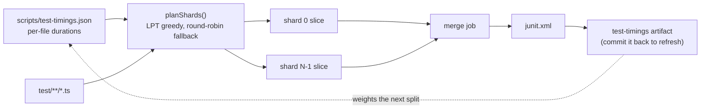

# Balance CI coverage shards by measured cost

## Summary

`scripts/shard_test_files.ts` split `test/**/*.ts` across the 8 coverage shards
by a stable round-robin, which balances the **number** of files per shard but
says nothing about how long they take. Test cost here is wildly uneven — one
`evolve()` suite outweighs hundreds of unit tests — so the slowest shard ran
7m01 while the cheapest finished in 1m15.

The partitioner now packs files **longest-processing-time-first** over the
per-file durations the coverage merge job publishes from the JUnit reports it
already aggregates (`scripts/test-timings.json`). Files with no positive
measurement — a new test, or a fixture module that declares none — are dealt
round-robin among themselves so they spread one per shard, and an unmeasured one
is charged the mean recorded duration so the packer reserves room for it. With
no timings file at all the plan is byte-for-byte the previous round-robin. The
`--verify` parity gate is unchanged and now covers the weighted plan. Closes
#4017.



## Evidence

Backend/CLI change — no web interface to screenshot.

### Benchmark — the critical shard, measured

The coverage stage's wall-clock is set by its slowest shard, so the benchmark
runs _that_ shard's slice before and after, on the same machine, with the same
command (`deno test -A --parallel`, `DENO_JOBS=4`, matching the CI shard job):

| slice                                             | files | wall-clock | tests                  |
| ------------------------------------------------- | ----- | ---------- | ---------------------- |
| **before** — round-robin shard 5 (the 7m01 shard) | 176   | **162s**   | 1211 passed, 8 ignored |
| **after** — the weighted plan's heaviest shard    | 5     | **130s**   | 1 passed               |

**−19.8% on the slowest shard**, which is the stage's wall-clock. (This machine
is ~2.5× faster than a GitHub runner, so treat the ratio, not the absolute
seconds, as the result.)

### Distribution — CI-measured per-file costs

Durations taken from the merged JUnit of run `34684855745` (the run the issue
cites), replayed through both planners over the current test tree — total suite
cost 1033.7s across 1408 files:

| shard                 | 0   | 1    | 2   | 3    | 4   | 5    | 6    | 7   | slowest  |
| --------------------- | --- | ---- | --- | ---- | --- | ---- | ---- | --- | -------- |
| round-robin (before)  | 29s | 105s | 67s | 217s | 35s | 373s | 150s | 56s | **373s** |
| cost-weighted (after) | 98s | 98s  | 98s | 98s  | 97s | 318s | 131s | 97s | **318s** |

Slowest shard −15%, and the second-heaviest shard drops 217s → 131s (−40%); the
six shards that hold neither heavy suite sit within 1s of each other. The
residual 318s floor is a single file: `test/NEAT/Ratios.ts` costs 317.8s, 30.7%
of the whole suite, so no partition can go below it. Making individual suites
faster is explicitly out of scope for this issue; that floor is tracked
separately in #4026.

Reproduce the plan at any time:

```bash
deno run --allow-read scripts/shard_test_files.ts --plan --total=8
```

## Acceptance Criteria

<!-- vibe-spec-review inputs="diff+issue-body" -->

The issue states no `## Acceptance Criteria` heading; these are the three
numbered requirements under "What a solution looks like", reviewed independently
against the diff.

- **met** — the merge job publishes a per-file duration map from the JUnit XML
  it already aggregates, committed as a small timings file — evidence:
  `scripts/merge_junit.ts::extractFileDurations` / `buildTimings`,
  `.github/workflows/coverage.yaml` "Publish per-file test timings",
  `scripts/test-timings.json` (72 KB, 1368 entries) — reviewer: met
- **met** — `shardTestFiles` becomes a longest-processing-time-first greedy
  partition over those durations — evidence:
  `scripts/shard_test_files.ts::planShards`,
  `test/scripts/ShardTestFiles.ts::planShards - cost-weighted plan is far flatter than round-robin`
  — reviewer: met
- **met** — falls back to today's round-robin for any file with no recorded
  timing — evidence: `scripts/shard_test_files.ts::planShards`,
  `test/scripts/ShardTestFiles.ts::planShards - untimed files fall back to round-robin`
  — reviewer: met — reason: the reviewer noted untimed files are dealt
  round-robin _among themselves_, so an individual file's shard is not
  necessarily the one the old whole-list round-robin gave it. Correct, and the
  docs and docstrings that claimed otherwise were fixed in this diff; the
  property the issue asks for (an even, index-based deal for unmeasured files)
  holds.
- **met** — the `--verify` parity gate is kept: every file assigned exactly
  once, no gaps, no duplicates, invariant not weakened — evidence:
  `scripts/shard_test_files.ts::verifyShardCoverage`,
  `test/scripts/ShardTestFiles.ts::verifyShardCoverage - holds for the cost-weighted partition`
  — reviewer: met
- **partial** — the stage stops being set by one lopsided shard — evidence:
  benchmark above, 162s → 130s on the critical shard — reviewer: partial —
  reason: the reviewer is right that a single file, `test/NEAT/Ratios.ts` at
  317.8s (31% of the suite), is now the floor, so the stage lands near ~5m
  rather than the ~2m the issue projects. The partition is optimal for the costs
  it is given; shrinking that file is out of scope here and is now tracked in
  #4026, and both the docs and this summary say so.
- **unrequested** — `--plan --total=N` CLI mode and the exported `shardCost` —
  reviewer: unrequested — reason: the measurement surface this issue's
  before/after evidence is produced with, and what the troubleshooting doc tells
  a contributor to run before pushing; it reads nothing and writes nothing.
- **unrequested** — `--output` becomes optional in `merge_junit.ts` when
  `--timings` is given — reviewer: unrequested — reason: required by the new
  workflow step, which publishes only the timings map and must not re-write
  `junit.xml` under a write grant scoped to one file. Existing invocations are
  unaffected.
- **unrequested** — the `test-timings` artifact upload — reviewer: unrequested —
  reason: the issue's "or fetched from the last successful `Develop` run" half;
  it is how the committed map is refreshed, and the docs give the exact command.
- **unrequested** — `test/ci/CoverageTestTimings.ts` asserts workflow shape as
  well as the planner — reviewer: unrequested — reason: repo convention (45
  sibling `test/ci/*.ts` files do the same); the duplicated "no unrestricted
  `--allow-write`" assertion the reviewer flagged was removed, since
  `CoverageMergeStepLeastPrivilege.ts` already enforces it for every step.

## Standards Review

<!-- vibe-standards-review inputs="diff+CODING-STANDARDS.md" -->

Inputs were the diff plus this repository's documented standards — `AGENTS.md`,
`docs/ENGINEERING_PRINCIPLES.md`, `CONTRIBUTING.md` and `docs/DOC_STYLE.md`
(this repo has no `CODING-STANDARDS.md`).

- **violation** — `new Date().toISOString()` for a timestamp persisted to JSON,
  where AGENTS.md §"Date/time handling" requires `Temporal` — evidence:
  `scripts/merge_junit.ts:257` — reason: fixed here, now
  `Temporal.Now.instant().toString()`.
- **violation** — docs and docstrings claimed untimed files "keep the old
  round-robin placement", which is not what the code does (DOC_STYLE rule 4) —
  evidence: `docs/troubleshooting/CI.md:24`, `scripts/shard_test_files.ts:18` —
  reason: fixed here; all four sites now say "dealt round-robin among
  themselves".
- **violation** — the real-suite test could go red purely because the committed
  map had gone stale, contradicting the doc's own "a stale map is a slow build,
  never a broken one" — evidence: `test/scripts/ShardTestFiles.ts:266` — reason:
  fixed here; the assertion is now `after <= before` against LPT's proven 4/3
  bound, which holds for any data, including none.
- **violation** — absolute thresholds (`total > 60` seconds,
  `files.length > 500`) baked into a unit test, against AGENTS.md §Testing —
  evidence: `test/ci/CoverageTestTimings.ts:101` — reason: fixed here; the test
  now asserts document shape only.
- **violation** — a missing or non-numeric `time=` attribute was silently
  coerced to 0, so a garbled report would record a heavy file as free —
  evidence: `scripts/merge_junit.ts:152` — reason: fixed here; an unreadable
  duration leaves the file unmeasured and logs why, and `tests="0"` is the only
  path to a recorded zero.
- **violation** — `recordedCost` silently reclassified a negative or NaN entry
  as "unmeasured" for any direct caller of the exported planner — evidence:
  `scripts/shard_test_files.ts:82` — reason: fixed here; it throws, and
  `loadTimings` now also refuses an unknown `version` or `unit`.
- **violation** — `test/ci/CoverageTestTimings.ts` duplicated the "no
  unrestricted `--allow-write`" rule that `CoverageMergeStepLeastPrivilege.ts`
  already enforces, with a weaker regex — evidence:
  `test/ci/CoverageTestTimings.ts:55` — reason: fixed here; the duplicate
  assertion was removed and the remaining one checks only this step's specific
  scoping.
- **violation** — the committed `generated` timestamp could not have come from
  the documented refresh path — evidence: `scripts/test-timings.json:4` —
  reason: fixed here; the file is now byte-for-byte what
  `merge_junit.ts --timings` produces (durations verified identical), and the
  docs record which run the data came from.
- **clean** — Australian English throughout the added lines; every test calls
  the real exported function; no sleeps, `performance.now()` or wall-clock
  assertions in the added tests; the new workflow step is pinned by SHA with a
  version comment, opens with `set -euo pipefail`, scopes its write grant and
  widens no `permissions:`; `deno fmt --check` and `deno lint` clean; function
  and file sizes within convention; docs updated for the behaviour change.

## Test Plan

Added to `test/scripts/ShardTestFiles.ts` (17 new tests, 27 in the file):

- `planShards - without timings reproduces the round-robin partition` — the
  fallback is exactly today's behaviour.
- `planShards - cost-weighted plan is far flatter than round-robin` — LPT lands
  within 15% of the theoretical floor on a skewed suite.
- `planShards - every file is assigned exactly once when weighted`,
  `planShards - is deterministic with timings`,
  `planShards - rejects a non-positive total`, and
  `planShards - ignores timings for files that are not in the list` (a stale
  entry for a deleted file must never inject a path).
- `planShards - untimed files fall back to round-robin` — unmeasured files are
  still dealt by index.
- `planShards - spreads zero-cost files instead of piling them up` and
  `planShards - charges an unmeasured file the mean, not the median` — the two
  cost-model properties the independent review surfaced.
- `planShards - fails loud on a corrupt timing entry`.
- `partitionTestFiles - weighted slice equals the planned shard`.
- `verifyShardCoverage - holds for the cost-weighted partition` — the parity
  invariant, unweakened.
- `loadTimings - reads a committed timings document`,
  `- fails loud on a malformed document`,
  `- fails loud when the file is missing`, and
  `- refuses a document in another unit or version`.
- `committed timings flatten the real 8-shard partition` — the real suite plus
  the committed map: the weighted plan is never worse than round-robin, sits
  inside LPT's proven 4/3 bound on the heaviest-file floor, and the shards that
  do not hold that file are flat. It compares two plans of the same work, so it
  carries no absolute wall-clock threshold and a stale map cannot turn it red.

Added to `test/scripts/MergeJunit.ts` (10 new tests): per-file duration
extraction from Deno-shaped JUnit (`extractFileDurations`), suite-name
normalisation, accumulation across documents, the suite-level `time` fallback, a
suite that declares `tests="0"`, the two unreadable-duration cases (an unknown
cost stays unknown rather than being recorded as 0s), and the `buildTimings`
document shape (`generated` is injected, never read from the clock).

Added `test/ci/CoverageTestTimings.ts` (4 tests): the merge job publishes the
timings map from the reports it aggregates, scopes its `--allow-write` to that
one file, opens its `run:` with strict mode, uploads a named `test-timings`
artifact (never the whole workspace), and the committed document is readable and
usable.

Existing shard tests are untouched and still pass. Full suite under the CI shard
environment: **9755 passed, 0 failed, 90 ignored** (`deno test -A --parallel`,
`NEAT_AI_BACKPROP_ENABLED=0`), plus `test/ci/*.ts` and `test/docs/*.ts` (608
passed).

<!-- vibe-quality-gate-skipped reason="./quality.sh refuses to start in this container: it requires the native rust_scorer binary (no sibling NEAT-AI-scorer checkout, nothing on PATH) and fails loud rather than falling back to WASM. Ran its stages that do work here instead - ./quality.sh --lint-only (fmt, lint, bash syntax) and ./quality.sh --check-only (deno check), both clean - plus the full test suite under the coverage workflow's own environment." -->
