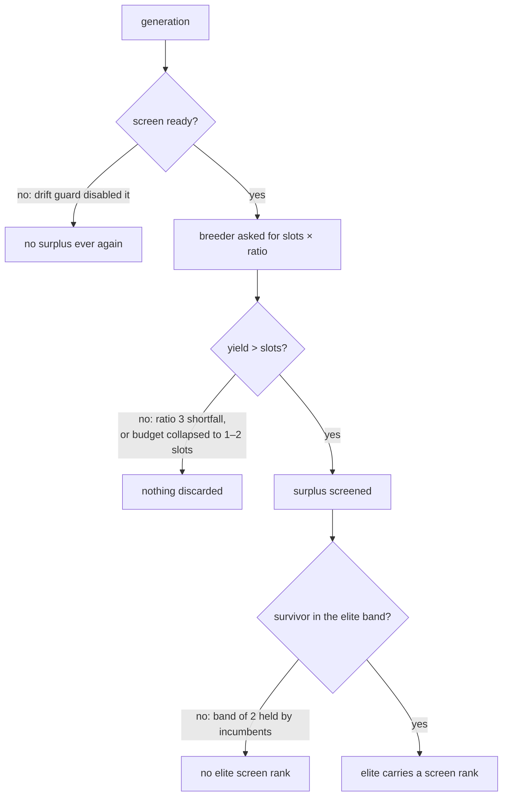

## Summary

`test/NEAT/PreSelectionWiring.ts` drove an **unseeded** evolve run for up to 15
generations and then asserted on a state that run was never guaranteed to reach.
Under a contended gate it did not reach it: 24 of 256 concurrent runs failed on
_"no elite carried a screen rank"_ or _"the stage discarded nothing"_.

Three links had to hold for those assertions, and none held by construction:

| Link                                                                                | Why it broke under load                                                                                                                                                                             | Fix                                                                             |
| ----------------------------------------------------------------------------------- | --------------------------------------------------------------------------------------------------------------------------------------------------------------------------------------------------- | ------------------------------------------------------------------------------- |
| The breeder must answer the surplus request with **more** offspring than the budget | It builds only as many _distinct_ offspring as the population can yield, so a request of `slots × 3` came back at or below the budget — and a batch no larger than the budget has no surplus to cut | `ratio: 6`, which leaves the yield room to exceed the budget                    |
| The bred slice must have **slots to fill**                                          | Completed training tasks land in the population and are subtracted from the offspring budget; a loaded machine returning several generations of them at once left a budget of one or two            | `trainPerGen: 0` — gradient steps are not the seam these tests cover            |
| A screened survivor must **enter the elite band**                                   | `screenRankOf` only answers for the last two generations and elites carry over unchanged, so a band of two can be the same long-lived creatures for a whole run                                     | `elitism: 8`, a band a fresh survivor only has to beat the eighth-best to enter |

`trainPerGen: 0` makes the surrogate's residuals more one-directional, which
fired the drift kill switch inside the cap in 1 of 96 measured runs — trading
one flake for another — so `driftGenerations` is pushed past the cap. That guard
keeps its own coverage in `test/surrogate/DriftMonitor.ts`.

The cap's failure message now carries what the stage actually did (offspring
bred, kept, discarded, and the generations the screen was ready in), so a future
flake names the link that broke rather than the cap it ran out of.

No production code changed — the diff is confined to the one test file.

Closes #4018.

## Evidence

Backend/test-only change — there is no web interface to screenshot. The evidence
is a measured before/after under the same contention the issue reports, using
the issue's own methodology (concurrent `deno test` processes on a loaded
machine).

Harness: 64 concurrent `deno test` processes of
`test/NEAT/PreSelectionWiring.ts`, 4 rounds, on a 21-core machine.

| Tree                                         | Runs | Failures                                                                                 |
| -------------------------------------------- | ---- | ---------------------------------------------------------------------------------------- |
| Unmodified `test/NEAT/PreSelectionWiring.ts` | 256  | **24** (21 × elite screen rank, 3 × discarded nothing, 1 × the #4010 residual assertion) |
| With this fix                                | 256  | **0**                                                                                    |

An earlier 48 × 2 pass over the unmodified file reproduced the same shapes at a
lower rate (7 of 96), matching the issue's reported 4 of 96.

Diagnostic traces taken during the investigation, from the failing runs:

- `bred 18 offspring at ratio 3, kept 18 … screened out 0` — the yield failing
  to exceed the budget.
- `bred 4 offspring at ratio 6, kept 1 … screened out 3` — the offspring budget
  collapsed to one slot by queued training results.
- `Surrogate DISABLED at generation 7: the surrogate over-predicted in one
  direction for 5 consecutive generation(s)`
  — the drift kill switch ending a run's screening.

## Reproduction

- **symptom** — under parallel load,
  `pre-selection wiring — a real evolve run
  reports the elite screen rank` and
  `pre-selection wiring — a screened-out
  creature never reaches the archive`
  fail at the 15-generation cap with _"no elite carried a screen rank over 15
  generation(s)"_ and _"the stage discarded nothing over 15 generation(s)"_
- **status** — `verified` — both assertions were observed failing against the
  unfixed file (24 of 256 contended runs) and passing after the fix (0 of 256
  contended runs), on the same machine, same harness, back to back
- **regression test** —
  `test/NEAT/PreSelectionWiring.ts::pre-selection wiring
  — a real evolve run reports the elite screen rank`
  and
  `test/NEAT/PreSelectionWiring.ts::pre-selection wiring — a screened-out
  creature never reaches the archive`
  (the flaky tests themselves; the fix makes the state they assert on reachable
  by construction)

## Test Plan

- `test/NEAT/PreSelectionWiring.ts` — modified, not removed or disabled. All 10
  tests still assert exactly what they did; only the run configuration behind
  them changed, plus the diagnostic text of two failure messages.
- Contended reproduction: 64 concurrent processes × 4 rounds = 256 runs, before
  (24 failures) and after (0 failures).
- `deno test test/NEAT/*.ts test/surrogate/*.ts test/config/*.ts` — 1644 passed,
  0 failed.
- `./quality.sh --lint-only` — formatting, lint and bash checks clean.
- `./quality.sh --check-only` — type check clean.
- `./quality.sh --skip-tests` — every gate stage except the test lane, clean.

<!-- vibe-quality-gate-skipped reason="the full ./quality.sh test lane cannot run in this container: it requires the native rust_scorer and refuses to fall back to the WASM scorer (`Native rust_scorer is required (quality.sh default) but was not found`), and NEAT-AI-scorer is not checked out beside this repo. Every other gate stage was run and passed (--lint-only, --check-only, --skip-tests), and the test lane was run manually over test/NEAT, test/surrogate and test/config (1644 passed) plus 256 contended runs of the changed file. CI runs the same checks on the PR." -->
