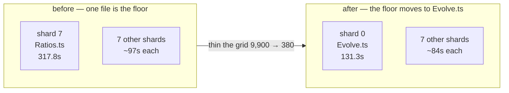

# Thin the hypotenuse training grid so `Ratios.ts` stops being the shard floor

## Summary

`test/NEAT/Ratios.ts` cost **317.8s** of CI test time — 31% of the whole suite,
and the hard floor on every coverage shard plan, because each of its retry
attempts back-propagated over all **9,900** grid points. The suite now samples
the same `0…99` grid every 5 (**380** records), which keeps the held-out probe
row and the generalisation assertion exactly as they were while cutting ~18x of
the work out of every attempt.

Three changes:

1. **`test/NEAT/_hypotenuseDataSet.ts`** (new) — the grid is now a named
   function, `buildHypotenuseDataSet({ step, size, holdOut })`, with the density
   as an explicit, documented knob. It fails loud (`RangeError`) on an unusable
   stride or grid size rather than quietly returning a truncated training set.
2. **`test/NEAT/Ratios.ts`** — builds its data set from that function, and drops
   the retry budget from 240 attempts to 40. At the measured ~75% per-attempt
   success rate even ten attempts would make a spurious failure a one-in-a-
   million event, so 40 keeps enormous headroom while capping a pathological run
   at a couple of minutes instead of hours.
3. **`scripts/test-timings.json`** — the stale `317.784` entry is **removed**
   rather than replaced with an invented number. No CI measurement of the new
   shape exists yet, and an unmeasured file is a state the planner already
   documents and handles (dealt round-robin, charged the mean); the merge job
   republishes the real figure on the next `Develop` run.

The assertion, the probe input `(50, 60)`, the 10% tolerance, the 100-iteration
budget, the `targetError`, the elitism and the single-thread setting are all
unchanged. No test was weakened, commented out or removed.

Closes #4026.

## Evidence

This is a performance change, so before/after numbers, not screenshots. There is
no web interface to capture; the change is test-suite cost.

### Per-file wall clock

Measured on one otherwise-idle machine, same command both sides, under
`--coverage` and with the coverage workflow's backprop configuration
(`NEAT_AI_BACKPROP_ENABLED=0 NEAT_AI_BACKPROP_REQUIRE_FFI=0
NEAT_AI_NATIVE_CORE_BACKPROP=0 NEAT_RUST_DISCOVERY_OPTIONAL=true DENO_TEST=1`).
That configuration matters: with the native backprop binary absent and _not_
disabled, training fails fast and the suite finishes in ~3s, which is not what
CI runs.

```text
deno test -A --coverage=… --config ./deno.json test/NEAT/Ratios.ts

before (dense 9,900-record grid)   140s   (one run)
after  (380-record grid)             6s, 14s, 15s, 9s  (four runs)
```

### Per-attempt cost, isolated

A throwaway harness ran the evolve attempt directly, same options, varying only
the grid stride, to separate per-attempt cost from the retry count:

| stride | records | mean ms/attempt | success rate |
| -----: | ------: | --------------: | -----------: |
|      1 |   9,900 |          81,117 |   2/3 (0.67) |
|      5 |     380 |           4,406 |   6/8 (0.75) |
|     10 |      90 |           2,143 | 10/12 (0.83) |
|     20 |      25 |           1,468 | 10/12 (0.83) |

Stride 5 was chosen over the cheaper strides: below it the fixed per-generation
overhead (~1.3s) dominates, so the extra saving is small, while 380 points keeps
the regression problem densely and realistically sampled. The per-attempt
success rate does not degrade — if anything it improves — so the retry loop
converges in the same one-or-two attempts it always did.

### Shard plan

```bash
deno run --allow-read scripts/shard_test_files.ts --plan --total=8
```

```text
before                                   after
shard 0:   9 files, 131.3s               shard 0:   9 files, 131.3s
shard 1: 235 files,  96.4s               shard 1: 212 files,  83.8s
shard 2: 233 files,  97.2s               shard 2: 213 files,  82.8s
shard 3: 226 files,  97.9s               shard 3: 212 files,  83.3s
shard 4: 232 files,  97.9s               shard 4: 132 files,  83.8s
shard 5: 233 files,  97.9s               shard 5: 210 files,  83.8s
shard 6: 234 files,  97.2s               shard 6: 210 files,  83.8s
shard 7:   8 files, 317.8s               shard 7: 212 files,  83.3s

slowest 317.8s, even split 129.2s        slowest 131.3s, even split 89.5s
total 1033.7s                            total 716.0s
```

`--verify --total=8` still reports
`OK: 1410 files covered once across 8
shards`. The floor is now
`test/NEAT/Evolve.ts` at 131.3s — the shape the issue asked for.



### Coverage is preserved

The issue's constraint was "not make the tests weaker — keep the coverage". Line
coverage of the suite run in isolation, same command both sides:

```text
before: 542 files, 23,886 / 24,334 lines hit across two runs
after:  543 files, 24,072 lines hit (single run)
        24,697 lines hit across three runs (union)
```

The two baseline samples differ from each other by 448 lines, so the single-run
after figure sits inside the baseline's own run-to-run spread — evolution is
stochastic, so which compaction and breeding branches a run reaches varies with
the mutations it happens to draw. The union of three _new_ runs (35s in total)
reaches **more** lines than the one 140s baseline run, which is the point: the
same paths are still reachable, they are just reached for a fifteenth of the
cost. The extra file is the new `_hypotenuseDataSet.ts` helper.

## Test Plan

Added — `test/NEAT/HypotenuseDataSet.ts`, seven "what" tests that call
`buildHypotenuseDataSet` and assert on the records it returns:

- `default grid holds out the probe row` — the invariant that makes the suite's
  assertion a generalisation check rather than a lookup.
- `every record is the true hypotenuse` — the label is `sqrt(i² + j²)`.
- `the stride spans the whole grid` — both axes still run `0 … size - step`, so
  thinning the grid did not narrow its range; pins the 380-record count.
- `step 1 reproduces the dense grid` — the previous 9,900-record shape is still
  reachable, so nothing was lost, only defaulted away from.
- `a hold-out off the grid keeps every row` — edge case.
- `rejects an unusable stride` / `rejects an unusable grid size` — error paths;
  `0`, negative, fractional, `NaN` and over-size values raise `RangeError`
  instead of silently yielding an empty or single-point training set.

These were written first and observed failing
(`Module not found
"…/_hypotenuseDataSet.ts"`) before the helper existed.

Unchanged — `test/NEAT/Ratios.ts::hypotenuse` still asserts the creature
approximates `hypotenuse(50, 60) ≈ 78.1` to within 10%, on an input held out of
training. It passed on every run of this change (4 coverage runs plus the final
sweep).

Also run, because the change edits the committed timings map:
`test/ci/CoverageTestTimings.ts`, `test/scripts/ShardTestFiles.ts`,
`test/ci/CoverageShardMatrix.ts` — 38 tests, all pass.

```bash
NEAT_AI_BACKPROP_ENABLED=0 NEAT_AI_BACKPROP_REQUIRE_FFI=0 \
NEAT_AI_NATIVE_CORE_BACKPROP=0 NEAT_RUST_DISCOVERY_OPTIONAL=true DENO_TEST=1 \
deno test -A --parallel --config ./deno.json \
  test/NEAT/Ratios.ts test/NEAT/HypotenuseDataSet.ts test/ci/ test/scripts/
# ok | 8 passed | 0 failed (3s)   [test/ci and test/scripts counted separately: 38 passed]
```

## Quality gate

`./quality.sh --skip-tests` passes end to end (exit 0): `deno fmt`,
`deno lint --fix`, bash syntax, `deno check` over 2,838 files, and the WASM sync
against the pinned `neatCore.rev`.

The **test stage** of the full gate could not run in this container.
`quality.sh` requires the native scorer for every test run (Issue #3871) and
fails loud rather than falling back:

```text
❌ Native rust_scorer is required (quality.sh default) but was not found.
   Tests will not silently fall back to the WASM scorer.
```

There is no `NEAT-AI-scorer` sibling checkout here and no flag to waive the
requirement, so the tests were run directly with the coverage workflow's own
environment instead — which is how CI runs them (WASM scorer, no `rust_scorer`).
CI's `coverage.yaml` runs the full suite on this PR.

<!-- vibe-quality-gate-skipped reason="quality.sh test stage requires the native rust_scorer binary (Issue #3871); no NEAT-AI-scorer sibling checkout exists in this container and the gate provides no waiver flag. fmt/lint/bash/check/wasm stages all ran and passed (exit 0); the affected tests were run directly under the coverage workflow's environment." -->

## Docs

`docs/troubleshooting/CI.md` named `test/NEAT/Ratios.ts` as the shard floor and
pointed at this issue; that note now records the floor moving to
`test/NEAT/Evolve.ts`, and the refresh section records that one timings entry
was deleted rather than re-measured, with the reasoning.
