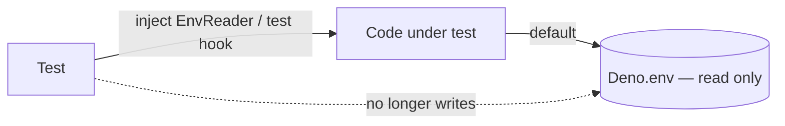

## Summary

Twelve test files set or deleted `Deno.env` variables inside `Deno.test()`
bodies. `deno test --parallel` runs every file in one process, so those values
leaked into unrelated tests running at the same time. Each case now passes the
value in directly, and the code under test gains an optional env-reader
parameter (default `Deno.env`) or a per-isolate test hook. Production
behaviour does not change. Closes #4034.

| Test file(s) | Seam added |
| --- | --- |
| `WorkerHandlerBaseInitTimeout.ts` | `getInitTimeoutMs(getEnv?)` |
| `WorkerThreadCapConfig.ts`, `DiscoveryHostPoolSizing.ts` | `createNeatConfig(options, env?)` → Discovery envelope + analysis budget |
| `TrainingTaskCapture.ts` | `scheduleTraining(…, selection?, captureEnv?)` |
| `ScorerGpuEnv.ts` | `scorerGpuEnv(getEnv?)` (test fixture) |
| `DiscoveryRustFlush.ts`, `DiscoveryTimeout.ts` | `DiscoverStructureDeps.env?` read by `DataRecorder.shouldAwaitCleanup` |
| `RustScorerIntegration.ts` | `__setRustScorerTmpDirForTests` (per-isolate, reset by `__resetRustScorerBridgeForTests`); both bridges now share `resolveScorerTmpDir` |
| `RustScorerBridgeHardening.ts` | asserts on an existing parent variable instead of setting a sentinel |
| `InFlightTestLog.ts` | `beginInFlight(name, getEnv?)` |
| `RustDiscoveryCStringLimit.ts`, `RustDiscoveryStringifyFailure.ts` | dropped a `finally` that wrote an unchanged value back to the shared env (their `Deno.env.get` stubs are isolate-local) |

`AGENTS.md` §🧪 Testing now says not to mutate `Deno.env` in tests and lists
the three accepted patterns.

`./quality.sh` also bumped `@std/uuid`, `@std/yaml` and `@std/testing` (patch
and minor versions) in `deno.json`/`deno.lock`.

## Evidence

This is a backend/test-only change with no UI.

- `deno test -A --parallel` over `test/config`, `test/workers`, `test/score`,
  `test/scripts`, `test/ErrorGuidedStructuralEvolution`,
  `test/NEAT/TrainingTaskCapture.ts` and `test/NEAT/NeatConfig.ts`:
  **1561 passed, 1 failed, 80 ignored**. The one failure is
  `test/config/RetiredExperimentalOptions.ts` ("neat_ai_backpropagation
  library/binary was not found"). It fails the same way on unmodified
  `origin/Develop` in this container, so it is caused by the environment, not
  this change.
- `./quality.sh --skip-tests` passes (fmt, lint, bash syntax, `deno check`,
  WASM verified).
- After the change, no test calls `Deno.env.set` / `Deno.env.delete` in the
  shared process. The only remaining calls are in the child processes of
  `RustScorerOption.ts` and `RustScorerStrictDefault.ts`.

<!-- vibe-quality-gate-skipped reason="full ./quality.sh test stage exits at pre-flight: native rust_scorer binary not present in this container; ran --skip-tests plus the affected test files directly, CI runs the full gate" -->

## Test Plan

- Rewrote the tests listed above to inject the environment instead of setting
  it.
- New: `WorkerHandlerBaseInitTimeout.ts::defaults to the real environment when not injected`
- New: `ScorerGpuEnv.ts::keeps the safe default when the environment is unreadable`
- New: `RustScorerIntegration.ts::the test override is cleared by the bridge reset`
- New: `InFlightTestLog.ts::is a no-op when the directory env is blank`
- `DiscoveryTimeout.ts` cases are type-checked but ignored here because they
  need the Rust discovery library. CI runs them.
