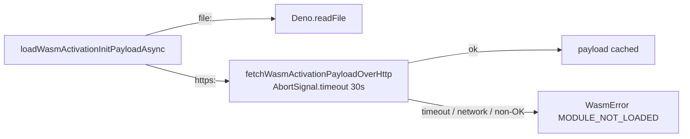

## Summary

The `https:` branch of `loadWasmActivationInitPayloadAsync` fetched the WASM
activation glue and binary with no `AbortSignal`, so a CDN that accepted the
connection and then stalled hung every worker-pool start-up indefinitely. The
fetch now lives in `fetchWasmActivationPayloadOverHttp`, which bounds both
requests **and** their body reads with one `AbortSignal.timeout`
(`WASM_PAYLOAD_FETCH_TIMEOUT_MS = 30_000`). Timeouts, network failures and
non-OK responses all reject with `WasmError("MODULE_NOT_LOADED")`; the original
error is kept as `cause`. Closes #4035.

## Evidence

Backend-only change; no UI. The new tests drive the fetch path through an
injected `fetch` seam, including a peer that never answers until aborted.

`./quality.sh --rust-scorer-bin=…` passed:
`ok | 9823 passed | 0 failed | 41 ignored`.

## Test Plan

- Added `test/workers/WasmPayloadFetchTimeout.ts`:
  - a stalled peer rejects with `WasmError` `MODULE_NOT_LOADED` ("timed out
    after 5ms")
  - every payload fetch carries an `AbortSignal`
  - a healthy peer returns the JS source and WASM bytes
  - a non-OK response still rejects with `WasmError`
  - a network failure is wrapped in `WasmError` with its `cause`
  - an invalid timeout (0, negative, NaN, Infinity) throws `RangeError`
- Existing `test/workers/WasmActivationPayload.ts` and
  `test/wasm/WasmPayloadAvailability.ts` still pass.
- Updated `docs/troubleshooting/WASM.md` with the new timeout behaviour.
