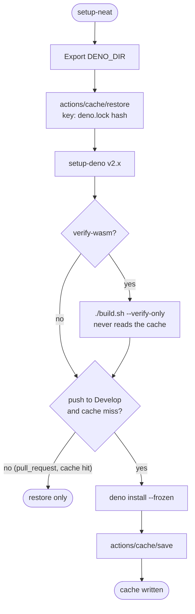

# PR Summary — Issue #4040: cache `DENO_DIR` in the shared CI setup action

## Summary

Closes #4040.

Every NEAT-AI CI job used to re-download the whole jsr/npm dependency graph. The
shared composite action `.github/actions/setup-neat` now:

- points `DENO_DIR` at `${RUNNER_TEMP}/deno-dir`;
- **restores** it on every run with `actions/cache/restore`, keyed on
  `deno-<os>-<arch>-hashFiles('deno.lock')`, with a prefix restore-key;
- **writes** it only on `push` to `Develop` — a `deno install --frozen` warm-up
  followed by `actions/cache/save` — so a pull request can never poison the
  entry that Develop and later PRs restore;
- leaves `./build.sh --verify-only` unchanged and independent of the cache.

Both cache actions are pinned to `actions/cache@v6.1.0`
(`55cc8345863c7cc4c66a329aec7e433d2d1c52a9`), resolved via `gh api`. A composite
action has no post hook, so the save runs inline after the warm-up. The
standalone setup-deno steps in `deno-outdated.yml`, `osv-scan.yml` and
`update-package-version.yml` stay out of scope, as the issue asks.

`docs/CI_EXTERNAL_NEAT_AI_CORE.md` documents the cache behaviour.

## Evidence

## Test Plan

- [x] `test/ci/DenoDependencyCache.ts` (new) parses the action YAML and asserts:
  - `DENO_DIR` is exported before setup-deno runs;
  - the restore step is unconditional and keyed on `deno.lock`;
  - there is exactly one save step, gated on push to Develop, with no combined
    `actions/cache` step;
  - the warm-up is gated the same way and sits before the save;
  - the verify step is unchanged.

  All five tests fail against the unfixed action and pass after the change.
- [x] `deno test -A test/ci/*.ts` — the whole CI suite passes, including
      `WorkflowActionPinning.ts`, which scans composite actions for SHA pins.
- [x] `./quality.sh` — exit 0; 9828 passed, 0 failed, 41 ignored.
