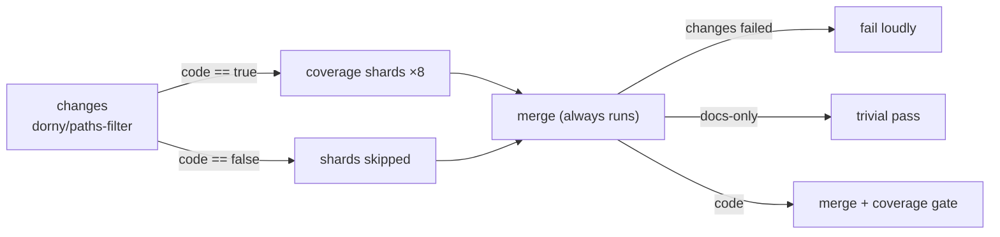

## Summary

`coverage.yaml` used to run all eight coverage shards on every PR, docs-only
ones included. A new `changes` job runs a SHA-pinned `dorny/paths-filter`
(v4.0.3) against an explicit **include list** of code paths, and the shards run
only when one of those paths changed. The required `merge` job ("Merge coverage
& results") still runs on every PR:

- **Code changed:** it merges and gates coverage as before.
- **Docs-only PR:** it passes trivially.
- **`changes` job failed:** it fails loudly. A skipped job reports success, so a
  failed filter is not allowed to pass for a docs-only result.

`quality.yml` stays unscoped because its hygiene checks apply to every change.
Closes #4041.

The include list is `src/**`, `test/**`, `bench/**`, `wasm_activation/**`,
`scripts/**`, `.github/actions/setup-neat/**`, `deno.json`, `deno.lock` and
`.github/workflows/coverage.yaml`. A path that is not on the list does not
trigger coverage. `docs/troubleshooting/CI.md` documents this.

## Checklist

- [x] Test first: `test/ci/CoveragePathScoping.ts`
- [x] `changes` job with a pinned action, read-only permissions and
      `timeout-minutes: 60`
- [x] Shards gated on `needs.changes.outputs.code`
- [x] `merge` always runs, fails when `changes` fails, and guards each coverage
      step with `RUN_COVERAGE`
- [x] Docs updated: `docs/troubleshooting/CI.md`, with a Mermaid diagram

## Test Plan

- `deno test -A test/ci/*.ts`: 299 passed, including the 7 new
  `CoveragePathScoping` cases.
- `actionlint .github/workflows/coverage.yaml`: clean.
- `./quality.sh --skip-tests --skip-discovery`: passed (fmt, lint, bash syntax,
  type-check, WASM verify).

<!-- vibe-quality-gate-skipped reason="the full ./quality.sh fails in this container before touching this change: the native rust_scorer binary is missing, and the discovery library check reports 'file not found' after a successful build; ran --skip-tests --skip-discovery (green) plus the CI test suite instead" -->

## Follow-up (out of scope)

Semgrep, shellcheck and dependency-review could get the same path scoping. They
are left unchanged here, as the issue asked.

## Security self-check

- [x] No secrets or hidden files staged.
- [x] Third-party action pinned to a commit SHA
      (`dorny/paths-filter@ceb8a2b8…`).
- [x] The `changes` job has least-privilege permissions (`contents: read`,
      `pull-requests: read`).
- [x] Workflow expressions pass through `env:` and are never interpolated into
      `run:` scripts.
