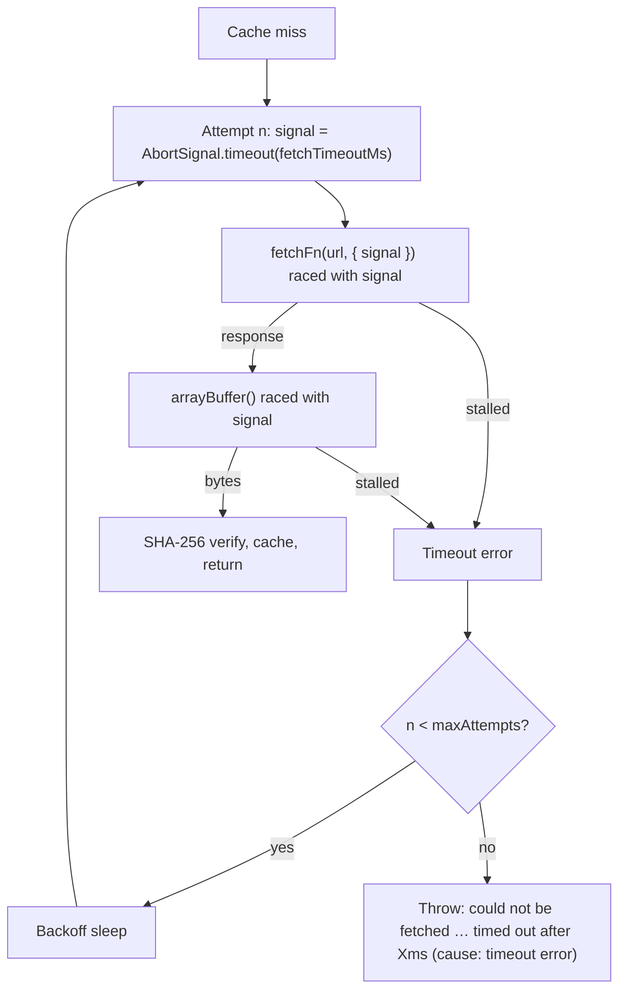

## Summary

A stalled jsr.io connection on a WASM bundle cache miss could hang start-up
forever, because `fetchWithRetry` passed no `signal` to the request or the body
read. Each attempt now creates its own `AbortSignal.timeout(fetchTimeoutMs)`.
That signal goes to `fetchFn` and also bounds `arrayBuffer()`. A timed-out
attempt is retried by the existing backoff. Once the attempts run out, the load
fails loud with a message that names the timeout. The default bound is the new
`WASM_BUNDLE_FETCH_TIMEOUT_MS` (60 s), and a caller can override it with the new
`LoadWasmBundleOptions.fetchTimeoutMs`. Closes #4048.

## Spec

### Intent and Rationale

- A cache miss happens on every NEAT-AI version bump, and GRQ now loads the
  bundle only through this function (GRQ #4957). An unbounded attempt meant the
  backoff never got its next try and start-up hung with no log line.
- The fix follows the sibling Issue #4035 fix in
  `src/workers/WasmActivationPayload.ts`, which uses one `AbortSignal.timeout`
  and a positive-finite validation.

### Essential Design Decisions

- The signal is raced against both the `fetchFn` promise and `arrayBuffer()`
  (`untilAborted`). The bound therefore holds even when an injected `fetchFn` or
  a body stream ignores the signal, not only with the real `fetch`.
- A fresh signal is created per attempt, so a retry is never started on an
  already-aborted signal.
- 60 s per attempt allows a cold fetch of the ~1 MB bundle at about 17 KB/s.
  Worst case with defaults is 5 × 60 s plus about 3.75 s of backoff before the
  load fails loud.
- The final error message now ends with the last attempt's message for every
  failure kind, not only timeouts. The existing "could not be fetched" phrase is
  kept.

### Undiscoverable Facts

- The only production caller, `initWasmActivation`
  (`src/wasm/WasmModuleLoader.ts:600`), passes no options, so the 60 s default
  applies across the fleet. The override is a per-call option, not an
  environment variable.

## Evidence

Backend-only change; no UI files touched.

- `timeout 300 deno test -A test/wasm/WasmBundleCache.ts test/wasm/WasmBundleIntegrity.ts test/wasm/WasmInitDiagnostics.ts < /dev/null`
  → `ok | 30 passed | 0 failed` on the final head.
- The production `fetch` is not replaced by a stand-in for its own behaviour.
  The tests inject a `fetchFn` that ignores its signal, which is stricter than
  the real `fetch` (that one aborts on the signal). `untilAborted` bounds both.

**Docs sweep** — grep: `fetchWithRetry`, `bounded backoff`,
`WASM_BUNDLE_FETCH_TIMEOUT_MS`, `fetchTimeoutMs`, `loadWasmBundleBytes`,
"retr\w* with bounded"; section:
`docs/troubleshooting/WASM.md#-bundle-integrity-check-issue-3680`; updated:
`docs/troubleshooting/WASM.md` (diagram node and new "Stalled fetch" paragraph),
`CHANGELOG.md` (Unreleased → Fixed), and the module and function doc comments in
`src/wasm/WasmBundleCache.ts`. `CHANGELOG.md:958` (the Issue #3419 entry,
"fetches with **bounded exponential backoff**") — still true because the backoff
is unchanged.

## Reproduction

- **symptom** — on a cache miss, a `fetchFn` that never answers, or a body that
  never completes, made `loadWasmBundleBytes` wait forever. The backoff never
  ran its next attempt and no error was raised.
- **status** — `verified`. The new tests failed against the unfixed
  `src/wasm/WasmBundleCache.ts` from the base branch (run with `--no-check`,
  with only the `WASM_BUNDLE_FETCH_TIMEOUT_MS` export stubbed in so the test
  file loads). The "never resolves", "body never completes" and "timed-out
  attempt is retried" tests failed with
  `Promise resolution is still pending but the event loop has already resolved`.
  The signal and invalid-timeout tests failed their assertions. All pass after
  the fix.
- **regression test** —
  `test/wasm/WasmBundleCache.ts::WasmBundleCache: Issue #4048 — a fetch that never resolves (and ignores its signal) fails within the bound`

## Acceptance Criteria

<!-- vibe-spec-review inputs="diff+issue-body" -->

- **met** — Each attempt's fetch and body read are bounded, e.g.
  `fetchFn(wasmUrl, { signal: AbortSignal.timeout(ms) })`, with the same signal
  covering `arrayBuffer()`. The bound is generous enough for a cold fetch of the
  bundle on a slow link. It is overridable, and a timed-out attempt is retried
  by the existing backoff. — evidence: `src/wasm/WasmBundleCache.ts`
  (`fetchWithRetry`, `untilAborted`, `fetchTimeoutMs`),
  `test/wasm/WasmBundleCache.ts::WasmBundleCache: Issue #4048 — a timed-out attempt is retried and the next attempt succeeds`,
  `test/wasm/WasmBundleCache.ts::WasmBundleCache: Issue #4048 — every attempt passes an abort signal to fetchFn`
  — reviewer: met
- **met** — Exhausting the retries still fails loud, and the error names the
  timeout as the cause. — evidence:
  `test/wasm/WasmBundleCache.ts::WasmBundleCache: Issue #4048 — a fetch that never resolves (and ignores its signal) fails within the bound`
  (asserts message and `cause` both say "timed out after 1ms") — reviewer: met
- **met** — A test injects a `fetchFn` that never resolves (or a body that never
  completes) and asserts the load fails within the bound, without real waiting.
  — evidence:
  `test/wasm/WasmBundleCache.ts::WasmBundleCache: Issue #4048 — a fetch that never resolves (and ignores its signal) fails within the bound`,
  `test/wasm/WasmBundleCache.ts::WasmBundleCache: Issue #4048 — a body that never completes fails within the bound`
  (1 ms bound, injected no-op sleep) — reviewer: met
- **unrequested** — `fetchTimeoutMs` validation (`RangeError` for a non-positive
  or non-finite value) and its test — reviewer: unrequested — reason: the
  override must fail loud on a bad value. A `NaN` or `0` would otherwise abort
  every attempt immediately, or silently disable the bound. This mirrors the
  #4035 sibling.

## Standards Review

<!-- vibe-standards-review inputs="diff+CODING-STANDARDS.md" -->

The repository has no `CODING-STANDARDS.md`. The reviewer used `AGENTS.md` and
`docs/ENGINEERING_PRINCIPLES.md`, the repository's documented standards.

- **clean** — Checked and found compliant: logging via `getLogger()` only, no
  timing APIs and no `Deno.env.set` in tests, and fail-fast on configuration
  errors. The docs and CHANGELOG match the shipped strings. No existing test
  assertions are removed. No workflows or external stubs are involved.
  (Optional, not chased: wrapping the abort reason in a new `Error` hides its
  `DOMException` type, but the reason is still kept as `cause`.)

## Test Plan

- Added six tests to `test/wasm/WasmBundleCache.ts`: never-resolving fetch,
  never-completing body, timed-out attempt retried then succeeding, abort signal
  passed to `fetchFn`, invalid `fetchTimeoutMs` refused (with the same call
  accepted at `fetchTimeoutMs: 1000`), and the default bound value.
- Existing tests: no assertions removed or changed. The diff to
  `test/wasm/WasmBundleCache.ts` only adds an import and new tests.
- `timeout 300 deno test -A test/wasm/WasmBundleCache.ts test/wasm/WasmBundleIntegrity.ts test/wasm/WasmInitDiagnostics.ts < /dev/null`
  on the final head: 30 passed, 0 failed.
- `./quality.sh --skip-tests --skip-discovery < /dev/null` on the final head
  passed: fmt, lint, bash syntax, type check and WASM sync. The run's routine
  `bump-deps.sh` rewrite of `deno.json`/`deno.lock` was reverted because this
  change adds no dependency.

<!-- vibe-quality-gate-skipped reason="environment: the test lane requires the native rust_scorer binary (Issue #3871), which is not on PATH and has no sibling NEAT-AI-scorer checkout on this host; the discovery verification also failed with 'Discovery library file not found' after a successful build. Static stages passed and the touched test files passed; CI runs the full gate." -->

Entry point checked: `loadWasmBundleBytes` /
`loadWasmBundleBytesWithDiagnostics` → `fetchWithRetry`. Each flip below was
made at that call path.

**Branch outcomes:**

- `src/wasm/WasmBundleCache.ts:304` — fetch raced with signal (stalled request
  rejects) —
  `…a fetch that never resolves (and ignores its signal) fails within the bound`
  — reverting to `fetchFn(wasmUrl)` turned it red (pending-promise leak),
  together with the "retried" and "abort signal" tests.
- `src/wasm/WasmBundleCache.ts:311` — body read raced with signal (stalled body
  rejects) — `…a body that never completes fails within the bound` — reverting
  to `response.arrayBuffer()` turned it red.
- `src/wasm/WasmBundleCache.ts:315` — `signal.aborted` true → timeout error;
  false → original error kept — `…a fetch that never resolves…` /
  `…cache miss with exhausted retries fails loud` (non-timeout cause preserved)
  — flipping to `if (false)` turned the two timeout tests red.
- `src/wasm/WasmBundleCache.ts:338` — final message carries the last cause
  (`Error` arm; `String()` arm only for non-`Error` throws) —
  `…a fetch that
  never resolves…` — dropping the interpolation turned it red.
  The non-`Error` arm has no dedicated test: `fetch` and the abort machinery
  always reject with an `Error` or `DOMException`.
- `src/wasm/WasmBundleCache.ts:398` — invalid timeout → `RangeError`; valid →
  proceeds — `…an invalid fetchTimeoutMs is refused` — flipping to `if (false)`
  turned it red.
- `src/wasm/WasmBundleCache.ts:267` — `untilAborted` early reject on an
  already-aborted signal — not reachable from `fetchWithRetry`, which always
  passes a fresh signal. It is a defensive guard with no dedicated test.

🤖 Generated with [Claude Code](https://claude.com/claude-code)
