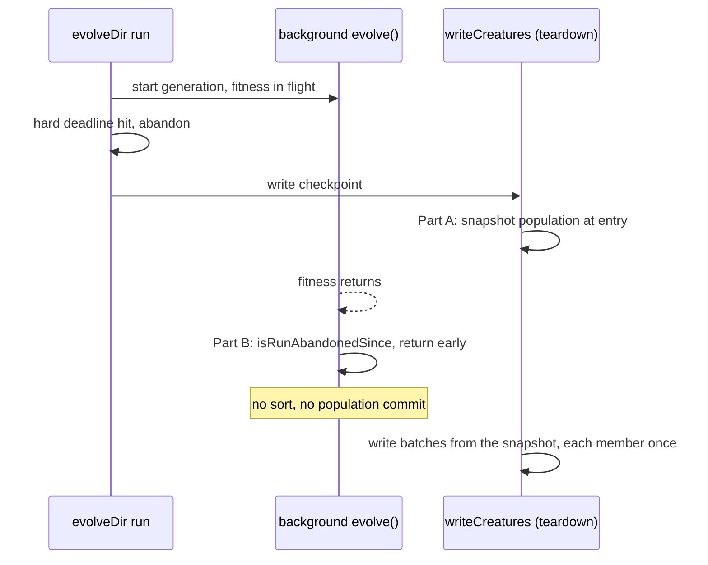

# Deadline-abandoned generation no longer re-sorts the population under the teardown checkpoint write (Issue #4052)

## Summary

Closes #4052

After a hard-deadline abandon, the background `neat.evolve()` keeps running.
When its fitness await finally returns it called
`sortCreaturesByScore(neat.population)` in place, while the teardown
`writeCreatures` was iterating that same array across
`await Promise.all(batch)`. The checkpoint could therefore duplicate some
members and drop others.

Two changes close it:

- **Part A** — `CheckpointWriter.writeCreatures` snapshots `source.population`
  at entry and iterates the snapshot.
- **Part B** — `evolve()` checks `neat.isRunAbandonedSince(scheduledEpoch)` as
  soon as fitness returns and returns a valid `EvolveResult` before anything
  mutates `neat.population`.

Dependency note: the branch also carries the `bump-deps.sh` commit (a2b21f72),
so this PR does change dependencies — `@stsoftware/tags` moves from
`jsr:@stsoftware/tags@1.0.24` to `@1.0.34` in `deno.json` and `deno.lock`, and
the NEAT-AI-core pin (`neatCore.rev` / `assetSha256`) moves to
`0d3231b8e654356f1c444c85d31beccb82354c07` with the matching
`wasm_activation/pkg` bundle and `src/wasm/WasmBundleSha256.ts`. The package
version in `deno.json` is bumped from 7.0.51 to 7.0.52.

## Spec

### Intent and Rationale

- An abandoned generation must not mutate shared state that the teardown is
  reading; a checkpoint holds every member of the population exactly once.
- Two independent layers: the writer is robust to a mutating source (Part A),
  and the producer stops mutating once abandoned (Part B).

### Essential Design Decisions

- Part B returns through a small `abandonedGenerationResult` helper so callers
  still receive a well-formed `EvolveResult` rather than `undefined`.
- The #4050 / #4051 guard in the population-commit path is kept; it covers
  abandonment that happens after this new check.
- The snapshot copies the array (membership and order), not the creatures;
  creatures are not cloned.

### Undiscoverable Facts

- The #4050 / #4051 guard only skipped the population commit, which runs after
  the in-place sort. The sort was the unguarded mutation.

## Evidence

Tests (paths relative to the repository root):

- `test/creature/CheckpointWriteSnapshot.ts` — `writeCreatures` writes each
  member once when the source population is reversed in place mid-write, and
  when it is re-sorted by score mid-write (#4052).
- `test/NEAT/EvolveAbandonedAfterFitness.ts` — an abandon during fitness leaves
  `neat.population` in its original order, and a checkpoint written while the
  abandoned generation finishes holds every member exactly once (`batchSize: 2`,
  `writeTextFile` seam with a short delay, sorted score tags compared). The
  wall-clock hard deadline is a fixed constant (`PAST_HARD_DEADLINE_MS`); no
  timing API is used in the tests.

**Docs sweep** — grep: `writeCreatures`, `sortCreaturesByScore`,
`isRunAbandonedSince`, `abandon\w*`, `hard deadline`, `checkpoint` (across
`README.md`, `docs/` excluding `docs/archive/`, every `*/README.md`, `AGENTS.md`
and `src`); section: `docs/TIMEOUTS.md#-what-each-phase-does-at-the-hard-cap`
(the "The generation itself" bullet), also read
`docs/TIMEOUTS.md#-the-post-loop-teardown-is-bounded-too-grq-4472`; updated:
`docs/TIMEOUTS.md` — the "The generation itself" bullet now says the abandoned
generation returns before sorting or committing `neat.population` once fitness
returns, and that `writeCreatures` iterates a snapshot taken at entry. Code hits
re-read and left in place, each still true: `src/NEAT/Neat.ts:955`,
`src/NEAT/Neat.ts:1038`, `src/creature/BoundedEvolveTeardown.ts:13`,
`src/creature/CreatureTraining.ts:743`, `src/config/TrainingEvent.ts:122`,
`src/creature/EvolveGenerationTail.ts:182`. Other `isRunAbandonedSince` callers
(the `NeatScheduling.ts` guards) are unchanged. The `writeCreatures` doc comment
gains a paragraph on the snapshot.

Cited issues:

- #4050: evolveDir teardown dies on RangeError 'Invalid array length' in
  CreatureExportBuilder after a deadline abandon — and wipes the checkpoint dir
  first (recurrence of GRQ#4861)
- #4051: Fix RangeError in evolveDir() after hard-deadline abandonment (Issue
  #4050)
- #4052: Deadline-abandoned generation re-sorts neat.population in place while
  the teardown checkpoint write is iterating it, so the checkpoint can duplicate
  some members and drop others

## Reproduction

- **Symptom:** a checkpoint written during teardown after a hard-deadline
  abandon contains duplicated members and is missing others, because the
  population array is re-sorted in place mid-write.
- **Status:** verified — reproduced against the base code by the regression
  tests below.
- **Regression test:** `test/NEAT/EvolveAbandonedAfterFitness.ts` (abandon
  during fitness, `writeCreatures` running while the generation finishes, each
  original member written exactly once) and
  `test/creature/CheckpointWriteSnapshot.ts`.

## Acceptance Criteria

<!-- vibe-spec-review inputs="diff+issue-body" -->

- **met** — Part A: `writeCreatures` snapshots the population at entry —
  evidence: `src/creature/CheckpointWriter.ts:140`,
  `test/creature/CheckpointWriteSnapshot.ts` — reviewer: met
- **met** — Part B: `evolve()` checks `isRunAbandonedSince(scheduledEpoch)` as
  soon as fitness returns and returns before mutating `neat.population` —
  evidence: `src/NEAT/NeatEvolution.ts:328`,
  `test/NEAT/EvolveAbandonedAfterFitness.ts` — reviewer: met
- **met** — Required test: abandon during fitness, run `writeCreatures` while
  the generation finishes, assert each original member is written exactly once —
  evidence: second test in `test/NEAT/EvolveAbandonedAfterFitness.ts` —
  reviewer: met
- **unrequested** — `abandonedGenerationResult` helper in
  `src/NEAT/NeatEvolution.ts` — reviewer: unrequested — reason: the early return
  must yield a valid `EvolveResult`
- **unrequested** — warn log on the early return — reviewer: unrequested —
  reason: fail loud rather than abandon silently
- **unrequested** — `MULTI_OPERATOR_ATTRIBUTION_NOTE` import in
  `src/NEAT/NeatEvolution.ts` — reviewer: unrequested — reason: used by the
  helper to build the result
- **unrequested** — the unit tests in `test/creature/CheckpointWriteSnapshot.ts`
  — reviewer: unrequested — reason: pin Part A directly, independent of the
  evolve path

## Standards Review

<!-- vibe-standards-review inputs="diff+CODING-STANDARDS.md" -->

`CODING-STANDARDS.md` is absent from this repository; the review used
`AGENTS.md` and `docs/ENGINEERING_PRINCIPLES.md`.

- `test/NEAT/EvolveAbandonedAfterFitness.ts` — used `Date.now()` for the hard
  deadline, which the testing policy forbids in `test/` — reason: fixed in this
  diff (replaced with the constant `PAST_HARD_DEADLINE_MS`)
- `test/NEAT/EvolveAbandonedAfterFitness.ts` — a circular `completedBefore + 1`
  assertion — reason: fixed in this diff (now asserts
  `generationsCompleted === 1`)

clean — rules checked: Australian English, no timing APIs or `Deno.env` mutation
in tests, tests call real functions and assert behaviour, no `console.*` in
`src/`, typed errors and fail-loud behaviour, no neuron UUID or semantic version
changes, no new dependencies, no source-grep tests.

## Test Plan

Red-run evidence (change removed on purpose, test run, change restored):

- Part A removed (iterate `source.population` directly): both tests in
  `test/creature/CheckpointWriteSnapshot.ts` and the checkpoint test in
  `test/NEAT/EvolveAbandonedAfterFitness.ts` go red.
- Part B check disabled: the "leaves neat.population in its original order" test
  goes red.
- With both in place: 4 passed, 0 failed.

Run with
`deno test --allow-read --allow-write --allow-env --allow-ffi --allow-net test/creature/CheckpointWriteSnapshot.ts test/NEAT/EvolveAbandonedAfterFitness.ts`.

Branch outcomes:

- `src/NEAT/NeatEvolution.ts:328` abandoned: early return with the population
  untouched — `test/NEAT/EvolveAbandonedAfterFitness.ts` "leaves neat.population
  in its original order"; disabling the check went red.
- `src/NEAT/NeatEvolution.ts:328` not abandoned: continues to the existing sort
  and commit path — covered by the existing evolve tests, which still pass.
- `src/creature/CheckpointWriter.ts:140` snapshot: iterates a stable copy —
  `test/creature/CheckpointWriteSnapshot.ts` (both tests) and the checkpoint
  test in `test/NEAT/EvolveAbandonedAfterFitness.ts`; removing the snapshot went
  red.

Guards on the new path: the early return sits before the sort and any population
mutation, so nothing is half-applied. The existing #4050 / #4051 abandon guard
at `src/NEAT/NeatEvolution.ts:1109` is kept for abandonment after this check.
Callers checked: `writeCreatures` has no changed signature, so every caller gets
the snapshot; `evolve()` callers receive a normal `EvolveResult`.

Removed assertions: none.

Known unrelated failure: `test/config/RetiredExperimentalOptions.ts` already
fails on the base commit.

`./quality.sh --skip-tests --skip-discovery < /dev/null` was clean (format,
lint, type-check, WASM sync). The full test lane was not run here.

<!-- vibe-quality-gate-skipped reason="rust_scorer binary and the discovery library are unavailable in this container; the full ./quality.sh test lane cannot start here. Format, lint, type-check, WASM sync and the targeted tests were run instead" -->
