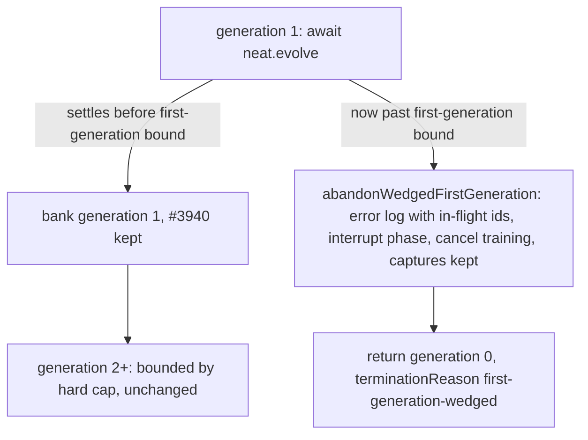

## Summary

`evolveDir()` awaited the first generation with no deadline
(`generationCap = 0`), so a generation 1 that never settled outlived a 5-minute
`--timeout` by 2 h on GRQ-21. Generation 1 now has its own, larger bound:
`start + (T + grace + min(60, 4 × T))` minutes. When the bound is breached, the
run logs a loud, distinct error line,
`[Neat] First generation wedged after Ns … in-flight: <ids>`. It then interrupts
any stalled phase and cancels in-flight training, whose schedule-time captures
are kept. It returns with `generation: 0` and the new `terminationReason`
`"first-generation-wedged"`. A generation 1 that merely runs past the hard cap
but finishes inside the new bound is still completed and banked (Issue #3940).
Closes #4053.

## Spec

### Intent and Rationale

- #3940 exempted generation 1 from the hard cap so that a late generation still
  banks a winner. The exemption had no ceiling, so a generation that never
  settles was bounded only by GRQ's external 2 h stale window. The fix keeps the
  exemption and adds a second, larger bound rather than reverting #3940.
- The fix reuses the existing machinery: `awaitWithinHardDeadline` with a
  different cap for generation 0, and the existing abandon tail. That tail now
  lives in `Neat.shedInFlightWork` and is shared by the hard-deadline and
  wedged-first-generation paths, so both cancel training work and bump
  `abandonEpoch` identically.

### Essential Design Decisions

- The bound is always strictly after the hard cap for `T > 0`: hard cap +
  `min(FIRST_GENERATION_MAX_EXTRA_MINUTES = 60, FIRST_GENERATION_TIMEOUT_MULTIPLE = 4 × T)`
  minutes. That gives T=5 → 30 min, T=15 → 90 min and T=60 → 135 min, where the
  ceiling binds. No timeout configured means no bound, as before.
- The outcome is a normal return with a distinct `terminationReason`, not a
  rejection. The bounded teardown still runs (worker termination and checkpoint
  write), and callers can tell this outcome apart from `hard-deadline`.
- Wedged training tasks are cancelled without quarantine
  (`cancelTrainingWork(…, false)`), matching the hard-deadline path.

### Undiscoverable Facts

- The `deno.json` / `deno.lock` change (`@stsoftware/tags` 1.0.24 → 1.0.34) is
  the quality gate's own internal-dependency bump. It was captured by the
  worker's periodic WIP checkpoint commit. `@stsoftware/*` deps have a 0h
  quarantine. The `deno.lock` entries trace to that manifest change alone.
- The gate requires a native `rust_scorer`. None was installed on this host, so
  it was built from `stSoftwareAU/NEAT-AI-scorer` in `/tmp` and passed with
  `--rust-scorer-bin`.
- What actually wedged inside GRQ-21's generation 1 is still unconfirmed. This
  change bounds the wedge and names it; it does not diagnose it.

## Evidence

Backend-only change: no UI files.

- `test/creature/EvolveDirFirstGenerationWedged.ts` — regression test:
  `timeoutMinutes: 5`, injected clock, `neat.evolve()` never settles on
  generation 0. Asserts that `evolveDir` returns with
  `terminationReason: "first-generation-wedged"` and `generation: 0`, that the
  stuck training task `0c7db7ab` is named in the log and cancelled without
  quarantine, and that the in-flight maps are empty.
- `test/NEAT/HardDeadline.ts` — `computeFirstGenerationDeadlineTS` values for
  T=0/5/15/60, and "strictly after the hard cap" for T in [0.5, 1, 5, 15, 45,
  120].
- `test/NEAT/HardDeadlineFirstGeneration.ts::abandonWedgedFirstGeneration: interrupts a stalled phase and names an empty in-flight set (Issue #4053)`.
- `test/creature/EvolveDirFirstGenerationHardDeadline.ts` — the #3940 guard.
  Generation 1 runs past the hard cap but finishes inside the new bound, and is
  still completed.
- Captures kept: the abandon cancels the task through `Neat.cancelTrainingWork`
  (asserted in the wedge test). A cancelled task keeps its capture
  (`src/NEAT/NeatScheduling.ts`, GRQ #4794), and that is covered by the existing
  `test/NEAT/TrainingTaskCapture.ts::a cancelled task keeps its capture — that is the hung set (GRQ #4794)`.
- Fake: the wedge test's `fakeWorker` stands in for `WorkerHandler`, whose
  `cancelTask(taskID, reason): boolean` and `quarantine(reason)` are what
  `Neat.cancelTrainingWork` calls. The test relies only on the call being made,
  not on what the worker does with it.

**Docs sweep** — grep: `uncapped`, `never abandoned`, `first generation`,
`generation 1`, `#3940`, `hard-deadline`, `terminationReason`; section:
`docs/TIMEOUTS.md` (exception note, deadlines table, "What each phase does at
the hard cap", sequence diagram, "Verifying the guarantee"); updated:
`docs/TIMEOUTS.md`, `CHANGELOG.md`, doc comments in `src/NEAT/HardDeadline.ts`,
`src/NEAT/Neat.ts` (`generationsCompleted`, `abandonInFlightPastHardDeadline`),
`src/creature/CreatureTraining.ts`, `src/creature/EvolveRunStatistics.ts`. Hits
left in place:

- `docs/TIMEOUTS.md:14` — "exactly one carve-out" is still true: the
  first-generation note is that one carve-out.
- `docs/TIMEOUTS.md:153` and `src/creature/BoundedEvolveTeardown.ts:101` /
  `:208` — "uncapped" there means a run with no timeout (replay drain), which is
  unchanged.
- `docs/RACING.md:111` and `src/score/RacingPolicy.ts:19` / `:25` — "never
  abandoned" there is about racing survivors, unrelated.

## Reproduction

- **symptom** — with `timeoutMinutes = 5`, a generation 1 whose `neat.evolve()`
  never settles kept `evolveDir` pending forever; on GRQ-21 the run was silent
  for 2 h 2 m until the external stale-window watchdog killed it.
- **status** — `verified` — with the cap reverted to the base value
  (`generation === 0 ? 0 : hardDeadlineMS`), the regression test failed with
  `never-settling first generation: evolveDir did not return` after its 20 s
  real-time guard. With the fix it passes.
- **regression test** —
  `test/creature/EvolveDirFirstGenerationWedged.ts::evolveDir: a first generation that never settles ends at the first-generation bound`

## Acceptance Criteria

<!-- vibe-spec-review inputs="diff+issue-body" -->

- **met** — Generation 1 gets a bound of its own, separate from (and larger
  than) the later-generation hard deadline … Breaching it is reported as a
  distinct, loud outcome … The #3940 behaviour, keeping generation 1's result
  when it merely runs late, survives for any generation 1 that finishes inside
  that bound — evidence:
  `src/NEAT/HardDeadline.ts::computeFirstGenerationDeadlineTS`,
  `test/NEAT/HardDeadline.ts`,
  `test/creature/EvolveDirFirstGenerationWedged.ts`,
  `test/creature/EvolveDirFirstGenerationHardDeadline.ts` — reviewer: met
- **met** — When generation 1 is abandoned, the in-flight training tasks are
  named and their captures kept, so the wedge can be reproduced — evidence:
  `test/creature/EvolveDirFirstGenerationWedged.ts` (task `0c7db7ab` named in
  the log, `cancelTask` called),
  `test/NEAT/TrainingTaskCapture.ts::a cancelled task keeps its capture — that is the hung set (GRQ #4794)`
  — reviewer: partial — reason: the reviewer judged naming met and "captures
  kept" unverified because the wedge test uses a fake worker. The abandon goes
  through `cancelTrainingWork`, and the existing GRQ #4794 test proves a
  cancelled task's capture survives, so the chain is covered end to end by the
  two tests.
- **met** — Regression test (would have caught this): `evolveDir` with
  `timeoutMinutes=5` and an injected clock, where `neat.evolve()` returns a
  promise that never settles on generation 0 … — evidence:
  `test/creature/EvolveDirFirstGenerationWedged.ts::evolveDir: a first generation that never settles ends at the first-generation bound`
  — reviewer: met
- **missing** — Closing evidence: a quoted sampler log line from a GRQ host
  showing the new first-generation bound firing … once GRQ has bumped to the
  release — reviewer: missing — reason: this needs a released NEAT-AI and a GRQ
  bump, which cannot happen before this PR merges.
- **unrequested** — `deno.json` / `deno.lock` bump of `@stsoftware/tags` 1.0.24
  → 1.0.34 — reviewer: unrequested — reason: the quality gate's automatic
  internal-dependency bump; the fleet policy lands bumps with the substantive
  change.
- **unrequested** — `Neat.shedInFlightWork` extracted from
  `abandonInFlightPastHardDeadline` — reviewer: unrequested — reason: shares the
  abandon tail with the new path instead of copying it. The hard-deadline log
  text and cancel reason are unchanged, and the existing hard-deadline tests
  still pass.
- **unrequested** — `abandonWedgedFirstGeneration` interrupts a stalled
  in-flight phase — reviewer: unrequested — reason: a generation 1 wedged in
  fitness (one of the issue's two candidates) is otherwise left running; this
  mirrors the hard-deadline path.
- **unrequested** — test pinning `FIRST_GENERATION_TIMEOUT_MULTIPLE === 4` and
  `FIRST_GENERATION_MAX_EXTRA_MINUTES === 60` — reviewer: unrequested — reason:
  pins the stated ceiling the issue asked for, alongside the existing
  `HARD_DEADLINE_GRACE_MINUTES` constant test.

## Standards Review

<!-- vibe-standards-review inputs="diff+CODING-STANDARDS.md" -->

This repository has no `CODING-STANDARDS.md`. The reviewer used `AGENTS.md` and
`docs/ENGINEERING_PRINCIPLES.md`.

- **clean** — No violations. Neither document marks any rule as enforced by
  review only. Checked and compliant: the logging policy (`getLogger().error`,
  no `console.*`); the Temporal vs Date guidance (elapsed time via the injected
  `now`); Australian English; no `Deno.env.set`/`delete` in tests; the typed
  termination reason; no numeric ids in logs (UUID suffixes only); principle 7
  (the abandon tail is shared, not duplicated); principle 1 (tests first); and
  that the docs match the code. No assertion is removed from an existing test.
  Optional note: `src/creature/EvolveRunStatistics.ts` had an over-long
  doc-comment line, re-wrapped in this diff.

## Test Plan

- Added `test/creature/EvolveDirFirstGenerationWedged.ts`.
- Extended `test/NEAT/HardDeadline.ts` (six `computeFirstGenerationDeadlineTS`
  tests) and `test/NEAT/HardDeadlineFirstGeneration.ts` (one
  `abandonWedgedFirstGeneration` test).
- Modified `test/creature/EvolveDirFirstGenerationHardDeadline.ts`: the injected
  clock's jump target changed from `start + 60 * 60 * 1000` to
  `computeHardDeadlineTS(start, 1)! + 60_000`. An hour past the start is now
  past the new first-generation bound (start + 6 min for T=1), and Issue #4053
  requires such a generation to be abandoned. Two asserts were added pinning the
  target between the two bounds. No assertion was removed.
- Modified `test/creature/EvolveDirHardDeadline.ts` and
  `test/creature/EvolveDirBoundedTeardown.ts` (PR #4054 review): `startTimeMS`
  changed from `Date.now() - 60 * 60 * 1000` to `Date.now() - 3 * 60_000`, past
  the hard cap (start + 2 min) but inside the first-generation bound (start + 6
  min for T=1), so generation 0 is not raced against an expired deadline on a
  slow host. Each now also asserts `terminationReason === "hard-deadline"`. No
  assertion was removed.
- `deno test --allow-all test/NEAT/HardDeadline.ts test/NEAT/HardDeadlineFirstGeneration.ts test/NEAT/TrainingTaskCapture.ts test/creature/EvolveDirFirstGenerationWedged.ts test/creature/EvolveDirFirstGenerationHardDeadline.ts test/creature/EvolveDirStuckChildDeadline.ts test/creature/EvolveDirHardDeadline.ts test/creature/EvolveDirBoundedTeardown.ts`
  — passed (40 passed, 0 failed).
- `./quality.sh --rust-scorer-bin=<built rust_scorer>` — passed:
  `ok | 9858 passed (5 steps) | 0 failed | 41 ignored`. It ran before the final
  comment-only and unit-test commit. The touched test files were re-run on the
  final head (above).

**Branch outcomes:**

- `src/NEAT/HardDeadline.ts:108` — `!timeoutMinutes` → `undefined` (no bound) —
  `test/NEAT/HardDeadline.ts::computeFirstGenerationDeadlineTS - no timeout configured returns undefined`.
  The bounded outcome is reached by the T=5/15/60 tests. Raising the ceiling
  constant to 6000 turned the T=60 and constants tests red.
- `src/creature/CreatureTraining.ts:667` — generation 0 cap = first-generation
  bound — `test/creature/EvolveDirFirstGenerationWedged.ts` (reverting it to `0`
  went red: `evolveDir did not return`). Setting it to `hardDeadlineMS` turned
  `test/creature/EvolveDirFirstGenerationHardDeadline.ts` red (`got 0`
  generations). The later-generation cap is reached by
  `test/creature/EvolveDirStuckChildDeadline.ts`.
- `src/creature/CreatureTraining.ts:676` — the generation-0 breach calls
  `abandonWedgedFirstGeneration` —
  `test/creature/EvolveDirFirstGenerationWedged.ts`. Forcing the other arm went
  red (`Values are not equal` on `terminationReason`). The later-generation arm
  is reached by `test/creature/EvolveDirStuckChildDeadline.ts`.
- `src/NEAT/Neat.ts:1044` / `:1050` — a stalled phase is named and interrupted —
  `test/NEAT/HardDeadlineFirstGeneration.ts::abandonWedgedFirstGeneration: interrupts a stalled phase and names an empty in-flight set (Issue #4053)`.
  Replacing `if (stalledPhase)` with `if (false)` went red. The no-phase arm is
  reached by `test/creature/EvolveDirFirstGenerationWedged.ts`.
- `src/NEAT/Neat.ts:1045` — an empty in-flight set prints `none` — same unit
  test. Dropping the `none` arm went red. The non-empty arm (`0c7db7ab`) is
  reached by `test/creature/EvolveDirFirstGenerationWedged.ts`.

Guards on the new path to the abandon outcome: it reuses the hard-deadline
path's `shedInFlightWork`, which sets `doNotStartMore`, cancels training, clears
the in-flight maps and bumps `abandonEpoch` (asserted in the unit test). It
deliberately skips `shouldAbandonInFlight`'s one-generation floor, because
generation 1 is exactly the case being bounded. The bounded teardown still runs
after the `break`.

🤖 Generated with [Claude Code](https://claude.com/claude-code)
