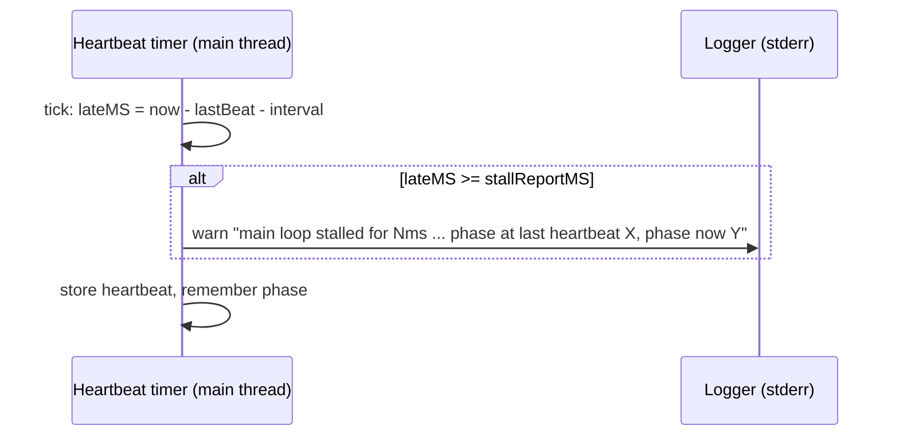

## Summary

PR #4101 (merged, released from 7.0.65) gave the off-main-thread watchdog a
heartbeat and an in-flight phase, but they surface only at a fatal breach. The
field comments on #4096 are mostly non-fatal main-loop blocks of 60 to 110 s
that never reach the deadline, so that instrument never reports them. This PR
adds a non-fatal stall line to the same heartbeat timer: when a tick is late by
`stallReportMS` (default `DEFAULT_STALL_REPORT_MS`, 10 s) the main thread logs
`[Neat] main loop stalled for <ms>ms (heartbeat every <n>ms) at generation
<n|unknown>; phase at last heartbeat: <phase>, phase now: <phase>`.
It does not kill anything. The field logs on 7.1.2 also exclude one hypothesis
(see Evidence). Part of #4096.

Version bump: `VERSION` is not touched by this change; the merged commit records
the final version.

## Not closing #4096

The generation-11 root cause is still neither identified nor excluded
(`partial`), and the closing field evidence needs a deployed run on a release
that carries this change (`missing`).

## Spec

### Intent and Rationale

- The root-cause criterion needs measurements of the blocks that actually
  happen. A fatal-only report cannot give them, so the smallest addition is a
  line from the existing heartbeat timer, with no new thread and no new timer.

### Essential Design Decisions

- The stall check is `describeMainLoopStall`, a pure comparison of two
  `Date.now()` readings made by the heartbeat timer, so it needs no Worker
  change and the breach line is untouched. It uses the wall clock, so a clock
  step can give a false line; that is documented.
- Both the phase at the last heartbeat and the phase now are named. A phase
  marker is cleared when its work returns, so the phase now alone can read
  `untracked` after a block that began inside `mutation`.
- The tick itself is `createHeartbeatBeat`, with the clock, the shared-memory
  readers, the heartbeat store and the logger injected, so the wiring around
  `describeMainLoopStall` is tested in-process with a fixed clock. The arm-time
  heartbeat is stored directly, not through the checking tick, so arming never
  reports.

### Undiscoverable Facts

- The 10 s default is above the 1 s heartbeat interval and well below the 60 to
  110 s blocks in the issue comments. The Worker's own handshake line already
  names those blocks, but only inside a worker-init failure.

## Evidence

Field logs searched: the downstream production log repository, `Develop` at
`66af01e` (2026-11-06), history from 2026-10-29 (the day #4101 merged) with
`git log -S 'lastHeartbeatAgeMs'` and
`git log -G 'Run wedged|event loop blocked'`. Neither matched a line, so no
fatal breach with a heartbeat age has been logged since the heartbeat shipped.
The same window does hold non-fatal blocks on 7.1.2, for example
`GRQ-3-rocket.log` (rocket@GRQ-3, commit `289753f`, load averages
`49.79 58.48 50.43` on 10 CPUs):

```text
[Timing] fitness=34710ms breeding=133950ms breedingWorker=133949ms mainThreadOverlap=0ms ... sort=0ms writeScores=194ms mutation=0ms deduplication=974ms speciation=18ms total=232627ms
[DiscoveryReplayRunner] Worker init failed; falling back to direct execution for this worker slot. Error: [WasmWorkerInit] Worker init: no response after 60s (worker=worker-25). Parent-observed: handshakeMs=60000 parentStallMs=5942 loopBlockedMs=64941 ...
```

In that generation `mutation=0ms` and every itemised main-thread phase is under
1 s, while `total` exceeds `fitness + breeding` by about 63 s, matching
`loopBlockedMs=64941`. So the comment's inference that a long `mutation` phase
causes the block does not hold for this instance, and the block sits in time no
phase accounts for, on a host far over-subscribed. That excludes `mutation` for
that run only. It neither identifies the generation-11 cause nor tells paging
from CPU starvation. The new stall line is what will.


```mermaid
sequenceDiagram
    participant T as Heartbeat timer (main thread)
    participant L as Logger (stderr)
    T->>T: tick: lateMS = now - lastBeat - interval
    alt lateMS >= stallReportMS
        T->>L: warn "main loop stalled for Nms ... phase at last heartbeat X, phase now Y"
    end
    T->>T: store heartbeat, remember phase
```

Issue numbers cited as provenance, each looked up with `gh issue view`: #4066
(event-loop watchdog primitive), #4067 (arm the watchdog in evolveDir, evolveEnv
and evolveRL), #4096 (this issue).

## Reproduction

- **symptom** — main-loop blocks of 60 to 110 s (and one fatal one) left no
  record of how long the loop was blocked or in which phase, except through the
  worker-init failure line.
- **status** — `partial` — the missing report is reproduced by a child-process
  busy loop (no stall line before this change) and fixed. reason: the original
  generation-11 stall needs the 8 GB swap-backed host and the 2.3 M-record
  corpus and was not reproduced.
- **regression test** —
  `test/NEAT/EventLoopWatchdog_test.ts::EventLoopWatchdogStall: a busy loop logs a stall line naming the generation and the phase`

## Acceptance Criteria

<!-- vibe-spec-review inputs="diff+issue-body" -->

- **met** — The watchdog gets a main-thread heartbeat: a `SharedArrayBuffer`
  timestamp the main loop bumps on a timer, read by `EventLoopWatchdogWorker`.
  The breach line then reports `lastHeartbeatAgeMs=` and the in-flight phase
  (`inFlightPhase`). — evidence: `src/NEAT/EventLoopWatchdog.ts`,
  `src/NEAT/EventLoopWatchdogWorker.ts` (merged in #4101, present at the base) —
  reviewer: met
- **partial** — Root cause of the generation-11 stall identified, or reproduced
  or excluded with quoted evidence. In particular: is it paging on a swap-backed
  heap, or main-thread work inside fitness? — evidence: the `rocket` log excerpt
  above and `src/NEAT/EventLoopWatchdog.ts` (stall line) — reviewer: partial —
  reason: not identified. `mutation` is excluded for one run only; paging versus
  starvation is open until a stall line from the field names the phase.
- **met** — Regression test: a subprocess run whose main thread busy-loops in
  generation ≥ 2 is killed with a breach line carrying `lastHeartbeatAgeMs` ≥
  the busy duration. A run that is merely slow but yielding reports a small
  heartbeat age. — evidence:
  `test/creature/EvolveRunWatchdogHeartbeat_test.ts::EvolveRunWatchdogHeartbeat: a busy main thread in generation 2 is killed with a heartbeat age at least the busy duration`
  (merged in #4101, present at the base) — reviewer: met
- **missing** — Closing evidence: a quoted breach line from a field run that
  includes the heartbeat age, or a quoted green final loop on a swap-backed 8 GB
  host. — reviewer: missing — reason: the production log search above found no
  such line since 2026-10-29; it needs a deployed run.
- **unrequested** — the non-fatal stall line, its `stallReportMS` option, tests
  and docs — reviewer: unrequested — reason: no criterion asks for it. It is
  kept because the root-cause criterion cannot be answered from fatal breach
  lines alone (none exist in the field since the heartbeat shipped) and the
  non-fatal blocks the issue comments report are otherwise unmeasured.

## Standards Review

<!-- vibe-standards-review inputs="diff+AGENTS.md" -->

- **violation** — the stall tests decided pass or fail on real timer scheduling
  (a 300 ms threshold, an exactly-once count, a 1.5 s yielding control) —
  evidence: `test/NEAT/EventLoopWatchdog_test.ts:494` — reason: fixed in this
  diff (the decision is now the pure `describeMainLoopStall`, tested with fixed
  numbers; the yielding child-process test is removed and the one wiring test
  asserts at least one line, with a 400 ms yield). The one wiring test still
  runs a real 800 ms busy loop in a child process, as the other watchdog tests
  in that file do
- **clean** — logging goes through `getLogger()`, typed `ConfigurationError`
  codes match the sibling option, Australian English, docs for the changed
  surface updated, no `Deno.env` in tests, `DEFAULT_STALL_REPORT_MS` and
  `stallReportMS` have a production reader in `beat`. No `CODING-STANDARDS.md`
  exists in this repository, so the reviewer used `AGENTS.md` and
  `docs/ENGINEERING_PRINCIPLES.md`, which mark no rule as enforced by review
  only.

## Test Plan

- `test/NEAT/EventLoopWatchdog_test.ts`: new
  `EventLoopWatchdogStall: a busy loop logs a stall line naming the generation and the phase`
  (child process; asserts `generation 3` and
  `phase at last heartbeat:
  mutation`), four fixed-number tests of
  `describeMainLoopStall` (the exact threshold with the full line, one ms below
  returns `undefined`, generation -1 prints `unknown`, and two different phases
  land in the right slots), and three `stallReportMS` validation tests
  (`NOT_FINITE`, `OUT_OF_RANGE`, positive accepted). No existing assertion was
  edited or removed.
- Mutation check (`src/NEAT/EventLoopWatchdog.ts:287-293`, the five deleted
  properties passed to `describeMainLoopStall` from the tick): the tick body
  moved into `createHeartbeatBeat`, and the new test
  `createHeartbeatBeat:
  stores the arm-time heartbeat without reporting, then reports a late tick with
  the phase at the last heartbeat and now`
  drives it with a fixed clock and asserts the exact line, the stored
  heartbeats, no report at arm or on an on-time tick, and the phase carried from
  the previous tick. Dropping any of `nowMS`, `lastBeatMS`,
  `heartbeatIntervalMS`, `stallReportMS`, `generation` or either phase changes
  the asserted line or the report count. This was not re-run under the mutation
  tool; the 31 tests in the two watchdog files pass.
- Red checks, each restored afterwards: `beat` not logging turns the wiring test
  red (`stall line missing from stderr`); `<=` for `<` in the threshold turns
  the boundary tests red; swapping the two phases in the line turns the phase
  test red.
- Ran on the head:
  `deno test -A test/NEAT/EventLoopWatchdog_test.ts
  test/creature/EvolveRunWatchdogHeartbeat_test.ts
  test/creature/EvolveRunWatchdog_test.ts
  test/creature/EvolveWatchdogWiring_test.ts`:
  52 passed, 0 failed (31 in the first two files, 21 in the other two).
  `deno fmt
  --check`, `deno lint` and `deno check` on the touched TypeScript
  pass.
- Callers of `armEventLoopWatchdog`: `src/creature/EvolveRunWatchdog.ts` passes
  no `stallReportMS`, so production uses the 10 s default.
- Docs: `docs/TIMEOUTS.md` (heartbeat section) and `CHANGELOG.md`.
- <!-- vibe-quality-gate-skipped reason="the full ./quality.sh was not run: it needs the native rust_scorer and about 15 minutes; CI runs it on the PR" -->
