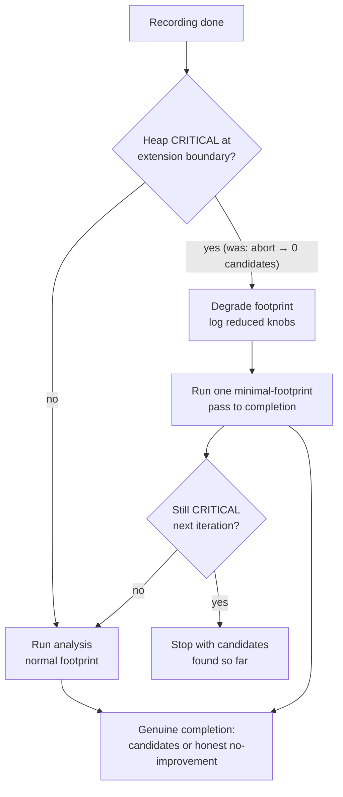

## Summary

Discovery now **degrades and continues** at the analysis-extension boundary
under CRITICAL heap pressure instead of aborting the iteration to zero
candidates. This is the NEAT-AI root-cause fix for **GRQ #3296** (part of GRQ
milestone #3267 — "Discovery OOM-killed on 16 GB host — adapt to host memory").

Previously, when the off-heap-aware guard reported CRITICAL pressure at the
extension boundary (genuine native-budget exhaustion), `DataRecorder` skipped
the analysis phase and returned an empty `DiscoverResult` carrying
`heapAbortedAtExtensionBoundary: true` — a 0-candidate skip that the parent
issue classes as a failure ("a loud degraded skip … is still a failure").

Now the boundary reduces the analysis footprint (fewer focus neurons, smaller
Rust FFI chunks) and pushes through to a genuine completion — candidates, or an
honest no-improvement result. The degrade decision is logged with the reduced
knob values so the smaller footprint is observable.

### What changed

- **New `AnalysisDegradeDecision.ts`** — a pure, deterministic helper
  (`computeDegradedAnalysisKnobs`) that computes the minimal analysis footprint
  from the current knobs: focus breadth reduced to a quarter (floored at one
  neuron), analysis chunk size bounded to a small chunk. Returns a grep-friendly
  reason string naming each reduced knob and its `from->to` value.
- **`AnalysisExtensionBoundary.ts`** — added `resolveDegradedAnalysisBoundary`,
  which samples the heap through the same off-heap-aware guard and, when it
  would previously have aborted, returns `degraded: true` with the degraded
  knobs and logs the degrade decision, instead of building an empty result. The
  legacy `resolveHeapAbortBoundary` is retained (still unit-tested) but is no
  longer the production path.
- **`DataRecorder.ts`** — the extension boundary now calls
  `resolveDegradedAnalysisBoundary` and runs `runAnalysisLoop` with the degraded
  knobs plus a `degradedFirstPass` signal rather than returning early.
- **`DataRecorderAnalysis.ts`** — the in-loop heap guard honours
  `degradedFirstPass`: the first (retryAttempt 0) minimal-footprint pass runs to
  completion — including its first chunk — instead of aborting immediately, so a
  starved host reaches a genuine completion. Subsequent iterations honour the
  guard normally, so a run that stays CRITICAL still bails with whatever
  candidates it found.

## Evidence

Backend/library change — no UI. Verified via `deno test`:

- `test/ErrorGuidedStructuralEvolution/AnalysisDegradeDecision.ts` — 6 cases
  pinning the reduction rules, floors, unbounded-chunk handling, non-finite
  fallback, and the starved-at-start minimal footprint.
- `test/ErrorGuidedStructuralEvolution/AnalysisExtensionBoundary.ts` — added 3
  `resolveDegradedAnalysisBoundary` cases (happy path unchanged; CRITICAL
  degrades and logs; genuine budget exhaustion degrades instead of forcing an
  OOM-prone abort).
- `test/ErrorGuidedStructuralEvolution/AnalysisLoopHeapGuard.ts` — added
  `degrades footprint and continues at extension boundary instead of aborting`,
  which forces persistent CRITICAL heap with `degradedFirstPass` and asserts the
  loop analyses neurons and submits a chunk (no 0-candidate abort), driven
  through the real `runAnalysisLoop`.

All existing extension-boundary, heap-guard, worker-payload, and outcome tests
continue to pass (`resolveHeapAbortBoundary` and the
`heapAbortedAtExtensionBoundary` wire contract are unchanged).

## Test Plan

- `deno test test/ErrorGuidedStructuralEvolution/AnalysisDegradeDecision.ts` — 6
  passed
- `deno test test/ErrorGuidedStructuralEvolution/AnalysisExtensionBoundary.ts` —
  10 passed
- `deno test test/ErrorGuidedStructuralEvolution/AnalysisLoopHeapGuard.ts` — 6
  passed
- `deno test test/ErrorGuidedStructuralEvolution/AnalysisHeapGuard.ts test/ErrorGuidedStructuralEvolution/DiscoveryHeapAbortBoundaryIntegration.ts`
  — 25 passed
- `deno test test/multithreading/WorkerProcessor.ts test/NEAT/DiscoveryOutcome.ts test/ErrorGuidedStructuralEvolution/DiscoveryTimeout.ts`
  — 17 passed
- `deno check` + `deno fmt` + `deno lint` clean on all changed files
