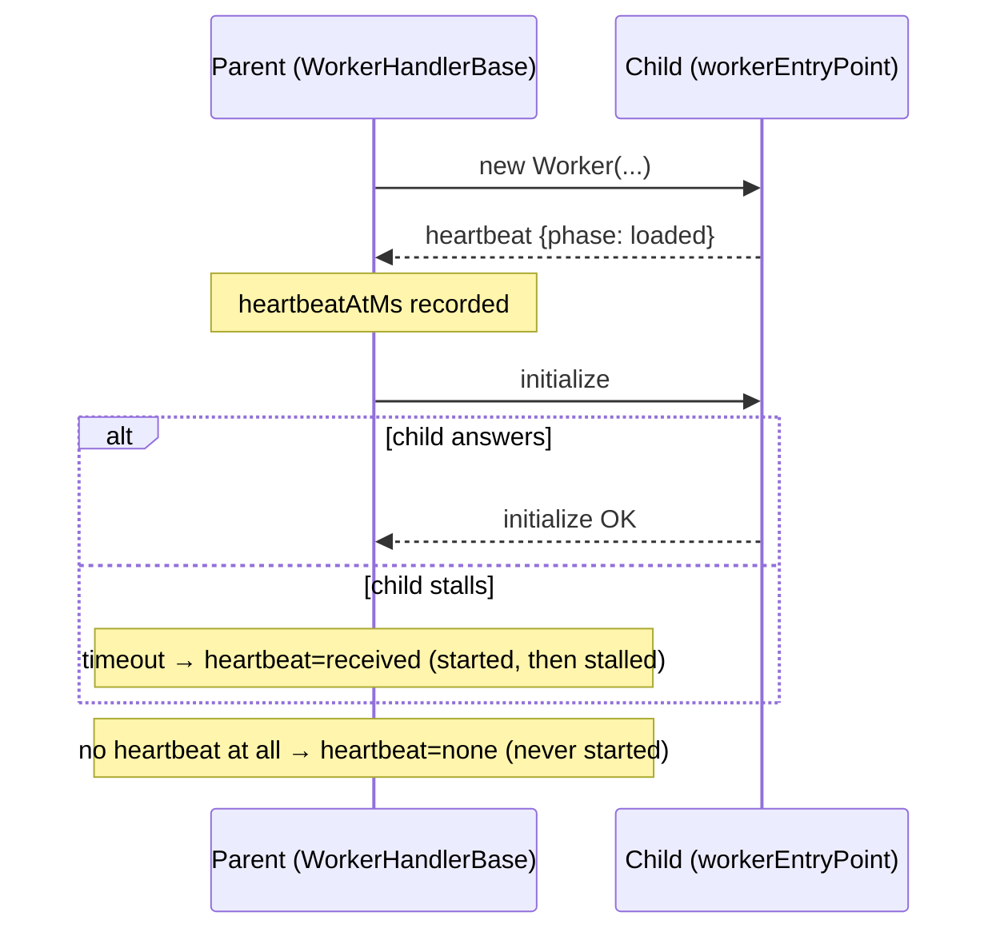

# Worker start heartbeat — tell "never started" apart from "started and stalled"

## Summary

The #3494 worker-init timeout diagnostic names three candidates but cannot tell
them apart:

```text
Child WASM phase timings unknown — the worker never answered the init handshake
(may be stuck loading WASM, CPU-starved, or OOM).
```

A `stSoftwareAU/GRQ` `team` run lost five worker slots to that 60-second
handshake with `cache=hit`, `bundleLoadMs=2`, `instantiateMs=1`,
`wasmTotalMs=20` and `workerError=none` — the parent loaded and instantiated the
bundle in 20 ms, so "stuck loading WASM" was already ruled out, yet nothing in
the log said whether the child isolate had ever started.

This adds a **start heartbeat**: the child posts one message as soon as its
module has evaluated and its message loop is installed, _before_ any init work.
The parent records receipt and the timeout error now reports it:

- `heartbeat=received heartbeatMs=N` — the isolate started, then stalled;
  suspect CPU starvation or a stuck init.
- `heartbeat=none` — the isolate never reached its entry point; suspect spawn
  starvation or OOM.

No behaviour change: the direct-execution fallback, the timeout value, and the
existing greppable field names are all untouched — the timeout message gains one
field and one closing sentence.

Raised for `stSoftwareAU/GRQ#3771`.

### Design notes

`WorkerHandlerBase`'s task-callback map asserts a callback exists for every
message it routes, so an unsolicited task-shaped message would throw
`No callback` and kill init. The heartbeat therefore carries a single
unmistakable field (`neatAiWorkerHeartbeat`) and the parent's listener takes it
off the wire before task routing sees it.

`setupWorkerMessageLoop` is the single entry point both the multithreading and
intelligentDesign workers reach, and `createInitSequence` is the single choke
point every pooled worker reaches via `waitUntilReady()` — so both halves are
one-site changes that cover every worker pool.

## Evidence

Library change with no web interface, so no screenshot. Evidence is the test
suite plus the lint/type gates:



```text
deno test test/workers/ test/multithreading/ test/intelligentDesign/Worker*.ts
  ... ok | 186 passed | 0 failed
./quality.sh --lint-only   ... ✅
./quality.sh --check-only  ... ✅
```

## Test Plan

- **`test/workers/WorkerStartHeartbeat.ts`** (new):
  - a stalled child that sent no heartbeat → timeout error carries
    `heartbeat=none` and the "did not reach its entry point" verdict;
  - a stalled child that sent one → `heartbeat=received heartbeatMs=…` and the
    "then stalled before answering" verdict;
  - the two messages differ (the point of the change);
  - a heartbeat is never routed as a task response (would throw `No callback`);
  - `setupWorkerMessageLoop` posts exactly one heartbeat on start, before any
    init work;
  - `isWorkerHeartbeatMessage` rejects task responses, `null`, strings, and
    malformed payloads.
- Existing `test/workers/WorkerInitDiagnostics.ts` and
  `test/wasm/WasmInitDiagnostics.ts` remain green — the pre-existing fields of
  the timeout contract are unchanged.
