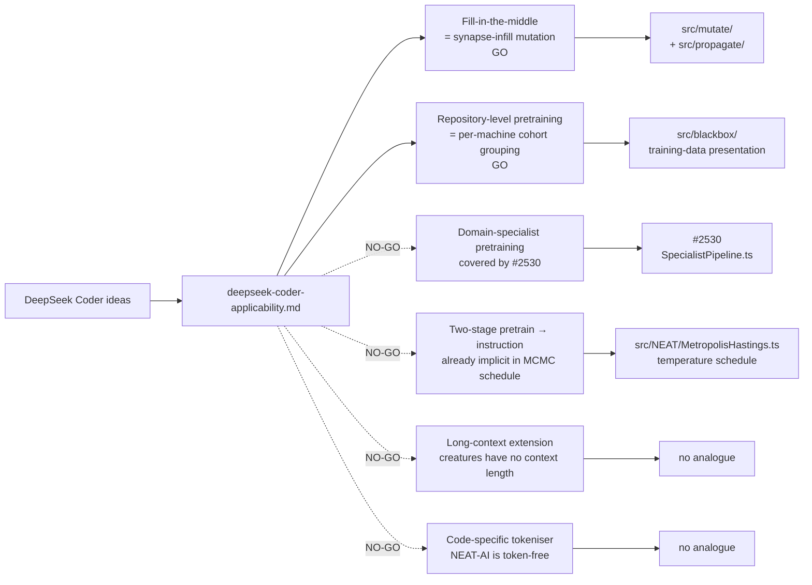

# DeepSeek Coder Applicability to NEAT-AI (Issue #2539)

> **📦 Archived under
> [Issue #2575](https://github.com/stSoftwareAU/NEAT-AI/issues/2575).** This
> research note was moved from `docs/research/` to `docs/archive/research/`. Its
> conclusions have landed (or been triaged out) — see the
> [`deepseek-papers-index.md`](deepseek-papers-index.md) catalogue for the
> consolidated implementation status. Topic index:
> [`docs/README.md`](../../README.md).

This research note maps the six headline ideas from DeepSeek-Coder and
DeepSeek-Coder-V2 onto NEAT-AI's mutation, speciation, training-augmentation,
and discovery surfaces and records a GO / NO-GO recommendation with a
one-paragraph rationale per idea. For every GO it proposes an experimental
sub-issue title plus outline; the sub-issues themselves are not raised here.

> **Sources.**
>
> - Guo, Zhu, Yang, Xie, Dong, Zhang, Chen, Bi, Wu, Li and Luo, _DeepSeek-Coder:
>   When the Large Language Model Meets Programming — The Rise of Code
>   Intelligence_, January 2024.
>   [arXiv:2401.14196](https://arxiv.org/abs/2401.14196). Citations below use
>   the form _(Coder §x.y)_ and refer to that preprint.
> - DeepSeek-AI, _DeepSeek-Coder-V2: Breaking the Barrier of Closed-Source
>   Models in Code Intelligence_, June 2024.
>   [arXiv:2406.11931](https://arxiv.org/abs/2406.11931). Citations below use
>   _(Coder-V2 §x.y)_.
>
> **Scope.** Documentation only. No source-code changes. Each GO recommendation
> is paired with a proposed experimental sub-issue title and outline; the
> sub-issues themselves are not yet created.
>
> **Sibling notes.** This note is one entry in the DeepSeek paper catalogue
> ([#2533](https://github.com/stSoftwareAU/NEAT-AI/issues/2533),
> [`deepseek-papers-index.md`](deepseek-papers-index.md)). It deliberately
> defers the **domain-specialist pipeline** to the V4 specialist plan
> ([#2530](https://github.com/stSoftwareAU/NEAT-AI/issues/2530)) and
> cross-references the MoE applicability note
> ([`deepseek-moe-applicability.md`](deepseek-moe-applicability.md)) for any
> Coder-V2 routing detail that is already covered there.

## Cross-link to #2530 (avoid duplication)

The Coder paper's "code-domain specialist via domain-specific pretraining" is
the closest LLM analogue to NEAT-AI's specialist sub-population pipeline. The
**V4 specialist plan
([#2530](https://github.com/stSoftwareAU/NEAT-AI/issues/2530))** already owns:

- Tagging species with a `specialistTaskId` so each species is bound to a
  sub-task signal.
- A `SpecialistPipeline.ts` orchestrator that seeds one specialist species per
  declared sub-task (`specialistMode: "off" | "auto" | "manual"`).
- Per-generation routing — specialists are evaluated against their own sub-task
  only.
- A periodic generalist-distillation step using the On-Policy Distillation
  breeding operator from #2528.

This Coder note **does not duplicate** that work. Idea 3 (domain-specialist
pretraining) below is the explicit NO-GO that records the overlap and points
back at #2530. Coder-V2 reinforces the same recipe at LLM scale and does not add
anything beyond #2530.

## Summary table

| # | DeepSeek-Coder idea                           | Closest NEAT-AI surface                                                              | Recommendation               | Effort | Risk to invariants |
| - | --------------------------------------------- | ------------------------------------------------------------------------------------ | ---------------------------- | ------ | ------------------ |
| 1 | Fill-in-the-middle (FIM) pretraining          | `src/mutate/` (sub-graph mask) + `src/propagate/` (focused backprop)                 | **GO**                       | M      | None               |
| 2 | Repository-level pretraining (context order)  | `src/blackbox/` training-data presentation + `src/NEAT/` per-machine corpus grouping | **GO**                       | M      | None               |
| 3 | Domain-specialist pretraining                 | `src/NEAT/Species.ts` + `SpecialistPipeline.ts` (#2530)                              | **NO-GO** (covered by #2530) | —      | None               |
| 4 | Two-stage training (pretrain → instruction)   | Cold-start fitness → annealed narrow target metric                                   | **NO-GO** (already implicit) | —      | None               |
| 5 | Long-context extension via continued training | `n/a` — creatures have no "context length"                                           | **NO-GO**                    | —      | None               |
| 6 | Code-specific vocabulary / tokenisation       | `n/a` — NEAT-AI consumes numeric vectors, not tokens                                 | **NO-GO**                    | —      | None               |

## Idea → NEAT-AI module mapping

## 1. Fill-in-the-middle (FIM) pretraining — **GO**

**Technical summary.** Coder §3.2 augments standard left-to-right next-token
training with a **fill-in-the-middle** objective: a contiguous middle span of
the token sequence is masked, the prefix and suffix are concatenated as context,
and the model is asked to reproduce the missing middle. Coder reports that the
FIM augmentation is free of regression on left-to-right metrics and materially
improves single-line and multi-line infill benchmarks. Coder-V2 §2 keeps the
same objective. The training signal teaches the model that any internal slice
must be reconstructible from the surrounding context — i.e. internal redundancy
is a feature, not a flaw.

**Closest NEAT-AI surface.** `src/mutate/` already manipulates internal
sub-graphs (add/remove neurons, add/remove connections), and `src/propagate/`
runs focused backprop. There is no current operator that **temporarily masks a
connected sub-graph** during a forward pass and asks the rest of the creature to
compensate before unmasking. Discovery's `CacheInformedRemovalCandidates.ts` is
the closest neighbour — it nominates sub-graphs for removal — but it is a
destructive proposal, not a reversible augmentation that asks the surrounding
topology to learn redundancy.

**Rationale (GO).** A "synapse infill" training augmentation maps cleanly onto
NEAT-AI:

1. Pick a contiguous internal sub-graph (e.g. one hidden neuron plus its
   incident synapses, or a small connected hidden cluster).
2. **Mask it** — zero its activation contribution for a configurable number of
   forward passes (do _not_ delete it; keep the UUIDs and weights intact).
3. Run focused backprop on the surrounding topology so the creature learns to
   compensate for the missing middle.
4. **Unmask** the sub-graph and re-evaluate. Two diagnostics drop out for free:
   - If the post-unmask creature is **better** than the pre-mask creature, the
     compensation backprop discovered useful redundancy in the surrounding
     topology — a real training-augmentation win.
   - If the masked sub-graph could be removed with **no measurable loss** after
     compensation, it is a genuine redundancy candidate — a discovery cue for
     `CacheInformedRemovalCandidates.ts`.

This is orthogonal to the existing Intelligent Design squash testing and to the
existing per-creature backprop. It is a **training-augmentation** loop, not a
structural mutation operator: nothing about the creature's identity changes
during the masked window.

**Risk.** None to the critical invariants. The masked sub-graph keeps its UUIDs
throughout (the mask is a forward-pass-only flag, not a deletion), so "Neuron
UUID stability" is unaffected. The creature constructor is not invoked, so
`semanticVersion` is unaffected. No wire format changes — discovery and breeding
never see the mask state. The realistic risk is **training noise**: too
aggressive a mask schedule will degrade fitness more than the compensation pass
can recover. The sub-issue must report fitness time-series with vs without FIM
augmentation and must default the feature **off**.

**Effort.** **M.** New `src/propagate/SynapseInfillAugmentation.ts` implementing
the mask / compensation / unmask cycle, an opt-in
`NeatOptions.synapseInfill: { enabled, maskFraction, compensationPasses }`
configuration, plus tests for the four observable outcomes (UUIDs preserved
across the cycle; fitness restored after unmask on a trivial creature; the
"redundancy-cue" path correctly flags genuinely-removable sub-graphs;
disabled-by-default behaviour is bit-identical to the current code path).

**Lands in.** NEAT-AI. The mask is implemented in
`src/propagate/SynapseInfillAugmentation.ts` plus a thin hook in the existing
backprop entry point. No Rust discovery changes are required — the redundancy
cue feeds back through existing TS surfaces.

**Proposed experimental sub-issue.**

- **Title.** "Synapse-infill training augmentation: mask a connected sub-graph,
  compensate, then unmask"
- **Outline.**
  1. Add `NeatOptions.synapseInfill` (off by default) with `maskFraction`,
     `compensationPasses`, and `infillEveryN` knobs.
  2. Implement `src/propagate/SynapseInfillAugmentation.ts` running the mask →
     focused-backprop → unmask cycle, leaving creature UUIDs and
     `semanticVersion` untouched.
  3. Surface the redundancy diagnostic to
     `src/discovery/CacheInformedRemovalCandidates.ts` so genuinely-removable
     sub-graphs can be nominated for removal in the next discovery round.
  4. Tests: UUID stability across the cycle
     (`test/creature/NeuronUuidStability.ts`-style), `semanticVersion`
     preserved, off-by-default is bit-identical, redundancy cue flags a
     synthetic redundant sub-graph.
  5. Benchmark: fitness-vs-generation on the standard ED-fold harness with
     `synapseInfill = off / light / aggressive`. **PR may only land if FIM mode
     is at least neutral on final fitness while reducing average synapse count
     by ≥ 3 % or accelerating time-to-first-1%-improvement by ≥ 5 %.** Negative
     result is acceptable: document and close.

## 2. Repository-level pretraining (context order) — **GO**

**Technical summary.** Coder §2.2 / §3.1 argues that pretraining on **whole
repositories** (with files presented in a topologically-sensible order — e.g.
import-graph order — and concatenated within a single training context) yields
materially better long-range coherence than pretraining on isolated files in
random order. Coder-V2 §2.1 keeps the same recipe and broadens the language
coverage. The portable claim is that **example-presentation order matters**, not
just the examples themselves: grouping examples that share a context lets the
model exploit cross-example regularities that random shuffling destroys.

**Closest NEAT-AI surface.** `src/blackbox/` (the per-creature training-data
adapter — `MemeticInterface.ts`, `MemeticTrajectory.ts`, `MemeticUpdate.ts`,
`MemeticWireData.ts`) consumes a `Dataset` in whatever order the caller
provides. Today there is no concept of "training-example cohort" — each example
is treated as i.i.d.. NEAT-AI's distributed training layer is a similar surface:
~20 machines each evolve populations against (potentially) machine-local
training data, then push fittest creatures via GitHub. There is currently no
signal that says "machine A was trained on cohort X, machine B on cohort Y" when
cross-pollinating populations.

**Rationale (GO).** Two distinct experiments fall out, both portable from the
Coder recipe:

1. **In-population presentation order.** Group training examples that share a
   context (e.g. by source machine, by source population segment, or by
   user-supplied `cohortId`) and present them as contiguous blocks within a
   memetic backprop pass rather than as i.i.d. shuffles. The expected payoff is
   faster early-generation convergence on data sets with strong intra-cohort
   regularities (time-series segments, per-customer sub-sets, per-machine sensor
   batches).
2. **Cross-machine cohort awareness.** When a creature pushed by machine A is
   bred with a creature evolved on machine B, optionally tag each parent with
   the cohort it was trained on. This is a metadata-only addition: it does not
   change UUIDs, does not change topology, and does not change what crosses the
   wire. It is consumable by analytics (which cohorts transfer well? which are
   brittle when crossed?) and can later inform breeding-pair selection — but the
   experimental sub-issue stays small and only delivers the diagnostic.

This is **orthogonal to GRPO** (#2527 / #2537) — GRPO normalises the advantage
signal _within_ a cohort; cohort-aware presentation orders the cohorts
themselves. It is also orthogonal to the V4 specialist pipeline (#2530) —
specialists are tagged by **task**, cohorts are tagged by **data origin**.

**Risk.** None to the critical invariants. The change is a presentation-order
tweak inside `src/blackbox/`; UUIDs and `semanticVersion` are untouched. Cohort
metadata, if added, must respect the AGENTS.md "Discovery/cache/FFI wire
contract" — no integer ids, no other identity-bearing fields. The realistic risk
is **fitness regression on i.i.d. data sets**: if there is no meaningful
intra-cohort regularity, contiguous-block presentation can hurt by producing
per-block local minima. The sub-issue must default to off and require a
measurable lift before adoption.

**Effort.** **M.** New `src/blackbox/CohortAwarePresentation.ts` accepting an
optional per-example `cohortId` and producing a presentation order that respects
cohort boundaries. Add a `cohortId?: string` opt-in field on the
training-example surface, document in `src/config/`. Plus tests: i.i.d. default
behaviour bit-identical, cohort grouping respected on a synthetic two-cohort
dataset, no creature identity surface affected.

**Lands in.** NEAT-AI. Pure TypeScript; no Rust discovery changes.

**Proposed experimental sub-issue.**

- **Title.** "Cohort-aware training-example presentation order in
  `src/blackbox/`"
- **Outline.**
  1. Add an optional `cohortId?: string` field to the training-example shape;
     document the semantics (free-form caller-supplied tag).
  2. Implement `src/blackbox/CohortAwarePresentation.ts` producing a
     contiguous-block order when `cohortId` is supplied; fall back to the
     existing shuffle when absent.
  3. Tests: default is bit-identical to today; cohort grouping is respected; no
     UUID / `semanticVersion` surface is touched.
  4. Benchmark: a synthetic two-cohort harness with strong intra-cohort
     regularity (cohort-specific bias term) — measure time-to-first
     1%-improvement and final fitness. **PR may only land if cohort mode is at
     least neutral on final fitness AND improves time-to-first-1%-improvement by
     ≥ 10 % on the synthetic harness.** Negative result is acceptable.

## 3. Domain-specialist pretraining — **NO-GO** (covered by #2530)

**Technical summary.** Coder §2 / §3 argues that a **code-domain corpus**
(filtered for licence, deduplicated by content hash, balanced across languages)
plus the standard pretraining objective is sufficient to produce a
**code-specialist** model that beats general-purpose LLMs on coding benchmarks.
The recipe is unsurprising in 2024 — domain-narrow data ⇒ domain-narrow
specialist — but Coder is a clean reference for the **specialist** half of a
"specialists then ensemble" pipeline. Coder-V2 §2 adds an MoE backbone so
multiple specialists co-exist inside one model with token-level routing.

**Closest NEAT-AI surface.** Specialist sub-populations and the periodic
generalist-distillation step are already designed in **#2530**, which:

- Tags `Species` with a `specialistTaskId` so a species is bound to a sub-task
  signal.
- Adds `src/NEAT/SpecialistPipeline.ts` orchestrating the lifecycle (auto/manual
  seeding, per-task routing, periodic generalist distillation).
- Re-uses the On-Policy Distillation breeding operator from #2528 for the
  generalist step.

**Rationale (NO-GO).** Coder adds nothing on top of #2530 that is not already
covered. The Coder-specific contribution is the data-curation pipeline (see
`deepseek-math-applicability.md` Idea 5 for the same NO-GO rationale on data
curation — NEAT-AI does not own the corpus). The "MoE backbone with multiple
specialists" of Coder-V2 is the
[`deepseek-moe-applicability.md`](deepseek-moe-applicability.md) territory and
is tracked under #2535. There is no remaining Coder-specific lift to chase.
Adopting Coder-V2's "MoE-routed specialists" inside NEAT-AI would require a
routing layer over species, which is the open MoE question and should stay in
#2535, not be re-litigated here.

**Risk / effort.** N/A (not adopted).

**Revisit only if** #2530 ships and benchmark evidence shows that the
distillation step is the bottleneck — at which point Coder's recipe of keeping
the specialist's training data segregated even after the distillation might
become relevant.

## 4. Two-stage training (pretrain → instruction tune) — **NO-GO** (already implicit)

**Technical summary.** Coder §3.4 / Coder-V2 §3 follows the standard **pretrain
→ instruction-tune** schedule: a generic pretraining phase trains the model on a
broad mixture, then a smaller instruction-tuning phase anneals toward narrow
downstream metrics. The portable shape is "broad signal first, narrow signal
second", with the schedule as the only knob.

**Closest NEAT-AI surface.** The existing MCMC temperature schedule
(`src/NEAT/MetropolisHastings.ts`) already implements **broad → narrow** at
acceptance time: high temperature accepts worsening mutations to escape local
optima (broad exploration), then cools to be greedy (narrow exploitation).
Combined with the GRPO advantage signal (#2527) and the curriculum-learning GO
recommendation in
[`deepseek-math-applicability.md`](deepseek-math-applicability.md) Idea 6
("Generation-curriculum fitness"), the broad → narrow shape is **already
covered** at two distinct levels of the stack — acceptance temperature and
fitness composition.

**Rationale (NO-GO).** A separate "two-stage" experiment for NEAT-AI would
either (a) duplicate the MCMC schedule that already exists or (b) duplicate the
curriculum-learning experiment proposed in `deepseek-math-applicability.md`
Idea 6. Either way, there is no NEAT-AI specific lift left to chase that is not
already on someone's plate. The DeepSeek-Math curriculum experiment is the
better-shaped vehicle because it ties the schedule to an actual cost-component
re-weighting; a Coder-style "two-stage" experiment would just be a re-skin.

**Risk / effort.** N/A (not adopted).

**Revisit only if** the curriculum-learning experiment from
`deepseek-math-applicability.md` Idea 6 lands as a negative result and the team
still wants to chase a coarser broad → narrow signal — at which point a simpler
two-phase MCMC schedule could be evaluated as a smaller, less risky alternative.
Track that decision when (if) it arises; do not pre-empt it here.

## 5. Long-context extension via continued training — **NO-GO**

**Technical summary.** Coder-V2 §2.3 extends the model's effective context
window post-hoc by **continued training on long-context data** with adjusted
positional encodings (rope-base scaling and/or YaRN-style interpolation). The
contribution is purely a transformer-attention story — extending the distance
over which a token can attend to other tokens.

**Closest NEAT-AI surface.** None. NEAT-AI evolves **forward-only feed-forward
neural networks** (the default in production per `AGENTS.md` "Feed-forward vs
Recurrent Connections"). There is no token sequence, no attention mechanism, no
positional encoding, and consequently nothing analogous to "context length".
Each creature consumes a fixed-shape numeric input vector and produces a
fixed-shape numeric output vector. Recurrent topologies _do_ exist as an option
but are outside the current production workload, and even there the relevant
knob is "how far back do recurrent connections reach" — not "how many tokens can
the model attend to at once".

**Rationale (NO-GO).** There is no surface to adapt. The Coder-V2 idea is
genuinely transformer-attention-specific and does not carry a portable
algorithmic kernel that maps onto our breeding, selection, mutation, discovery,
or backprop surfaces. Documented for completeness; will not be re-litigated.

**Risk / effort.** N/A (not adopted).

**Revisit only if** NEAT-AI gains a first-class attention or sequence model (no
current plan); at that point, post-hoc context extension via continued training
would become re-applicable.

## 6. Code-specific vocabulary / tokenisation — **NO-GO**

**Technical summary.** Coder §3.1 trains a **code-aware BPE tokeniser** on the
curated code corpus, with merges biased toward common code substrings
(operators, indentation runs, common identifier prefixes). The claim is that
domain-tuned tokenisation reduces sequence length and improves downstream
quality on coding benchmarks.

**Closest NEAT-AI surface.** None on the input side. NEAT-AI consumes **numeric
vectors** — there is no tokeniser, no vocabulary, no merge table. A loose
analogue would be **input feature engineering**: choosing how domain-aware the
input vector is (raw sensor values vs hand-engineered features such as moving
averages, log-ratios, normalised z-scores). Feature engineering is unambiguously
the **caller's responsibility** — the same boundary as the data-curation NO-GO
in [`deepseek-math-applicability.md`](deepseek-math-applicability.md) Idea 5.

**Rationale (NO-GO).** Tokenisation does not transfer because NEAT-AI is
token-free. The closest analogue (domain-aware feature engineering) is out of
scope: the library's contract is that the caller supplies the input vector shape
and semantics; baking domain-aware feature engineering into NEAT-AI would
silently reshape the caller's data set, would introduce non-determinism across
machines that have different feature pipelines, and would break the assumption
that two machines training on the same `Dataset` see the same creature
behaviour. There is no convergence lift to chase here because we do not own the
input pipeline.

**Risk / effort.** N/A (not adopted).

**Revisit only if** NEAT-AI introduces a built-in feature-engineering layer (no
current plan); at that point, Coder's case for domain-tuned input
representations would become re-applicable.

## Cross-cutting invariants

Both GO recommendations have been screened against the two critical invariants
in `AGENTS.md`:

- **Neuron UUID stability.** Idea 1 (synapse-infill augmentation) is a
  forward-pass mask — the masked sub-graph keeps its UUIDs throughout the cycle.
  No mutation operator runs; no breeding step runs; no `Creature` constructor is
  invoked. The recorded redundancy cue refers to the masked sub-graph by UUID.
  Idea 2 (cohort-aware presentation) is a presentation- order tweak inside
  `src/blackbox/` and does not touch creature identity at all.
- **Semantic version immutability.** Neither GO experiment introduces a pipeline
  step that re-bumps `semanticVersion`. Idea 1 does not invoke the `Creature`
  constructor; Idea 2 does not modify creatures.

Anything that crosses a process, machine, disk, cache, or FFI boundary in the GO
experiments above must continue to use **UUID-only wire formats** (per
`AGENTS.md` "Discovery/cache/FFI wire contract"). Idea 1's redundancy cue feeds
`CacheInformedRemovalCandidates.ts`, which already uses UUID-only sub-graph
descriptors — the sub-issue must include a wire-format test asserting no `id` /
`fromId` / `toId` fields leak. Idea 2's `cohortId` is caller-supplied free-form
metadata and is explicitly not an identity field; the sub-issue must document
that contract.

## What this note does not do

- It does not duplicate the V4 specialist plan (#2530) — Idea 3 is the explicit
  NO-GO that records the overlap.
- It does not duplicate the GRPO core mechanism (#2527) or the curriculum-
  learning idea (`deepseek-math-applicability.md` Idea 6) — Idea 4 is the
  explicit NO-GO that records the overlap.
- It does not duplicate the MoE applicability note (#2535) — any Coder-V2
  routing detail is owned there.
- It does not prescribe implementation — each GO experiment owns its own design
  in its (proposed) sub-issue.
- It does not commit to merging any experiment to `Develop`. Sub-issues must
  produce benchmark evidence (per the Performance Task Workflow in `AGENTS.md`)
  before adoption.
- It does not re-open NO-GO ideas. If circumstances change (e.g. NEAT-AI
  acquires an attention mechanism or a built-in feature-engineering layer), open
  a new follow-up issue rather than re-litigating long-context or tokenisation
  here.
