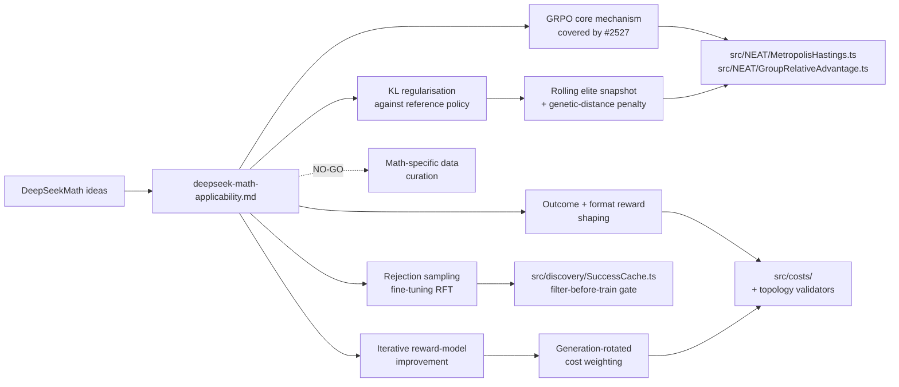

# DeepSeekMath Applicability to NEAT-AI (Issue #2537)

> **📦 Archived under
> [Issue #2575](https://github.com/stSoftwareAU/NEAT-AI/issues/2575).** This
> research note was moved from `docs/research/` to `docs/archive/research/`. Its
> conclusions have landed (or been triaged out) — see the
> [`deepseek-papers-index.md`](deepseek-papers-index.md) catalogue for the
> consolidated implementation status. Topic index:
> [`docs/README.md`](../../README.md).

This research note revisits the original DeepSeekMath paper — the paper that
introduced **GRPO** — for techniques that extend beyond what the V4 note
[#2526](https://github.com/stSoftwareAU/NEAT-AI/issues/2526) captured and that
the GRPO experimental sub-issue
[#2527](https://github.com/stSoftwareAU/NEAT-AI/issues/2527) does not already
own. The focus is on reward shaping, KL regularisation, math-specific data
curation, and rejection sampling fine-tuning.

> **Source.** Shao, Wang, Zhu, Xu, Song, Bi, Zhang, Zhang, Li, Wu and Guo,
> _DeepSeekMath: Pushing the Limits of Mathematical Reasoning in Open Language
> Models_, 2024. [`arXiv:2402.03300`](https://arxiv.org/abs/2402.03300).
> Citations below use the form _(DSMath §x.y)_ and refer to that PDF.
>
> **Scope.** Documentation only. No source-code changes. Each GO recommendation
> is paired with a proposed experimental sub-issue title and outline; the
> sub-issues are not yet created.

## Cross-link to #2527 (avoid duplication)

The GRPO **core mechanism** — group-relative advantage as the selection /
acceptance signal — is already captured in two places:

- [#2526](https://github.com/stSoftwareAU/NEAT-AI/issues/2526) (V4 note, §1) —
  the conceptual GO recommendation.
- [#2527](https://github.com/stSoftwareAU/NEAT-AI/issues/2527) — the
  experimental sub-issue that owns the implementation
  (`GroupRelativeAdvantage.ts`, `mcmcAdvantageMode` option, MCMC plumbing,
  parent-selection ranking, benchmark).

This note **does not duplicate** the core advantage-signal work. Instead it
identifies the **adjacent ideas in the DeepSeekMath paper** that #2527 leaves
open — KL regularisation against a reference policy, two-component reward
(outcome + format), rejection-sampling fine-tuning, math-specific data curation,
and iterative reward-model improvement — and maps each onto the NEAT-AI surface
area.

## Summary table

| # | DeepSeekMath idea                            | Closest NEAT-AI surface                                       | Recommendation              | Effort | Proposed sub-issue                                                                        |
| - | -------------------------------------------- | ------------------------------------------------------------- | --------------------------- | ------ | ----------------------------------------------------------------------------------------- |
| 1 | GRPO core mechanism                          | `src/NEAT/MetropolisHastings.ts`, `GroupRelativeAdvantage.ts` | **Already covered (#2527)** | —      | None — see #2527.                                                                         |
| 2 | KL regularisation against a reference policy | MCMC temperature + elite snapshot                             | **GO**                      | M      | "Genetic-distance KL penalty against rolling elite snapshot for MCMC acceptance".         |
| 3 | Two-component reward (outcome + format)      | `src/costs/` + topology validation                            | **GO**                      | S      | "Add structural-validity format penalty as a second cost-component term".                 |
| 4 | Rejection sampling fine-tuning (RFT)         | `src/discovery/SuccessCache.ts`, retention policy             | **GO**                      | M      | "Rejection-sampled discovery batches: filter candidates by fitness gain before backprop". |
| 5 | Math-specific data curation                  | `src/blackbox/` training-data preparation                     | **NO-GO**                   | M      | None — the corpus question does not transfer; see rationale.                              |
| 6 | Iterative reward-model improvement           | Static fitness function (no curriculum today)                 | **GO**                      | L      | "Generation-curriculum fitness: rotate cost-weights as the population improves".          |

## Idea → NEAT-AI module mapping

## 1. GRPO core mechanism — **Already covered (#2527)**

**Technical summary.** GRPO (DSMath §4.1) replaces the absolute reward signal of
PPO with a **group-relative advantage**: for each prompt, sample _G_ rollouts,
then use `(reward_i − mean) / (std + ε)` as the advantage. No separate value /
critic network is needed.

**What is already covered.** The V4 note (#2526 §1) motivates this in NEAT-AI
terms; the experimental sub-issue #2527 owns the implementation —
`src/NEAT/GroupRelativeAdvantage.ts`, the `mcmcAdvantageMode` option, MCMC
plumbing, parent-selection ranking, and a benchmark gate. The species cohort is
the natural "group".

**GRPO sub-question that #2527 leaves open.** #2527 is silent on the **cohort
size minimum** in pathological cases — single-member species fall back to "no
advantage" (advantage = 0) but the paper itself uses a fixed group size _G_
(typically 64). NEAT species sizes vary enormously across generations. A
follow-up question worth recording (but **not** worth a separate experimental
issue) is whether species with `size < minCohortSize` should fall back to
**"current generation"** (#2527 already captures this) or to a **rolling cohort
of the last K accepted creatures across all species**. The latter is closer to
DSMath's fixed-size group and would smooth advantage variance during early
generations when species are tiny. Track as a follow-up only if #2527's
benchmark shows high variance in early generations; otherwise close as an
unproductive refinement.

**Risk / effort.** N/A here — owned by #2527.

## 2. KL regularisation against a reference policy — **GO**

**Technical summary.** GRPO (DSMath §4.1, eq. 21) adds a **KL divergence term**
between the trained policy and a fixed **reference policy** (an earlier
checkpoint, typically the supervised-fine-tuned base) directly into the loss —
`L = E[advantage · log π / π_ref] − β · KL(π || π_ref)`. The KL term prevents
the policy from drifting too far during RL and stabilises training.

**Closest NEAT-AI surface.** `src/NEAT/MetropolisHastings.ts` already accepts or
rejects mutations with a temperature schedule — that is NEAT's drift-control
knob. The MCMC temperature does **not** anchor against a specific reference
creature; it just becomes "greedier" as it cools. There is no concept today of
"do not let creatures diverge too far in genetic distance from a recent elite".

**Rationale (GO).** Adding a KL-style penalty against a **rolling elite
snapshot** complements the temperature schedule. The penalty term would be
proportional to `geneticDistance(candidate, snapshot)` (existing function via
species comparison), with a coefficient `β` that decays as the snapshot ages.
This gives NEAT a soft anchor — creatures can still explore, but moving too far
from a known-good genome incurs an acceptance penalty independent of raw
fitness. The expected payoff is fewer "lucky" worsening mutations being kept
during high-temperature phases. Importantly, this is **orthogonal** to GRPO
(#2527): KL regularisation modifies the acceptance probability after the
advantage signal is computed.

**Risk.** Low for invariants. The penalty only changes the acceptance
probability; UUIDs (per "Neuron UUID stability" in `AGENTS.md`) and
`semanticVersion` are untouched. The risk is **diversity collapse** — if `β` is
set too high and the snapshot is refreshed too rarely, the population converges
to a small genetic-distance ball around a single elite. The experimental
sub-issue must report Shannon diversity time-series, not just fitness.

**Effort.** **M.** New `src/NEAT/ReferenceSnapshot.ts` (capture + age the
snapshot), modify `MetropolisHastings.ts` to accept an optional KL term,
`NeatOptions.referencePolicyKl: { beta, snapshotIntervalGenerations }`. Tests
for: snapshot capture and age, monotonic decay of `β`, no penalty when
`beta = 0`, and a regression test that genetic-distance penalty maps correctly
to acceptance probability.

**Proposed sub-issue.** "Genetic-distance KL penalty against rolling elite
snapshot for MCMC acceptance" — outline:

1. Add `src/NEAT/ReferenceSnapshot.ts` capturing the top-K elites every
   `snapshotIntervalGenerations`.
2. Extend `MetropolisHastings.ts` to take an optional `klPenalty` term derived
   from `geneticDistance(candidate, snapshot)`.
3. Document `NeatOptions.referencePolicyKl` in `src/config/`.
4. Tests for snapshot lifecycle, decay schedule, and acceptance-probability
   shape.
5. Benchmark vs the existing temperature-only schedule on the standard ED-fold
   harness; **PR may only land if KL-augmented mode is at least neutral on the
   benchmark and does not collapse Shannon diversity** by more than 10 % vs
   baseline.

## 3. Two-component reward: outcome + format — **GO**

**Technical summary.** DSMath §4.2 trains a reward model that combines an
**outcome reward** (final answer correctness) with a **format reward** (the
chain-of-thought conforms to a template — boxed final answer, intermediate steps
present). The format reward is rule-based, not learnt, and acts as a shape
regulariser on the policy's outputs.

**Closest NEAT-AI surface.** `src/costs/` already composes multiple cost terms
(`MSE.ts`, `MAE.ts`, `CrossEntropy.ts`, etc.) for the **outcome** signal. There
is no "format reward" — no penalty today for a creature whose topology is
structurally valid but **shape-suboptimal** (e.g. an excessive number of unused
or near-zero-weight synapses, neurons with zero in-degree that survived because
they happen not to harm fitness).

**Rationale (GO).** Adding a small **structural-validity penalty** as a second
cost-component is an excellent fit. NEAT-AI already validates topology via
`validateTopology` (WASM); promoting a subset of those validations to a **soft
penalty** rather than a hard reject gives the population a smooth gradient
toward cleaner shapes. Concretely: penalise dead neurons (zero fan-out and zero
fan-in beyond inputs/outputs), penalise extreme fan-in or fan-out outliers,
penalise synapses with `|weight| < ε` that have not been pruned. The
format-reward analogy is clean — outcome reward is fitness on the training data,
format reward is "is this a well-shaped creature?". The penalty must be small
relative to the outcome cost (DSMath uses a 0.1 weighting) so fitness still
dominates.

**Risk.** Low. The penalty is a scalar added to the existing cost composition;
UUIDs and `semanticVersion` are untouched. The only risk is biasing the
population toward over-pruned creatures — the experimental sub-issue must report
a side-by-side topology-size and synapse-count time series.

**Effort.** **S.** Add `src/costs/StructuralFormatPenalty.ts` implementing the
`CostInterface` shape, register it as an opt-in component in
`NeatOptions.costs`, document its weighting. Tests: penalty is zero for a
trivially-clean genome; penalty is positive and bounded for a genome with a
known dead neuron; weighting respects the configured coefficient.

**Proposed sub-issue.** "Add structural-validity format penalty as a second
cost-component term" — outline:

1. Add `src/costs/StructuralFormatPenalty.ts` (CostInterface implementation).
2. Document `NeatOptions.formatRewardWeight` in `src/config/`.
3. Tests for the three penalty cases above (clean, dead-neuron, over-fan-in).
4. Benchmark: convergence speed and final fitness with vs without the format
   reward at weight 0.0 (off, baseline) and 0.05/0.1 (suggested).
5. **PR may only land if format-reward mode is at least neutral on benchmark
   fitness while reducing average synapse count by ≥ 5 %.**

## 4. Rejection sampling fine-tuning (RFT) loop — **GO**

**Technical summary.** DSMath §3.3 describes an **RFT loop**: sample _N_
candidate completions from the current policy, **filter** them by a correctness
verifier, then fine-tune the policy on the survivors. The loop iterates: each
round's fine-tuned model produces the next round's candidates. RFT is upstream
of GRPO in the DSMath pipeline — it is the supervised warm-start.

**Closest NEAT-AI surface.** Discovery already does something close: candidate
mutations are proposed (Rust FFI), each is evaluated, and the best-scoring ones
are accepted. The `src/discovery/SuccessCache.ts` retains the survivors keyed by
structural fingerprint; failures go to `FailureCache.ts`. What is **missing** is
a **batched filter-then-train** step — currently each candidate is evaluated and
immediately accepted or rejected. The cache retains identity (UUIDs) but does
not feed a **second-stage backprop pass** trained on the top-K survivors of a
discovery batch.

**Rationale (GO).** RFT maps cleanly onto a new discovery sub-pass:

1. Sample a batch of _N_ candidate mutations (existing).
2. Score them all (existing).
3. **Filter** to the top-K by fitness gain (new — currently we accept any
   improving candidate).
4. Run a focused backprop pass on the K survivors **before** integrating them
   back into the population (new).

The expected payoff is that the surviving candidates arrive in the population
already locally optimised, reducing the "wasted" generations where a freshly
discovered structural change still has random weights. This is distinct from the
existing per-creature backprop (which runs after acceptance) — the RFT pass runs
**between filtering and acceptance**, and it runs on the **batch** not the
individual.

**Comparison with the existing `SuccessCache` retention policy.** Today the
SuccessCache retains all survivors keyed by fingerprint, with eviction handled
by `DiscoveryCacheEviction.ts`. The retention policy is **first-in, last-evicted
by fingerprint** — it does not currently rank survivors by fitness gain. RFT
changes the SuccessCache contract: it would prefer high-gain survivors over
high-recency survivors when budget is tight. The sub-issue must preserve the
existing eviction signal (so we do not lose mutation-stability-tracker
information) while adding a fitness-gain ranking on top.

**Risk.** Low–medium. The batch backprop runs on creatures that have already
been validated; UUIDs are stable and `semanticVersion` is preserved by the
constructor. The risk is **cache-eviction churn** — if the new ranking displaces
useful low-gain entries (they may still be diversity-relevant), the population's
exploration suffers. The experiment must report mutation-stability metrics.

**Effort.** **M.** New `src/discovery/RejectionSamplingFineTune.ts`
orchestrating filter-then-train, modify `SuccessCache.ts` retention to be
fitness-gain aware, plus tests for filter cutoff, batch-backprop output shape,
and SuccessCache invariants.

**Proposed sub-issue.** "Rejection-sampled discovery batches: filter candidates
by fitness gain before backprop" — outline:

1. Add `src/discovery/RejectionSamplingFineTune.ts` orchestrating
   filter-then-train.
2. Modify `SuccessCache.ts` to expose a fitness-gain-ranked retrieval API.
3. Tests: filter cutoff selects top-K, batch backprop preserves UUIDs,
   SuccessCache eviction respects both recency and fitness-gain.
4. Benchmark: convergence speed with `rftBatchSize = 0` (off) vs 8/16/32 on the
   standard harness.
5. **PR may only land if RFT mode is at least neutral on convergence wall-clock
   while improving final fitness by ≥ 1 %.**

## 5. Math-specific data curation — **NO-GO**

**Technical summary.** DSMath §2.1 describes a **multi-stage corpus pipeline**:
crawl mathematical web pages, deduplicate by URL and content hash,
**decontaminate** by removing pages overlapping benchmark test sets, and balance
by domain (algebra, geometry, statistics). The corpus quality story is a major
contribution of the paper — DSMath argues that corpus quality explains more of
the lift than the optimiser changes do.

**Closest NEAT-AI surface.** `src/blackbox/` prepares per-creature training data
— `MemeticInterface.ts`, `MemeticTrajectory.ts`, `MemeticUpdate.ts`,
`MemeticWireData.ts` — but the **training data itself** is supplied by the
caller (a `Dataset`, not crawled). NEAT-AI does not own a corpus.

**Rationale (NO-GO).** Data curation is **a property of the application**, not
of NEAT-AI. The library's job is to evolve a creature against whatever cost
function the caller hands it; the caller is responsible for supplying clean
training data. Adding "deduplicate / decontaminate / balance" inside NEAT-AI
would conflict with this contract — it would silently mutate the caller's data
set, would cause non-deterministic fitness scores across machines (since
deduplication ordering is non-deterministic), and would break the assumption
that two machines training the same `Dataset` see the same creatures.

**There is no convergence lift to chase here** because we do not own the data.
The right place for dedup / quality filtering is in the application layer that
constructs the `Dataset` before handing it to NEAT-AI; if we wanted to
**document** that hygiene as a guideline we could add it to
`docs/PERFORMANCE_TUNING.md`, but that is a documentation task outside the scope
of this issue.

**Revisit only if** a future change introduces an in-library data ingestion path
(e.g. a built-in benchmark dataset bundled with NEAT-AI), at which point
deduplication and decontamination become a library concern.

**Risk / effort.** N/A (not adopted).

## 6. Iterative reward-model improvement — **GO**

**Technical summary.** DSMath §4.3 refreshes the **reward model** as the policy
improves: every _T_ steps, fresh policy rollouts are scored by humans /
heuristics and used to retrain the reward model so it stays calibrated against
the current policy distribution. A static reward model becomes mis-calibrated as
the policy explores new regions of output space.

**Closest NEAT-AI surface.** The fitness function in NEAT-AI is **static** —
once the caller supplies a cost function, it does not change across generations.
There is no "re-calibration" step. This is fine when the cost surface is
stationary, but it is a known weakness on benchmarks where early generations
need a coarser fitness signal (rough survival) and late generations need a finer
one (decimal-place ranking).

**Rationale (GO).** Map "iterative reward-model improvement" onto **curriculum
learning**: rotate the cost-component weights across generations. Early
generations weight a cheap, coarse cost-component heavily (e.g. MAE for
survival); later generations shift weight toward the precision component (e.g.
MSE) and the format reward (#3 above). This is **not** a new fitness function —
it is a **scheduled re-weighting** of existing cost components. The expected
payoff is faster early-generation progress and finer late-generation
discrimination, without any change to the caller's contract.

This is **orthogonal to GRPO** (#2527) — GRPO normalises the advantage signal
**within** a generation; curriculum schedules the **shape** of the fitness
function **across** generations.

**Comparison with the existing static fitness function.** Today the cost weights
are set at `Neat` construction time and never change. Curriculum learning adds a
`costScheduler` callback that returns the weights for a given generation index.
The scheduler is opt-in; the default is a no-op (constant weights), preserving
today's behaviour.

**Risk.** Medium. The fitness function changing under the population's feet
risks **non-monotonic fitness** — a creature that scored 0.9 in generation 100
might score 0.85 in generation 200 simply because the weighting moved. This is
acceptable **within** a generation (cohort comparison is consistent) but breaks
**cross-generation** elite tracking. The sub-issue must rebase the
elite-snapshot fitness onto the current generation's weights before comparing,
and tests must cover the case where the schedule produces a worse-by-old-weights
elite that is better-by-new-weights.

**Risk to UUID-stability and `semanticVersion`** is nil — the fitness function
does not modify creatures. `creature.score` is recalculated against the current
weights but the creature itself is untouched.

**Effort.** **L.** New `src/NEAT/CostScheduler.ts`, generation-aware fitness
recomputation in `NeatEvolution.ts`, elite-rebasing logic, and a careful set of
regression tests around plateau detection (currently triggered by score
non-progress — would be confused by a schedule shift).

**Proposed sub-issue.** "Generation-curriculum fitness: rotate cost-weights as
the population improves" — outline:

1. Add `src/NEAT/CostScheduler.ts` returning weights for a given generation
   index.
2. Wire into `NeatEvolution.ts` so each generation rescales the cost composition
   before scoring.
3. Rebase elite-snapshot fitness onto the current weights before comparing.
4. Tests: default no-op schedule preserves behaviour; schedule shift recomputes
   elites correctly; plateau detector is not confused by schedule shifts.
5. Benchmark: a coarse-to-fine schedule vs a static schedule on the standard
   ED-fold harness; **PR may only land if the curriculum is at least neutral on
   final fitness AND improves time-to-first-1%-improvement by ≥ 10 %**.

## Cross-cutting invariants

Every GO recommendation has been screened against the two critical invariants in
`AGENTS.md`:

- **Neuron UUID stability.** None of the GO experiments modify an existing
  neuron's UUID. KL regularisation modifies the acceptance probability;
  format-reward modifies the cost score; RFT runs backprop on
  already-instantiated creatures (existing UUIDs preserved); curriculum learning
  rescales the cost composition.
- **Semantic version immutability.** None of the GO experiments introduce a
  pipeline step that re-bumps `semanticVersion`. New offspring continue to
  default to `CURRENT_CREATURE_SEMANTIC_VERSION` via the `Creature` constructor.

Anything that crosses a process, machine, disk, cache, or FFI boundary in the
experiments above must continue to use **UUID-only wire formats** (per
`AGENTS.md` "Discovery/cache/FFI wire contract"). The RFT sub-issue (#4) is the
most likely place to slip on this rule because it modifies the SuccessCache
retention contract — its sub-issue must include a wire-format test.

## What this note does not do

- It does not duplicate the GRPO core mechanism, which #2527 owns.
- It does not prescribe implementation — each GO experiment owns its own design
  in its (proposed) sub-issue.
- It does not commit to merging any experiment to `Develop`. Sub-issues must
  produce benchmark evidence (per the Performance Task Workflow in `AGENTS.md`)
  before adoption.
- It does not re-open NO-GO ideas. If circumstances change (e.g. NEAT-AI
  acquires a built-in dataset), open a new follow-up issue rather than
  re-litigating data curation here.
