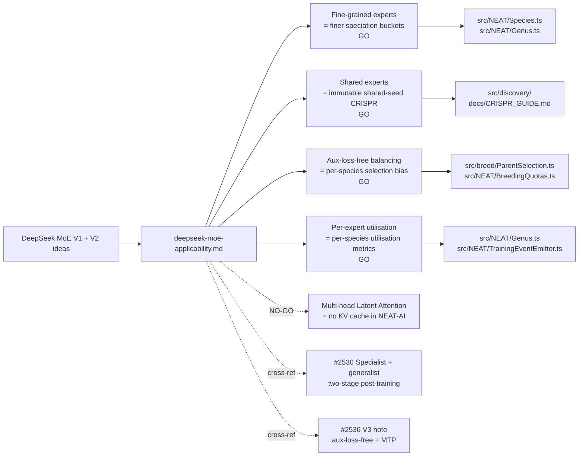

# DeepSeek MoE (V1 + V2) Applicability to NEAT-AI (Issue #2535)

> **📦 Archived under
> [Issue #2575](https://github.com/stSoftwareAU/NEAT-AI/issues/2575).** This
> research note was moved from `docs/research/` to `docs/archive/research/`. Its
> conclusions have landed (or been triaged out) — see the
> [`deepseek-papers-index.md`](deepseek-papers-index.md) catalogue for the
> consolidated implementation status. Topic index:
> [`docs/README.md`](../../README.md).

This research note maps the headline ideas from the DeepSeek MoE family —
fine-grained expert segmentation and shared-expert isolation from **DeepSeekMoE
(V1)**, plus auxiliary-loss-free load balancing, Multi-head Latent Attention
(MLA), and per-expert utilisation telemetry from **DeepSeek V2** — onto
NEAT-AI's speciation, breeding, and population-balancing machinery. Each idea
gets a GO / NO-GO recommendation with a one-paragraph rationale and (for every
GO) a proposed experimental sub-issue outline.

> **Sources.**
>
> - DeepSeek-AI, _DeepSeekMoE: Towards Ultimate Expert Specialization in
>   Mixture-of-Experts Language Models_, January 2024.
>   [arXiv:2401.06066](https://arxiv.org/abs/2401.06066). Citations below use
>   the form _(MoE V1 §x.y)_.
> - DeepSeek-AI, _DeepSeek-V2: A Strong, Economical, and Efficient
>   Mixture-of-Experts Language Model_, May 2024.
>   [arXiv:2405.04434](https://arxiv.org/abs/2405.04434). Citations use the form
>   _(V2 §x.y)_.
>
> **Note on aux-loss-free balancing.** DeepSeek's auxiliary-loss-free
> load-balancing technique (bias-only routing correction) is most thoroughly
> described in the **V3 technical report**
> ([arXiv:2412.19437](https://arxiv.org/abs/2412.19437)); the V2 paper
> introduces the routing-bias machinery that V3 then made fully aux-loss-free.
> The companion V3 note
> ([#2536](https://github.com/stSoftwareAU/NEAT-AI/issues/2536),
> [`deepseek-v3-applicability.md`](deepseek-v3-applicability.md)) covers the V3
> refinement; this note focuses on the MoE-family lineage. The two notes
> deliberately overlap on the speciation-bias mapping and cross-reference each
> other.
>
> **Scope.** Documentation only. No source-code changes. Each GO is paired with
> a proposed experimental sub-issue title and outline; this note does not
> pre-empt the implementation work.
>
> **Sibling notes.** This note is one entry in the DeepSeek paper catalogue
> ([#2533](https://github.com/stSoftwareAU/NEAT-AI/issues/2533),
> [`deepseek-papers-index.md`](deepseek-papers-index.md)). The
> specialist-pipeline issue
> ([#2530](https://github.com/stSoftwareAU/NEAT-AI/issues/2530)) already covers
> the MoE-derived "specialist + generalist" two-stage post-training idea; we
> cross-reference rather than duplicate.

## Summary table

| # | MoE idea                                      | Closest NEAT-AI surface                                                        | Recommendation | Effort | Risk to invariants |
| - | --------------------------------------------- | ------------------------------------------------------------------------------ | -------------- | ------ | ------------------ |
| 1 | Fine-grained expert segmentation (MoE V1)     | Speciation granularity — `src/NEAT/Species.ts`, `src/NEAT/Genus.ts`            | **GO**         | M      | None               |
| 2 | Shared experts isolated from routing (MoE V1) | Immutable shared-seed CRISPR injection — `src/discovery/`, `docs/CRISPR_GUIDE` | **GO**         | M      | None               |
| 3 | Auxiliary-loss-free load balancing (V2 / V3)  | Per-species selection bias — `src/breed/ParentSelection.ts`, `Species.ts`      | **GO**         | M      | None               |
| 4 | Multi-head Latent Attention (MLA, V2)         | None — feed-forward creatures have no KV cache                                 | **NO-GO**      | n/a    | n/a                |
| 5 | Per-expert utilisation telemetry (V2)         | Per-species utilisation metrics in training event payload — `Genus.ts`         | **GO**         | S      | None               |

## MoE idea → NEAT-AI module mapping

## 1. Fine-grained expert segmentation (MoE V1) — **GO**

**Technical summary.** DeepSeekMoE (MoE V1 §3) argues that conventional MoE
routes tokens to a small number of large experts, which forces each expert to
absorb several semantically distinct skills and so blunts specialisation. Their
fix is **fine-grained segmentation**: split each expert hidden FFN into _m_
smaller experts and route each token to _km_ of them (instead of _k_ of the
original size). With the same parameter and FLOP budget, the finer slices each
specialise more narrowly and the routing distribution has more degrees of
freedom, which empirically yields lower perplexity for the same compute.

**Closest NEAT-AI surface.** "Experts" in NEAT-AI map most naturally onto
**species** — disjoint sub-populations whose creatures share a topology
fingerprint. `src/NEAT/Species.ts` already buckets creatures by
`{neuronCountBucket, connectivityBucket, squashDistribution}` (Issue #1038). The
`NEURON_BUCKET_SIZE = 10` and `CONNECTIVITY_BUCKET_SIZE = 2` constants set the
granularity. The "few large experts" baseline today is the coarse default
bucketing; the "many small experts" alternative is finer bucketing (e.g.
`NEURON_BUCKET_SIZE = 5`, plus a finer squash-class hash) so that each species
covers a narrower topology niche.

**Rationale (GO).** Tightening the speciation buckets is a cheap, self-contained
experiment with a clear hypothesis: finer niches give selection more degrees of
freedom and reduce intra-species diversity collapse, in exchange for smaller
per-species cohorts and slower fitness-sharing convergence. The V1 result is
that the trade comes out favourable when the routing/selection mechanism can
support more buckets — exactly the regime we are in, since `BreedingQuotas`
already allocates per-species. The experiment is independent of Idea 2 (shared
seeds) and Idea 3 (selection bias); they compose.

**Risk.** None to the critical invariants. Bucket boundaries are runtime
classification only; UUIDs and `semanticVersion` are not affected. Cross-machine
breeding is unaffected because the wire format is unchanged — only the in-memory
species key changes. The dynamics risk is **diversity collapse at the species
level**: with very fine buckets, many species have size 1 and fitness-sharing
degenerates. The experiment must report species size distribution and
`bestRawFitness`-vs-generation to detect this.

**Effort.** **M.** Make `NEURON_BUCKET_SIZE`, `CONNECTIVITY_BUCKET_SIZE`, and
the squash-distribution hash granularity configurable via
`NeatOptions.speciationGranularity`. Add a benchmark on the standard ED-fold
suite that varies granularity (coarse / current / fine / very-fine) and reports
fitness, species-count, and species-size distribution.

**Proposed experimental sub-issue.**

- **Title.** "Fine-grained speciation: configurable bucket granularity for
  `Species` classification (DeepSeekMoE V1 §3)"
- **Outline.**
  1. Promote `NEURON_BUCKET_SIZE`, `CONNECTIVITY_BUCKET_SIZE`, and the
     squash-distribution hash to `NeatOptions.speciationGranularity` (default =
     current values).
  2. Benchmark four granularity levels (coarse, current, fine, very-fine) on the
     standard ED-fold suite. Hold population size, mutation rates, and selection
     pressure constant.
  3. Report fitness-vs-generation, species count, species-size histogram, and
     Shannon diversity over species. Diversity collapse is a fail criterion, not
     just lower fitness.
  4. Cross-check: does finer bucketing increase the proportion of
     speciation-driven breeding (cross-species grafting) vs. intra-species
     breeding? Use existing `BreedingQuotas` telemetry.
  5. Negative-result acceptable: if the current granularity is already
     near-optimal, document it as the published baseline and close.

## 2. Shared experts isolated from routing (MoE V1) — **GO**

**Technical summary.** DeepSeekMoE (MoE V1 §3.2) introduces **shared experts** —
a small set of experts that are **always activated** for every token, in
parallel with the routed experts. The shared experts absorb common features that
all routed experts would otherwise have to redundantly re-learn, freeing the
routed experts to specialise on niche features. Empirically this reduces
redundancy across the routed expert set and improves perplexity at fixed
compute.

**Closest NEAT-AI surface.** The cleanest analogue is an **immutable shared-seed
subnetwork** injected into every species via CRISPR (see AGENTS.md "CRISPR
injections" terminology and [`docs/CRISPR_GUIDE.md`](../../CRISPR_GUIDE.md)).
Today, CRISPR templates can inject hand-crafted synapses/neurons into individual
creatures, but there is no concept of a "core" sub-graph that every species must
contain and that mutation/breeding must preserve. Such a core would be the
population analogue of "always-on shared experts": a topology fragment that
captures common, broadly-useful features, contributed to every creature, and
never edited away.

**Rationale (GO).** A shared-seed core would let speciation and breeding focus
selection pressure on the **specialist** part of each creature without having to
re-evolve the same generic feature extractor in every species. The immutability
constraint also gives us a stronger anchor for cross-machine breeding alignment
— the shared core's neuron UUIDs are identical across the fleet, so the matching
surface for grafting between incompatible topologies is larger. The experiment
is a clean ablation: same population, same mutation/breeding, with vs. without a
shared seed core. Risk is contained because the seed is content, not new
machinery.

**Risk.** None to UUID stability — the shared-seed neurons get UUIDs at
seed-construction time and those UUIDs are then preserved across all descendants
(per AGENTS.md "Neuron UUID stability"). None to `semanticVersion` — seed
creatures are constructed via the standard `Creature` constructor and inherit
`CURRENT_CREATURE_SEMANTIC_VERSION`. The risk surface is **mutation/compaction
discipline**: the immutability constraint must be enforced by mutation operators
(i.e. they must skip the shared-core neurons), and any compaction pass must
respect "do not delete shared-core neurons even if they appear unreferenced". A
regression test in `test/creature/` should assert that the shared-core UUIDs
survive multiple generations of mutation, breeding, and compaction.

**Effort.** **M.** A `seeds/shared-core/*.json` directory plus a
`NeatOptions.sharedCoreSeed` option that injects the seed into every freshly
constructed creature, plus a pin-list mechanism in mutation / compaction that
protects the shared-core neuron UUIDs. Plus a benchmark holding everything
constant except the shared-core flag.

**Proposed experimental sub-issue.**

- **Title.** "Shared-seed core: immutable CRISPR-injected subnetwork preserved
  across species (DeepSeekMoE V1 §3.2)"
- **Outline.**
  1. Define a `seeds/shared-core/` JSON directory of valid `exportJSON()`
     creatures, with documented intent (e.g. "encode a tanh denser-than-input
     common-feature extractor").
  2. Add `NeatOptions.sharedCoreSeed` that names the seed; on `Neat`
     construction, inject the seed's neurons + synapses into every newly
     constructed creature, marking the seed neurons with a `coreSeed: true` tag.
  3. Update `src/mutate/` operators and the compaction pass to skip
     `coreSeed`-tagged neurons (no removal, no UUID change, no squash swap).
  4. Add `test/creature/SharedCoreInvariant.ts` asserting that after N
     generations, every surviving creature still contains all `coreSeed`-tagged
     neurons with their original UUIDs.
  5. Benchmark fitness-vs-generation with and without the seed on the ED-fold
     suite. Report whether the seed accelerates convergence and whether it traps
     the population in the seed basin (diversity-collapse check via species
     count and Shannon diversity).
  6. Cross-reference: this idea is orthogonal to and composes with specialist
     sub-populations
     ([#2530](https://github.com/stSoftwareAU/NEAT-AI/issues/2530)). The
     shared-core is the always-on portion; specialists are the routed portion.

## 3. Auxiliary-loss-free load balancing (V2 / V3) — **GO**

**Technical summary.** Conventional MoE training adds an auxiliary
load-balancing loss to discourage the gating network from collapsing onto a few
popular experts. The auxiliary loss is brittle: it competes with the main
objective for gradient signal, and tuning its weight is empirically painful.
DeepSeek-V2 (V2 §3) introduces a per-expert routing bias term that is updated
_outside_ the main loss — the gate's logit for each expert receives a bias
adjustment that drifts down for over-utilised experts and up for under-utilised
ones. V3 (the V3 note, #2536) makes this fully **auxiliary-loss-free**:
balancing is achieved purely through the bias dynamics, with no auxiliary term
in the loss. Empirically the bias-only scheme matches or beats the
auxiliary-loss baseline at much lower tuning cost.

**Closest NEAT-AI surface.** NEAT-AI's analogue of the "over-utilised-expert
penalty" is **fitness sharing** — `Species.ts` already divides `bestRawFitness`
by `size` to produce `adjustedFitness`, and downstream selection
(`src/breed/ParentSelection.ts`, `src/NEAT/BreedingQuotas.ts`) uses that
adjusted value as a soft penalty against large species. The fitness-sharing
penalty is exactly the brittle "auxiliary loss" pattern V2 wants to replace: it
is mixed into the same scalar that drives selection, and tuning its strength
means re-shaping the fitness surface. A bias-only alternative would compute a
per-species **selection bias** that drifts down for over-utilised species (those
whose share of breeding slots exceeds target) and up for under-utilised ones,
and apply that bias _at parent-selection time_ without touching the raw or
adjusted fitness scalar.

**Rationale (GO).** Decoupling the balancing signal from the fitness signal
removes the worst class of fitness-sharing pathology: a strong species that gets
penalised so hard its members lose to mediocre members of a tiny species. With a
bias-only scheme, raw fitness still decides within-species selection, while a
separate exponential-moving-average bias steers the across-species
breeding-quota distribution. This pairs well with the V3 aux-loss-free work
tracked under #2536 — the two notes should ideally land a single experiment that
compares (a) current fitness-sharing, (b) bias-only, (c) bias + light
fitness-sharing.

**Risk.** None to the critical invariants. The bias is a runtime selection-time
scalar; UUIDs, `semanticVersion`, and the wire format are untouched. The
dynamics risk is **bias drift**: an aggressive update rate could over-correct
and cause population oscillation (species A shrinks, B grows, A rebounds). The
V2 paper's update rule is a small exponential-moving-average step; we should
follow it and report species-size time series alongside fitness.

**Effort.** **M.** A `NeatOptions.speciationBalancing` option with values
`fitness-sharing` (current default), `bias-only`, and `bias-plus-sharing`. Plus
a per-`Species` `selectionBias: number` field updated once per generation by an
EMA controller, and a hook in `BreedingQuotas` / `ParentSelection` that adds the
bias to the selection logit (or multiplies the quota target). Plus benchmarks on
the ED-fold suite.

**Proposed experimental sub-issue.**

- **Title.** "Aux-loss-free species balancing: bias-only selection correction in
  `BreedingQuotas` / `ParentSelection` (DeepSeek V2 §3, V3 refinement)"
- **Outline.**
  1. Add a `selectionBias: number` field to `Species` updated once per
     generation by an EMA controller against a target species-size fraction
     (e.g. `1 / numSpecies`).
  2. Add `NeatOptions.speciationBalancing` with values `fitness-sharing`
     (default), `bias-only`, `bias-plus-sharing`.
  3. Wire the bias into `BreedingQuotas` (multiplicative on the per-species
     quota) and into `ParentSelection` (additive on the within-species softmax
     temperature, if applicable).
  4. Benchmark all three modes on the ED-fold suite. Report fitness,
     species-count, species-size distribution, and bias-trajectory time series.
  5. Coordinate with the V3 aux-loss-free work
     ([#2536](https://github.com/stSoftwareAU/NEAT-AI/issues/2536)) so the two
     sub-issues share a single benchmark-and-decision artefact.
  6. Negative-result acceptable: if fitness-sharing alone is unimprovable,
     document it.

## 4. Multi-head Latent Attention (MLA, V2) — **NO-GO**

**Technical summary.** MLA (V2 §2.1) compresses the per-token KV cache through a
low-rank latent projection: instead of storing full key and value vectors per
head per token, the model stores a small latent vector plus per-head
decompression matrices. This dramatically reduces inference memory and bandwidth
for long contexts, with negligible accuracy loss.

**Closest NEAT-AI surface.** None. NEAT-AI creatures are forward-only
feed-forward networks (per AGENTS.md "Feed-forward vs Recurrent Connections",
default forward-only). There is no attention mechanism, no KV cache, and no
per-token state to compress. The `src/wasm/` activation path is a topological
feed-forward sweep, and the propagation path (`src/propagate/`) is
gradient-based, not autoregressive.

**Tangential idea — "compress per-creature state to a low-rank summary."** The
acceptance criteria asks whether the underlying low-rank state-compression idea
has any application to discovery-cache state representation (i.e. could the
success/failure cache use a low-rank fingerprint instead of a full creature
snapshot?). The honest answer is that the discovery cache already does this — a
discovery candidate's "state" is a `rustRequest` payload keyed by structural
fingerprints, not by activation traces. There is no per-token activation-cache
analogue, and no obvious win from adding one. The discovery wire-format work in
[Issue #2090](https://github.com/stSoftwareAU/NEAT-AI/issues/2090) and the
wire-format guarantees in AGENTS.md ("Discovery/cache/FFI wire contract")
already cover the compactness question; switching to a low-rank latent
representation would add complexity without a target problem.

**Rationale (NO-GO).** MLA is a transformer-attention KV-cache optimisation; we
do not have the surface it applies to. The "compress-state-to-latent" idea is
interesting in isolation but has no load-bearing application in NEAT-AI today,
and inventing one would be a solution looking for a problem. Listed for
completeness so this idea is not re-raised.

**Risk.** N/A (not adopted). Adopting an analogue would require first
identifying a concrete state-storage bottleneck the discovery or breeding
pipeline actually has — at which point that bottleneck, not MLA, would drive the
design.

**Effort.** N/A.

## 5. Per-expert utilisation telemetry (V2) — **GO**

**Technical summary.** V2 (V2 §3, "Device-Limited Routing" and the load metrics
surrounding it) emphasises that **per-expert utilisation telemetry** — fraction
of tokens routed to each expert per step, running averages over recent windows,
and over-/under-utilised expert counts — is essential to debug routing
pathologies (collapse onto a few experts, dead experts that never fire).
DeepSeek's MoE training reports these metrics continuously and uses them to
validate that the balancing mechanism (auxiliary loss in V1, routing bias in V2)
is actually working.

**Closest NEAT-AI surface.** `src/NEAT/Genus.ts` already exposes a
`SpeciesSummary` (Issue #2452) per training event with `size`, `bestRawFitness`,
`meanRawFitness`, and `adjustedFitness`. What we _do not_ surface today is
**per-species utilisation over time** — for example, the rolling fraction of
breeding slots a species has won over the last N generations, the fraction of
mutations that survived selection per species, or the count of consecutive
generations a species was empty ("dead-expert" detector). These are exactly the
metrics V2's MoE diagnostics report.

**Rationale (GO).** Surfacing these metrics is a small, observation-only change
with high diagnostic value. It is an essential prerequisite to both Idea 1
(fine-grained speciation — we need to know whether finer buckets create dead
species) and Idea 3 (bias-only balancing — we cannot tune the bias EMA without a
utilisation time series). It also pairs with the V3 note's diagnostics work
(#2536). The telemetry has zero impact on creature semantics or wire formats; it
is a strict superset of what `SpeciesSummary` already emits.

**Risk.** None. The metrics are read-only over the existing `Genus.speciesMap`;
no creature, mutation, or breeding logic changes. UUIDs, `semanticVersion`, and
the wire format are untouched.

**Effort.** **S.** Extend `SpeciesSummary` with rolling-window fields
(`breedingShareWindow`, `mutationSurvivalRate`, `consecutiveEmptyGenerations`),
populate them in `Genus` once per generation, and ensure
`TrainingEventEmitter.ts` carries them. Add a small dashboard-friendly logging
helper that flags "over-utilised-species" and "dead-species" thresholds at WARN
level.

**Proposed experimental sub-issue.**

- **Title.** "Per-species utilisation telemetry: rolling-window metrics on
  `SpeciesSummary` (DeepSeek V2 §3 routing diagnostics)"
- **Outline.**
  1. Extend `SpeciesSummary` (Issue #2452) with `breedingShareWindow: number`
     (last-N-generations fraction of breeding slots),
     `mutationSurvivalRate: number`, and `consecutiveEmptyGenerations: number`.
  2. Populate the fields in `Genus.computeStatistics()` (or a sibling method)
     using existing `BreedingQuotas` and `Mutator` accounting hooks; add
     accounting hooks where they are missing.
  3. Emit the new fields via `TrainingEventEmitter.ts` so consumers see them on
     the standard generation event.
  4. Add a logging helper that, at default verbosity, emits a single WARN line
     per generation listing dead species (`consecutiveEmptyGenerations >= 3`)
     and over-utilised species (`breedingShareWindow > 0.5` for two windows
     running).
  5. Add unit tests in `test/NEAT/` that exercise the new fields against
     synthetic populations (single dominant species, all-equal species,
     dead-species recovery).
  6. Negative-result not applicable — this is observability, not behaviour
     change. Acceptance is "the metrics are correct on the synthetic populations
     and emit on the standard event payload".

## Cross-cutting invariants

Every GO recommendation has been screened against the two critical invariants in
AGENTS.md:

- **Neuron UUID stability.** Idea 1 (fine-grained speciation) only changes
  in-memory bucket keys — no neuron identity changes. Idea 2 (shared-seed core)
  constructs seed neurons via the standard `Creature` constructor at seed-load
  time and then preserves their UUIDs through mutation, breeding, and
  compaction; the proposed sub-issue includes a regression test asserting this.
  Ideas 3 (bias-only balancing) and 5 (utilisation telemetry) are
  observation-only and additive over selection — they touch no neuron.
- **Semantic version immutability.** None of the GO experiments change the
  `Creature` constructor's default semantic-version handling or introduce a
  pipeline step that re-bumps `semanticVersion`. Seed creatures (Idea 2) inherit
  `CURRENT_CREATURE_SEMANTIC_VERSION` like any other freshly constructed
  creature.

Anything that crosses a process, machine, disk, cache, or FFI boundary in the
experiments above must continue to use **UUID-only wire formats** (per AGENTS.md
"Discovery/cache/FFI wire contract"). The shared-seed library (Idea 2) is the
most likely place to slip on this rule — its loader must treat seed JSON as a
normal `exportJSON()` payload and reject any seed that contains numeric `id` /
`fromId` / `toId` fields.

## Cross-references

- [`deepseek-papers-index.md`](deepseek-papers-index.md) (#2533) — the catalogue
  entry for both the V1 MoE paper and the V2 MoE/MLA paper points here.
- [`deepseek-v3-applicability.md`](deepseek-v3-applicability.md) (#2536) — V3's
  aux-loss-free balancing refinement; Idea 3 here and the V3 note's balancing
  section should land a shared experiment.
- Specialist + generalist two-stage post-training
  ([#2530](https://github.com/stSoftwareAU/NEAT-AI/issues/2530)) — the
  MoE-derived "specialist sub-models then ensemble distillation" idea is already
  tracked there. Idea 2 (shared-seed core) here is the always-on counterpart to
  those routed specialists; the two compose, they do not duplicate.
- AGENTS.md — "CRISPR injections" terminology and the two critical invariants
  quoted above.
- [`docs/CRISPR_GUIDE.md`](../../CRISPR_GUIDE.md) — append+demote pattern and
  validation rules that any shared-seed loader (Idea 2) must respect.

## What this note does not do

- It does not prescribe implementation — each GO experiment owns its own design
  in its sub-issue, to be raised in the next planning round.
- It does not commit to merging any experiment to `Develop`. Sub-issues must
  produce benchmark evidence (per the Performance Task Workflow in `AGENTS.md`)
  before adoption.
- It does not re-open the NO-GO idea. MLA (Idea 4) does not have an applicable
  surface in NEAT-AI today; if a future autoregressive or recurrent mode
  introduces one, raise a fresh follow-up rather than re-litigating here.
