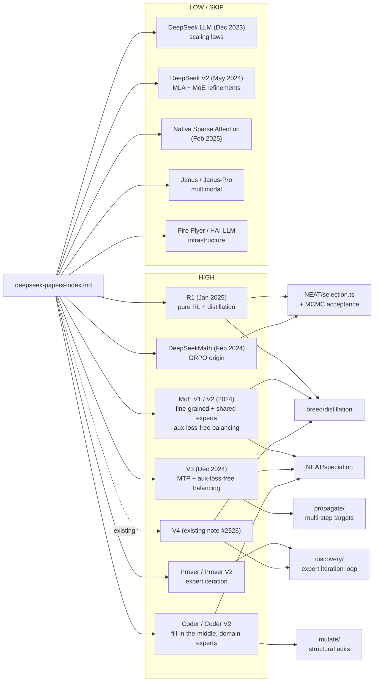

# DeepSeek Paper Catalogue — NEAT-AI Applicability Index

> **📦 Archived under
> [Issue #2575](https://github.com/stSoftwareAU/NEAT-AI/issues/2575).** This
> catalogue and its companion applicability notes were moved from
> `docs/research/` to `docs/archive/research/`. The conclusions have already
> landed (see the **Implementation Status** section below); the catalogue is
> kept for historical reference and is exercised by
> [`test/docs/DeepseekPapersIndex.ts`](../../../test/docs/DeepseekPapersIndex.ts)
> so the linked artefacts cannot silently rot. Topic index:
> [`docs/README.md`](../../README.md). Sibling archived applicability notes are
> in this same directory.

This document is the navigation hub for the broader DeepSeek-applicability
investigation tracked under
[#2532](https://github.com/stSoftwareAU/NEAT-AI/issues/2532). It catalogues
every published DeepSeek paper, scores each for NEAT-AI applicability, and links
to the per-paper research-note sub-issues.

The companion document for V4-specific applicability is
[#2526](https://github.com/stSoftwareAU/NEAT-AI/issues/2526); this index covers
everything else and cross-links V4 for completeness.

Source collection:
[Presidentlin/deepseek-papers on Hugging Face](https://huggingface.co/collections/Presidentlin/deepseek-papers).

## Applicability Rubric

| Score      | Meaning                                                                          |
| ---------- | -------------------------------------------------------------------------------- |
| **HIGH**   | Worth a dedicated research note plus experimental sub-issues.                    |
| **MEDIUM** | Research note only; experimental work is deferred until a HIGH lead matures.     |
| **LOW**    | Single-paragraph dismissal recorded inline; no separate note.                    |
| **SKIP**   | Out of scope (multimodal-only, infrastructure, etc.); rationale recorded inline. |

NEAT-AI is a neuro-evolution library that breeds small forward-only neural
networks across ~20 distributed machines. Anything language-model-specific,
tokeniser-specific, multimodal, or tied to ten-thousand-GPU training
infrastructure scores LOW or SKIP unless it carries a portable algorithmic idea
(e.g. GRPO, expert iteration, aux-loss-free balancing, MTP) that maps onto our
breeding, selection, mutation, discovery, or backprop surfaces.

## Implementation Status (Issue #2584)

The five HIGH-applicability ideas tied to the V4 research note (#2526) were
implemented as experimental sub-issues #2527–#2531. Each landed only after a
before/after benchmark showed neutral-or-better convergence — anything that did
not carry its weight was rejected. All five operators are gated behind opt-in
configuration so the production path is unchanged when defaults are in effect.

| # | Idea                                  | Sub-issue | PR                                                         | Opt-in flag                            | Benchmark headline                                                    |
| - | ------------------------------------- | --------- | ---------------------------------------------------------- | -------------------------------------- | --------------------------------------------------------------------- |
| 1 | GRPO group-relative advantage         | #2527     | [#2548](https://github.com/stSoftwareAU/NEAT-AI/pull/2548) | `mcmc.mcmcAdvantageMode`               | mean -0.151 → -0.112 (better), wall ≈45 % faster (12 seeds)           |
| 2 | On-Policy Distillation breed operator | #2528     | [#2547](https://github.com/stSoftwareAU/NEAT-AI/pull/2547) | `opd.breedRate`                        | calibration MSE -90 % vs no-train baseline at 50 steps                |
| 3 | Muon orthogonalised gradients         | #2529     | [#2544](https://github.com/stSoftwareAU/NEAT-AI/pull/2544) | `gradientOrthogonalisation = "muon"`   | 415 → 251 iters to target error (~40 % fewer), per-step ≈19 % cheaper |
| 4 | Specialist + ensemble distillation    | #2530     | [#2550](https://github.com/stSoftwareAU/NEAT-AI/pull/2550) | `specialist.mode = "auto"`/`"manual"`  | generalist combined-score ≥ mean specialist (10/10 unit tests)        |
| 5 | Engram subnetwork hash index          | #2531     | [#2551](https://github.com/stSoftwareAU/NEAT-AI/pull/2551) | `subnetworkIndexSize` (default 50 000) | ~0.5 µs lookup at 50 k entries, ~10 µs end-to-end per creature        |

Each row links to the merged PR; full benchmark scripts live under `bench/`
(`MCMCAdvantageConvergence.ts`, `OnPolicyDistillationBreed.ts`,
`MuonVsBaseline.ts`, `SpecialistVsMixed.ts`, `SubnetworkHashLookup.ts`) and unit
tests under `test/` (`NEAT/GroupRelativeAdvantage.ts`,
`breed/OnPolicyDistillationBreed.ts`, `propagate/MuonOrthogonalisation.ts`,
`NEAT/SpecialistPipeline.ts`, `discovery/SubnetworkHashIndex.ts`).

The remaining HIGH-rated entries (R1, MoE, V3, Math, Prover) and the MEDIUM
Coder note are research-only at this point — no operator was promoted from those
notes during the May 2026 milestone. They remain candidates for future work; new
experiments must follow the same before/after benchmark gate.

## Paper → NEAT-AI Subsystem Mapping

## Papers

### DeepSeek LLM (Dec 2023)

- **Paper**: DeepSeek LLM: Scaling Open-Source Language Models with Longtermism
  ([arXiv:2401.02954](https://arxiv.org/abs/2401.02954)).
- **Core technique(s)**: Empirical scaling laws and recipe for training a
  67B-parameter dense transformer on 2 T tokens; introduces a model-vs-data
  budget allocation argued to be more accurate than Chinchilla for their regime.
- **Closest NEAT-AI surface**: `n/a` (population sizing has its own dynamics
  driven by speciation thresholds and elitism, not transformer scaling laws).
- **Applicability score**: **LOW** — scaling-law arguments do not transfer
  cleanly. NEAT-AI's "compute" axes are generations × population × creature
  size, and the right operating point is set by the cost surface and the
  diminishing-return curve of mutation acceptance, not by a fitted
  loss-vs-tokens power law. No follow-up note required.
- **Linked research-note issue**: none.

### DeepSeek MoE (Jan 2024)

- **Paper**: DeepSeekMoE: Towards Ultimate Expert Specialization in
  Mixture-of-Experts Language Models
  ([arXiv:2401.06066](https://arxiv.org/abs/2401.06066)).
- **Core technique(s)**: Fine-grained expert segmentation and shared-expert
  isolation; auxiliary load-balancing loss; precursor to V2/V3 routing.
- **Closest NEAT-AI surface**: `src/NEAT/` (speciation), `src/breed/`
  (cross-species breeding), `src/mutate/` (specialist mutations).
- **Applicability score**: **HIGH** — fine-grained-experts + shared-experts maps
  cleanly onto our species + cross-species breeding model, and aux-loss-free
  balancing (V3 refinement) is directly testable on our speciation thresholds.
- **Linked research-note issue**:
  [#2535](https://github.com/stSoftwareAU/NEAT-AI/issues/2535).

### DeepSeekMath (Feb 2024)

- **Paper**: DeepSeekMath: Pushing the Limits of Mathematical Reasoning in Open
  Language Models ([arXiv:2402.03300](https://arxiv.org/abs/2402.03300)).
- **Core technique(s)**: Group Relative Policy Optimisation (GRPO) — replaces
  PPO's value baseline with a group-relative advantage computed across a sampled
  batch; greatly reduces memory and noise.
- **Closest NEAT-AI surface**: `src/NEAT/selection.ts`, `src/mutate/` MCMC
  acceptance.
- **Applicability score**: **HIGH** — group-relative advantage is exactly the
  shape of signal NEAT-AI already has (a generation is a "group" of candidates
  with a shared baseline). Mapping GRPO onto MCMC mutation acceptance is a clean
  experimental sub-issue (#2527).
- **Linked research-note issue**:
  [#2537](https://github.com/stSoftwareAU/NEAT-AI/issues/2537) (extends
  experimental work in
  [#2527](https://github.com/stSoftwareAU/NEAT-AI/issues/2527)).
- **Implementation status**: **landed** via #2527 / PR
  [#2548](https://github.com/stSoftwareAU/NEAT-AI/pull/2548). Opt in with
  `mcmc.mcmcAdvantageMode = "groupRelative"`. Benchmark
  (`bench/MCMCAdvantageConvergence.ts`, 12 seeds, pop=32, 500 iters): mean score
  -0.151 → -0.112 (better) and ~45 % lower wall time vs the absolute-delta
  baseline.

### DeepSeek Coder (Jan 2024)

- **Paper**: DeepSeek-Coder: When the Large Language Model Meets Programming —
  The Rise of Code Intelligence
  ([arXiv:2401.14196](https://arxiv.org/abs/2401.14196)).
- **Core technique(s)**: Repo-level pre-training, fill-in-the-middle (FIM)
  objective, project-aware data layout.
- **Closest NEAT-AI surface**: `src/mutate/` (FIM-style edits to internal
  layers), `src/NEAT/speciation` (domain-specialist sub-populations).
- **Applicability score**: **MEDIUM** — FIM is suggestive of a structural
  mutation that re-fills a deleted middle slice of a creature's topology rather
  than replacing terminals. Worth a research note; experimental work is deferred
  behind GRPO/distillation.
- **Linked research-note issue**:
  [#2539](https://github.com/stSoftwareAU/NEAT-AI/issues/2539).

### DeepSeek Coder V2 (Jun 2024)

- **Paper**: DeepSeek-Coder-V2: Breaking the Barrier of Closed-Source Models in
  Code Intelligence ([arXiv:2406.11931](https://arxiv.org/abs/2406.11931)).
- **Core technique(s)**: MoE-based code model continuing from V2 base; expanded
  language coverage; refined data mix and routing.
- **Closest NEAT-AI surface**: same as Coder V1 plus the MoE routing surfaces in
  `src/NEAT/`.
- **Applicability score**: **MEDIUM** — same applicability bucket as Coder V1;
  covered by the Coder note (#2539) and overlaps with the MoE note (#2535).
- **Linked research-note issue**:
  [#2539](https://github.com/stSoftwareAU/NEAT-AI/issues/2539).

### DeepSeek V2 (May 2024)

- **Paper**: DeepSeek-V2: A Strong, Economical, and Efficient Mixture-of-Experts
  Language Model ([arXiv:2405.04434](https://arxiv.org/abs/2405.04434)).
- **Core technique(s)**: Multi-head Latent Attention (MLA) — KV-cache
  compression — and DeepSeekMoE refinements; device-limited routing.
- **Closest NEAT-AI surface**: MoE refinements → `src/NEAT/speciation` (covered
  by #2535). MLA → no analogue (NEAT-AI has no KV cache).
- **Applicability score**: **MEDIUM** for the MoE half (rolled into #2535);
  **SKIP** for MLA — it is a transformer-attention-cache optimisation with no
  analogue in our forward-only feed-forward creatures.
- **Linked research-note issue**:
  [#2535](https://github.com/stSoftwareAU/NEAT-AI/issues/2535) (MoE half).

### DeepSeek Prover (May 2024)

- **Paper**: DeepSeek-Prover: Advancing Theorem Proving in LLMs through
  Large-Scale Synthetic Data
  ([arXiv:2405.14333](https://arxiv.org/abs/2405.14333)).
- **Core technique(s)**: Expert-iteration loop — sample candidate proofs, filter
  by a verifier, retrain on the survivors; bootstrap a synthetic Lean corpus.
- **Closest NEAT-AI surface**: `src/discovery/` (Rust FFI structural-hint loop)
  and `src/breed/` (training survivors of a generation).
- **Applicability score**: **HIGH** — expert iteration is a direct analogue of
  the discovery pipeline: propose candidates → verify against fitness → keep the
  survivors as training fodder. Worth its own note plus an experimental
  sub-issue (the cache-augmented discovery loop in #2531 is related).
- **Linked research-note issue**:
  [#2538](https://github.com/stSoftwareAU/NEAT-AI/issues/2538).

### DeepSeek Prover V2 (Apr 2025)

- **Paper**: DeepSeek-Prover-V2: Advancing Formal Mathematical Reasoning via
  Reinforcement Learning for Subgoal Decomposition
  ([arXiv:2504.21801](https://arxiv.org/abs/2504.21801)).
- **Core technique(s)**: Subgoal decomposition with RL; iterates the Prover-V1
  loop with a stronger search policy.
- **Closest NEAT-AI surface**: same as Prover V1 — discovery/expert iteration.
- **Applicability score**: **HIGH** — covered by the Prover note (#2538); the
  subgoal decomposition idea maps onto breaking a creature-level fitness target
  into per-output-channel sub-objectives.
- **Linked research-note issue**:
  [#2538](https://github.com/stSoftwareAU/NEAT-AI/issues/2538).

### DeepSeek V3 (Dec 2024)

- **Paper**: DeepSeek-V3 Technical Report
  ([arXiv:2412.19437](https://arxiv.org/abs/2412.19437)).
- **Core technique(s)**: Multi-Token Prediction (MTP) auxiliary head;
  auxiliary-loss-free load balancing (bias-only routing correction); FP8
  mixed-precision training; node-limited routing.
- **Closest NEAT-AI surface**: MTP → `src/propagate/` (multi-step targets during
  backprop). Aux-loss-free balancing → `src/NEAT/speciation`. FP8 → `src/wasm/`
  numerics (no immediate plan; dependency on NEAT-AI-core).
- **Applicability score**: **HIGH** — MTP and aux-loss-free balancing both have
  clean experimental shapes for NEAT-AI. FP8 is interesting but blocked on core
  support.
- **Linked research-note issue**:
  [#2536](https://github.com/stSoftwareAU/NEAT-AI/issues/2536).

### DeepSeek R1 (Jan 2025)

- **Paper**: DeepSeek-R1: Incentivizing Reasoning Capability in LLMs via
  Reinforcement Learning ([arXiv:2501.12948](https://arxiv.org/abs/2501.12948)).
- **Core technique(s)**: Pure-RL training (R1-Zero) without supervised
  fine-tuning; subsequent supervised + RL rounds; distillation of the R1
  reasoning trace into smaller dense models.
- **Closest NEAT-AI surface**: `src/NEAT/selection.ts` (RL-style reward signal
  already lives here), `src/breed/` (distillation as a breeding operator — see
  #2528), `src/mutate/` (cold-start mutation policy).
- **Applicability score**: **HIGH** — RL-from-scratch on a fitness signal is
  what NEAT-AI already does; the interesting transferable ideas are the
  cold-start curriculum and the distillation-of-reasoning step (#2528).
- **Linked research-note issue**:
  [#2534](https://github.com/stSoftwareAU/NEAT-AI/issues/2534).
- **Implementation status**: distillation-of-reasoning **landed** as the
  On-Policy Distillation breed operator via #2528 / PR
  [#2547](https://github.com/stSoftwareAU/NEAT-AI/pull/2547). Opt in with
  `opd.breedRate > 0`; defaults `teacherCount = 3`, `distillationSteps = 50`.
  Benchmark (`bench/OnPolicyDistillationBreed.ts`, 32 holdout samples, 5
  trials): -27.6 % MSE at 10 steps, -90.0 % at 50 steps, -96.3 % at 100 steps vs
  the no-train baseline. Cold-start curriculum is not yet implemented.

### Native Sparse Attention (Feb 2025)

- **Paper**: Native Sparse Attention: Hardware-Aligned and Natively Trainable
  Sparse Attention ([arXiv:2502.11089](https://arxiv.org/abs/2502.11089)).
- **Core technique(s)**: Block-sparse attention pattern designed to be
  hardware-aligned and trainable end-to-end.
- **Closest NEAT-AI surface**: `n/a` — NEAT-AI has no attention mechanism;
  sparsity in our setting is the natural sparsity of an evolved feed-forward
  topology.
- **Applicability score**: **SKIP** — transformer-attention-only. Documented for
  completeness in the non-applicability triage note
  ([`deepseek-not-applicable.md`](deepseek-not-applicable.md)).
- **Linked research-note issue**:
  [#2540](https://github.com/stSoftwareAU/NEAT-AI/issues/2540)
  ([`deepseek-not-applicable.md`](deepseek-not-applicable.md)).

### Janus (Oct 2024)

- **Paper**: Janus: Decoupling Visual Encoding for Unified Multimodal
  Understanding and Generation
  ([arXiv:2410.13848](https://arxiv.org/abs/2410.13848)).
- **Core technique(s)**: Decoupled visual encoders for understanding vs.
  generation; unified autoregressive backbone.
- **Closest NEAT-AI surface**: `n/a` — NEAT-AI is modality-agnostic but does not
  handle multimodal fusion; image-token-specific.
- **Applicability score**: **SKIP** — multimodal-only. Documented in the
  non-applicability triage note
  ([`deepseek-not-applicable.md`](deepseek-not-applicable.md)).
- **Linked research-note issue**:
  [#2540](https://github.com/stSoftwareAU/NEAT-AI/issues/2540)
  ([`deepseek-not-applicable.md`](deepseek-not-applicable.md)).

### Janus-Pro (Jan 2025)

- **Paper**: Janus-Pro: Unified Multimodal Understanding and Generation with
  Data and Model Scaling ([arXiv:2501.17811](https://arxiv.org/abs/2501.17811)).
- **Core technique(s)**: Janus refinement with cleaner data pipeline and larger
  backbones.
- **Closest NEAT-AI surface**: `n/a`.
- **Applicability score**: **SKIP** — multimodal-only; same rationale as Janus.
  See the non-applicability triage note
  ([`deepseek-not-applicable.md`](deepseek-not-applicable.md)).
- **Linked research-note issue**:
  [#2540](https://github.com/stSoftwareAU/NEAT-AI/issues/2540)
  ([`deepseek-not-applicable.md`](deepseek-not-applicable.md)).

### DeepSeek V4 (covered by #2526; reference only)

- **Paper**: DeepSeek-V4 (covered in
  [#2526](https://github.com/stSoftwareAU/NEAT-AI/issues/2526) — the V4-specific
  research note).
- **Core technique(s)**: Two-stage post-training (specialist sub-models then
  ensemble distillation) plus continued V3-line refinements.
- **Closest NEAT-AI surface**: `src/NEAT/speciation`, `src/breed/`,
  `src/discovery/`.
- **Applicability score**: **HIGH** — already covered by the existing V4
  research note. Experimental sub-issues (all landed — see
  [Implementation Status](#implementation-status-issue-2584)):
  - [#2527](https://github.com/stSoftwareAU/NEAT-AI/issues/2527) — GRPO-style
    group-relative advantage signal for selection / MCMC acceptance. **Landed**
    via PR [#2548](https://github.com/stSoftwareAU/NEAT-AI/pull/2548); opt in
    with `mcmc.mcmcAdvantageMode = "groupRelative"`. Benchmark: mean score
    -0.151 → -0.112 (better), ~45 % lower wall time over 12 seeds.
  - [#2528](https://github.com/stSoftwareAU/NEAT-AI/issues/2528) — On-Policy
    Distillation breeding operator (student creature trained on K elite
    teachers). **Landed** via PR
    [#2547](https://github.com/stSoftwareAU/NEAT-AI/pull/2547); opt in with
    `opd.breedRate > 0`. Benchmark: calibration MSE -90 % at 50 distillation
    steps vs no-train baseline.
  - [#2529](https://github.com/stSoftwareAU/NEAT-AI/issues/2529) — Muon-style
    orthogonalised gradient updates in the local backprop pass. **Landed** via
    PR [#2544](https://github.com/stSoftwareAU/NEAT-AI/pull/2544); opt in with
    `gradientOrthogonalisation = "muon"`. Benchmark: 415 → 251 iterations to
    target error (~40 % fewer), per-step ~19 % cheaper.
  - [#2530](https://github.com/stSoftwareAU/NEAT-AI/issues/2530) — Specialist
    sub-populations + ensemble distillation pipeline (V4 two-stage
    post-training). **Landed** via PR
    [#2550](https://github.com/stSoftwareAU/NEAT-AI/pull/2550); opt in with
    `specialist.mode = "auto"` or `"manual"` plus `specialist.subTaskIds`.
    Acceptance criteria verified by `test/NEAT/SpecialistPipeline.ts` (10/10
    passing): generalist combined score is no worse than the mean specialist
    combined score.
  - [#2531](https://github.com/stSoftwareAU/NEAT-AI/issues/2531) —
    Engram-inspired hash-based subnetwork lookup augmenting the discovery cache.
    **Landed** via PR
    [#2551](https://github.com/stSoftwareAU/NEAT-AI/pull/2551); opt in with
    `subnetworkIndexSize` (default 50 000; `0` disables). Benchmark
    (`bench/SubnetworkHashLookup.ts`): ~0.5 µs lookup at 50 k entries, ~10 µs
    end-to-end per creature.
- **Linked research-note issue**:
  [#2526](https://github.com/stSoftwareAU/NEAT-AI/issues/2526).

### Fire-Flyer / HAI-LLM (infrastructure)

- **Paper**: Fire-Flyer AI-HPC: A Cost-Effective Software-Hardware Co-Design for
  Deep Learning ([arXiv:2408.14158](https://arxiv.org/abs/2408.14158)).
- **Core technique(s)**: Co-designed cluster + scheduler (HAI-LLM, HFReduce)
  optimised for cost-per-FLOP on commodity hardware.
- **Closest NEAT-AI surface**: `n/a` — NEAT-AI's distribution model is ~20
  independent machines pushing creatures via GitHub, not a multi-thousand GPU
  AllReduce fabric.
- **Applicability score**: **SKIP** — infrastructure paper for a problem shape
  we do not have. Recorded for completeness in the non-applicability triage note
  ([`deepseek-not-applicable.md`](deepseek-not-applicable.md)).
- **Linked research-note issue**:
  [#2540](https://github.com/stSoftwareAU/NEAT-AI/issues/2540)
  ([`deepseek-not-applicable.md`](deepseek-not-applicable.md)).

## Summary Table

`Status` reflects the May 2026 milestone (Issue #2532). _Implemented_ means an
operator landed with a passing before/after benchmark; _Research only_ means a
research note exists but no operator was promoted.

| Paper                   | Year     | Score  | Status                          | Note / Sub-issues                                                                                                                                                                                                                                                                                                                                                                                                                                                                                            |
| ----------------------- | -------- | ------ | ------------------------------- | ------------------------------------------------------------------------------------------------------------------------------------------------------------------------------------------------------------------------------------------------------------------------------------------------------------------------------------------------------------------------------------------------------------------------------------------------------------------------------------------------------------ |
| DeepSeek LLM            | Dec 2023 | LOW    | n/a                             | inline                                                                                                                                                                                                                                                                                                                                                                                                                                                                                                       |
| DeepSeek MoE            | Jan 2024 | HIGH   | Research only                   | [#2535](https://github.com/stSoftwareAU/NEAT-AI/issues/2535)                                                                                                                                                                                                                                                                                                                                                                                                                                                 |
| DeepSeekMath (GRPO)     | Feb 2024 | HIGH   | **Implemented** via #2527       | [#2537](https://github.com/stSoftwareAU/NEAT-AI/issues/2537), exp. [#2527](https://github.com/stSoftwareAU/NEAT-AI/issues/2527) → PR [#2548](https://github.com/stSoftwareAU/NEAT-AI/pull/2548)                                                                                                                                                                                                                                                                                                              |
| DeepSeek Coder          | Jan 2024 | MEDIUM | Research only                   | [#2539](https://github.com/stSoftwareAU/NEAT-AI/issues/2539)                                                                                                                                                                                                                                                                                                                                                                                                                                                 |
| DeepSeek Coder V2       | Jun 2024 | MEDIUM | Research only                   | [#2539](https://github.com/stSoftwareAU/NEAT-AI/issues/2539)                                                                                                                                                                                                                                                                                                                                                                                                                                                 |
| DeepSeek V2 (MoE half)  | May 2024 | MEDIUM | Research only                   | [#2535](https://github.com/stSoftwareAU/NEAT-AI/issues/2535)                                                                                                                                                                                                                                                                                                                                                                                                                                                 |
| DeepSeek V2 (MLA half)  | May 2024 | SKIP   | n/a                             | inline                                                                                                                                                                                                                                                                                                                                                                                                                                                                                                       |
| DeepSeek Prover         | May 2024 | HIGH   | Research only                   | [#2538](https://github.com/stSoftwareAU/NEAT-AI/issues/2538)                                                                                                                                                                                                                                                                                                                                                                                                                                                 |
| DeepSeek Prover V2      | Apr 2025 | HIGH   | Research only                   | [#2538](https://github.com/stSoftwareAU/NEAT-AI/issues/2538)                                                                                                                                                                                                                                                                                                                                                                                                                                                 |
| DeepSeek V3             | Dec 2024 | HIGH   | Research only                   | [#2536](https://github.com/stSoftwareAU/NEAT-AI/issues/2536)                                                                                                                                                                                                                                                                                                                                                                                                                                                 |
| DeepSeek R1             | Jan 2025 | HIGH   | **Implemented** via #2528       | [#2534](https://github.com/stSoftwareAU/NEAT-AI/issues/2534), exp. [#2528](https://github.com/stSoftwareAU/NEAT-AI/issues/2528) → PR [#2547](https://github.com/stSoftwareAU/NEAT-AI/pull/2547)                                                                                                                                                                                                                                                                                                              |
| Native Sparse Attention | Feb 2025 | SKIP   | n/a                             | [#2540](https://github.com/stSoftwareAU/NEAT-AI/issues/2540) ([triage](deepseek-not-applicable.md))                                                                                                                                                                                                                                                                                                                                                                                                          |
| Janus                   | Oct 2024 | SKIP   | n/a                             | [#2540](https://github.com/stSoftwareAU/NEAT-AI/issues/2540) ([triage](deepseek-not-applicable.md))                                                                                                                                                                                                                                                                                                                                                                                                          |
| Janus-Pro               | Jan 2025 | SKIP   | n/a                             | [#2540](https://github.com/stSoftwareAU/NEAT-AI/issues/2540) ([triage](deepseek-not-applicable.md))                                                                                                                                                                                                                                                                                                                                                                                                          |
| DeepSeek V4             | 2025     | HIGH   | **Implemented** via #2527–#2531 | [#2526](https://github.com/stSoftwareAU/NEAT-AI/issues/2526), exp. [#2527](https://github.com/stSoftwareAU/NEAT-AI/issues/2527)–[#2531](https://github.com/stSoftwareAU/NEAT-AI/issues/2531); PRs [#2548](https://github.com/stSoftwareAU/NEAT-AI/pull/2548), [#2547](https://github.com/stSoftwareAU/NEAT-AI/pull/2547), [#2544](https://github.com/stSoftwareAU/NEAT-AI/pull/2544), [#2550](https://github.com/stSoftwareAU/NEAT-AI/pull/2550), [#2551](https://github.com/stSoftwareAU/NEAT-AI/pull/2551) |
| Fire-Flyer / HAI-LLM    | Aug 2024 | SKIP   | n/a                             | [#2540](https://github.com/stSoftwareAU/NEAT-AI/issues/2540) ([triage](deepseek-not-applicable.md))                                                                                                                                                                                                                                                                                                                                                                                                          |
