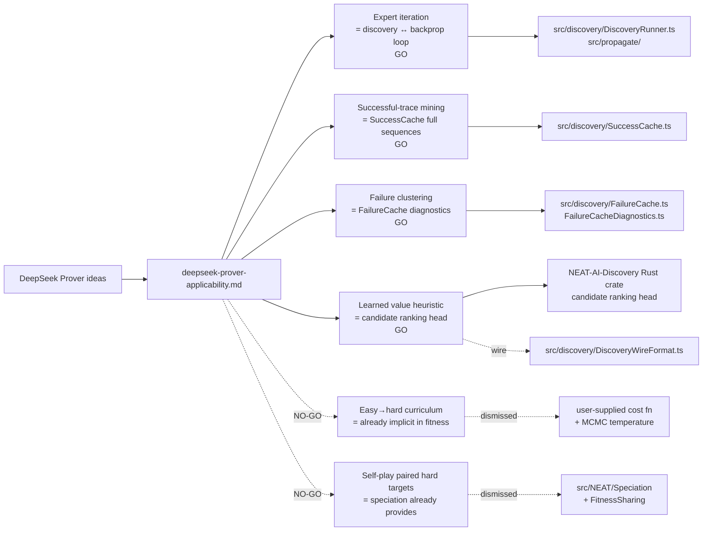

# DeepSeek Prover Applicability to NEAT-AI (Issue #2538)

> **📦 Archived under
> [Issue #2575](https://github.com/stSoftwareAU/NEAT-AI/issues/2575).** This
> research note was moved from `docs/research/` to `docs/archive/research/`. Its
> conclusions have landed (or been triaged out) — see the
> [`deepseek-papers-index.md`](deepseek-papers-index.md) catalogue for the
> consolidated implementation status. Topic index:
> [`docs/README.md`](../../README.md).

This research note maps the six headline ideas from DeepSeek-Prover and
DeepSeek-Prover-V2 onto NEAT-AI's discovery + breeding + backprop pipeline and
records a GO / NO-GO recommendation with a one-paragraph rationale per idea. For
every GO it proposes an experimental sub-issue title plus outline; the
sub-issues themselves will be raised in a follow-up planning round, not here.

> **Sources.**
>
> - DeepSeek-AI, _DeepSeek-Prover: Advancing Theorem Proving in LLMs through
>   Large-Scale Synthetic Data_, May 2024.
>   [arXiv:2405.14333](https://arxiv.org/abs/2405.14333). Citations below use
>   the form _(Prover §x.y)_ and refer to that preprint.
> - DeepSeek-AI, _DeepSeek-Prover-V2: Advancing Formal Mathematical Reasoning
>   via Reinforcement Learning for Subgoal Decomposition_, April 2025.
>   [arXiv:2504.21801](https://arxiv.org/abs/2504.21801). Citations use
>   _(Prover-V2 §x.y)_.
>
> **Scope.** Documentation only. No source-code changes. Each GO is paired with
> a proposed experimental sub-issue title and outline; this note does not
> pre-empt the implementation work.
>
> **Sibling notes.** This note is one entry in the DeepSeek paper catalogue
> (#2533, [`deepseek-papers-index.md`](deepseek-papers-index.md)). The
> R1-specific note
> ([`deepseek-r1-applicability.md`](deepseek-r1-applicability.md)) covers
> pure-RL and capability-jump diagnostics that overlap with this note's
> success-trace and jump-detector ideas — we cross-reference rather than
> duplicate.

## Summary table

| # | Prover idea                                     | Closest NEAT-AI surface                                     | Recommendation | Effort | Lands in            | Risk to invariants |
| - | ----------------------------------------------- | ----------------------------------------------------------- | -------------- | ------ | ------------------- | ------------------ |
| 1 | Expert-iteration loop (search ↔ SFT)            | `discovery/` (Rust FFI) + `propagate/` backprop             | **GO**         | M      | NEAT-AI             | None               |
| 2 | Successful-trace mining                         | `src/discovery/SuccessCache.ts`                             | **GO**         | S      | NEAT-AI             | Wire format        |
| 3 | Failed-attempt diagnostics / failure clustering | `src/discovery/FailureCache.ts` + `FailureCacheDiagnostics` | **GO**         | M      | NEAT-AI + Discovery | Wire format        |
| 4 | Curriculum from easy → hard                     | Per-generation difficulty schedule on training set          | **NO-GO**      | L      | NEAT-AI             | None               |
| 5 | Tree search with learned value heuristic        | `src/discovery/CandidateScoring.ts` ranking                 | **GO**         | L      | NEAT-AI-Discovery   | Wire format        |
| 6 | Self-play / autocurriculum (Prover-V2 paired)   | Existing speciation pressure                                | **NO-GO**      | M      | NEAT-AI             | None               |

## Prover idea → NEAT-AI / NEAT-AI-Discovery module mapping

## 1. Expert-iteration loop (search ↔ SFT) — **GO**

**Technical summary.** Prover §3 describes the headline operating mode:
alternate **inference-time search** (sample candidate proofs against a Lean
verifier) with **supervised fine-tuning on the survivors**. Each iteration
expands the synthetic corpus: search produces verified proofs, those proofs
become SFT data, the refined model produces stronger searches next round.
Prover-V2 §2 keeps the same outer loop but plugs in an RL inner step.

**Closest NEAT-AI surface.** NEAT-AI already has the two halves but they are
loosely coupled. The discovery pipeline (`src/discovery/DiscoveryRunner.ts`,
`DiscoveryReplayRunner.ts`, Rust FFI) corresponds to "search": propose
structural candidates, validate by re-scoring, keep the survivors. Backprop
(`src/propagate/`) corresponds to "SFT": absorb the per-creature error signal
into weights. Today these two surfaces run on different cadences — discovery
fires when the plateau detector triggers, while backprop runs every generation
inside the memetic step — and the survivors of one are not explicitly used as
fodder for the other.

**Rationale (GO).** Formalising the alternation as a tighter loop has two
benefits worth measuring. First, after a successful discovery insertion, the new
structure is unconditioned weights; running a focused backprop pass specifically
targeted at the inserted neurons/synapses (rather than the global backprop pass)
should consolidate the structural change before the next discovery round,
exactly as Prover's SFT consolidates the search trace before the next search
round. Second, surfacing the loop as a first-class controller gives us a clean
place to plug in cadence policies (e.g. always run focused-backprop after every
accepted discovery candidate). The work is low risk and complementary to the R1
phase-schedule idea (see `deepseek-r1-applicability.md` Idea 6) — Prover
formalises the sequence between two phases that R1 leaves as one option among
many.

**Risk.** None to the critical invariants. The loop runs existing operators in a
different order; UUIDs and `semanticVersion` flow through unchanged. The
accepted-candidate replay path already rebuilds creatures via the standard
constructor. Wire format is unchanged.

**Effort.** **M.** A `DiscoveryConsolidationController` that, after each
accepted candidate, runs a configurable number of focused backprop passes
limited to the affected sub-graph, then re-evaluates fitness. Plus a benchmark
that compares the tighter loop against the existing decoupled cadence on the
standard ED-fold suite.

**Lands in.** NEAT-AI. The Rust discovery crate already returns the sub-graph
descriptor needed to focus backprop; the controller is TypeScript.

**Proposed experimental sub-issue.**

- **Title.** "Expert-iteration controller: focused backprop after every accepted
  discovery candidate"
- **Outline.**
  1. Add `NeatOptions.discoveryConsolidation` controlling the number of focused
     backprop passes run on each accepted candidate's affected sub-graph.
  2. Wire the controller into `CandidateApplication.ts` so that post-acceptance
     the runner immediately queues a focused backprop pass on the
     inserted/edited neurons rather than waiting for the next generation.
  3. Benchmark fitness-vs-generation, candidate acceptance rate, and
     discovery-cycle wall time against the existing cadence on the ED-fold
     suite.
  4. Negative-result acceptable: if the global per-generation backprop already
     consolidates effectively, document it and close.

## 2. Successful-trace mining — **GO**

**Technical summary.** Prover §3.2 keeps the entire successful proof trace
(intermediate tactic applications, not just the terminal proof) as SFT training
data. Prover-V2 §3 extends this by retaining the subgoal decomposition tree
alongside each successful trace. The hypothesis is that intermediate steps carry
transferable structure that pure terminal-success data does not.

**Closest NEAT-AI surface.** `src/discovery/SuccessCache.ts` currently keys on
the discovery wire request and stores the candidate plus a small metadata header
(score deltas, error, timestamp, discovery-library version). It records the
**terminal** accepted candidate, not the mutation _sequence_ that got the parent
creature into the state where this candidate became applicable. The sister
`SubnetworkHashIndex` indexes by sub-graph hash and is the closest existing
approximation to a "trace" — it links candidates with similar structural
fingerprints — but it does not capture temporal sequencing.

**Rationale (GO).** Retaining the short mutation sequence that preceded an
accepted discovery candidate (capped at e.g. the last K mutations on the applied
creature lineage) gives the discovery cache a richer replay surface: when the
same sub-graph fingerprint appears again, the cache can replay not only the
terminal candidate but also the structural conditions that led to it. This is
exactly the Prover §3.2 trick. Cost is small — a bounded ring buffer per
accepted candidate — and it composes with the cache-augmented discovery work
tracked under #2531.

**Risk.** Low. The added per-entry payload must respect the AGENTS.md discovery
wire contract — UUIDs only, no integer `id` / `fromId` / `toId` fields. The
sub-issue must include a wire-format test, equivalent to the one required for R1
Idea 2 (cold-start seed library).

**Effort.** **S.** A new optional `mutationLineage?: MutationStep[]` field on
`SuccessCacheEntry` (UUID-only, schema-versioned), plus a recorder that captures
the last K mutations applied to a creature via the existing mutation operators.

**Lands in.** NEAT-AI. `SuccessCache.ts` and `DiscoveryWireFormat.ts` are both
TypeScript; the Rust discovery crate does not need changes — it consumes the
terminal candidate, which is unchanged.

**Proposed experimental sub-issue.**

- **Title.** "Mutation-lineage trace in `SuccessCache` (preceding K mutations
  per accepted candidate)"
- **Outline.**
  1. Extend `SuccessCacheEntry` with an optional `mutationLineage` field; bump
     `DISCOVERY_WIRE_SCHEMA_VERSION` and add a wire-format test asserting
     UUID-only payloads.
  2. Add a `MutationLineageRecorder` keyed by `creature.uuid` (or root ancestor)
     that captures the last K mutation descriptors and is consulted when writing
     a new success entry.
  3. Use the lineage at replay time — when the same sub-graph hash hits, prefer
     replaying entries whose lineage prefix matches the candidate creature's own
     recent lineage.
  4. Benchmark replay hit rate and post-replay fitness on long evolution traces;
     negative-result acceptable if lineage-aware replay does not beat hash-only
     replay.
  5. Cross-reference R1 Idea 4 (capability-jump detector) — high-jump events are
     the most valuable lineage entries to retain when the cache evicts.

## 3. Failed-attempt diagnostics / failure clustering — **GO**

**Technical summary.** Prover §3.3 analyses **failed** proof attempts, not just
successful ones, to bias future search. Failure modes are clustered (syntactic
vs semantic, premature termination, etc.) and the search policy is nudged away
from the cluster centres in subsequent rounds. Prover-V2 §3.4 deepens this by
tagging failure clusters with the sub-goal level at which they manifest.

**Closest NEAT-AI surface.** `src/discovery/FailureCache.ts` already keys on the
wire request and remembers candidates that did not improve fitness, so they are
not re-tried. `FailureCacheDiagnostics.ts` summarises failure rates and reasons.
What is missing is **clustering**: today the cache is a flat key→entry table,
with no notion of "these 47 failures share a structural fingerprint and should
be down-weighted as a class". The Rust discovery crate emits per-candidate
features but they are not aggregated into clusters that feed back into the next
round's candidate proposals.

**Rationale (GO).** Failure clustering is high-value because the discovery cache
is already populated densely with negative examples (most candidates fail).
Aggregating those into a small number of clusters by structural fingerprint and
feeding the cluster centroids back into the Rust crate as "avoid this region"
hints should sharpen subsequent proposals. This is the exact analogue of
Prover's failure-bias step.

**Risk.** Low. The cluster centroids must travel via the discovery wire format
and must be UUID-free (centroids are over structural fingerprints, which are
already UUID-keyed in the existing `SubnetworkHashIndex`). The sub-issue must
include a wire-format test. No change to creature semantics or the critical
invariants.

**Effort.** **M.** A clustering pass over `FailureCache` entries (e.g. DBSCAN on
the structural fingerprint vector exposed by the Rust crate) plus a new optional
input on `buildDiscoveryWireRequest` that lets the Rust side down-weight
candidates whose fingerprint falls inside a known failure cluster.

**Lands in.** Both. The clustering pass itself can sit in TypeScript
(`src/discovery/FailureCacheDiagnostics.ts` extension) since the fingerprints
are already reachable there. The Rust crate (NEAT-AI-Discovery) needs a small
extension to its candidate-ranking call to accept and respect the cluster-avoid
hints. The TypeScript and Rust changes are coordinated via a single
`DISCOVERY_WIRE_SCHEMA_VERSION` bump.

**Proposed experimental sub-issue.**

- **Title.** "Failure clustering: bias discovery proposals away from known
  failure clusters"
- **Outline.**
  1. Cluster `FailureCache` entries by structural fingerprint (configurable
     algorithm; DBSCAN as default).
  2. Extend `DiscoveryWireFormat` with an optional `failureClusterHints` field;
     bump the schema version and add a UUID-free wire-format test.
  3. Update the Rust crate (NEAT-AI-Discovery) to consume the hints when ranking
     candidates — penalise but do not eliminate, so unusual successes are still
     findable.
  4. Benchmark candidate acceptance rate, discovery-cycle wall time, and
     fitness-vs-generation against the unclustered baseline on the ED-fold
     suite.
  5. Cross-reference Idea 5 (learned value heuristic) — the failure clusters are
     a hand-crafted heuristic; Idea 5 generalises this to a learned head and may
     subsume it if Idea 5 lands first.

## 4. Curriculum from easy → hard problems — **NO-GO**

**Technical summary.** Prover §3.1 bootstraps on easier theorems before harder
ones, growing the synthetic corpus in increasing difficulty. The curriculum is
explicit: an external scorer ranks problems by difficulty and the trainer admits
problems in order. Prover-V2 §3.2 generalises this to a per-iteration mix of
easy and hard problems with a tunable ratio.

**Closest NEAT-AI surface.** NEAT-AI's training set is supplied by the user via
the cost/fitness function. There is no in-tree concept of "problem difficulty";
the per-generation evaluation runs every creature on the same fitness surface.
The closest existing curriculum-like behaviour is **MCMC temperature**
(`src/NEAT/MCMCAcceptance.ts` / `MCMCDiagnostics.ts`), which schedules
acceptance probability over generations — but that schedules **search
aggression**, not **problem difficulty**.

**Rationale (NO-GO).** A problem-difficulty curriculum requires per-example
difficulty annotations on the training set, and **the training set lives in the
user application, not in NEAT-AI**. The library has no general way to score "how
hard is this training example" without leaking into the user's domain.
Implementing curriculum mid-library would either (a) require the user to supply
per-example difficulty annotations (effectively a new public API surface for a
speculative gain) or (b) try to derive difficulty from loss values, which
conflates "this example is hard" with "this creature is weak" and so does not
reproduce Prover's controlled curriculum. We can revisit if a single benchmark
application establishes that a simple loss-based difficulty proxy is worth the
API surface, but until then this idea is best-served by the user's own
training-loop wrapper rather than a library feature.

**Risk.** N/A (not adopted). Were we to adopt a per-example difficulty schedule,
the risk would be on the **fitness signal** rather than on the critical
invariants — a curriculum that admits only easy examples could artificially
flatten the fitness surface and starve speciation of pressure.

**Effort.** N/A. Listed for completeness so this idea is not re-raised without
new evidence.

**Lands in.** N/A. If revisited, would land in NEAT-AI as a `NeatOptions` field,
not in the Rust crate.

## 5. Tree search with learned value heuristic — **GO**

**Technical summary.** Prover §4 (and Prover-V2 §4) replaces uniform sampling at
search time with **best-first search guided by a learned value function**: a
small network ranks the next moves by predicted utility, focusing search on
promising branches. The value head is trained on the outcome of past searches
(regression on observed reward), so it improves as the corpus grows.

**Closest NEAT-AI surface.** Discovery candidate ranking lives in the Rust crate
(NEAT-AI-Discovery) and uses hand-crafted heuristics over the candidate's
structural features; `src/discovery/CandidateScoring.ts` contains the
TypeScript-side aggregation and `expectedCreatureScoreGain` weighting. The
current ranking is essentially a heuristic priority — there is no learned head
on top of the structural features.

**Rationale (GO).** A learned value head over candidate features — trained on
the success/failure cache outcomes — should beat the hand-crafted heuristic
given the volume of training data we already produce per machine per day. The
training signal is ready-made: every entry in `SuccessCache` is a positive
example, every entry in `FailureCache` is a negative example, and both already
carry the structural-feature vector that the Rust crate computes. The benefit is
sharper candidate ranking → fewer wasted evaluations → faster fitness gains.
This is the highest-effort idea in this note but also the most directly
transferable from Prover.

**Risk.** Wire-format. The learned head must be served from the Rust crate to
keep the hot-path data local; the TypeScript side passes the same UUID- keyed
candidate features it already passes. The training payloads (success/ failure
entries) must continue to use UUID-only wire format per AGENTS.md
"Discovery/cache/FFI wire contract". No risk to UUID stability or
`semanticVersion` — the head is a ranker, not a creature operator.

**Effort.** **L.** A small value network in the Rust crate, trained
offline-then-loaded or incrementally on each cache flush; a
`DiscoveryWireRequest` field that selects "heuristic" vs "learned" ranking
during rollout; and benchmarks that compare both rankers head-to-head.

**Lands in.** NEAT-AI-Discovery (primarily). The TypeScript side picks the
ranker via a config field; the actual model and training loop live in the Rust
crate to stay close to the structural-feature pipeline.

**Proposed experimental sub-issue.**

- **Title.** "Learned value head for discovery candidate ranking
  (NEAT-AI-Discovery)"
- **Outline.**
  1. Define the value head's input as the existing structural-feature vector
     used for `SubnetworkHashIndex` plus a small set of contextual features
     (pre-application creature score, species id, etc.).
  2. Train the head offline against the union of `SuccessCache` and
     `FailureCache` entries, with target = post-application `scoreDelta`
     (regression) or hit/miss (classification).
  3. Expose a `NeatOptions.discoveryValueHead` field that selects `"heuristic"`
     (default) or `"learned"`. Wire the choice through `DiscoveryWireRequest`
     (schema bump + UUID-only test).
  4. Benchmark candidate acceptance rate, fitness-vs-generation, and wall-clock
     per discovery cycle on the ED-fold suite.
  5. Negative-result acceptable: if the heuristic ranker is within noise of the
     learned head, keep the heuristic and document the learning.
  6. Cross-reference Idea 3 — failure clustering may become unnecessary if the
     learned head subsumes the avoid-cluster bias.

## 6. Self-play / autocurriculum dynamics (Prover-V2 paired hard targets) — **NO-GO**

**Technical summary.** Prover-V2 §5 introduces paired hard-target generation:
during training, the model is challenged with progressively harder companion
problems generated by an adversarial sibling. The result is an
**autocurriculum** — the difficulty escalates because two policies push each
other forward without a hand-coded difficulty schedule. The technique is
specific to Prover-V2.

**Closest NEAT-AI surface.** NEAT-AI's **speciation pressure** plus **fitness
sharing** (`src/NEAT/Speciation`, `FitnessSharingConfig`) already provides an
implicit autocurriculum. Speciation maintains diversity by penalising dense
clusters of similar creatures; fitness sharing scales reward inversely with
crowding. The combined effect is that the population spontaneously explores
under-covered regions of the fitness surface — exactly the autocurriculum
dynamic Prover-V2 invents to escape its single-policy setting.

**Rationale (NO-GO).** Prover-V2's paired hard-target generation is an **escape
hatch from a single-policy setting**. NEAT-AI is intrinsically multi-policy:
every generation evaluates a population of speciated creatures, and the
breeding/selection machinery routes pressure across species. Adding a "paired
adversarial sibling" mechanism to NEAT-AI would re-derive the dynamic the
speciation machinery already produces, without a clear win to measure. The
honest course is to recognise that NEAT-AI's existing speciation is the
analogue, and to direct any speciation-related research effort into improving
fitness-sharing or speciation thresholding (e.g. #2496, #2530), not into a new
paired-target operator.

**Risk.** N/A (not adopted). Were we to adopt a paired-target operator the risk
would be on **population dynamics** (artificial pressure could crash diversity),
not on the critical invariants.

**Effort.** N/A. Listed for completeness.

**Lands in.** N/A. If revisited as a speciation-tuning idea, would land in
NEAT-AI (`src/NEAT/`).

## Cross-cutting invariants

Every GO recommendation has been screened against the two critical invariants in
AGENTS.md:

- **Neuron UUID stability.** All four GO experiments are observational (Idea 3
  clustering reads the cache; Idea 5 ranks candidates; Idea 2 records lineage),
  additive in configuration (Idea 1 controller), or apply existing
  candidate-application code paths. No proposed change rewrites an existing
  neuron's UUID.
- **Semantic version immutability.** None of the GO experiments change the
  `Creature` constructor's default semantic-version handling or introduce a new
  pipeline step that re-bumps `semanticVersion`. The constructor continues to
  default new offspring to `CURRENT_CREATURE_SEMANTIC_VERSION`.

Three of the four GOs (Ideas 2, 3, and 5) extend the discovery wire format. Each
sub-issue MUST bump `DISCOVERY_WIRE_SCHEMA_VERSION` and add a wire-format test
asserting **UUID-only payloads** per the AGENTS.md "Discovery/cache/FFI wire
contract" — no `neuronId`, `fromNeuronId`, `toNeuronId`, `insertBeforeNeuronId`,
`fromId`, or `toId` may appear in any new payload field.

## Repository split summary

| GO experiment              | NEAT-AI changes                                            | NEAT-AI-Discovery changes                  |
| -------------------------- | ---------------------------------------------------------- | ------------------------------------------ |
| 1. Expert-iteration loop   | New controller; focused-backprop wiring                    | None (uses existing FFI)                   |
| 2. Successful-trace mining | `SuccessCache` lineage field + recorder; wire schema bump  | None (unchanged terminal candidate)        |
| 3. Failure clustering      | Clustering pass; `FailureCacheDiagnostics` extension; wire | Consumer for cluster-avoid hints           |
| 5. Learned value head      | `NeatOptions` switch; wire schema bump                     | Value-head model + training + serving path |

## What this note does not do

- It does not prescribe implementation — each GO experiment owns its own design
  in its sub-issue, to be raised in the next planning round.
- It does not commit to merging any experiment to `Develop`. Sub-issues must
  produce benchmark evidence (per the Performance Task Workflow in `AGENTS.md`)
  before adoption.
- It does not re-open NO-GO ideas. The easy→hard curriculum (Idea 4) is
  best-served by user-application code outside NEAT-AI; paired hard-target
  generation (Idea 6) is already covered by speciation pressure. If
  circumstances change, raise a fresh follow-up rather than re-litigating here.
