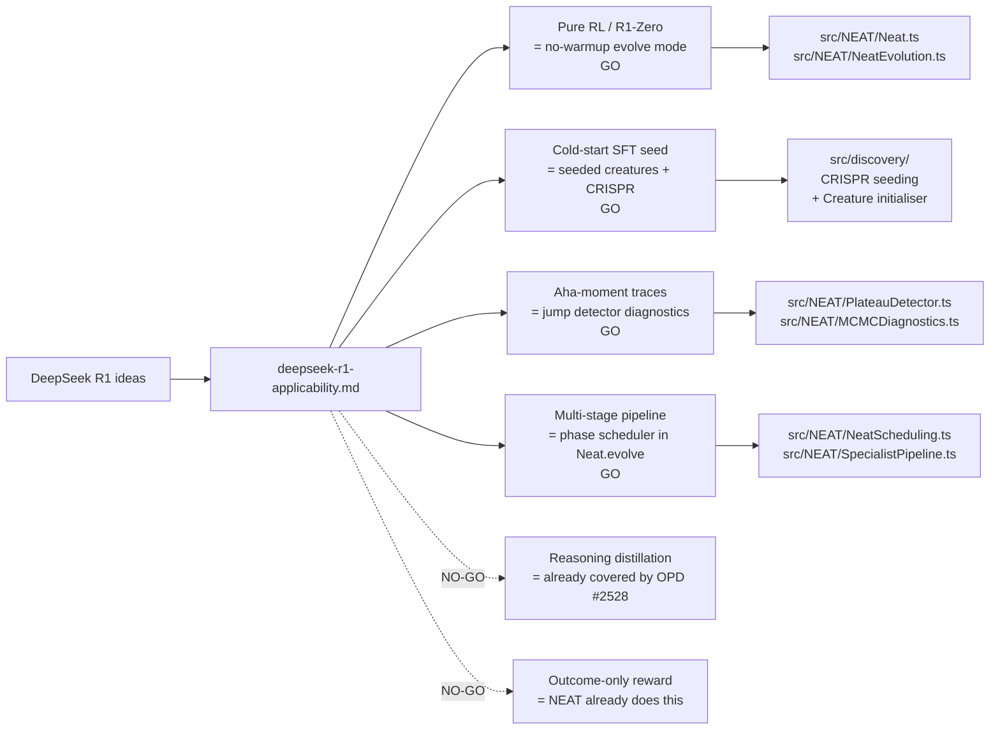

# DeepSeek R1 Applicability to NEAT-AI (Issue #2534)

> **📦 Archived under
> [Issue #2575](https://github.com/stSoftwareAU/NEAT-AI/issues/2575).** This
> research note was moved from `docs/research/` to `docs/archive/research/`. Its
> conclusions have landed (or been triaged out) — see the
> [`deepseek-papers-index.md`](deepseek-papers-index.md) catalogue for the
> consolidated implementation status. Topic index:
> [`docs/README.md`](../../README.md).

This research note maps the six headline ideas from DeepSeek R1 onto NEAT-AI's
evolution + breeding + backprop pipeline and records a GO / NO-GO recommendation
with a one-paragraph rationale per idea. For every GO it proposes an
experimental sub-issue title plus outline; the sub-issues themselves will be
raised in a follow-up planning round, not here.

> **Source.** DeepSeek-AI, _DeepSeek-R1: Incentivizing Reasoning Capability in
> LLMs via Reinforcement Learning_, January 2025.
> [arXiv:2501.12948](https://arxiv.org/abs/2501.12948). Citations below use the
> form _(R1 §x.y)_ and refer to that preprint.
>
> **Scope.** Documentation only. No source-code changes. Each GO is paired with
> a proposed experimental sub-issue title and outline; this note does not
> pre-empt the implementation work.
>
> **Sibling notes.** This note is one entry in the DeepSeek paper catalogue
> (#2533, [`deepseek-papers-index.md`](deepseek-papers-index.md)). The
> V4-specific note
> ([`deepseek-v4-applicability.md`](deepseek-v4-applicability.md)) already
> covers GRPO (#2527), On-Policy Distillation (#2528), Muon (#2529),
> specialist + generalist distillation (#2530), and Engram caching (#2531) — we
> cross-reference rather than duplicate.

## Summary table

| # | R1 idea                                      | Closest NEAT-AI surface                                    | Recommendation | Effort | Risk to invariants |
| - | -------------------------------------------- | ---------------------------------------------------------- | -------------- | ------ | ------------------ |
| 1 | Pure RL (R1-Zero, no SFT)                    | Pure-evolution baseline (`Neat.evolve()` no-backprop mode) | **GO**         | S      | None               |
| 2 | Cold-start SFT bootstrapping                 | Seeded creature initialisation + CRISPR injections         | **GO**         | M      | None               |
| 3 | Distillation to small dense models           | Breeding operator (compare against existing OPD #2528)     | **NO-GO**      | M      | None (covered)     |
| 4 | "Aha moments" / capability-jump traces       | Discovery + plateau-detector diagnostics                   | **GO**         | S      | None               |
| 5 | Outcome-only reward (no process supervision) | Existing global fitness signal vs. per-output rewards      | **NO-GO**      | M      | None               |
| 6 | Multi-stage RL → SFT → RL pipeline           | Phase-alternating schedule inside `Neat.evolve()`          | **GO**         | M      | None               |

## R1 idea → NEAT-AI module mapping

## 1. Pure RL (R1-Zero, no SFT) — **GO**

**Technical summary.** R1-Zero (R1 §2.2) shows that a base language model can
acquire long-form reasoning purely from a reinforcement-learning signal —
without any supervised fine-tuning warm-up. The reward is outcome-only
(verifiable answer correctness plus a small format reward) and the policy
optimiser is GRPO. The headline result is that reasoning behaviours, including
self-reflection and chain-of-thought, _emerge from selection pressure alone_
once the base model is competent enough to be edited.

**Closest NEAT-AI surface.** NEAT-AI's pure-evolution mode — `Neat.evolve()`
with backprop disabled and selection driven entirely by `MetropolisHastings`,
`MutationStabilityTracker`, and species-relative fitness — is the direct
analogue. The memetic baseline (evolution + per-creature backprop) is what we
run in production today; the pure-evolution path exists in the codebase but is
not a first-class operating mode.

**Rationale (GO).** Promoting "no-warmup" to a first-class mode costs little and
gives us an honest baseline against which to measure how much the local backprop
pass actually buys. R1-Zero's result is that the two regimes are qualitatively
different — selection-only finds different basins than selection-plus-gradient —
and we should be able to repeat that observation on NEAT genomes. The experiment
is independent of any other R1 idea and unblocks the phase-alternation work in
Idea 6.

**Risk.** None to the critical invariants. Disabling backprop touches weights
only; UUIDs and `semanticVersion` are not affected. Cross-machine breeding is
unaffected because the wire format is unchanged.

**Effort.** **S.** A `NeatOptions.disableBackprop` flag (or equivalent
`backpropPasses: 0` short-circuit) plus a regression test that confirms the
existing memetic path is unchanged when the flag is off.

**Proposed experimental sub-issue.**

- **Title.** "Pure-evolution mode: first-class `--no-warmup` baseline for
  `Neat.evolve()`"
- **Outline.**
  1. Add a `NeatOptions.disableBackprop` (default `false`) that short-circuits
     the local backprop pass after mutation/breed.
  2. Run a baseline comparison on the standard ED-fold benchmark suite: memetic
     (current default) vs. pure-evolution vs. pure-evolution + MCMC-temperature
     schedule.
  3. Report fitness-vs-generation, species-count, and MCMC acceptance-ratio time
     series. The deliverable is a benchmark note, not a default-flip.
  4. Negative-result acceptable: if pure-evolution underperforms across the
     board, document it as the published baseline and close.

## 2. Cold-start SFT bootstrapping — **GO**

**Technical summary.** R1 §3.1 reintroduces a small, high-quality
supervised-fine-tuning dataset _before_ the RL phase to fix two R1-Zero failure
modes: poor readability and language-mixing. The cold start is small (thousands
of examples), curated, and explicitly intended to seed the distribution rather
than to teach the task. The downstream RL then refines.

**Closest NEAT-AI surface.** NEAT-AI's analogue of "curated seed data" is
**seeded creature initialisation**: hand-crafted topologies injected into the
starting population, plus CRISPR injections (see AGENTS.md "CRISPR injections"
terminology and `docs/CRISPR_GUIDE.md`). Today we have ad-hoc CRISPR templates
and a handful of seed creatures; we do not have a declarative "seed library"
abstraction the way a SFT dataset is curated.

**Rationale (GO).** A small, declarative library of seed creatures and CRISPR
templates would give us the same affordance R1's cold-start gives them: push the
population's starting distribution into a useful basin before selection takes
over. The experiment is to compare cold-start populations (seeded library +
CRISPR) against random-init populations on the same benchmarks, holding
selection pressure constant. This complements the existing CRISPR work without
changing how CRISPR templates are applied.

**Risk.** None. Seeded creatures are constructed via the standard `Creature`
constructor, so they get fresh UUIDs and the default
`CURRENT_CREATURE_SEMANTIC_VERSION` by construction. The seed library is
content, not code; the wire format is unchanged.

**Effort.** **M.** A seed-library directory (e.g. `seeds/cold-start/*.json`), a
loader that injects N seeds into a fresh population, and a benchmark that varies
the seed-mix ratio (0%, 25%, 50%) while holding total population size fixed.

**Proposed experimental sub-issue.**

- **Title.** "Cold-start seed library: declarative population priors for
  `Neat.evolve()`"
- **Outline.**
  1. Define a `seeds/cold-start/` JSON directory and a `NeatOptions.seedLibrary`
     option that selects which seeds to inject and at what ratio.
  2. Seeds are valid `exportJSON()` creatures (UUID-only wire format per
     AGENTS.md "Discovery/cache/FFI wire contract").
  3. Benchmark fitness-vs-generation across seed ratios on the standard ED-fold
     suite.
  4. Report whether cold start meaningfully accelerates convergence and whether
     it traps the population in the seed basin (diversity collapse check via
     species count).

## 3. Distillation to small dense models — **NO-GO** (already covered by #2528)

**Technical summary.** R1 §4 distils the R1 reasoning trace into smaller dense
models (Qwen and Llama families, 1.5B–70B). The student is trained against
teacher logits; the result is that the small student inherits much of the
teacher's reasoning competence at a fraction of the inference cost. The operator
is straight knowledge distillation — _not_ structural surgery on the teacher.

**Closest NEAT-AI surface.** `src/breed/OnPolicyDistillationBreed.ts` — landed
under the V4 OPD breed work tracked by #2528 — already implements exactly this
idea on NEAT genomes: take K elite parents, generate a batch of inputs, fit a
student child against the parents' averaged outputs by gradient descent. The V4
note's #2528 description is the canonical specification, and #2530 (specialist +
generalist distillation) extends it to speciation granularity.

**Rationale (NO-GO).** This is the cleanest one-to-one mapping in the entire R1
paper, and it is **already covered**. Re-opening it would duplicate #2528 and
risk fragmenting the breeding-operator surface. The R1-specific flavour (distil
from a single high-fitness teacher's _trace_, rather than from a logit ensemble)
is a minor variation on the OPD operator and can be explored as a
parameterisation of the existing operator if needed; it does not warrant a new
sub-issue.

**Differences vs. the existing OPD breed (#2528)** — documented to avoid
re-litigation:

| Aspect           | OPD breed (#2528)                                  | R1-style distillation                   |
| ---------------- | -------------------------------------------------- | --------------------------------------- |
| Teacher count    | K elite parents (mixture)                          | Typically 1 teacher (R1-trace producer) |
| Teacher signal   | Averaged output activations across teachers        | Teacher logits / outputs only           |
| Granularity      | Pair-level (breed) or species-level (#2530)        | Whole-population to single-student      |
| Student topology | Fresh genome shaped by gradient fit                | Pre-fixed dense student topology        |
| Wire format      | UUID-only `exportJSON()` (AGENTS.md wire contract) | Same — student is a normal new creature |

**Risk.** N/A (not adopted; no new code). If a future variation of #2528
explicitly needs the single-teacher mode, parameterise the existing operator
rather than forking.

**Effort.** N/A.

## 4. "Aha moments" / capability-jump traces — **GO**

**Technical summary.** R1 §2.4 documents discrete, mid-training capability jumps
— moments where the model's behaviour shifts qualitatively (e.g. it starts
re-evaluating its own answers). These are visible in the training log as
step-changes in evaluation metrics rather than smooth trends. R1 treats them as
observable phenomena worth instrumenting; they are not themselves a training
mechanism.

**Closest NEAT-AI surface.** `src/NEAT/PlateauDetector.ts`,
`src/NEAT/MCMCDiagnostics.ts`, and `src/NEAT/MutationStabilityTracker.ts`
already collect generation-level fitness statistics. The discovery pipeline
(`src/discovery/`) tracks per-mutation outcomes via `SuccessCache` /
`FailureCache`. None of these specifically flag _which mutation_ triggered a
fitness jump above N standard deviations — the data is collected, but the
diagnostic is not surfaced.

**Rationale (GO).** A "jump detector" diagnostic that flags any mutation, breed,
or discovery application whose post-event fitness is more than N species-stdev
above the pre-event baseline is a near-zero-cost feature with real research
value. It surfaces capability shifts the same way R1 does, plus it gives the
discovery cache a candidate signal for prioritising similar future mutations.
This is observability, not behaviour change — no creature semantics are altered.

**Risk.** None. The detector is read-only on the existing fitness stream; UUIDs,
`semanticVersion`, and the wire format are untouched.

**Effort.** **S.** New diagnostic in `src/NEAT/MCMCDiagnostics.ts` (or a sibling
file) plus a logging hook on the post-mutation fitness assertion. Threshold (N
stdev) is a configurable option.

**Proposed experimental sub-issue.**

- **Title.** "Capability-jump detector: flag mutations producing >Nσ fitness
  shifts"
- **Outline.**
  1. Add a `MutationJumpDetector` that compares pre- and post-mutation
     species-relative fitness, emits a structured log entry when the delta
     exceeds N species-stdev (configurable, default N=3).
  2. Cross-reference each flagged event against the discovery cache to see
     whether the same mutation pattern was previously cached as a hit.
  3. Run on a long evolution trace; report frequency, distribution, and whether
     the detected events correlate with subsequent fitness ceiling changes.
  4. Optional: feed flagged mutations back into the discovery cache as
     high-priority replays.

## 5. Outcome-only reward (no process supervision) — **NO-GO**

**Technical summary.** R1 §2.3 explicitly avoids per-step process rewards — the
gradient signal comes from a verifier judging the final output (and a small
format check), not from a learned process-reward model. The headline result is
that an outcome-only reward is competitive with, and easier to scale than,
per-step process supervision; the latter is brittle to reward hacking on
intermediate steps.

**Closest NEAT-AI surface.** NEAT-AI's fitness signal is **already
outcome-only**: a single scalar per creature per evaluation, computed by the
user-supplied cost/fitness function over the full output. Per-layer or
per-output process rewards are not part of the selection or breeding machinery.
Backprop _is_ a per-output gradient signal, but only inside the local memetic
step within a single creature — it is not part of the selection-level reward
structure.

**Rationale (NO-GO).** R1's outcome-only result is **a vindication of NEAT-AI's
existing design**, not a new technique to adopt. Going the other way —
introducing per-layer / per-output process rewards into selection — would
contradict R1's finding and reintroduce the process-reward fragility R1
explicitly avoided. For backprop specifically, the existing per-output gradient
signal is a local optimisation tool, not a selection signal, and it works as
intended; mixing it into selection (e.g. scoring creatures by intermediate-layer
error) would couple the two surfaces in a way that has no precedent in R1 or the
rest of the catalogue.

**Risk.** N/A (not adopted). Adopting process rewards _would_ touch selection
semantics and require a new experimental track; the R1 evidence recommends
against starting that track.

**Effort.** N/A. Listed for completeness so this idea is not re-raised.

## 6. Multi-stage RL → SFT → RL pipeline — **GO**

**Technical summary.** R1 §3 chains training phases: cold-start SFT → first RL
round → rejection-sampling SFT (using RL outputs filtered by quality) → second
RL round. Each phase has a different signal shape (supervised loss vs. RL
reward) and a different objective (alignment, exploration, consolidation).
Phases are short and the pipeline is explicit, not adaptive.

**Closest NEAT-AI surface.** `Neat.evolve()` today runs a single uniform loop:
per generation, select → breed → mutate → backprop → evaluate.
`src/NEAT/SpecialistPipeline.ts` and `src/NEAT/NeatScheduling.ts` already
contain hooks for phase-aware behaviour, but there is no explicit
"discovery-only", "breed-only", or "backprop-only" phase exposed to the caller.

**Rationale (GO).** A phase-alternating schedule that runs short windows of
"discovery-only" (structural exploration), "breed-only" (recombination), and
"backprop-only" (local-optimisation consolidation) gives us R1-style staged
training on the NEAT machinery we already have. The hypothesis is that phase
separation reduces interference between exploration (which benefits from looser
MCMC acceptance) and exploitation (which benefits from tight local gradient
descent). The experiment is straightforward: implement the phase schedule,
benchmark against the uniform loop, report. This idea pairs naturally with Idea
1 (pure-evolution mode is exactly the "backprop-off" phase).

**Risk.** None to the critical invariants. The schedule is a higher-level
controller above existing operators; UUIDs, `semanticVersion`, and the wire
format are not touched. Risk is **population-dynamics**: an aggressive phase
schedule could collapse diversity. The experiment must report species-count and
Shannon-diversity time series, not just fitness — same guard rail as the V4
specialist + generalist note (#2530).

**Effort.** **M.** A `NeatOptions.phaseSchedule` configuration (e.g. a sequence
of `{phase, generations}` records) plus a controller in `NeatEvolution.ts` that
toggles the right operators per phase, plus benchmarks on the standard ED-fold
suite.

**Proposed experimental sub-issue.**

- **Title.** "Phase-alternating training schedule for `Neat.evolve()`
  (discovery-only / breed-only / backprop-only windows)"
- **Outline.**
  1. Add `NeatOptions.phaseSchedule` — a list of `{phase, generations}` records
     where `phase` is one of `discovery`, `breed`, `backprop`, `mixed`
     (default).
  2. Implement the controller in `NeatEvolution.ts` so each phase enables only
     its named operator path; other operators short-circuit.
  3. Benchmark a representative R1-shaped schedule (e.g. discovery → mixed →
     backprop → mixed) against the uniform `mixed` baseline.
  4. Report fitness, species-count, Shannon diversity, and MCMC acceptance-ratio
     time series. Negative-result acceptable: if the uniform loop wins, document
     it.
  5. Cross-reference Idea 1 (pure-evolution mode) — they share the same
     `disableBackprop` plumbing.

## Cross-cutting invariants

Every GO recommendation has been screened against the two critical invariants in
AGENTS.md:

- **Neuron UUID stability.** All four GO experiments are observational (Idea 4),
  additive in configuration (Ideas 1 and 6), or construct fresh creatures via
  the standard `Creature` constructor (Idea 2 seed library). No proposed change
  rewrites an existing neuron's UUID.
- **Semantic version immutability.** None of the GO experiments change the
  `Creature` constructor's default semantic-version handling or introduce a new
  pipeline step that re-bumps `semanticVersion`. The constructor continues to
  default new offspring to `CURRENT_CREATURE_SEMANTIC_VERSION`.

Anything that needs to cross a process, machine, disk, cache, or FFI boundary in
the experiments above must continue to use **UUID-only wire formats** (per
AGENTS.md "Discovery/cache/FFI wire contract"). Idea 2 (the seed library) is the
most likely place to slip on this rule and so its sub-issue must include a
wire-format test.

## What this note does not do

- It does not prescribe implementation — each GO experiment owns its own design
  in its sub-issue, to be raised in the next planning round.
- It does not commit to merging any experiment to `Develop`. Sub-issues must
  produce benchmark evidence (per the Performance Task Workflow in `AGENTS.md`)
  before adoption.
- It does not re-open NO-GO ideas. Reasoning distillation (Idea 3) is owned by
  #2528 / #2530; outcome-only reward (Idea 5) is the existing design. If
  circumstances change, raise a fresh follow-up rather than re-litigating here.
